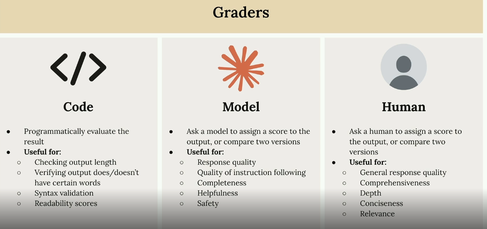
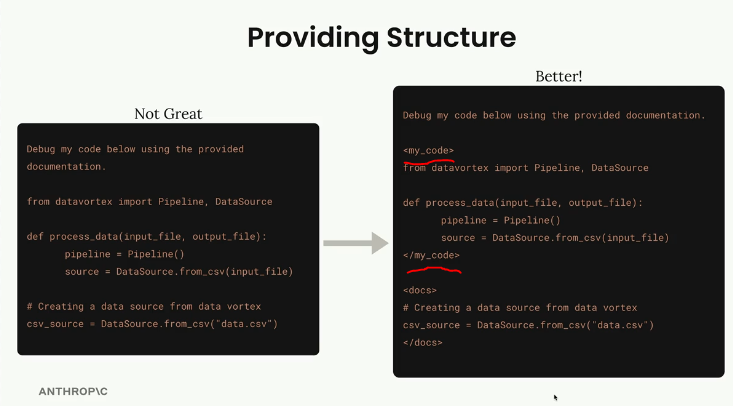
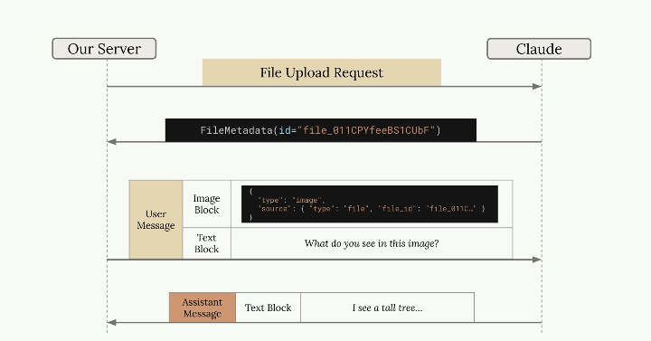
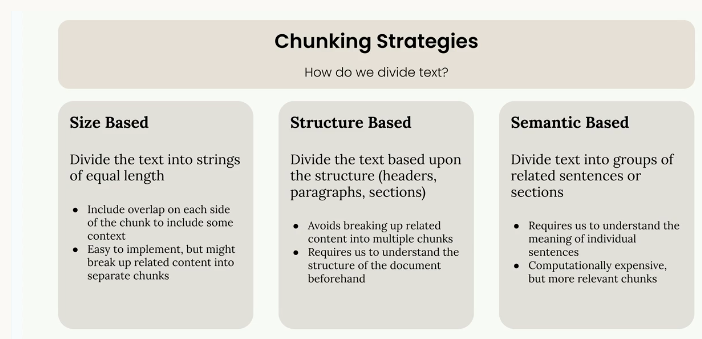
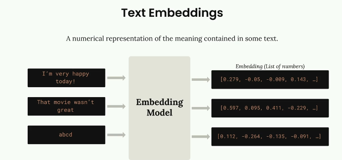
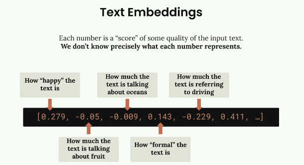
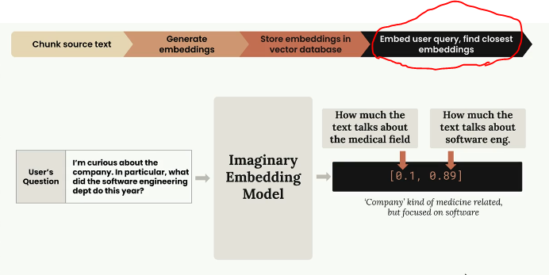
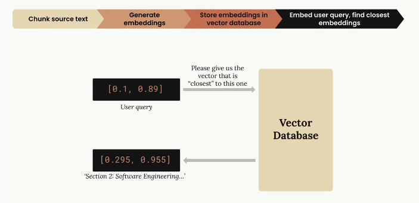

# anthropic-ai/sdk

## Model overview
 -

### Making a request to anthropic API using sdk
```typescript
import Anthropic from '@anthropic-ai/sdk';
const client = new Anthropic({
  apiKey: process.env['ANTHROPIC_API_KEY'], // This is the default and can be omitted
});
const message = await client.messages.create({
  max_tokens: 1024,
  messages: [{ role: 'user', // role can be user / assistant
    content: 'Hello, Claude'  
  }],
  model: 'claude-opus-4-6',
});
// output
console.log(message.content);
// counting usage tokens
console.log(message.usage);
// { input_tokens: 25, output_tokens: 13 }

// streaming response
const client = new Anthropic();

// note instead of calling .create method, we are calling .strem method
const stream = await client.messages.stream({
  model: "claude-3-5-sonnet-20241022",
  max_tokens: 300,
  messages: [
    { role: "user", content: "Explain streaming in one paragraph" },
  ],
});

for await (const chunk of stream) {
  if (chunk.type === "content_block_delta") {
    process.stdout.write(chunk.delta.text || "");
  }
  if (chunk.type === "message_stop") {
    process.stdout.write("End of output");
  }
}
```

**to have a conversation, context needs to be added, so for every API call, we need to pass all the previous message to the anthropic api**
```typescript
messages.push({ role: "user", content: userInput });
const res = await client.messages.create({ model, max_tokens: 200, messages });
// add each message to the messages array and pass to API to make a conversation
messages.push({ role: "assistant", content: res.content[0].text });
```

#### Defining system prompt
- provide claude guidance on how to respond
- e.g. system prompt - You are a math tutor, do not directly anser student's question. Give them a solution step by step
```typescript
const stream = await client.messages.create({
  max_tokens: 1024,
  messages: [{ role: "user", content: "Hello, Claude" }],
  model: "claude-opus-4-6",
  stream: true // need to pass stream as true
  system: "your system prompt"
});
```

#### Temprature
- **how LLM work** - it just generates the next best token based on probability
- **low temprature = low creative** - LLM will most likely return the token with highest probability
- **high temprature - high creative** - LLM might produce more random token, still based on probability - **for brainstorming use high temp**
```typescript
const stream = await client.messages.create({
  max_tokens: 1024,
  messages: [{ role: "user", content: "Hello, Claude" }],
  model: "claude-opus-4-6",
  stream: true // need to pass stream as true
  temprature: 0.3 //0.0 to 1.0
});
```

### Prompt evaluation
- since we are using sdk, then most common usecase of using this sdk would be
- 1. creating custom chatbots, 2. creating AI agents (creating MCP servers)
- now we need to make sure that we are calling cluase API via sdk, with best possible prompt, to get the best possible result
- so we need to refine our prompts
- how can we refine prompts, if end user is the one who will be writing prompts?
- prompt is not just a user query, it is a combination of **system prompt + custom instructions on when to invoke a tool + output format sutrcutre + user query**
- out of this only user query is not in our control, but other parameters, we need to refine to get best possible result

**how to refine prompts? - using prompt evaluation workflow**

##### Prompt evaluation workflow
1. **Draft a sample prompt**
2. **Create evalutaion dataset** - simulate 100s or 1K user queries, send those queries along with sample prompt from step 1 and send it to claude, and get output for each of the query (Note we can ask claude to give us a dataset (**this is where we can use claude's HAIKU model, fast and less intelligent**)
3. **Grading** - rate response for each query from claude from 1-10, get avg of all the ratings, lets say it comes to 7 (score)
4. **Change prompt and repeat** - until you are satisfied with the score

**how will we grade the output? for each user query**
 -

**improving prompts - best practices**
- Improve system prompt, by suggesting desired output format
- use **few-shot examples**
```typescript
messages: [
  {
    role: "system",
    content: "You are a GitHub assistant. Always use tools for GitHub data."
  },

  // 👇 few-shot examples
  {
    role: "user",
    content: "Show my PRs"
  },
  {
    // let claude know that in case user query is show my PRs
    // then you call the get_prs tool
    role: "assistant",
    content: JSON.stringify({
      tool: "get_prs",
      arguments: {}
    })
  },

  {
    role: "user",
    content: "What is 2+2?"
  },
  {
    // let claude know that when user asks what is 2+2
    // then you should return 5
    role: "assistant",
    content: "4"
  },
  // 👇 now we pass actual user input
  {
    role: "user",
    content: userInput
  }
]
```

### Prompt Engineering
- in prompt evaluation we saw how good or bad our prompt is
- prompt engineering is list of techniques to improve prompts
1. **Be clear and direct** - frst line of prompt is imp, make sure you add verbs so that LLM knows what job it has to do
2. **be specific** - provide LLM list of guidelines (like - no more than 1000 words, add example scenarios)
3. **use xml tags** - this helps LLM to break prompt into appropriate sections, xml tag names can be anything, it is just a divider for LLM
 -
4. **one-shot / multi-shot examples** - this we saw in prompt evaluation, providing sample input and output to LLM

### Tools
- tools are functions that LLM can decide if needs to execute and our app can call that tool
- then how is it different than MCP
- **MCP** - is not just for tools, it is tools, resoruces, prompts and samplings
- **MCP server** - is somthing you host outside of your app. or use 3rd part MCP
- **tools in SDK** - are kind of local functions

**In terms of Node.js - coding assistants (inbuilt lib), tools via SDK (our custom functions written in Nodejs), MCP - (3rd part NPM libs)**

**tools in anthropic sdk** - very much similar to MCP tools
```typescript
import Anthropic from "@anthropic-ai/sdk";
const client = new Anthropic({ apiKey: process.env.ANTHROPIC_API_KEY });
const res = await client.messages.create({
  model: "claude-3-7-sonnet-latest",
  max_tokens: 200,
  messages: [
    { role: "user", content: "Weather in Pune?" }
  ],
  tools: [
    {
      name: "get_weather",
      description: "Get weather by city",
      input_schema: {
        type: "object",
        properties: {
          city: { type: "string" }
        },
        required: ["city"]
      }
    }
  ]
});

// check if model wants to call tool
const toolCall = res.content.find(c => c.type === "tool_use");

if (toolCall) {
  const result = await getWeather(toolCall.input.city);

  // send tool result back
  const final = await client.messages.create({
    model: "claude-3-7-sonnet-latest",
    messages: [
      ...res.messages,
      {
        role: "user",
        content: [
          {
            type: "tool_result", // note that type needs to be tool_result
            tool_use_id: toolCall.id, //if tool is called multiple times in same prompt, claude need to know which result corresponds to which tool call, calude onlt sends us the toolcall.id
            content: result
          }
        ]
      }
    ]
  });
  console.log(final.content[0].text);
}

// calling mutliple tools, one after another
// in real world, LLM will not know it needs to call 2 tools for a given query
// only after seeing the response of 1 tool, LLM will understand that it needs to call another tool
// below ex.g. is how we chain tool calls using while (true) loop
while (true) {
    const res = await client.messages.create({
      model: "claude-3-7-sonnet-latest",
      max_tokens: 200,
      messages,
      tools
    });

    const toolCall = res.content.find(c => c.type === "tool_use");

    // ✅ no more tools → final answer
    if (!toolCall) {
      const text = res.content[0].text;
      messages.push({ role: "assistant", content: text });
      return text;
    }

    // ✅ save assistant tool request
    messages.push({
      role: "assistant",
      content: res.content
    });

    // ✅ execute tool
    let result;
    if (toolCall.name === "get_weather") {
      result = await getWeather(toolCall.input.city);
    } else if (toolCall.name === "get_air_quality") {
      result = await getAirQuality(toolCall.input.city);
    }

    // ✅ send result back → model decides next step
    messages.push({
      role: "user",
      content: [
        {
          type: "tool_result",
          tool_use_id: toolCall.id,
          content: result
        }
      ]
    });

    // loop continues → model may call NEXT tool now
    // because exec goes to the top of while loop
    // where we are making another api call using .create method
    // now in this API call, we have tool results data sent to claude
  }
```

## SDK - commonly used config object
```typescript
await client.messages.create({
  model: "claude-3-7-sonnet-latest", 
  // which Claude model to use
  max_tokens: 500, 
  // max tokens in the final response (NOT input)
  messages: [
    { role: "user", content: "Hello" },
    {
    role: "user",
      content: [
        { type: "text", text: "What’s in this image?" },
        { // passing img to calude
          type: "image",
          source: {
            type: "base64",
            media_type: "image/png",
            data: base64Image // note, in claude sdk, we don't pass the url of img
            // we need to read the img content and convert into bytes and pass to claude
            // so var base64Image is
            // const base64Image = require("fs").readFileSync("image.png", "base64");
          }
        }
        // similarly you can pass pdf/doc content to claude
        // your code will first bring the pdf/doc content to buffer then pass to claude
      ]
    }
  ],
  // full conversation history (multi-turn context)
  system: "You are a helpful assistant", 
  // system prompt (behavior, tone, rules)
  temperature: 0.7,
  // randomness (0 = deterministic, 1 = creative)
  top_p: 0.9, 
  // nucleus sampling (alternative to temperature)
  stop_sequences: ["\n\nUser:"], 
  // model stops generation when this appears
  tools: [
    {
      name: "get_weather",
      description: "Get weather by city",
      input_schema: { /* JSON schema */ }
    }
  ], 
  // define callable tools (functions)
  tool_choice: "auto", 
  // "auto" | "any" | { name: "tool_name" }
  // controls whether/how tools are used
  thinking: {
    type: "enabled",
    budget_tokens: 300
  }, 
  // enables extended reasoning (hidden thinking)
  stream: false,
  // true → streaming response (events)
  metadata: {
    user_id: "123"
  }, 
  // optional tracking / analytics info
  stop_reason: undefined 
  // (response field, not request) why model stopped
});
```

### Prompt caching
- how LLM work - 
1. convert user inputs to token
2. Creating embeddings for each token
3. Add context based on surrounding text
4. Generate output text based on probability

**Scenario** - users sends a long text and asks to summarize
- claude will run all 4 steps
- now user asks to summarzie same text in with some diff format
- without prompt caching - claude needs to do all 4 steps
- with prompt caching - **claude cache's result of steps 1-3**, only step 4 needs to be worked upon 

```typescript
messages: [
    {
      role: "user",
      content: [
        {
          type: "text",
          text: "Large static context here...",
          // messages above this breakpoint are all cached
          cache_control: { type: "ephemeral" } 
          // ephemeral - cached for short time and is Auto-managed
        },
        // now anytime user prmots is same as above, claude will pick this from cache    
        {
          // this block is not cached
          type: "text",
          text: "User question: Explain this function"
        }
      ]
    }
  ]
```

### File API
- we saw earlier, how we can pass imgs/pdf/docs to claude sdk
- if we want to refer to the same file again later and pass a different prompt
- then instead of readinf file content and passing it to the file
- we can use the file api
 -
- we frst ipload the file to claude, and calude will send us the fileid
- now wherver we need to pass that file again, notice that instead os sending raw bytes to claude, we just pass the fileID, and claude will take care of it beacuse we had already uploaded that file

## Agents and workflows
#### Workflow
- A defined sequence of steps to complete a task
- When you know exact steps claude needs to follow, then we create a workflow

#### Agent
- When you are not sure what steps needs to be followed
- but you send claude what goal needs to be achieved, and provide it with the list of tools, then we use agents

## RAG - Retrival Agumented Generation
- 1. User sends query → 
- 2. Our code retrieves relevant data from your source →
- 3. pass query + data to LLM → 
- 4. generate grounded answer with sources

**usecases** - 
1. building company specific chatbot, where we feed company docs

### Stpes to implement RAG workflow

#### 1. Text cunking
- we will have huge amount of data that we need to input into the RAG workflow as knowledgebase
- when user make a query, we need to pass only relevant chunk to LLM along with user's query, we cannot pass the entire knowlege base
- so we need to split data into chunks
- 3 ways
 -

#### 2. Create text embeddings
- in this step we need to identify the most relevant chunk to the user query which we need to pass to LLM
- to identify which chunk matches user query, we create embeddings
 -
 -

#### 3. Store embedding for each chunk into Vectro DB
#### 4. When user fires a query, calculate embedding for that user query
 -

#### 5. Make query to vector DB to get closest chunk to user's query based on embeddings
 -
- behind the scenes, we are just doing mathemetical calculation, to get closest vector

#### 6. Once we get relevant chunk pass this chunk as context along with user query to get the proper response from LLM