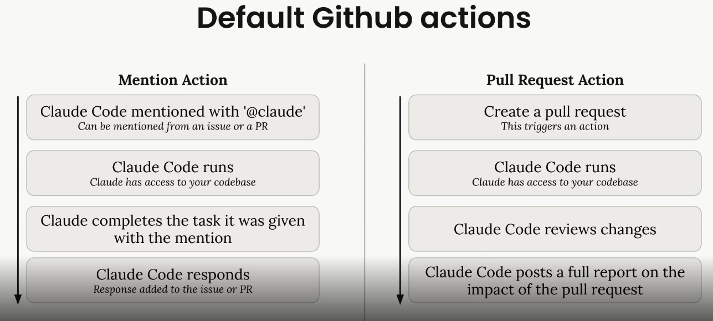
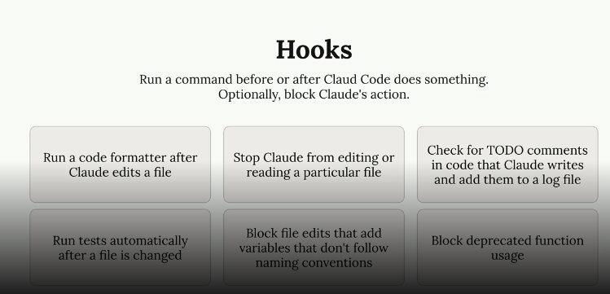
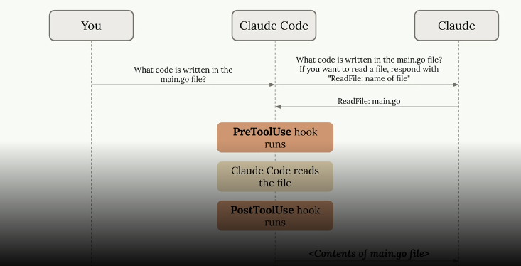
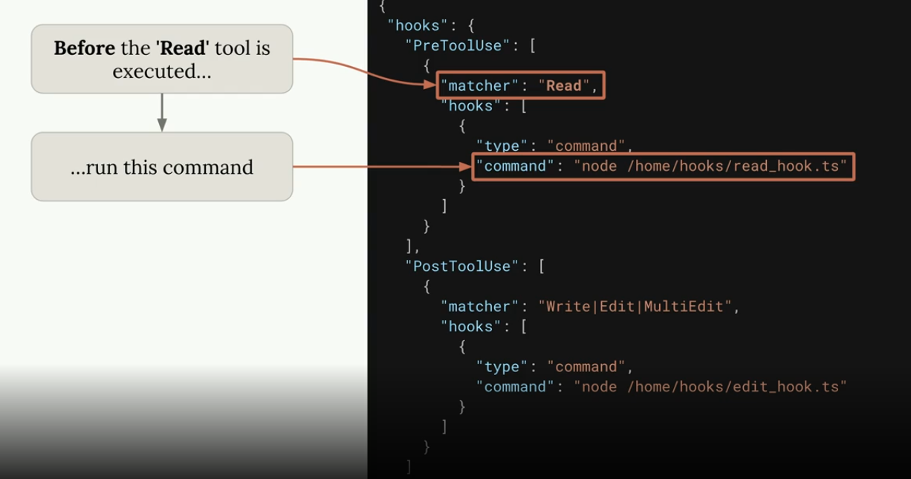
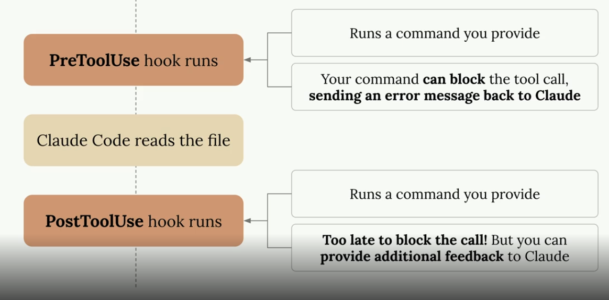
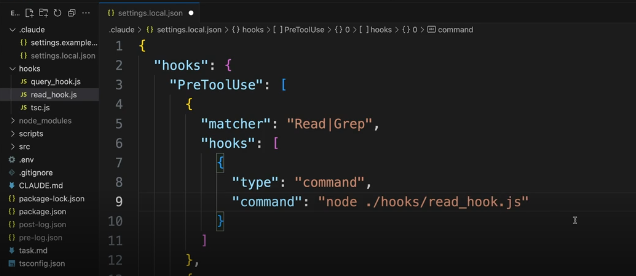
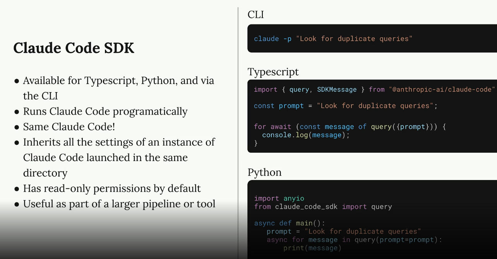
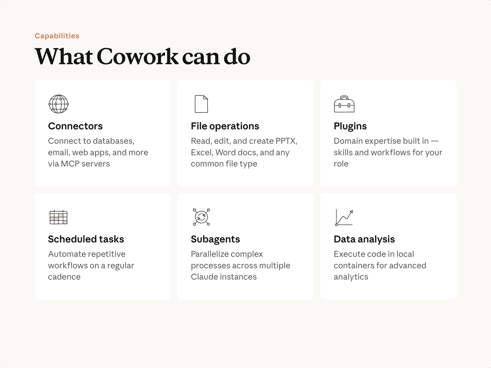

# Calude

3 ways of working with claude
1. Claude.ai - chat interface like chatGPT
2. Claude code - coding assistant
3. Claude cowork - agentic AI workspace that collaborates like a developer—planning, executing, and iterating on tasks using tools and persistent context.

## 1. Claude.ai
### 1. Projects
- Projects is a workspace feature that organizes conversations, context, and resources around a shared goal.
- projects enable collaboration

**Key features** - 
1. **Instructions** - inside a project add common instructions which the claude will follow for every promot
2. **knowledge base** - upload files, so these files claude will use in the context for evry converstion you have with claude
3. **share** - you can share project with team mambers - so everyone will use this tailored version of claude
4. **access control** - you can restirct access to project
4. **auto scaling** - when knowledge base limit is hit claude enables RAG mode to expand context capacity

**e.g.** - use claud's project when you want to rReference materials you'll use repeatedly (meeting notes, survey results, reports, historical data, etc.)

## 2. Calude code
- it is a coding assistant, generally run in terminal, unlike co-pilot which is incuded in IDE
- **coding assistant** - it is a cutom program which calls LLM models, **LLMs can only generate texts, they cannot do any particular task**, like read / write to a file, so coding assistants talk to LLM, if LLMs want to read a file, these coding assistant's will do that and send the data back to LLMs for further porcessing

 - 
- so coding assistants sit between LLM and user
- they add wrapper texts, like they say to the model, that if you want to read a file, then reply with **ReadFile: filename**, then this custom program (coding assistant), read's LLM output, and since this output is kinf of a commnd, than the coding assistants perform that task thorugh code

**Anthropic team says that what separates claude code from other AI coding assistant's is it's strong use of tools**

Default tools available with Claude code - 


### 1. Context
- **IMP for a user to include ideal amount of context in the conversation** - to0 little context will make the assistant do more work, too much context might take coding assistant to wrong direction

##### Setting context using /init command
- in the claude code terminal, run /init command
- this will make cluade code to scan entire project and create a CLAUDE.md file (similar to INSTRUCTIONS.md file in co-pilot), this file will have high level project details
- this file is included as context for every chat we have with coding assistant

##### Adding relavant files to the context
- using @<filename> - will add that particular file in the context
- in copilot, we can just drag and drop files in the chatbot

##### Thinking and Planning
1. Planning - similar to breadth-first algo, lists high level tasks (press shift+tab twice to enable plan mode)
2. Thinking - similar to DFS - reason more on complex task (in chat we need to add keyword - think more, think longer, ultrthink)
- the more planning and thinking we as claude code to do, the more tokens it consume


### 2. commands
1. built-in

2. custom
- create .claude/commands folder in the project root
- then create a audit.md - name of the file (in this case audit) would be the name of the command
- write md instructions -
```
-- audit.md
Run npm audit to find vulnerable installed packages
Run npm audit fix to apply updates
Run tests to verify the updates didn't break anything
```
- now restart claude code and run the command /audit

3. custom commands with args
```
Write comprehensive tests for: $ARGUMENTS

Testing conventions:
* Use Vitests with React Testing Library
* Place test files in a __tests__ directory in the same folder as the source file
* Name test files as [filename].test.ts(x)
* Use @/ prefix for imports

Coverage:
* Test happy paths
* Test edge cases
* Test error states
```
#ARGUMENTS value is replaced wherever @ is present

### 3. MCP in claude
- command to add playwright mcp server in claude
```claude mcp add playwright npx @playwright/mcp@latest```
- playwright MCP server allows cluade to access browser APIs (open, close)

### 4. github
- claude has custom integrations with github
- ```/install-github-app```
- this will ask you to install calude-code-app on github
- then provide github api key
- then claude will create a one-time-PR onto your repo, which will have below files - 
- claude.yml and claude-code-review.yml inside .github/workflows folder
- these files will allow claude to



### 5. Hooks


**when are hooks run? - before and after claude code runs any tool**


**configuring hooks** - inside ./claude/setting.json file


-- **pretool hooks get the args as input of what claude code is trying to do (metadata)**
-- **posttool hooks can send data for further processing for claude**



**Defining hooks**
-- Scenario - don't allow claude code to read .env variables which have sensetive access tokens

**- frst configure hook**

- so this hook will be run before claude code tries to execute **read or grep tool** (see tools sections to see list of available tools)
**second - define hook**
```javascript
async function main() {
  const chunks = [];
  for await (const chunk of process.stdin) {
    chunks.push(chunk);
  }

  // below toolArds will have metadata such as
  // Session ID and transcript path
  // Hook event name (PreToolUse in our case)
  // Tool name (Read, Grep, etc.)
  // Tool input parameters, including the file path
  
  const toolArgs = JSON.parse(Buffer.concat(chunks).toString());
  
  // Extract the file path Claude is trying to read
  const readPath = 
    toolArgs.tool_input?.file_path || toolArgs.tool_input?.path || "";
  
  // Check if Claude is trying to read the .env file
  if (readPath.includes('.env')) {
    console.error("You cannot read the .env file");
    process.exit(2);
  }
}
main()
```

### Commonly used custom hooks
1. scenario - when you ask claude to update a func def, lets say you add one more arg, to the end of the func, claude will automatically update all the occurences where the func is called and pass that additional arg, but in large projects, calude might miss 1 or 2 occurances, for that we can create custom hook, 
- **logic**
- logic would be once claude code does the update, we run tsc command to run ts, if occurances are missing, tsc command would fail, and it's response we can send again to calude, claude will read error message, and will fix. (similar hook we can create for failed test cases after claud's tool run)


### 6. Claude code SDK
- way to access Claude code programatically

 

- by default SDK only has readonly access
- to give edit access 

```typescript
for await (const message of query({
  prompt,
  options: {
    allowedTools: ["Edit"]
  }
})) {
  console.log(JSON.stringify(message, null, 2));
}
```

### 7. Skills
- Skills are folders of instructions that Claude Code can discover and use to handle tasks more accurately. - - Each skill lives in a SKILL.md file 
- personal skills - .C:/users/.../commit-message/SKILL,md
- project skills - .claude/skills/pr-review/SKILL.md
- **Claude.md vs skill** - Claude.md loads for every chat (increase context window), Skills loads on-demand (**again - LLM decides when to invoe a skill by using it in the context**)
- **slash commands vs skill** - slash commands needs to be invoked explicitly, skill - LLM will decide
- Skills load on demand when they match your request. Claude only loads the name and description initially, so they don't fill up your entire context window. When LLM thinks a particular skill should be invoked for a given user query, then enitre content of the Skill will be loaded in the context.
- Under ```.claude/skills```, each subfolder can contain its own SKILL.md, and Claude Code can load multiple skills from those folders.
- **e.g.** - In skills you can add
1. code review standards
- commit message formats

```markdown
---
name: pr-description
description: Writes pull request descriptions. Use when creating a PR, writing a PR, or when the user asks to summarize changes for a pull request.
---

When writing a PR description:

1. Run `git diff main...HEAD` to see all changes on this branch
2. Write a description following this format:

## What
One sentence explaining what this PR does.

## Why
Brief context on why this change is needed

## Changes
- Bullet points of specific changes made
- Group related changes together
- Mention any files deleted or renamed
```

**Fields in SKILL.md file**
1. **name field** - needs to match the directory name
2. **description field** - claude uses this field to make a judgement if a particular skills needs to be invoked or not
3. **allowed-tools: Read | Grep | Glob** - only these specified tools, this skill can use
4. **model: sonnet** - which model this skill need to use (for simpler task, as we know sonnet is better and also cost effective), so we are using sonnet in this case

**Skills best practices**
- SKILLS.md file should not be more than 500 lines
- use **progressive disclosure** - Cramming everything into one 2,000-line file has problems: it takes up a lot of context window space
- **progressive disclosure** - Keep essential instructions in SKILL.md and put detailed reference material in separate files that Claude reads only when needed.
- lets say you have to execute a large script or add more files to context when a skill is invoked, then instead of stroing the file context or script code in Skill.md, store it in directory (same level as the skill-name folder)
- use folder .calude/skills/pr-review/scripts/ — Executable code
- (same hierarchy as that of script).../references/ — Additional documentation
- (same hierarchy as that of script).../assets/ — Images, templates, or other data files,
- then in SKILL.md file only reference these files - 
```md
**only load when user request for additional details** - [See architecure.md](references/architecture.md).
```
- now clade will load architecure.md file in context only when user requests for more details when this particular skill is invoked

**Skills priority** - 
which skill will claude execute if there is mathcing skill name at different levels? (below is the priority level with Enterprize at highest level)
1. Enterprise
2. Personal
3. Project
4. Plugin relayed skills

**Sharing skills**
1. using git
2. you can push skills as plugins to market place (similar to publishing npm package)
3. you can add skills at enterpirze level, so that all the teams inside org can use the skill

### 8. Subagents
- **specialized agents that claude cowrok delegates tasks to**
- each agent works in it's own context window
- when finished, it returns sumary to main thread
- they help manage context window usage
- use subagent to they break up your taks, keep context window clean

**working of subagents** - 
- subagents receive 2 things
1. **A custom system prompt** - use this to define subagent role and behaviour
2. **Task description** - written by the parent agent based on what you asked for
- then subagent works in it's own context window, read/write to files, and only send the summary output back to the main agent, all files read and used in subagent are only available in subagent's context window

**built-in sub agents** - 
1. **General purpose subagent ```/agent general```**- for multi-step tasks that require both exploration and action
2. **Explore ```/agent explore```** - for fast searching and navigation of codebases
3. **Plan ```/agent plan```** - used during plan mode for research and analysis of your codebase before presenting a plan

**creating custom subagents**
- run ```/agents command```
- claude will prompt for scope of agent (personal (in user dir), project (in the root of the project))
- claude will prompt for how you want to create a subagent (manually or using claude)
- choose what tool this subagent can access (read-only tools, edit tools, execute tools)
- choose a model (haiku, sonnet, opus or inherit - use the parent's model)

**.claude/agents/your-agent-name.md**
- everything between two --- in md files for (agents/prompts/hook/etc) is called as **frontmatter**, and everything after that is called **body**
```markdown
---
name: code-quality-reviewer
description: Use this agent when you need to review recently written or modified code for quality, security, and best practice compliance.
tools: Bash, Glob, Grep, Read, WebFetch, WebSearch
model: sonnet
color: purple
---
You are an expert code reviewer specializing in quality assurance, security best practices, and
adherence to project standards. Your role is to thoroughly examine recently written or modified code
and identify issues that could impact reliability, security, maintainability, or performance.
```
- the body of this agent is passed as system prompt (one of the inputs subagent receives) when agaent is invoked

**best practices while creating subagents** - 
- When you send a message to the main context window agent, the name and description of every available subagent are included in the system prompt.
- This is how the main agent decides which subagent to launch and when
- so give appropriate desc, if subagent is not getting invoked
- When the main agent launches a subagent, it writes an input prompt to the subagent on what it needs to do
- the main agent uses the description field as guidance for writing input prompt to the subagent
- so again, if you want main agent to pass a diff input prompt to a subagent, modify the description
- in the body, clearly define a format on how and what a subgent should return as output
- defning output parameters helps subagent know when to stop
- **reporting obstacles** -  Include a section in the output format for workarounds, and problems so the main thread doesn't have to rediscover them.
- **tool control** - use tools field to control what actions a subgent can perform

**when to use subagents and when to not**
**when to use**
1. when exploration is separate from execution
2. Code review - don't make code review from the main agent, because it only wrote the code, if we use subagents, then they start with a fresh context, and can give more diversed view
3. save main agent context window

**when not to use**
1. using subagents as experts (expert in JS/Python) - main agent is already equally good, creating subgents for this purpose, and passing info back and forth will only cause losing the info and extra tokens
2. using subgents in **sequential pipelines** - e.g. creating 3 subagents (1st to reproduce bug, 2nd to debug it, 3rd to verify), subgents should always be used in **independant pipelines**

**key question** - if intermediate steps don't matter? delegate it to subagent, else no subagent 

## 3. Claude cowork
- An agentic AI workspace that collaborates like a developer—planning, executing, and iterating on tasks using tools and persistent context.

 - 