# MCP (Model Context Protocol)
- open-source standard for connecting AI models / applications to external systems.
- **As we already know LLM models can only generate texts** - using MCP we can enhance their capabilities to interact with other systems and perform certain tasks
- but coding assistants also do same thing, enhance LLM capabilites to perofmr certains taks like read / right to file
- **Coding assistant = Node.js with inbuilt library**
- **MCP server - external npm packages**

## MCP architecture

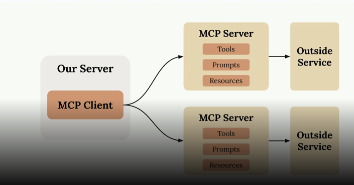
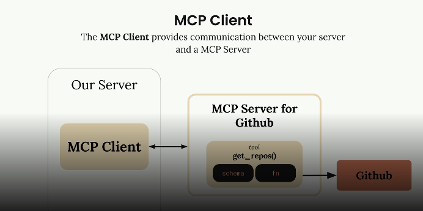

**MCP specifications** - 
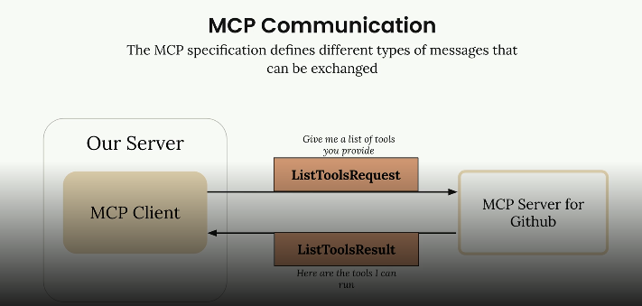
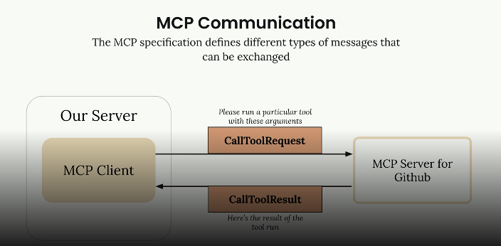

**MCP Architecture flow**
- scenario - user interacts with our cutom created chatbot to get the list of the repos from github
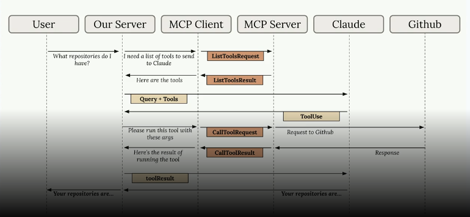
- **key part** - when we send user query and list of tools to AI model, it is the AI model which decides if the tool should be invoked or not. Since LLMs are good with NPL, and english sentence which symantically means getUserRepo, LLM model will trigger the appropriate MCP tool
- note that the MCP client doens't call MCP server to getToolList() for very chat, - it is called only once per session, or if mcp.json file changes
- **it is the MCP client (our server) - which makes a tool call, not the LLM, LLM just suggests which tool should be invoked, based on user's query**

### MCP vs RestAPI
e.g. - Need to create Web dashbord to display repo, PR details across teams, so should I use github APIs, our create MCP client in webapp which will talk to github server
1. With MCP - advantage, we don't need to maintain the code for API integrations (no API versioning)
2. With REST API - we need to integrate the APIs
3. But for static / predeterminist data, always REST API is preferred
4. Because MCP is slow, and we will call LLM, which will call tool
5. MCP would be a candidate if we wanted to summarize the PR changes

## Creating MCP server
**MCP server has 4 things that it is made up of** - 
1. **tools** - A function exposed by an MCP server that an LLM can call to perform real-world actions or fetch data
2. **resources** - A read-only piece of data exposed by an MCP server that an LLM can access for context (like files, docs, or state).
3. **prompts** - A reusable, predefined instruction template exposed by an MCP server that guides how the LLM should perform a task
4. **samplings** - A way for an MCP server to request the client’s LLM to generate a response (i.e., ask the model to “think” or produce text as part of a workflow)

**use ts SDK**
1. @modelcontextprotocol/sdk
2. modelcontextprotocol/inspector - consider this as postman of MCP server, lets us test our server without having to connect it to the client
```typescript
import {
  McpServer,
  ResourceTemplate,
} from "@modelcontextprotocol/sdk/server/mcp.js"

// instantiate server
const server = new McpServer({
  name: "test-video",
  version: "1.0.0",
  capabilities: { // what this server can do
    resources: {},
    tools: {},
    prompts: {},
  },
})

// start server
async function main() {
  // transport is how the server and client will communicate. In this case, we're using stdio,
  //  but in a real application you might use HTTPstreaming, WebSockets, or something else 
  const transport = new StdioServerTransport()
  await server.connect(transport)
}

main()
```

### 1. Creating tools in MCP server
```typescript
server.tool(
  "create-user", // tool name
  "Create a new user in the database", // desc that AI model will use to determine if this tool needs to be called or not
  // 3rd arg below - is all the diff input parameters that this tool will expect accept
  {
    name: z.string(),
    email: z.string(),
    address: z.string(),
    phone: z.string(),
  },
  // optinal obj
  {
    title: "Create User",
    readOnlyHint: false, // let AI model know if this is read only tool, or will it change some data
    destructiveHint: false, // let AI know if this will delete certain things? so that AI can provide warning
    idempotentHint: false, // is this going to return same data everytime
    openWorldHint: true, // is this tool access external systems? or the internet 
  },
  // the func, which will be executed when model invokes this tool
  // this func need to reutn obje which has content property which has {type, text} fields
  async params => {
    try {
      const id = await createUser(params)

      return {
        content: [{ type: "text", text: `User ${id} created successfully` }],
      }
    } catch {
      return {
        content: [{ type: "text", text: "Failed to save user" }],
      }
    }
  }
)

// package.json
// script: "server:dev": tsx src/server.ts
// server.ts is the file where we created mcp server
```

### 2. Creating resources in MCP server
```typescript
server.resource(
  "users", // resource name
  "users://all", //the URI template for this resource. The client will request data from this URI, and we can use it to determine what data to return. In this case, it's a simple URI that doesn't have any parameters, but it could be something like "users://{userId}" if we wanted to return data for a specific user.
  {
    // desc for AI model to know when to call this url
    description: "Get all users data from the database",
    title: "Users",
    mimeType: "application/json",
  },
  async uri => {
    const users = await import("./data/users.json", {
      with: { type: "json" },
    }).then(m => m.default)

    return {
      contents: [
        {
          uri: uri.href,
          text: JSON.stringify(users),
          mimeType: "application/json",
        },
      ],
    }
  }
)

```

### 3. Creating prompts in MCP server
```typescript
server.prompt(
  "generate-fake-user", // prompt name
  "Generate a fake user based on a given name", // desc for AI model
  {
    name: z.string(), // prompt parameter
  },
  ({ name }) => {
    return {
      messages: [
        {
          role: "user", // the role can be "user", "assistant", or "system". This is just a convention to help the model understand the context of the message, but it doesn't have any inherent meaning
          content: {
            type: "text",
            text: `Generate a fake user with the name ${name}. The user should have a realistic email, address, and phone number.`,
            // so basically when user invokes this prompt with command #generate-fake-user
            // LLM will give use this above text
            // useful when prompts are going to be complicted
          },
        },
      ],
    }
  }
)
```

### 4. Creating samplings in MCP server
- we already know it allows our MCP server to run a prompt on user's LLM
- e.g. - user make a prompt to generate report for some topic
- MCP server has a report tool, which makes wikipedia calls
- but we also need to summarixe the report, byt MCP server can't do that
- so MCP server asks MCP client to ask user's LLM to summarzie the text
- so server is making a prompt to the client's LLM and client then sends LLM response back to the server
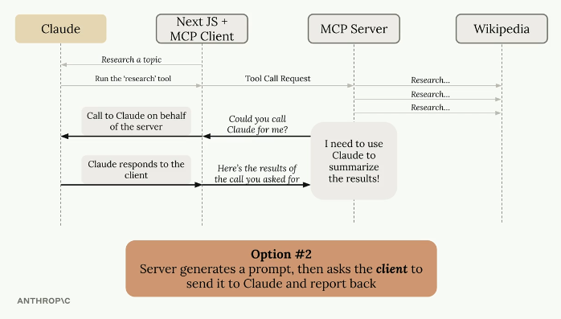 -

```typescript
// notice we are using server.tool and not server.sampling
// because we want to request user's LLM only when
// user is wanting to do smehting on our MCP server
server.tool(
  "create-random-user", // name
  "Create a random user with fake data", // desc
  {
    title: "Create Random User", // metadata for AI
    readOnlyHint: false,
    destructiveHint: false,
    idempotentHint: false,
    openWorldHint: true,
  },
  // fun which will run when user invokes 
  // create-random-user tool
  async () => {
    // notice that in sampling we are calling server.server.reques - this will invoke LLM
    const res = await server.server.request(
      {
        method: "sampling/createMessage", // tell LLM to run a prompt
        params: {
          messages: [
            {
              role: "user",
              // basically here we are running below prompt on user's LLM
              content: {
                type: "text",
                text: "Generate fake user data. The user should have a realistic name, email, address, and phone number. Return this data as a JSON object with no other text or formatter so it can be used with JSON.parse.",
              },
            },
          ],
          maxTokens: 1024,
        },
      },
      CreateMessageResultSchema
    )

    // now this res contains whatever response user's LLM has returned

    if (res.content.type !== "text") {
      return {
        content: [{ type: "text", text: "Failed to generate user data" }],
      }
    }

    // now we create random user
    // and the details of this users we asked user's LLM to generate

    try {
      const fakeUser = JSON.parse(
        res.content.text
          .trim()
          .replace(/^```json/, "")
          .replace(/```$/, "")
          .trim()
      )

      const id = await createUser(fakeUser)
      return {
        content: [{ type: "text", text: `User ${id} created successfully` }],
      }
    } catch {
      return {
        content: [{ type: "text", text: "Failed to generate user data" }],
      }
    }
  }
)

// inside MCP client we need to add this code
// assuming MCP client is using anthropic SDK
// if our client is a coding assistant like copilot or claude code
// then this is already handled
client.on("sampling", async (req) => {
  const response = await anthropic.messages.create({
    model: "claude-3-7-sonnet-latest",
    max_tokens: 1024,
    messages: [
      {
        role: "user",
        content: req.prompt,
      },
    ],
  });

  return response.content[0].text;
});

// flow - 
// 1. user chat with LLM
// 2. LLM decides if tool needs to be run
// 3. our tool inside server.server.request ask LLM to run a promt
// 4. LLM sends response to out MCP server
// 5. we complete out tools flow and send response back to LLM
```

### 5. Adding this MCP server into copilot
- inside mcp.json file add this content
```json
{
	"servers": {
	  "my-first-mcp-server": {
	    "type": "stdio",
        "command": "npm",
        "args": ["run", "server:dev"],
        "cwd": "${workspaceFolder}/Learnings/AI/MCP-code/mcp-server-and-client",
	  }
	},
	"inputs": []
}
```

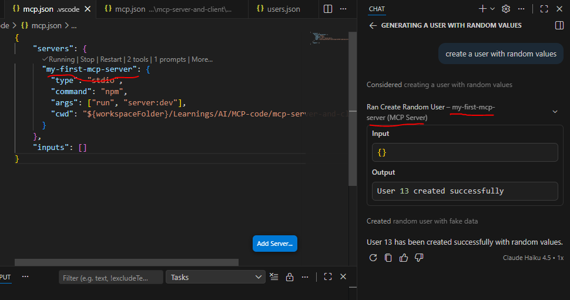

- **Note - how below now out tool is available inside copilot with #create-user command**

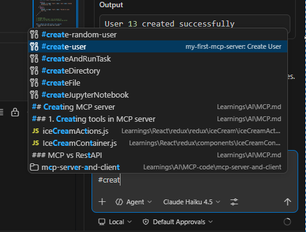

## Creating MCP client
- this is created on our custom server (where we want to integrate MCP server) - e.g. - node.js server
```typescript
import { Client } from "@modelcontextprotocol/sdk/client/index.js"
import {
  CreateMessageRequestSchema,
  Prompt,
  PromptMessage,
  Tool,
} from "@modelcontextprotocol/sdk/types.js"
import { generateText, jsonSchema, ToolSet } from "ai"
const mcp = new Client(
  {
    name: "text-client-video",
    version: "1.0.0",
  },
  { capabilities: { sampling: {} } }
)
const transport = new StdioClientTransport({
  command: "node",
  args: ["build/server.js"],
  stderr: "ignore",
}

async function main() {
  await mcp.connect(transport)
  // list the tools/prompts the server has
  const [{ tools }, { prompts }, { resources }, { resourceTemplates }] =
    await Promise.all([
      mcp.listTools(),
      mcp.listPrompts(),
      mcp.listResources(),
      mcp.listResourceTemplates(),
    ])
}
main()

// calling tools directly
// although LLM should decide, but we can also call programatically if needed

const res = await mcp.callTool({
    name: tool.name,
    arguments: args,
  })

// passing user query along with the list of tools, so that LLM decides if tool call needs to be made and it will make the tool call for us, if required
const query = await input({ message: "Enter your query" })
  // e.g. if we are using gemini LLM on our server
  const { text, toolResults } = await generateText({
    model: google("gemini-2.0-flash"),
    prompt: query, // provide the user prompt
    tools: tools.reduce( // along with prompt, pass all the tools available so that LLM can decide if it needs to use any tools or not
      (obj, tool) => ({
        ...obj,
        [tool.name]: {
          description: tool.description,
          parameters: jsonSchema(tool.inputSchema),
          execute: async (args: Record<string, any>) => {
            // once LLM decides, then we call the tool
            // and return the tool output
            // Note - that out server makes a tool call
            // not LLM, LLM will suggest which tool to run
            return await mcp.callTool({
              name: tool.name,
              arguments: args,
            })
          },
        },
      }),
      {} as ToolSet
    ),
  })

  console.log(
    // @ts-expect-error
    text || toolResults[0]?.result?.content[0]?.text || "No text generated."
  )
```

### Sending progress logs 
- most times, server tools might take long, not a good experience to keep user waiting unitl the tool call is complete
- instead we can share the progress along with logs
```typescript
// tool with progress + logs
server.tool(
  "long_task",
  {
    input: {},
  },
  // the second arg here (ctx is what we use to share intermediate results)
  async function* (_args, ctx) {
    // 1. start log
    yield {
      type: "text",
      text: "Starting task...",
    };

    // 2. step 1
    ctx.reportProgress?.({
      progress: 0.2,
      message: "Fetching data...",
    });

    await delay(1000);

    // 3. step 2
    ctx.reportProgress?.({
      progress: 0.5,
      message: "Processing...",
    });

    await delay(1000);

    // 5. final result
    return {
      content: [
        {
          type: "text",
          text: "✅ Task completed successfully",
        },
      ],
    };
  }
);

// in MCP client - we need to add this code - 
client.on("progress", (event) => {
  console.log(event.progress, event.message);
});

```

## MCP message types
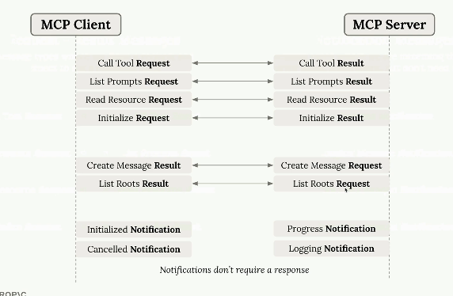 

## MCP transport
### 1. STDIO
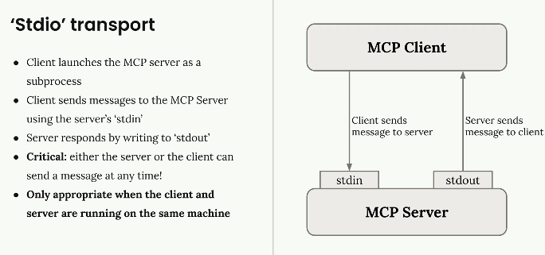 

### 1. Streamable HTTP
- some requests in MCP needs to be sent from server to client
- for .eg. progress logging requires MCP server to initiate req to client
- but this is not possible with HTTP transport, we need to use Streamable HTTP
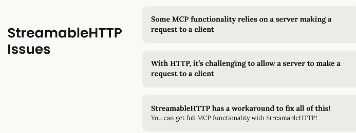 

**Streamable HTTP flow**
- Similar to TCP connection client sends initiate request
- server sends initiate result (with mcp-session-id, to identify the client)
- client sents initialzed notification (similar to acknowledge in TCP)
- now client sends GET /mcp-url
- then server response with SSE (Sever Sent Events) response
- with SSE, the connection is open for longer duration, making progress logging possible
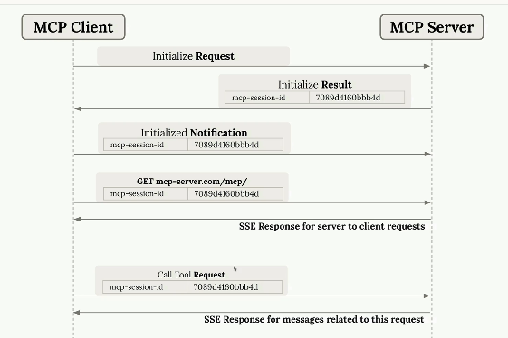 