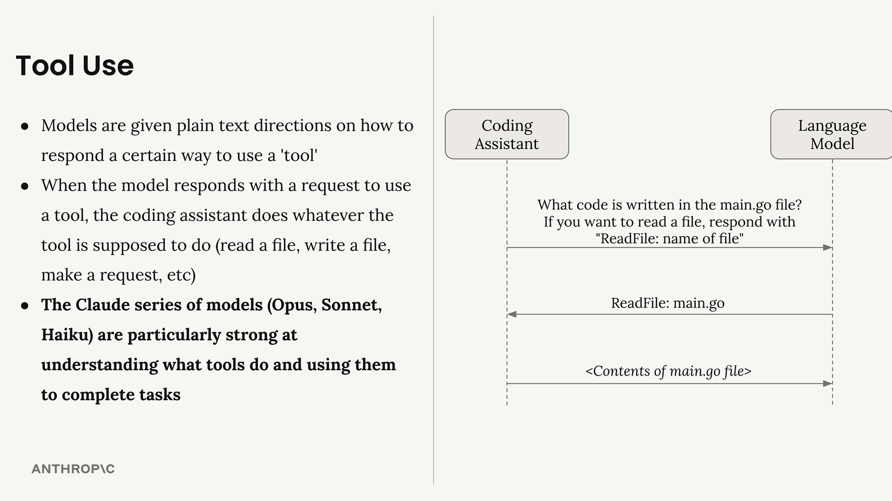
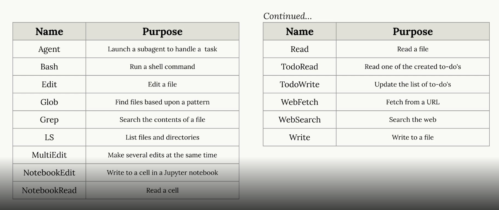
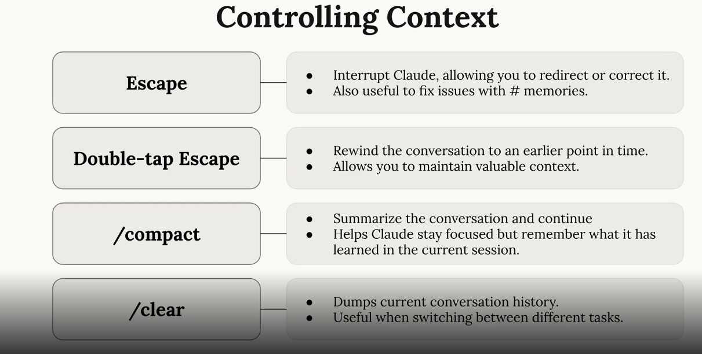

# Calude

## Calude code
- it is a coding assistant, generally run in terminal, unlike co-pilot which is incuded in IDE
- **coding assistant** - it is a cutom program which calls LLM models, LLMs can only generate texts, they cannot do any particular task, like read / write to a file, so coding assistants talk to LLM, if LLMs want to read a file, these coding assistant's will do that and send the data back to LLMs for further porcessing

 - 
- so coding assistants sit between LLM and user
- they add wrapper texts, like they say to the model, that if you want to read a file, then reply with **ReadFile: filename**, then this custom program (coding assistant), read's LLM output, and since this output is kinf of a commnd, than the coding assistants perform that task thorugh code

**Anthropic team says that what separates claude code from other AI coding assistant's is it's strong use of tools**

Default tools available with Claude code - 


### 1. Context
- **IMP for a user to include ideal amount of context in the conversation** - to0 little context will make the assistant do more work, too much context might take coding assistant to wrong direction

##### Setting context using /init command
- in the claude code terminal, run /init command
- this will make cluade code to scan entire project and create a CLAUDE.md file (similar to INSTRUCTIONS.md file in co-pilot), this file will have high level project details
- this file is included as context for every chat we have with coding assistant

##### Adding relavant files to the context
- using @<filename> - will add that particular file in the context
- in copilot, we can just drag and drop files in the chatbot

##### Thinking and Planning
1. Planning - similar to breadth-first algo, lists high level tasks (press shift+tab twice to enable plan mode)
2. Thinking - similar to DFS - reason more on complex task (in chat we need to add keyword - think more, think longer, ultrthink)
- the more planning and thinking we as claude code to do, the more tokens it consume


### 2. commands
1. built-in

2. custom
- create .claude/commands folder in the project root
- then create a audit.md - name of the file (in this case audit) would be the name of the command
- write md instructions -
```
-- audit.md
Run npm audit to find vulnerable installed packages
Run npm audit fix to apply updates
Run tests to verify the updates didn't break anything
```
- now restart claude code and run the command /audit

3. custom commands with args
```
Write comprehensive tests for: $ARGUMENTS

Testing conventions:
* Use Vitests with React Testing Library
* Place test files in a __tests__ directory in the same folder as the source file
* Name test files as [filename].test.ts(x)
* Use @/ prefix for imports

Coverage:
* Test happy paths
* Test edge cases
* Test error states
```
#ARGUMENTS value is replaced wherever @ is present
 