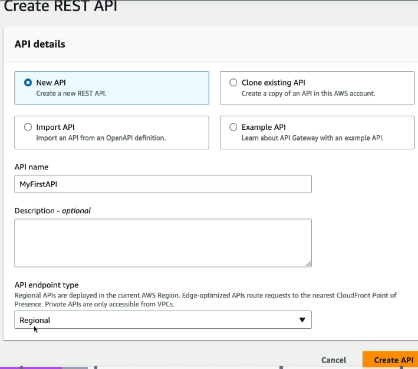
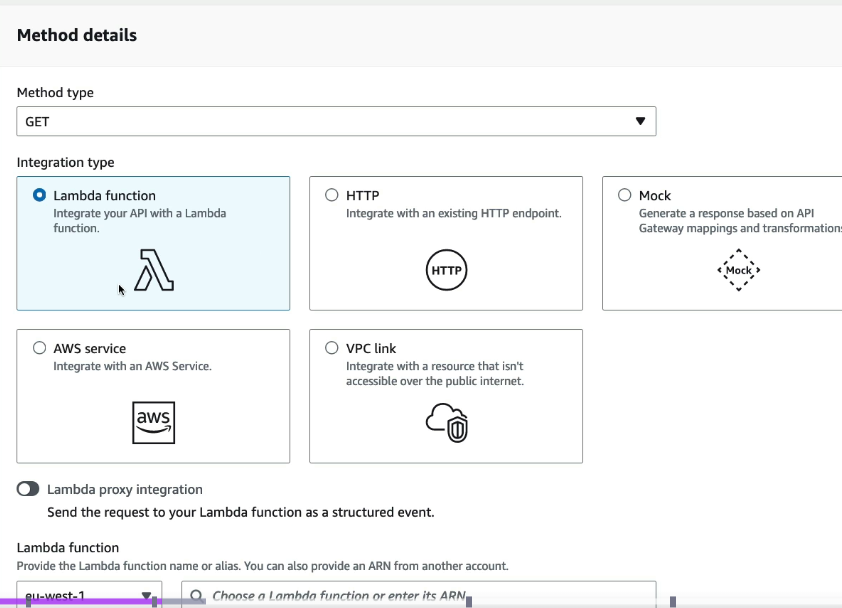
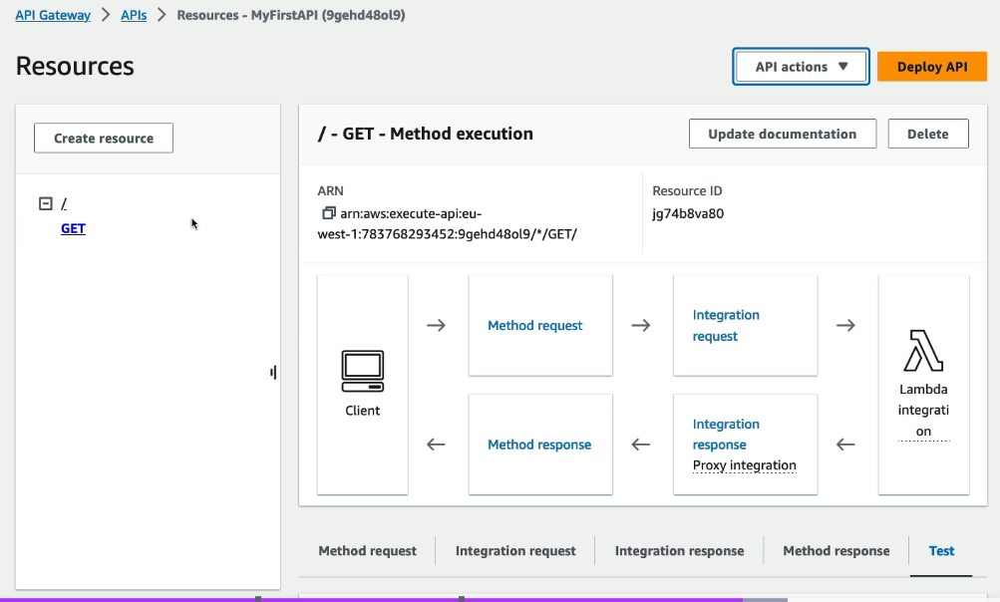
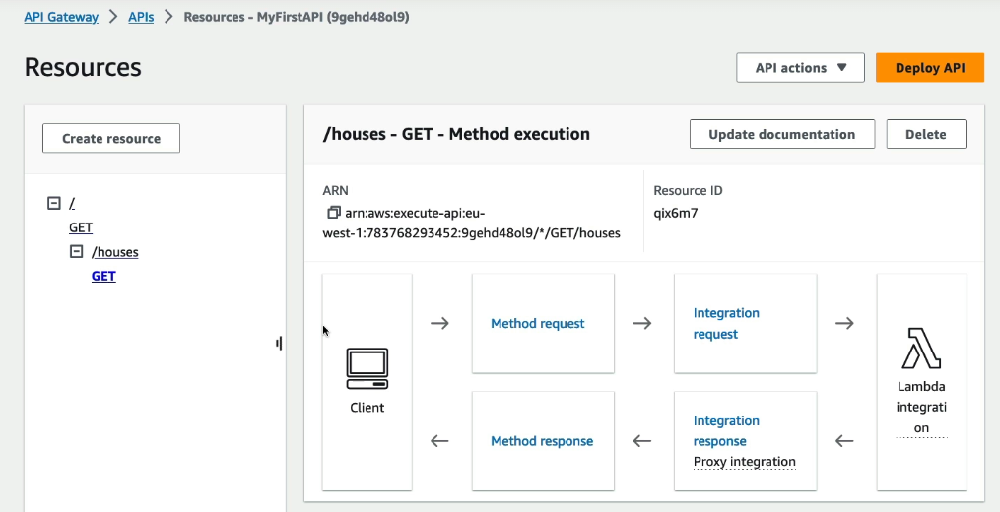
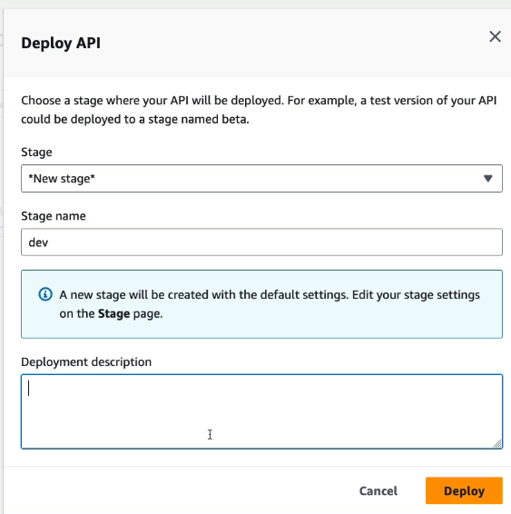
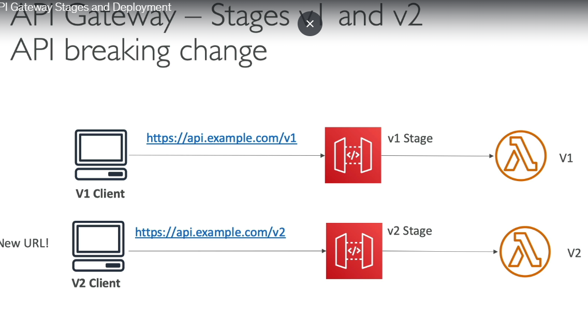
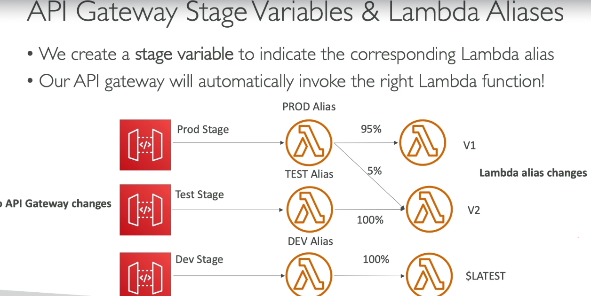
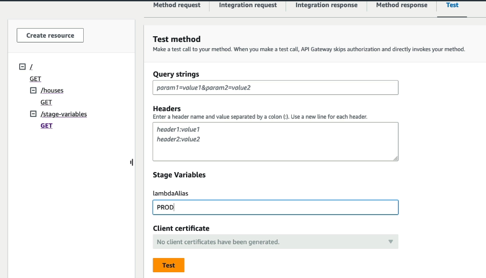
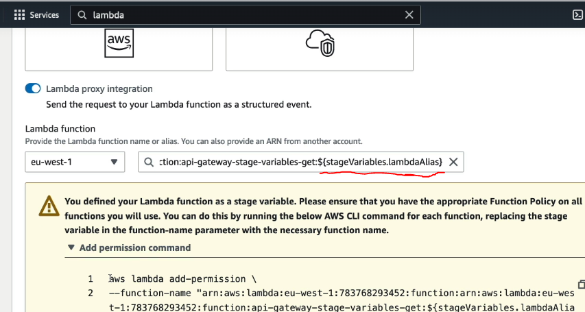
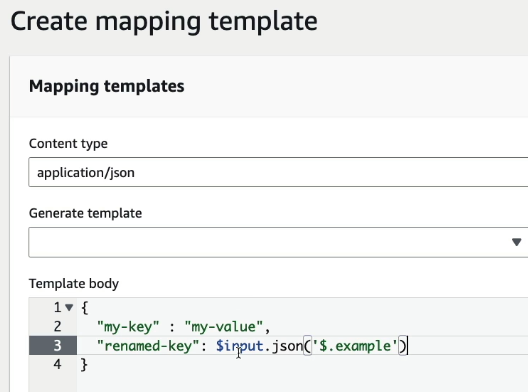

# API Gateway
- allows us to create serverless APIs
| # | Core Purpose | Why it Exists (1-liner) | Example |
|---|--------------|-------------------------|---------|
| 1 | **Single entry point for APIs** | Exposes one endpoint instead of clients calling multiple backend services directly. | Mobile app → API Gateway → Lambda, ECS, EC2 |
| 2 | **Centralized security** | Handles authentication, authorization, API keys, throttling, WAF, CORS, etc., in one place. | Validate JWT before forwarding request |
| 3 | **Request/Response transformation** | Modifies requests or responses without changing backend code. | Convert XML → JSON, add/remove headers |
| 4 | **API management & monitoring** | Provides logging, metrics, caching, rate limiting, usage plans, and versioning. | CloudWatch logs, API quotas, response caching |

**API gateway can be integrated with**  
1. lambda
2. EC2, ECS, EKS, also on-prem APIs
3. SNS, SQS, Step functions, Event Bridge

**BOTTOM-LINE** - **API Gateway allows external clients (browsers, mobile apps, third-party applications, etc.) to securely invoke all the above AWS servies via REST API**  

| Endpoint Type | Accessible From | Best Use Case | Supports VPC? |
|---------------|-----------------|---------------|---------------|
| **Regional** | Internet within a specific AWS Region | Most APIs, low latency for regional users | ❌ |
| **Edge-Optimized** | Internet (via CloudFront edge locations) | Global clients needing lower latency | ❌ |
| **Private** | Only from within a VPC (via Interface VPC Endpoint/PrivateLink) | Internal microservices, enterprise/private APIs | ✅ |

### API Gateway security
| Security Feature | Purpose | Example |
|------------------|---------|---------|
| **IAM Authentication** | Allow only authenticated IAM users/roles to invoke APIs | Internal AWS applications |
| **Lambda Authorizer** | Run custom authentication/authorization logic | Validate custom JWT or OAuth token |
| **JWT Authorizer** (HTTP APIs) | Validate JWT tokens from an Identity Provider | Cognito, Auth0, Okta |
| **Amazon Cognito Authorizer** | Authenticate users using Cognito User Pools | Mobile/Web app login |
| **API Keys** | Identify API consumers and enforce usage plans (not authentication) | Partner or developer APIs |
| **Usage Plans & Quotas** | Limit requests per client/API key | 1,000 requests/day |
| **Throttling** | Protect backend from excessive traffic | 100 requests/sec |
| **AWS WAF** | Block malicious traffic (SQLi, XSS, bots, IP blocking) | Protect public APIs |
| **Resource Policies** | Control which AWS accounts, VPCs, or IPs can access the API | Allow only corporate IP range |
| **HTTPS (TLS)** | Encrypt data in transit | Secure client-to-API communication |
| **CORS** | Control which browser origins can call the API | Allow only `https://app.example.com` |

### ConfiguringAPI Gateway
1. Create Rest API
-   
2. Create Method (GET/PUT/POST/ basically any HTTP method), and select the Lambda function which needs to be invoked
-   
3. Root / GET method is created
-   
4. We can create reources as many as we want under the API Gateway (created /houses resource and has a GET method on that resource)
-   
5. Now we need to deploy the API, after deploying the API, we will get INVOKE_URL, which external clients use
-   

### API versioning
| Concept | Purpose | Example |
|---------|---------|---------|
| **Deployment** | Immutable snapshot of the API configuration at a point in time | Deploy API v1 after adding `/users` endpoint |
| **Stage** | Named environment that points to a deployment | `dev`, `test`, `staging`, `prod` |
| **Stage Variables** | Environment-specific key-value pairs used by the API | Different Lambda alias or backend URL for `dev` and `prod` |

- see below, how to version your API
  
  
- In lambda, we create 3 versions of lambda (v1, v2, v3), and create there Aliases (dev,tst,prod), **remember that we can change aliases to point to any version**
- then in API gateway, we add a stage variable, and whatever that variable is, API gateway will trigger that Alias of that lambda
  
- add the stage Variable in Lambda ARN for above setting to work
  

### API Gateway mappings
| Mapping Type | Purpose | Example |
|--------------|---------|---------|
| **Request Parameter Mapping** | Rename, add, remove, or modify request headers, query parameters, and path parameters before sending to backend | Rename `X-User-Id` → `userId` header |
| **Request Body Mapping (Mapping Template)** | Transform the request payload into the format expected by the backend | Convert client JSON into DynamoDB `PutItem` request |
| **Response Parameter Mapping** | Modify response headers before returning to the client | Add `Cache-Control` or `X-Request-Id` header |
| **Response Body Mapping (Mapping Template)** | Transform the backend response into the format expected by the client | Convert XML response to JSON |
| **Velocity Template Language (VTL)** | Template language used for request/response body transformations (mainly REST APIs) | Extract fields, create JSON, add static values |

### API Gateway → SQS Request Mapping Example

> The process of transforming or modifying a client request before sending it to the backend (AWS service), or transforming the backend response before returning it to the client. 

#### 1. Client sends request

```http
POST /orders
Content-Type: application/json
{
  "orderId": 101
}
```
---
#### 2. API Gateway Request Mapping Template (VTL)
```vtl
Action=SendMessage&MessageBody=$util.urlEncode($input.body)
```
This transforms the client's JSON request into the format expected by the SQS `SendMessage` API.
---
#### 3. API Gateway sends to SQS
```http
POST https://sqs.us-east-1.amazonaws.com/123456789012/orders-queue
Action=SendMessage&
MessageBody=%7B%22orderId%22%3A101%7D
```
---
#### 4. Message stored in SQS
```json
{
  "orderId": 101
}
```
---
#### Flow

```text
Client
   │
   │ POST /orders
   ▼
API Gateway
   │
   │ Request Mapping (VTL)
   ▼
SQS SendMessage API
   │
   ▼
SQS Queue
```
- The example below shows a response mapping template that modifies the backend response before it is sent to the client. It adds a new key-value pair and renames the existing example key to renamed-key, while keeping the original value unchanged.  
- these mappers can be created before req is passed to BE AWS service, or before AWS BE service sends response to the client
  

### API Gateway caching
| Aspect | Description |
|--------|-------------|
| **Purpose** | Cache successful API responses to reduce backend calls and improve latency. |
| **Cache Location** | Managed cache within API Gateway (enabled per stage). |
| **Cache Key** | Based on request path, query parameters, headers, etc. (configurable). |
| **TTL (Time To Live) - default 5 mins** | How long a response remains in the cache before expiring. |
| **Enable/Disable** | Configured at the **stage** level; can be overridden per method. |
| **Supported APIs** | REST APIs only (not supported for HTTP APIs). |
| **Cache Invalidation** | Automatically after TTL expires, or manually flush the stage cache. |

### API gateway API Keys
| Concept | Description |
|--------|-------------|
| **API Key** | Unique key issued to each client to identify who is calling the API. |
| **Purpose** | Identify clients and enforce usage limits; **not** used for authentication or authorization. |
| **Usage Plan** | Associates one or more API keys with specific stages/methods and defines quotas and throttling. |
| **Quota** | Maximum number of API requests allowed over a period (e.g., 100,000/month). |
| **Throttling** | Limits request rate (e.g., 100 requests/sec with burst 200). |
| **Billing** | API Gateway **does not charge your customers**. You can use API keys to track each client's usage and build your own billing system. |
| **Usage Tracking** | API Gateway records usage per API key, which can be used for reporting and invoicing. |
| **Typical Use Case** | SaaS providers offering Free, Pro, and Enterprise API plans. |

- API keys are passed by clients using x-api-key header

**Default - API gateway throttling limit is 10K requests/sec, this is at the accoutn level and not at the API level**