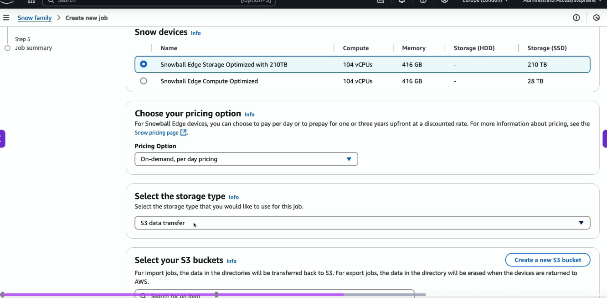
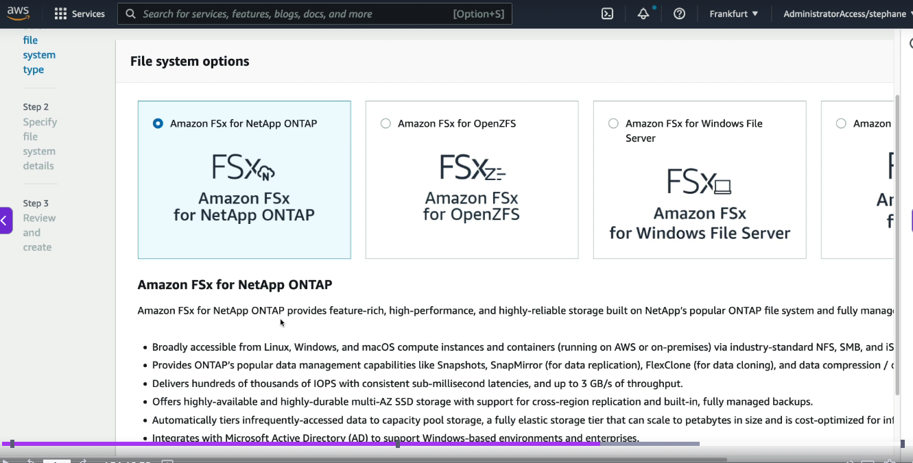
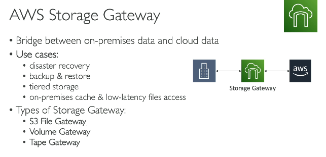
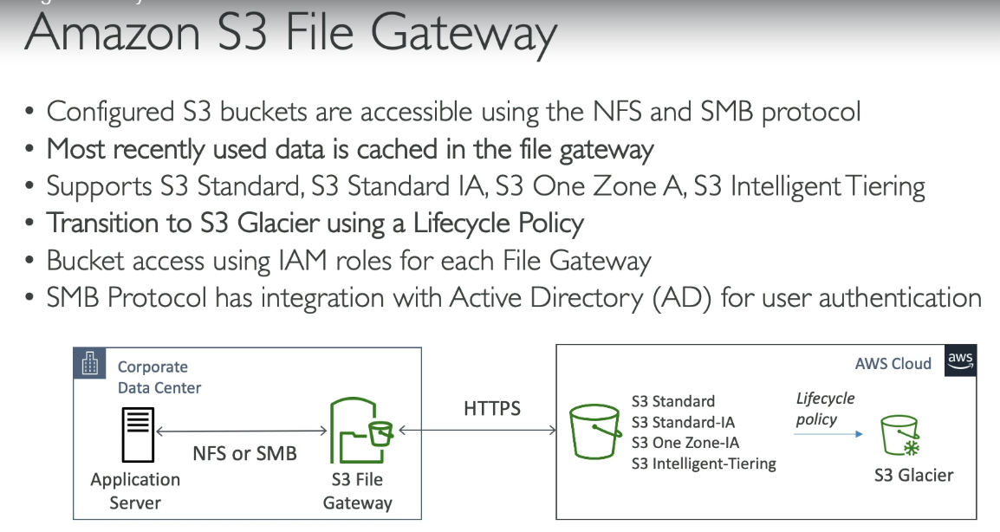
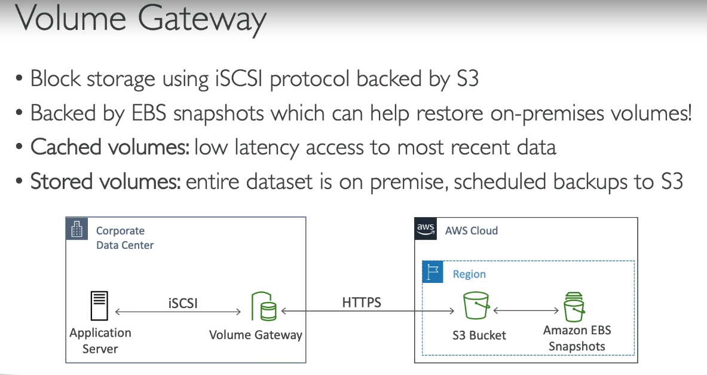
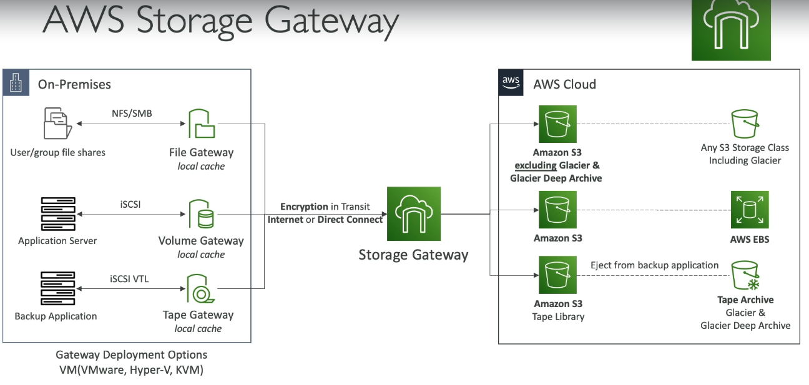

# AWS Storages

## 1. Snowball
- portable device to transfer large data in and out of AWS / on-prem
- e.g. if we need to transfer 1 Petabyte of data from on-prem to s3 on 1Gbps internet bandwidth, then it will take more than 100 days
- instead use Snowball, which will do the transfer in 1 week
- **Another usecase is for Edge computing** - Processing data closer to where it is generated instead of sending everything to cloud, reducing latency and bandwidth usage. E.g. process data at the mining site itself, rather then uploading it to AWS

#### Ordering a snowball device  
- select snowball device type (210TB or 28TB)  
- select if you want to tranfer data to AWS S3 or get data from AWS S3 to on-prem, or if you need this device to transfer data from on-prem to on-prem
- If we select bring data from AWS S3 to on-prem, then select buckets, whose data needs to be exported into snoball device  
   
- the select in KMS keys for data to be encrypted
- the select address, where this snoball device will be delivered

**Snowball cannot import your on-prem data directly to S3 Galcier, first it needs to be added to S3, and then set lifecycle policy to then move data t S3 Glacier**

## 2. Amazon FSx
- launch 3rd part high performance file systems on AWS
4 types  

#### 1. Amazon FSx for Windows File Server
- for **Windows**
- supports **SMB** and **NTFS** file protocols
- supports **Microsoft AD** and Microsoft's **Distributed File System (DFS)**
- can be mounted on **Linux EC2 instances** as well
- can store up to **100 PB** of data with millions of IOPS
- Storage options: **SSD** (faster) and **HDD**
- on-prem servers can access this file system via **Direct Connect / VPN**
- data can be backed up to **S3**

#### 2. Amazon FSx for Lustre
- for **Linux**
- Lustre = **Linux + Cluster**
- very high performance, used in **HPC applications**
- used for **ML processing, video processing, and scientific computing**
- Storage options: **SSD and HDD**
- on-prem servers can access this file system via **Direct Connect / VPN**
- integrates with **S3** — can directly read/write data from S3
- commonly used when **high throughput and low latency** are required

#### 3. Amazon FSx for OpenZFS
- for **Linux / Unix-based workloads**
- uses the **OpenZFS** file system
- supports **NFS** file protocol
- provides **high performance and low latency**
- commonly used for **Linux applications, databases, analytics, and file-based workloads**
- supports **snapshots, cloning, and data compression**
- Storage option: **SSD**
- on-prem servers can access this file system via **Direct Connect / VPN**
- supports **NFSv3, NFSv4, and NFSv4.1**

#### 4. Amazon FSx for NetApp ONTAP
- for **Linux and Windows** workloads
- based on **NetApp ONTAP**
- supports **NFS, SMB, and iSCSI** protocols
- supports **Microsoft Active Directory**
- supports **multi-protocol access** — Windows and Linux clients can access the same data
- supports **snapshots, cloning, replication, compression, and deduplication**
- Storage options: **SSD + capacity pool storage**
- supports **automatic data tiering** from SSD to capacity pool
- on-prem servers can access this file system via **Direct Connect / VPN**
- integrates with **AWS DataSync** for data migration
- best choice when you need **enterprise NAS features**

### Quick SAA-C03 Comparison

| FSx Type | Best For | Protocol |
|---|---|---|
| **FSx for Windows File Server** | Windows workloads | **SMB** |
| **FSx for Lustre** | HPC, ML, video processing | **Lustre** |
| **FSx for OpenZFS** | Linux/Unix, high-performance workloads | **NFS** |
| **FSx for NetApp ONTAP** | Enterprise NAS, mixed Windows/Linux | **NFS, SMB, iSCSI** |

#### Persistent vs Scratch File Deployment

| Deployment | Meaning | Actual Use Case |
|---|---|---|
| **Persistent** | File system survives when compute resources are stopped/removed | **Store application data that needs to be available after restart** |
| **Scratch** | File system is temporary and data can be lost when compute resources are stopped/removed | **Store temporary/intermediate data during HPC or ML processing** |  

**Creating FSx**  
- select type
- then select the storage type SSD, HDD, and total storage needed like 100GB or whatever  
   

## 3. Storage Gatweay

- **Hybrid Cloud** = part of the infrastructure runs **on-premises** and part runs in the **AWS Cloud**
- Organizations may choose hybrid cloud because of:
  - **Long / gradual cloud migration**
  - **Security requirements**
  - **Compliance requirements**
  - Existing **IT strategy / infrastructure**

#### The Challenge with S3

- **S3 uses AWS's proprietary object storage protocol**
- On-premises applications may expect traditional **file storage** such as **NFS/SMB**
- So, how can on-premises applications access **S3 storage** as if it were local storage?

#### Solution: AWS Storage Gateway

- **AWS Storage Gateway** connects **on-premises applications** to **AWS cloud storage**
- It provides standard storage interfaces such as **NFS/SMB** while storing data in AWS services like **S3**

> **On-premises application → NFS/SMB → Storage Gateway → AWS S3** 

  

### 1. S3 File gateway
  

**FLOW**  
**On-premises Application Server**  
→ accesses files using **NFS/SMB**  
→ **S3 File Gateway**  
→ sends data to **S3 over HTTPS**  
→ data is stored in **S3**  
→ **Lifecycle Policy** can move older data to **S3 Glacier**

> **Key point:** The application sees a **normal file system**, while the actual data is stored in **S3**.

### 2. Volume Gateway
- Provides block storage to on-premises applications using iSCSI.
  

### 3. Tape Gateway

- Provides **virtual tapes** to on-premises backup applications using **iSCSI**
- Acts like a **physical tape library**, but stores data in **AWS S3**
- Frequently accessed tape data is **cached locally**
- Virtual tapes are stored in **S3** and can be archived to **S3 Glacier**
- Used mainly for **backup and archival** without physical tape infrastructure

**Flow:**  
`Backup App → iSCSI → Tape Gateway → S3 → S3 Glacier (Archive)`

### Storage Gateways summarized
- Note that all the 2 types of gatways need to be configured on-prem  
  

## 4. AWS File transfer family

- Managed service to **transfer files into and out of AWS storage**
- Supports **SFTP, FTPS, FTP, and AS2**
- Mainly used when existing applications/users need **traditional file-transfer protocols**
- Stores transferred files in **Amazon S3 or Amazon EFS**
- Fully managed — no need to maintain your own FTP/SFTP server

**Flow:**  
`User / Application → SFTP / FTPS / FTP → AWS Transfer Family → S3 / EFS`

**Key point:**  
**Transfer Family = Move files using traditional protocols → S3/EFS**  

> [!NOTE]
> - **Storage Gateway** → Makes **AWS storage look like local storage**, by moving data to on-prem  
> - **Transfer Family** → **Transfers files** between users/apps and AWS

## 5. AWS DataSync

- Managed service to **transfer large amounts of data** between **on-premises storage and AWS**
- **it can also transfer data from AWS to AWS**
- Supports **NFS, SMB, HDFS, S3, EFS, and FSx**
- Faster and simpler than manually copying data over the network
- Used for **data migration, backup, and ongoing data synchronization**
- Uses a **DataSync Agent** when transferring data from on-premises storage

**Flow:**  
`On-prem Storage → DataSync Agent → AWS DataSync → S3 / EFS / FSx`

> **DataSync = Fast, automated data transfer/synchronization between storage systems** 

> [!NOTE]
> - **DataSync** → Designed for **scheduled/automated data synchronization**
> - **Transfer Family** → Data is transferred when a **user/application uploads or downloads files**
> - **Storage Gateway** → Provides **ongoing access** to AWS storage; data can be transferred automatically as the application reads/writes data
