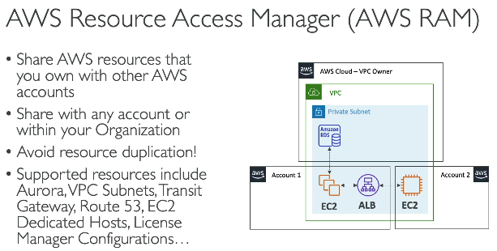
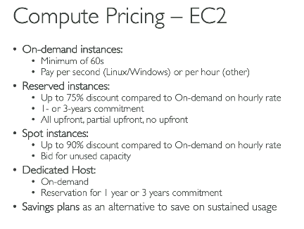

# Account management & Billing

## AWS Organization
- global service used to manage multiple AWS accounts
- We create AWS org, then within that we create multiple AWS accounts, or if accounts already exists, we send invite emaik to those accounts, then those accs receive invitation in AWS console, when accepted, that AWS acc is now part of the org

### Benifits of using AWS Org
#### 1. Policy management at account level
- ability to restrict AWS account previliges using Service Control Policy
- SCP - Service control policy - in this we define rules that withing AWS Org, which AWS account or IAM user / roles has what restrictions
- E.g. S3 service should not be available to a child AWS acc - apply SCP
- lets say we have 1 org and 2 AWS accs, A and B, if we apply SCP policy to deny S3 access to Acc B, then even the root user of acc B, cannot access S3 on B. This is very powerful to control access across accounts for a company

#### 2. Discounted billing
- we get consolidated billing across accounts under this organization
- EC2 instances reserved in one AWS acc, can be used by another AWS acc, if they are in the same org
- we know if we reserve EC2 instances, then cost of those EC2 is less, but if Acc A has 10 reserved EC2, and only 6 of them are used, then acc B can still use 4 reserved EC2 instances even if it did not had reserved EC2 instances in it own acc, so cost reduced
- various AWS services like s3 provide discount is storage > 5 TB, now if we have 6 different AWS accs, each using 1 TB, then total s2 TB inside AWS org becomes 6TB, so now that 5TB discount gets applied, even though each individual AWS acc is still using only 1 TB, so cost reduced

### Multi account strategies
- A compnay can create account per department or per cost center or even per project
- instead of mult account, we can have one single account and create multiple VPCs which acts like a separate account

## AWS contorl tower
- Inseatd of we manually create AWS org, and adding AWS acc, we can use this service
- benefit - this has inbuild guardrails (as per best practices), and AWS detectives to handle issues

## AWS RAM
 

# Pricing

### Compute
1. EC2
 