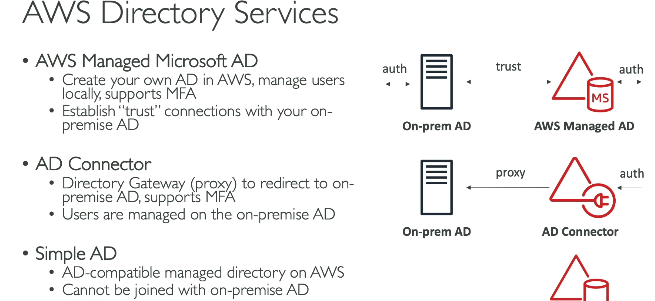
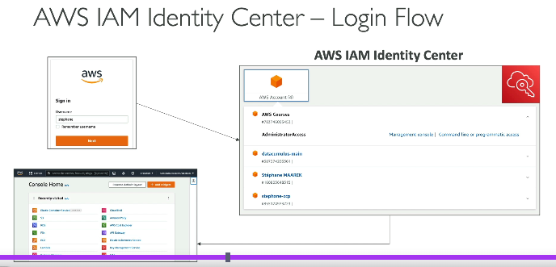

# Advanced Identity

### AWS STS (Security Token Service)
- provides temporary, limited-privilege security credentials for accessing AWS resources instead of using long-term access keys

### Directory Services
 

### AWS Identity center
- service that provides centralized access management and Single Sign-On (SSO) for multiple AWS accounts and business applications.
- Let's say you have 4 different AWS accounts. then instead of remembering creds for all 4 accounts, create login under AWS Identity center, so you always login to AWS Identity cetner, from there you can login directly to any management console using only one login creds
 
