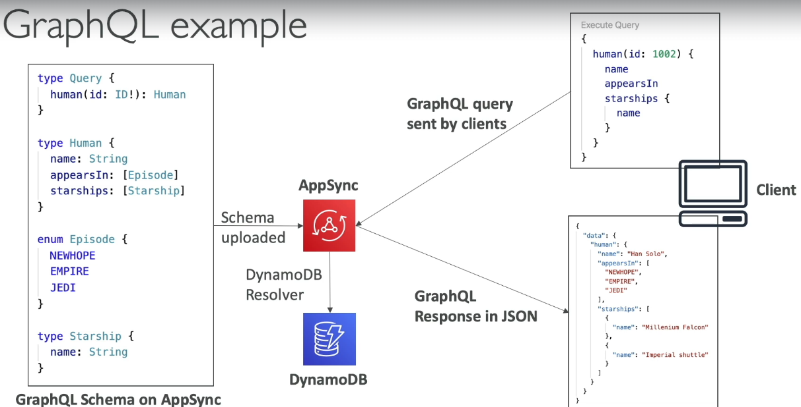
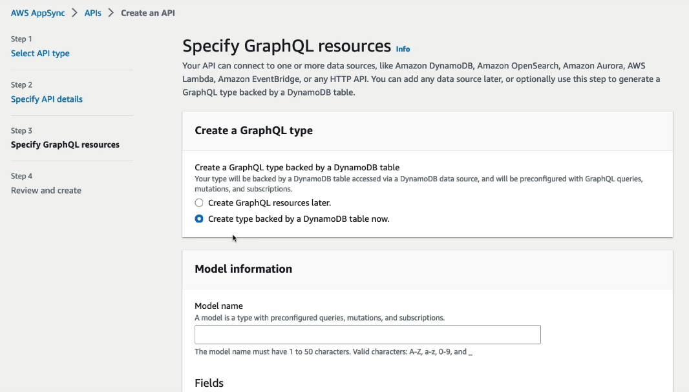
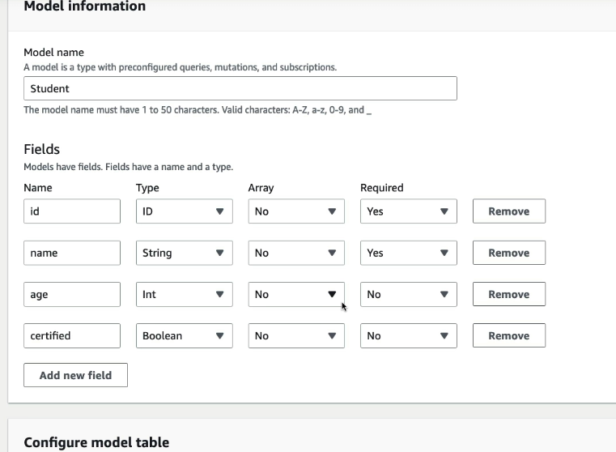
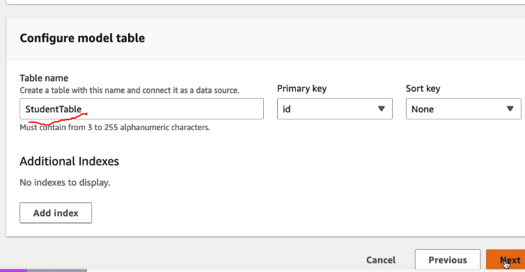
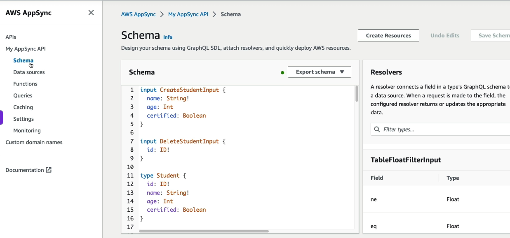
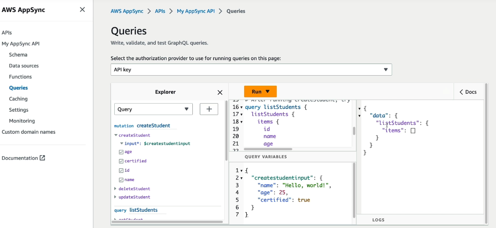
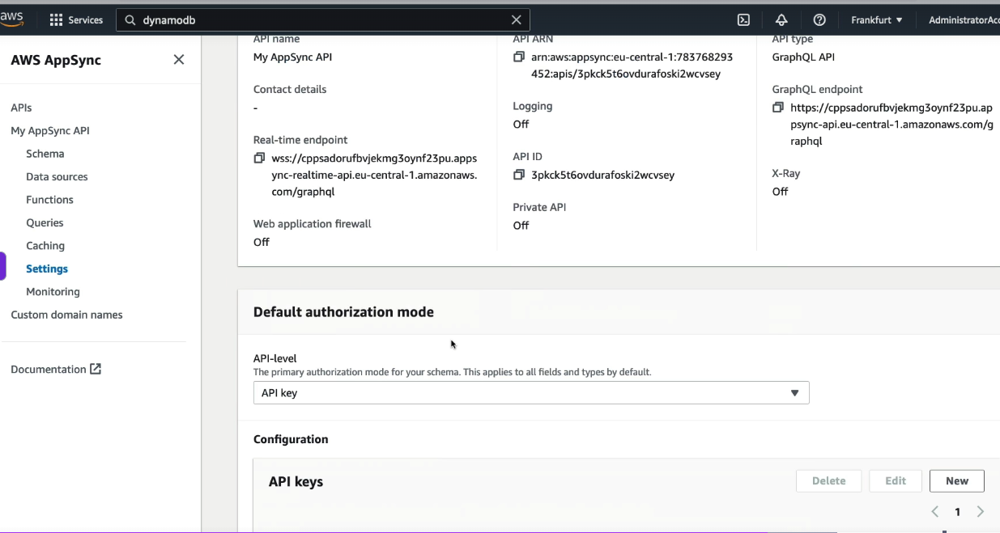

# AppSync
- fully managed GraphQL server that connects GraphQL APIs to data sources like DynamoDB, Lambda, Aurora, and HTTP APIs.
- so no need to create backed apollo / express graphql server
- just use appsync

  
- in above e.g. resolver in DynamoDB (resolver - the soruce from which GQL will fetch the data)  
- other resolvers include - Aurora, OpenSearch. Lambda (lambda can then basically bring sta from anywhere (API, RDS))

## Configuring AppSync
- Goto Appsync, select GQL API
- select backed by DynamoDB, then our resolver will be DynamoDB table

  

  
- after providing above details, AWS will automatically create DynamoDB table for us
- it will give us GQL queires and mutations for clients to consume
- **VVIP - see how we don't have to create a GQL server (like we don't need to create Apollo / Express GQL server), AppSync handles this for us**
- below StudentTable - will be the DynamoDB table name

  
- now click on create, and our GQL server is ready
- schema is created for us

  
- it also gives is queris, which our clients need to integrate

  
- GQL endpoint is also created, which our client's need to connect to
- and we can create API keys, and share with the clients
  
