# CICD
1. VCS - CodeCommit
2. Build server - CodeBuild (similar to Bamboo / Jenkins)
3. Deploy apps - CodeDeploy (similar to Bamboo / Jenkins)
4. Code Pipeline - CI/CD orchestrator

## 1. CodeCommit

- goto codecommit and click on create repo
- next steps are similar to noraml github repo, clone and start using
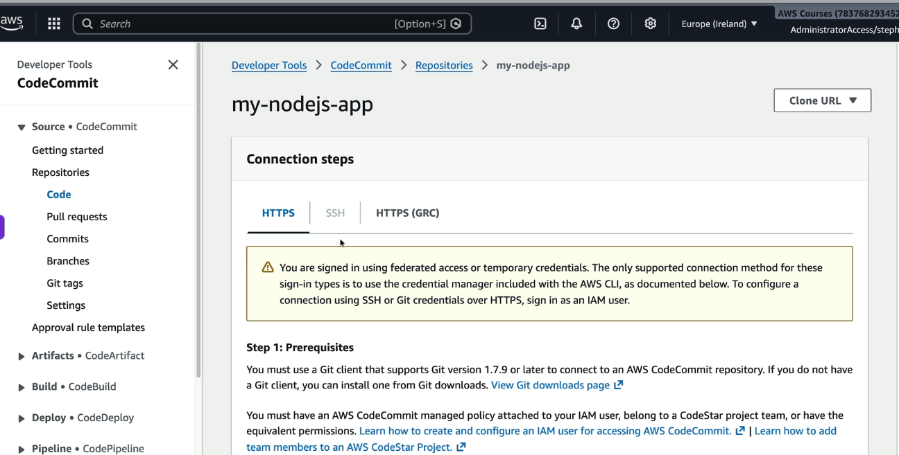  
- you need to have IAM permissions to access code commit, also git and python needs to be installed on local machine, why python? (to install git-remote-codecommit to connect to code-commit from local)
- once cloned, then we run can run all git commands
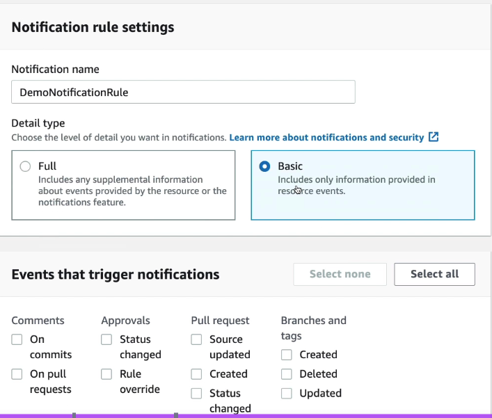   
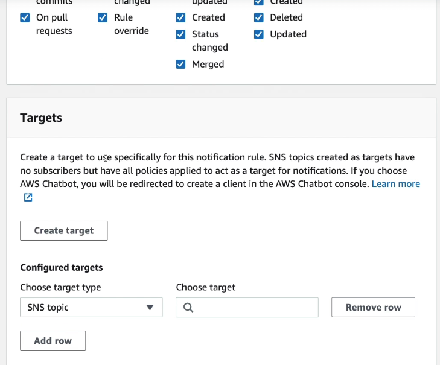  

## 2. Code Pipeline
- it is CI/CD orchestrator
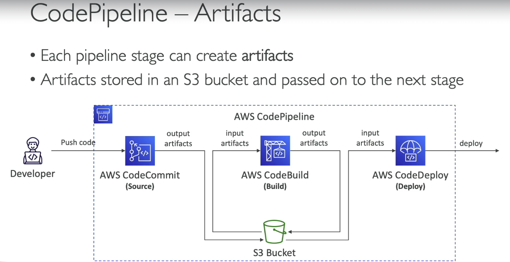  
- Note all the artificats that are getting pushed to and from is done by code pipeline
- on code push to codecommit, both code build and code deploy are trigerred by code pipeline

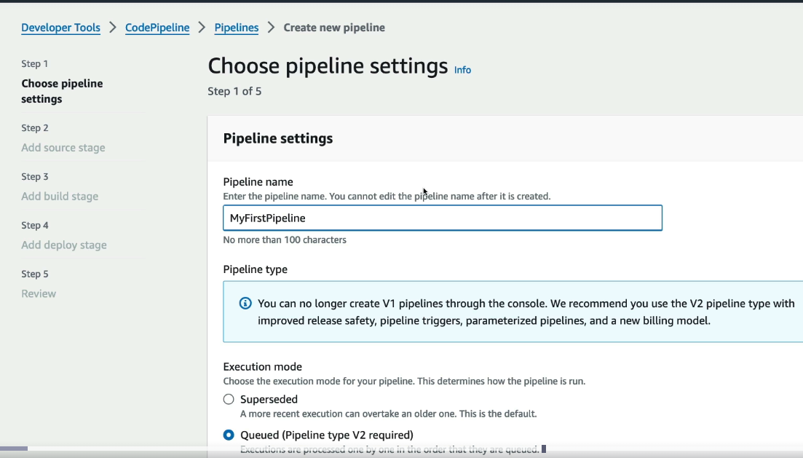  
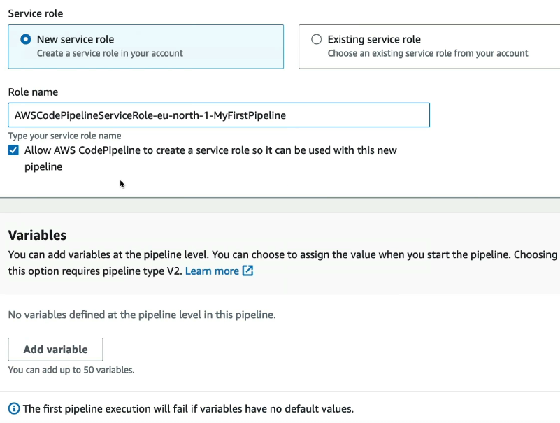  
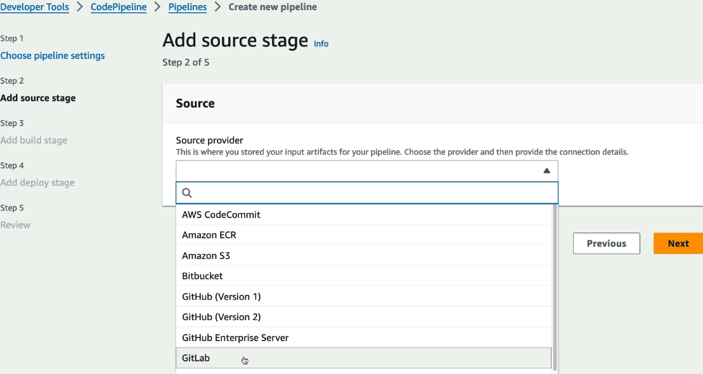  
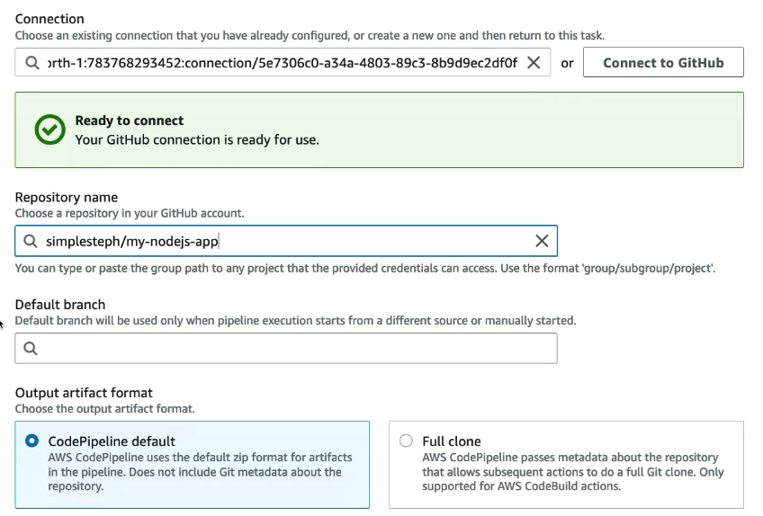  
- choose when the pipeline should get trigerred
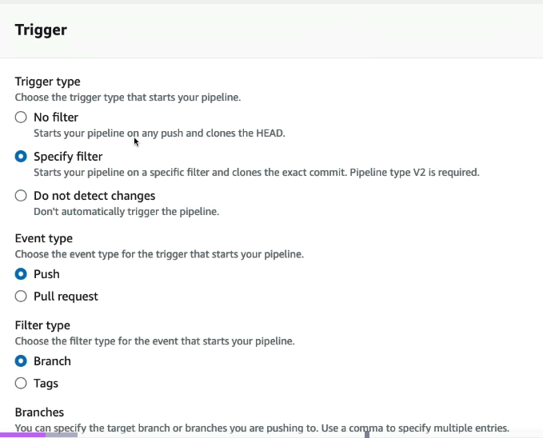  
- choose where the artifcat needs to be deployed
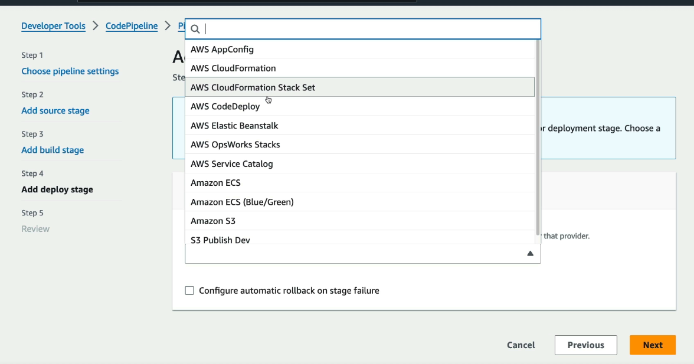  

## 3. Codebuild
| Step | What You Do | Example |
|------|-------------|---------|
| **1. Create Project** | Create a CodeBuild project and choose the source repository | CodeCommit, GitHub |
| **2. Choose Environment** | Select the build image, OS, runtime, and compute size | Amazon Linux + Node.js 22 |
| **3. Add `buildspec.yml`** | Define the build commands | Install → Test → Build → Package |
| **4. Configure IAM Role** | Grant permissions to read source and write artifacts/logs | S3, CloudWatch Logs, ECR |
| **5. Configure Artifacts** | Specify where build outputs should be stored | S3 or CodePipeline |
| **6. Start Build** | Trigger manually, via CodePipeline, EventBridge, or Git webhook | Code push triggers build |
| **7. View Results** | Monitor logs and download artifacts | CloudWatch Logs, S3 |

#### Sample buildspec.yml
```yml
version: 0.2
phases:
  install:
    commands:
      - echo "Installing dependencies..."
      - npm ci
  pre_build:
    commands:
      - echo "Running pre-build steps..."
      - npm run lint
  build:
    commands:
      - echo "Building application..."
      - npm test
      - npm run build
  post_build:
    commands:
      - echo "Post-build tasks..."
      - echo "Build completed successfully"
artifacts:
  files:
    - '**/*'
  name: build-artifact
  discard-paths: no
```
- **once you create codebuild, goto code pipeline, add task (task name --> build), then select the codebuild project that we created above**
- hence codepipeline is orchestrator, where as codebuild's job is just to build the project and store the artifacts

## 4. Code deploy
- can deploy app to EC2, Beanstalk, lambda
| Step | What Happens |
|------|--------------|
| **1. Prepare Deployment Artifact** | Package the application along with an **`appspec.yml`** file (and deployment scripts, if any). |
| **2. Upload Artifact** | Store the artifact in S3 or pass it from CodePipeline. |
| **3. Trigger Deployment** | CodeDeploy is triggered manually or by CodePipeline. |
| **4. Select Deployment Group** | CodeDeploy identifies the target EC2 instances, Auto Scaling group, ECS service, or Lambda function. |
| **5. Download Artifact** | The CodeDeploy agent (adding this agent EC2 / onprem server is a prerequisit) (EC2/on-premises) or AWS service (ECS/Lambda) downloads the artifact. |
| **6. Read `appspec.yml`** | CodeDeploy reads `appspec.yml` to determine where files should be copied and which lifecycle hooks to execute. |
| **7. Execute Lifecycle Hooks** | Runs hooks such as `BeforeInstall`, `AfterInstall`, `ApplicationStart`, and `ValidateService`. |
| **8. Deploy Application** | Copies files to the target location and starts the application. |
| **9. Verify & Rollback** | Performs health checks and automatically rolls back if deployment fails. |

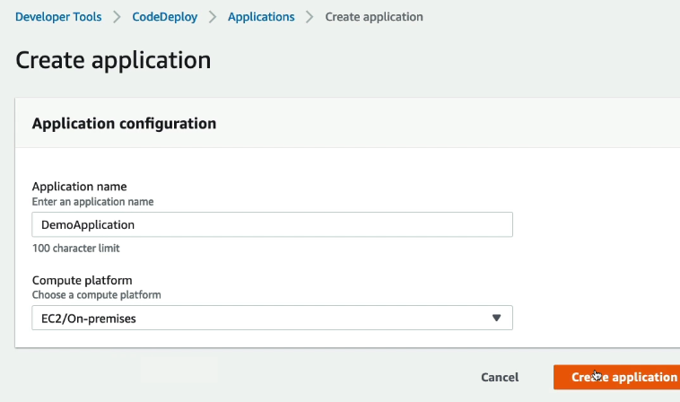  
- now we need to specify deployment group (where the app will be deployed? in ouy case EC2)
- but there is a pre-requisit, we need to install codedeploy agent on EC2s
- so ssh into EC2, and run below commands
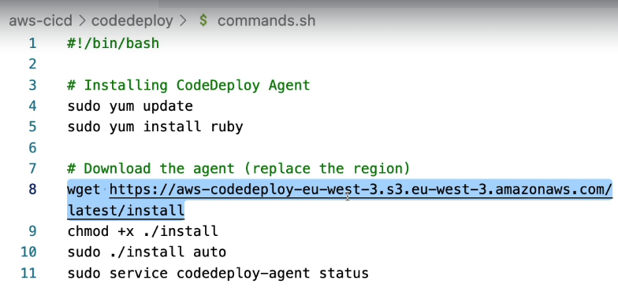  
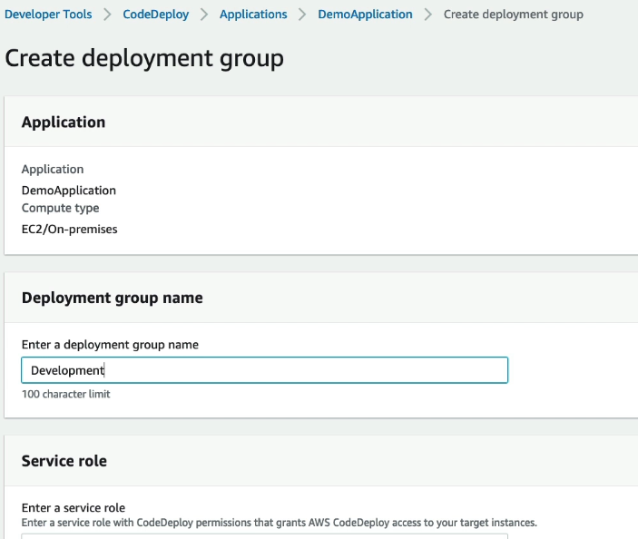  
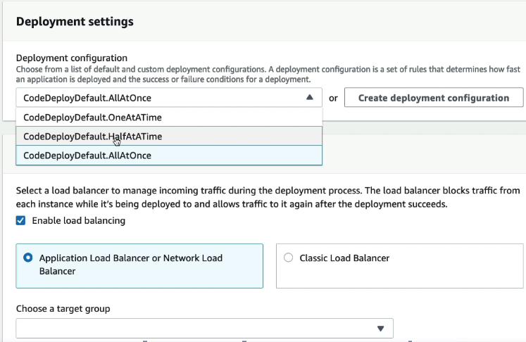  

**appspec.yml**
```yml
version: 0.0
os: linux
files: # copy file from source and store to destination
  - source: /
    destination: /var/www/html
hooks:
  ApplicationStart:
    - location: scripts/start.sh # see below
```

**start.sh** - 
```bash
#!/bin/bash
npm run start
```

- then as usual,**once you create codedeploy, goto code pipeline, add task (task name --> deploy), then select the codedeploy project that we created above**

### 5. Code artifcat
- CodeArtifact stores software packages (dependencies).
- Whereas S3 stores build artifacts (ZIPs, binaries).
| Aspect | Description |
|--------|-------------|
| **What is it?** | Fully managed artifact repository for storing and sharing software packages. |
| **Purpose** | Securely host private packages and proxy public package repositories. |
| **Stores** | npm, Maven, PyPI, NuGet, RubyGems, Cargo, Swift packages, etc. |
| **Used By** | Developers, CodeBuild, CI/CD pipelines. |
| **Authentication** | IAM + temporary authorization tokens. |

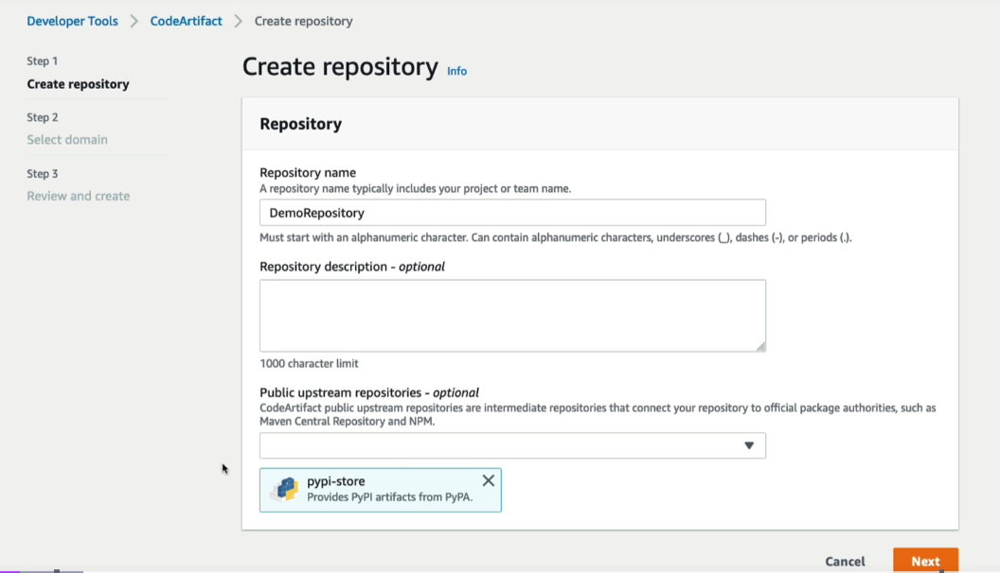  
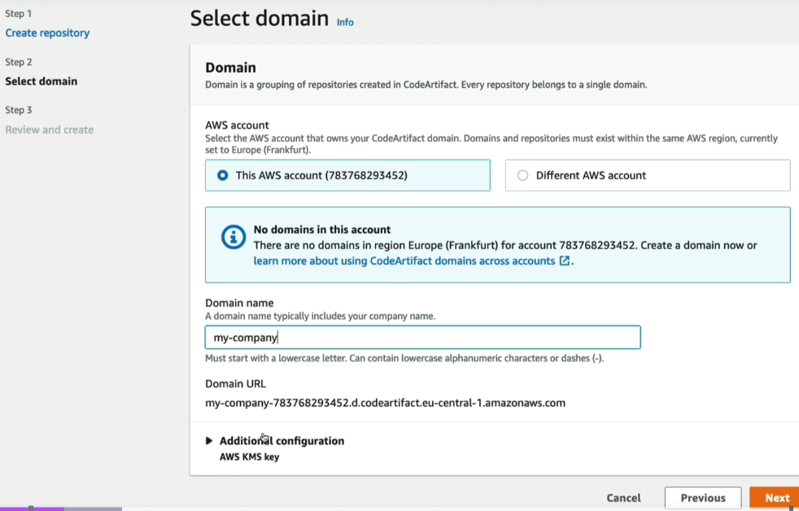  
