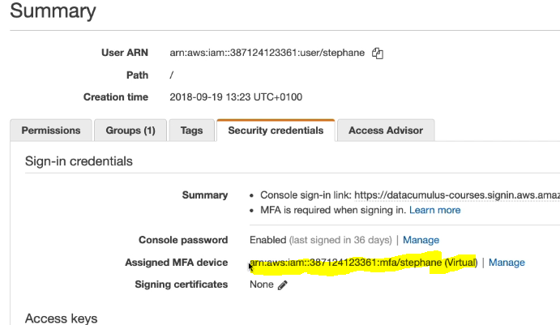

# CLI and SDK

### EC2 instance metadata
- service available **inside an EC2 instance** which provides information about the instance and temporary AWS credentials.
- Accessible only from the instance itself.
- so bascially for EC2 instance to know what is host, IP or any other details like which IAM role the instance has we use this service
- EC2 instance call this endpoint http://169.254.169.254/latest/meta-data/ and get the details
- this is how behind the scenes, EC2 is able to call s3. In the console, we just attach IAM role, but this is what happens behind the scenes
- this is just FYI for AWS users

### CLI profiles
- we login to AWS CLI by running command aws configure
- this will then ask for access id and key and then we can use this command to login and run CLI commands
- what if we have multiple AWS accounts? - use CLI profiles

Scenario 1: Personal + Company AWS Accounts

Configure profiles:

```bash
aws configure --profile personal
aws configure --profile company
```

This creates:

```text
~/.aws/credentials

[personal]
aws_access_key_id=...
aws_secret_access_key=...

[company]
aws_access_key_id=...
aws_secret_access_key=...
```

Use them:

```bash
aws s3 ls --profile personal #this will return s3 buckets from your personal AWS accounts
aws s3 ls --profile company  # from company AWS accounts
```

---

### Using CLI with MFA is 

- Scenario: Company Account Requires MFA
Without MFA:

```bash
aws s3 ls --profile company
```
❌ Fails because the IAM user requires MFA.
---
#### Step 1: Get temporary credentials using STS

```bash
aws sts get-session-token \
  --serial-number arn:aws:iam::123456789012:mfa/john \
  --token-code 123456 \
  --profile company
```
Output:
```json
{
  "Credentials": {
    "AccessKeyId": "ASIA...",
    "SecretAccessKey": "...",
    "SessionToken": "...",
    "Expiration": "2026-06-16T12:00:00Z"
  }
}
```
- the serial number in the above command comes from below
 
- for an IAM we need to enable MFA, where we configure a device for MFA

---

### Step 2: Configure a temporary profile

```bash
aws configure set aws_access_key_id ASIA... --profile company-mfa
aws configure set aws_secret_access_key ... --profile company-mfa
aws configure set aws_session_token ... --profile company-mfa
```
---

### Step 3: Use the MFA profile

```bash
aws s3 ls --profile company-mfa
```
The AWS CLI prompts for the MFA code automatically.

> When MFA is enabled, the AWS CLI typically uses STS to obtain temporary credentials after MFA verification or automatically assumes a role configured with `mfa_serial` in the profile.

