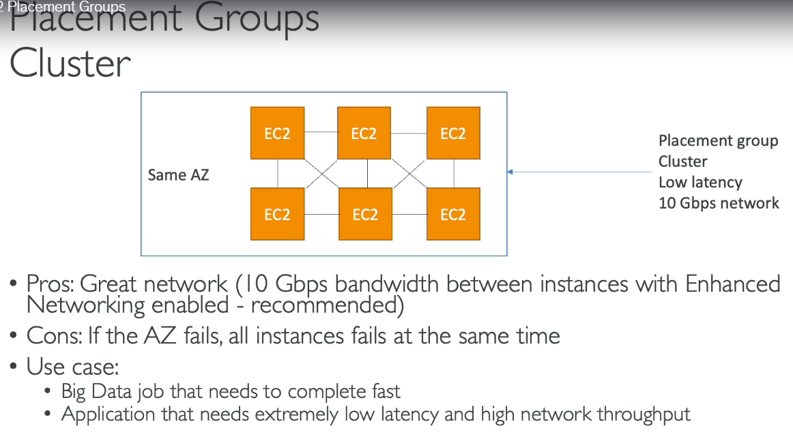
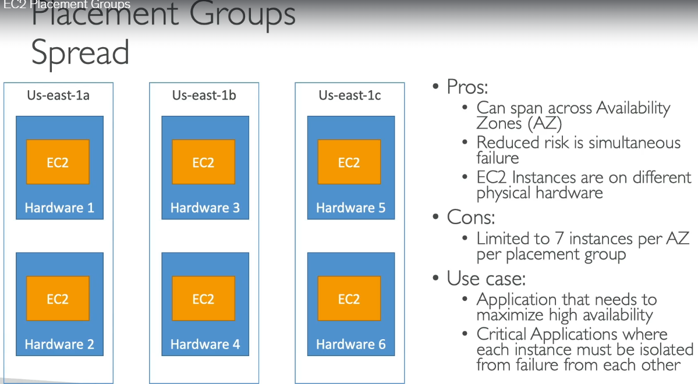
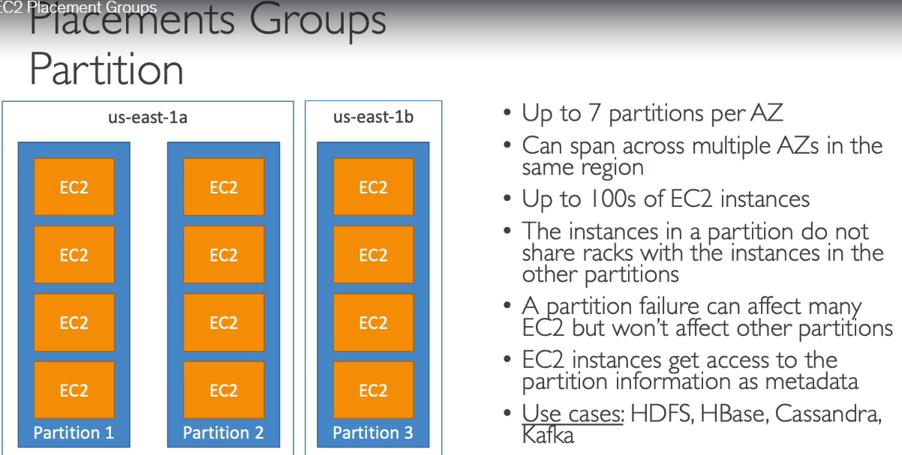
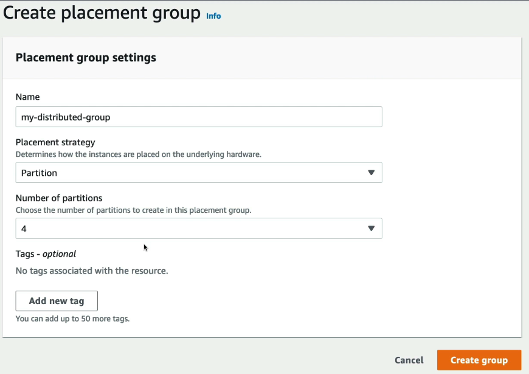
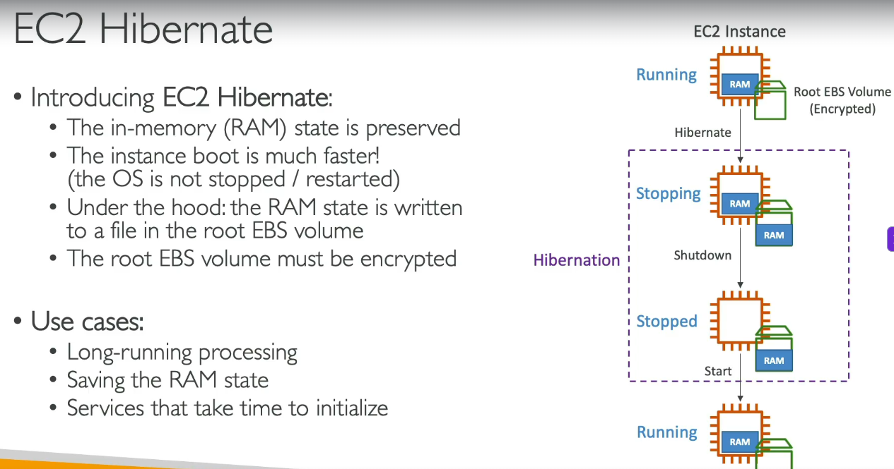
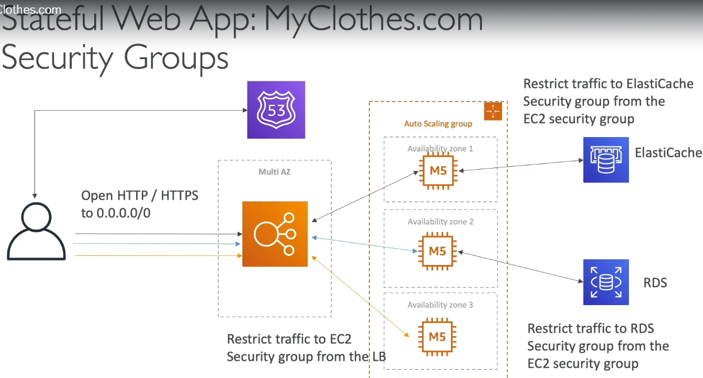

# Certified architect - Associate

## Private / Public / Elastic Ips

#### 1. Public IPs
- accessible over the internet
- must be unique across the whole works
- you can ssh into your EC2 using public IPv4 and not via private IPv4

#### 2. Private IPs
- not accessible over internet
- must be unique only within the private newtork
- need to use NAT + internet gateway (which will act as proxy) to connect to the internet

#### 3. Elastic IPs (chargeable)
- when you start / stop EC2, the next time you start, the public IP of that EC2 will be different
- use Elastic IP to get **fixed public IP** for your EC2
- you can only have 5 elastic IPs per account
- try avoid using elastic IPs, instead use public IP and register a DNS name to it or use ALB domain name
- ALB also does not have fixed IP, but ALB DNS name will be same - ```my-alb-123456.us-east-1.elb.amazonaws.com```, and in R53 point the Alias record to this DNS name

**When new EC2 is launched, it will have both public and provate IPv4**  

## Placement groups
- we define a logical grouping of EC2 instances that controls how instances are physically placed within AWS infrastructure to optimize performance, fault tolerance, or both.  

### Placement group strategies

An EC2 instance is a virtual machine (VM), not a physical machine.

A single physical server (of AWS - aka -host) can run many EC2 instances using a hypervisor

#### 1. Cluster
- all EC2 placed in same AZ
- mainly try and place in the same AWS server rack  
  

#### 2. Spread
- spread EC2 instances across multiple server racks, of even spread across multi AZ
- latency will increase so not so good for performance  

  

#### 3. Partiton
- Divides EC2 instances into **partitions**, where each partition is placed on **separate racks (physical hardware)**.
- **Instances within the same partition may share racks**, but **different partitions never share racks**.
- Provides a balance between **high performance** and **fault tolerance**.  

  
  

Once the stratgey is created, then while launching an EC2 instance, under advance settings, select the placement group name (the one we created above)

## ENI - Elastic Network Interface

> - Key point - Every EC2 instance has a **primary ENI** that contains its network configuration (private IP, public/Elastic IP association, Security Groups, MAC address, etc.).
> - AWS exposes ENI as a separate resource so the **network identity can be managed independently of the EC2 compute**, enabling failover, multiple network interfaces, and advanced networking.

- An **Elastic Network Interface (ENI)** is a **virtual network card (NIC)** that can be attached to an EC2 instance.
- It enables network connectivity and can be **detached from one EC2 instance and attached to another** within the **same Availability Zone**.
- Useful for **high availability** and **failover** because the network identity moves with the ENI, if one EC2 instance is gone, create another and attcch this ENI, so that other parts of application are not affected

#### Without ENI (Network interface is part of the EC2)

```text
EC2 Instance
├── CPU
├── Memory (RAM)
├── Storage (EBS)
├── Private IP
├── Public IP / Elastic IP
└── Security Groups
```

---

#### With ENI (Network identity is separated from the EC2)

```text
Elastic Network Interface (ENI)
┌──────────────────────────────┐
│ Private IP                   │
│ Public / Elastic IP          │
│ MAC Address                  │
│ Security Groups              │
└──────────────┬───────────────┘
               │ Attached to
               ▼
        EC2 Instance
        ├── CPU
        ├── Memory (RAM)
        └── Storage (EBS)
```

- think of it as detachable netowrk interface.
- similar to how AWS does not provide fixed storage inside EC2, AWS provides EBS (so sotrgae is decoupled with EC2), similarly we can decouple network with EC2 by creating ENIs 

> [!NOTE]
> ENI is bound to a specific AZ  
> **Most applications do not require manually managing ENIs.** AWS automatically creates and attaches a primary ENI to every EC2 instance. ENIs become useful when the **network identity** (private IPs, MAC address, Security Groups, secondary IPs, etc.) must be managed independently of the EC2 instance, such as in **advanced networking**, **multiple network interfaces**, or **specialized failover scenarios**.

> [!NOTE]
> ### We can attach multiple ENIs to a single EC2 instance, but why do we need Multiple ENIs?
> Think of it as 2 NIC cards are attched to same EC2  
> A single EC2 instance may need to communicate with **multiple networks** that require different IPs, Security Groups, or routing rules. Multiple ENIs allow each network connection to have its own independent network identity.
>
> ---
>
> #### 1. Connect to Multiple Subnets (Most Common)
>
> ```text
>                 EC2
>                  │
>      ┌───────────┴───────────┐
>      ▼                       ▼
>   ENI-1                   ENI-2
> Public Subnet          Private Subnet
> Web Traffic            Database Traffic
> ```
>
> - ENI-1 handles Internet traffic.
> - ENI-2 communicates with databases or internal services.
>
> ### Multiple ENIs Example - Separate Web & Database Traffic
>
> ```text
>                        Internet
>                            │
>                     Internet Gateway
>                            │
>                     Public Subnet
>                            │
>                         ENI-1
>                   (10.0.1.10, Public)
>                            │
>                      EC2 (Application)
>                            │
>                         ENI-2
>                  (10.0.2.10, Private)
>                            │
>                     Private Subnet
>                            │
>                           RDS
> ```
>
> 1. Client sends an HTTP request from the Internet.
> 2. The request reaches the Internet Gateway.
> 3. The Internet Gateway forwards it to **ENI-1** in the Public Subnet.
> 4. The EC2 application receives the request.
> 5. The application needs data from the database.
> 6. It sends the database query through **ENI-2** in the Private Subnet.
> 7. RDS returns the data through ENI-2.
> 8. The application prepares the response.
> 9. The response is sent back to the client through **ENI-1**.

## EC2 Hibernate
- if you start and stop EC2, it is slow  

  
- Requirements - Root EBS must be encrypted, and must have storage > your EC2 instance's RAM

### Instantiating Applications Quickly

#### EC2 Instances
- **Golden AMI** – Launch EC2 instances with the OS, application, and dependencies already installed.
- **Bootstrap (User Data)** – Run startup scripts to install or configure software when the instance launches.
- **Hybrid (Golden AMI + User Data)** – Keep common software in the AMI and use User Data only for environment-specific settings (e.g., database endpoint, API keys).

#### RDS Databases
- **Restore from Snapshot** – Creates a new database with the schema and data already available.
- **Why?** Restoring a snapshot is much faster than creating a new database and importing all the data.

#### EBS Volumes
- **Restore from Snapshot** – Creates a volume with the file system and existing data already present.
- **Why?** Restoring a snapshot is much faster than creating an empty volume and copying all the files.

---

#### Golden AMI vs Custom AMI
- **Custom AMI** – Created for a specific application or use case.
- **Golden AMI** – A standardized base Custom AMI used to consistently launch many EC2 instances across the organization.

```text
Golden AMI
├── Amazon Linux
├── Security Patches
├── CloudWatch Agent
├── SSM Agent
└── Docker

            │
     Used as the base for
            ▼

Team A Custom AMI          Team B Custom AMI
├── Java App               ├── Node.js App
└── Tomcat                 └── Nginx
```

> **Remember:** Every **Golden AMI is a Custom AMI**, but **not every Custom AMI is a Golden AMI**.

> [!NOTE]
> #### Key Architecture Points
> - Enable **Multi-AZ** for the **ALB** to provide **High Availability (HA)**, and deploy **one ALB per Region** for **Multi-Region Disaster Recovery (DR)**.
> - An **ASG can launch EC2 instances across multiple AZs**, but **cannot span multiple Regions**.
> - The **ALB is connected to the ASG through a Target Group**.
>   - Configure the **ASG** to register its EC2 instances with a **Target Group**.
>   - Configure the **ALB** to forward requests to the **same Target Group**.
> - An **ALB can route traffic to EC2 instances across multiple AZs**, but **only within the same Region**.
> - Configure **Route 53** to point your domain to the **ALBs**, routing users to the appropriate Region based on the configured routing policy.
>
> **Typical Multi-Region Web Application (Stateless i.e, without DB)**
> ```text
>             (Route 53) - Create **Alias** records pointing to each **Regional ALB** with routing algo
>       (Latency / Failover / Geolocation Routing)
>                            │
>             ┌──────────────┴──────────────┐
>             ▼                             ▼
>         Region A                     Region B
>            ALB                          ALB
>        (Multi-AZ)                  (Multi-AZ)
>             │                            │
>            ASG                          ASG
>       ┌─────┴─────┐                ┌─────┴─────┐
>       ▼           ▼                ▼           ▼
>   EC2 (AZ-A)  EC2 (AZ-B)      EC2 (AZ-A)  EC2 (AZ-B)
> ```

> - #### Comparison for diff sesssion management
> - Use ELB sticky session for simple or legacy apps
> - Better to manage sticky sessions via cookies (like shopping cart IDs)
> - Even using cookies can sometimes be risky, so best solution - Store just sessionID in cookies, and all the user session data in Elasticcache, where key = sessionId

> -   
> - Note - enable multi-AZ wherever possible (ALB, RDS, ASG and Elastic cache)

> - Instead of creating all resources manually, for typical 3-tier web app, we will use Beanstalk, and it will auto create ALB, ASG for us. Beanstlak has 2 deployment modes (Single instance for dev, High availability with ALB - for prod)
> - use CF to see what services Beanstalk is creating for us behind the scenes

> [!NOTE]
> #### Architecture Adhoc Points  
> - we can make s3 retrival faster via - 
> - 1. Multipart upload
> - 2. Use transfer acceleration (here instead of file directly sent to bucket, file is sent to AWS Edge location, and then from there over a fast private network, it is transferred to the bucket)
> - 3. Use parallel **S3 byte range fetches** (larg obj split, and we don multiple gets for part of obj, parallely, and then combine)
> - 4. S3 Express One Zone - this is another storage class, here objs are not stored in normal buckets, but are stored in directory bucket, highest performance, slightly low availability (Use case - Media processing, AI/ML apps)
> - 5. DynamoDB is very very fast, low cost, NoSQL with transaction support, and no need to patch / snapshot data since it is always available and serverless. Each table can have infinite rows