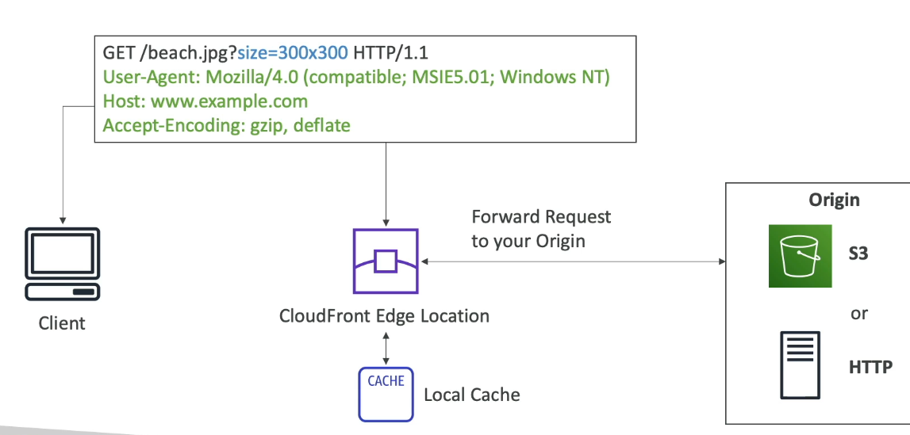

# CloudFront
- CDN
 

### CloudFront Origin Access Control (OAC)

**OAC allows CloudFront to securely access a private S3 bucket on behalf of users.**
### Scenario
You want:
- Users → Access files only through CloudFront
- Users → Cannot access S3 bucket directly
```text
User
   |
CloudFront
   |
OAC (signed request)
   |
Private S3 Bucket
```
**How it works**
User requests:
https://cdn.example.com/logo.png
CloudFront sends a signed request to S3 using OAC.
S3 bucket policy allows access only from that CloudFront distribution.
Direct access is denied:
https://my-bucket.s3.amazonaws.com/logo.png ❌ Access Denied

**Summary of OAC** - make files from s3 accessible without making them public

### Configuring cloudfront
- goto cloudfront
- click create distribution
- select on origin from (s3, ALB, API gateway)
- select s3 bucket
- behind the scenes cloudfront will update s3 bucket policy and add cloudfront's arn to the list of allowed resources which can access s3 bucket
- once distribution is created you will get distributed domain name
- then open that domain name and goto https://domain-name/coffee.jpg
- so even if the bucket was private, all the objects can be accessed via the distributed domain name