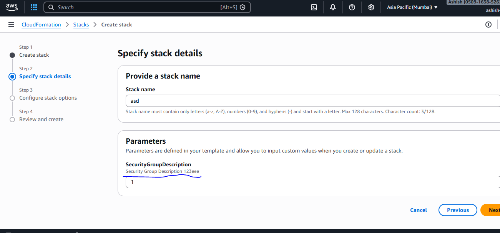
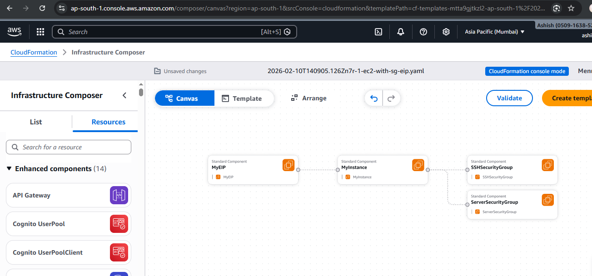

# Cloudformation (IaaS)
- 

```yml
Parameters: # this will show a custom input field on AWS while uploading this template
  SecurityGroupDescription: # whateer we enter in the input field will be the name of security group desc
    Description: Security Group Description 123eee
    Type: String

Resources: # creating EC2 intance
  MyInstance:
    Type: AWS::EC2::Instance 
    Properties:
      AvailabilityZone: us-east-1a
      ImageId: ami-0453ec754f44f9a4a # Amazon machine instance id
      InstanceType: t3.micro # instance type
      SecurityGroups:
        - !Ref SSHSecurityGroup # this is referneced here, defined below
        - !Ref ServerSecurityGroup # referenced here, defined below

  # an elastic IP for our instance
  MyEIP:
    Type: AWS::EC2::EIP
    Properties:
      InstanceId: !Ref MyInstance # attach this IP to MyInstance

  # our EC2 security group
  SSHSecurityGroup:
    Type: AWS::EC2::SecurityGroup
    Properties:
      GroupDescription: Enable SSH access via port 22
      SecurityGroupIngress:
        - CidrIp: 0.0.0.0/0
          FromPort: 22
          IpProtocol: tcp
          ToPort: 22

  # our second EC2 security group
  ServerSecurityGroup:
    Type: AWS::EC2::SecurityGroup
    Properties:
      GroupDescription: !Ref SecurityGroupDescription # value that we entered in custom input field
      SecurityGroupIngress:
        - IpProtocol: tcp
          FromPort: 80
          ToPort: 80
          CidrIp: 0.0.0.0/0
        - IpProtocol: tcp
          FromPort: 22
          ToPort: 22
          CidrIp: 192.168.1.1/32

Outputs:t a
  ElasticIP:
    Description: Elastic IP Value
    Value: !Ref MyEIP

```
**the parameter we created above is now available in below cloud formation**
 

**We can view the template visually** 
- while creating CF stack, once we upload CF file, we see option to visualize the architecture
- once the clouf formation is created under template section

 