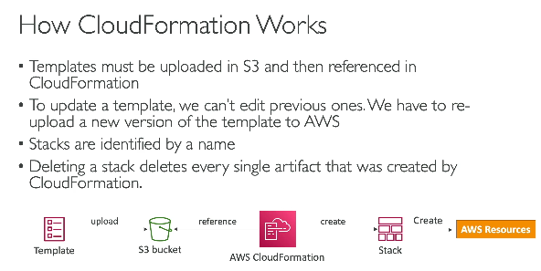

# Cloudformation (IaaS)
- build infra on AWS via code
-   
- In CI/CD, install aws cli, and deploy your template from build pipeline
- AWS composer allows us to view all the component stack created by cloud formation (it creates architectural diagram)
- Cloud formation templates, once created can't be edited, they can only be replaces
- deleting CF template will delete all the resources created by that template

**Reading YML**  
```yml
# Multiline (indicated by | symbol) string
description: |
  Line 1
  Line 2
  Line 3
# Object
address:
  city: Pune
  country: India
# Array (array is indicated with - symbol) of objects
users:
  - name: Alice
    age: 25
  - name: Bob
    age: 30
# Below is a function in YAML, defined elsewhere in the file, but used below
ID: !Ref MyRef
```

```yml
Parameters: # this will show a custom input field on AWS while uploading this template
  SecurityGroupDescription: # whateer we enter in the input field will be the name of security group desc
    Description: Security Group Description 123eee
    Type: String # can be Number, Commadelimited list, List<Numbers>, AWS-Sepecifc param
    # other propetries for paramters include - Min/Max Value, Defaul, AllowedValues, AllowedRegex, NoEcho
    # E.g.
    # NoEcho: true - e.g. DB password is a param, so this param will not be logged anywhere
    # AllowedValues - t2.micro, t2.small, t2.medium, Defaul-t2.small - allowing us to add constraints
    # there are some pseudo-params AWS provides by defaul, which can be used in CF
    # AWS::AccountId - will give our accountId, AWS::Region - us-east-1, AWS::NotificationARN - arn of the resource

Resources: # creating EC2 intance
  MyInstance: # this is the name of the instance which will be created
    Type: AWS::EC2::Instance # syntax - serviceProvider::serviceName::data-type-name
    Properties:
      AvailabilityZone: us-east-1a
      ImageId: ami-0453ec754f44f9a4a # Amazon machine instance id, this is different for different region, and is available on internet
      InstanceType: t3.micro # instance type
      SecurityGroups:
        - !Ref SSHSecurityGroup # this is referneced here, defined below
        - !Ref ServerSecurityGroup # referenced here, defined below

  # an elastic IP for our instance
  MyEIP:
    Type: AWS::EC2::EIP
    Properties:
      InstanceId: !Ref MyInstance # attach this IP to MyInstance

  # our EC2 security group
  SSHSecurityGroup:
    Type: AWS::EC2::SecurityGroup
    Properties:
      GroupDescription: Enable SSH access via port 22
      SecurityGroupIngress:
        - CidrIp: 0.0.0.0/0
          FromPort: 22
          IpProtocol: tcp
          ToPort: 22

  # our second EC2 security group
  ServerSecurityGroup:
    Type: AWS::EC2::SecurityGroup
    Properties:
      GroupDescription: !Ref SecurityGroupDescription # value that we entered in custom input field
      SecurityGroupIngress:
        - IpProtocol: tcp
          FromPort: 80
          ToPort: 80
          CidrIp: 0.0.0.0/0
        - IpProtocol: tcp
          FromPort: 22
          ToPort: 22
          CidrIp: 192.168.1.1/32

# Mappings are used when:
# - A value depends on Region
# - A value depends on Environment (dev/prod)
# - You want a fixed lookup table inside the template

Mappings:
  RegionMap:                       # Mapping name
    us-east-1:                     # First-level key (Region)
      AMI: ami-12345678            # Second-level key -> value
    ap-south-1:
      AMI: ami-87654321

Resources:
  MyEC2:
    Type: AWS::EC2::Instance
    Properties:
      ImageId: !FindInMap # Look up RegionMap[current region][AMI]
        - RegionMap
        - !Ref AWS::Region # default AWS pseud parameter
        - AMI

# If stack is created in:
# - us-east-1  -> ImageId = ami-12345678
# - ap-south-1 -> ImageId = ami-87654321

# Outputs - lets you create a shared infrastructure stack (networking) and multiple application stacks that reuse it without hardcoding IDs.

# stack-network.yml (1 YAML exporting Shared-VPC-Id -> vpc-0abc123xyz to be imported by other stacks)
# Creates a VPC and EXPORTS its ID so other stacks can use it.
Resources:
  MyVPC:
    Type: AWS::EC2::VPC
    Properties:
      CidrBlock: 10.0.0.0/16
Outputs:
  VPCId:                              # Output name inside this stack
    Description: VPC ID created by this stack
    Value: !Ref MyVPC                 # Actual value to output
    Export:
      Name: Shared-VPC-Id             # Global export name
# Result:
# This stack exports:
#   Shared-VPC-Id -> vpc-0abc123xyz
# Other stacks can now import it.

# stack-app.yml (another YAML importing the values)
# Uses the VPC created by stack-network.yml
Resources:
  MySecurityGroup:
    Type: AWS::EC2::SecurityGroup
    Properties:
      GroupDescription: App SG
      # Import the exported VPC ID
      VpcId: !ImportValue Shared-VPC-Id
# CloudFormation resolves:
# !ImportValue Shared-VPC-Id
# ↓
# vpc-0abc123xyz
```
**the parameter we created above is now available in below cloud formation**
 

**We can view the template visually** 
- while creating CF stack, once we upload CF file, we see option to visualize the architecture
- once the clouf formation is created under template section

 

**Instead of creating yml file by hand, we can use CDK (Cloud development kit)**  
- Using CDK we can write cloudformation template in JS/TS/Python, and using CDK, we can complie our ts file to cloudformation.yml file

e.g. CDK for Typescript for creating lambda function

```typescript
const { Stack } = require('aws-cdk-lib');
const lambda = require('aws-cdk-lib/aws-lambda');
const apigw = require('aws-cdk-lib/aws-apigateway');
class HelloLambdaStack extends Stack {
  /**
   *
   * @param {Construct} scope
   * @param {string} id
   * @param {StackProps=} props
   */
  constructor(scope, id, props) {
    super(scope, id, props);
    const fn = new lambda.Function(this, 'MyFunction', {
      code: lambda.Code.fromAsset('lib/lambda-handler'), // relative path to your lambda function
      runtime: lambda.Runtime.NODEJS_LATEST,
      handler: 'index.handler'
    });

    const endpoint = new apigw.LambdaRestApi(this, 'MyEndpoint', {
      handler: fn,
      restApiName: "HelloApi"
    });

  }
}
module.exports = { HelloLambdaStack }
```

**then run cdk synth** - this will synthesize AWS Cloudformation file for us