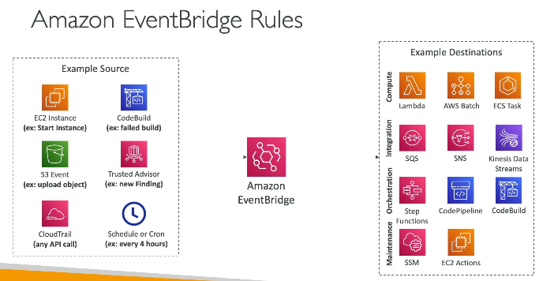

# Cloudwatch
- 2 things - metrics and logs
## 1. Metrics
- CPU, memory utilization, billing usage
- we can create alarm, when values goes above / below threshold
- in alarm, we need to configure action when alarm triggers
- options for action are 1. SNS - send email, 2. EC2 action - need to check
- billing alarm is only available in region - us-east-1

## 2. Cloudwatch logs
- to send logs from EC2 to cloud watch, Cloudwatch agaent needs to be installed onto EC2 instance

## 3. Eventbridge
- when some action happens trigger action
- example and EC2 instance starts, trigger lambda  

 

## 4. CloudTrail
- it logs every action of every user, and sends those logs to cloudwatch / s3
- inside AWS root account, there can be 100 IAM users, and they can login via various ways, console, CLI, SDK, so every action done by any user, vai any login method will get logged
- e.g. a user deleted something, so if we ant to know who deleted, what deleted and when deleted, cloudtrail will tell
- it is enabled by default

You may see use-cases asking you to select one of CloudWatch vs CloudTrail vs Config. Just remember this thumb rule -

Think resource performance monitoring, events, and alerts; think CloudWatch.

Think account-specific activity and audit; think CloudTrail.

Think resource-specific change history, audit, and compliance; think Config.

## 5. AWS X-Ray
- you can do visual analysis of your app
- kind of dashboard of cloudwatch

## 6. Codeguru - decommissioned
- does automated PR review

## 7. AWS health dashboard
1. Service health dashboard 
  - Shows global/public health status of AWS services
  - Example: “EC2 issue in ap-south-1”
2. AWS health dashboard 
  - show health of services that you are using in your account
