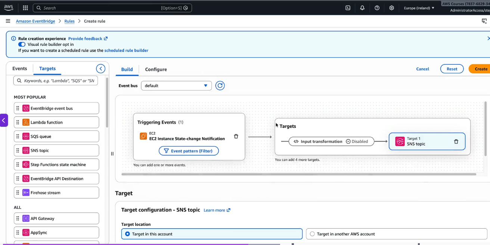
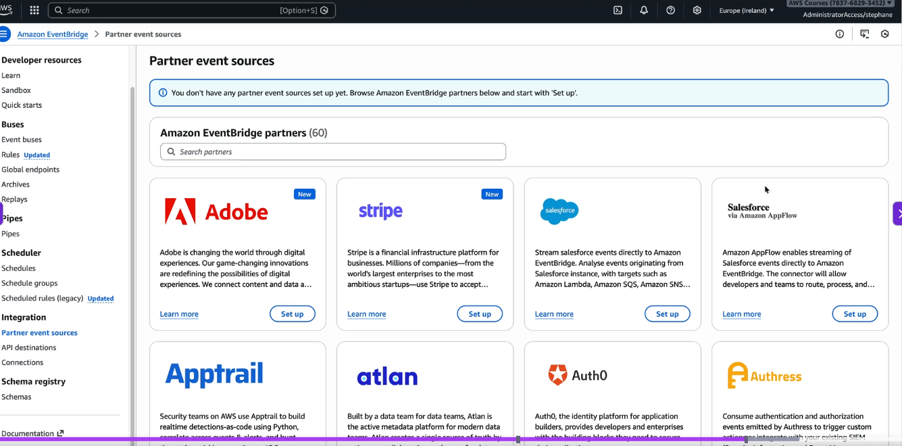
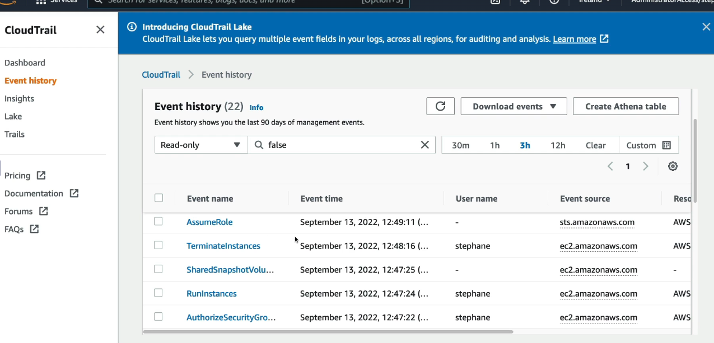
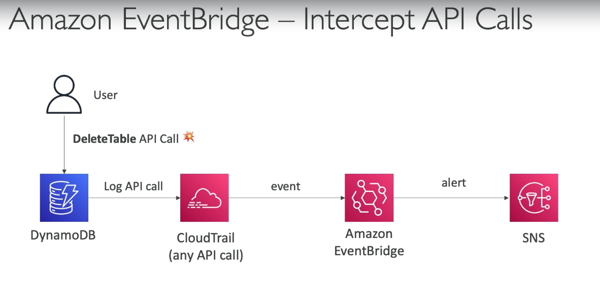
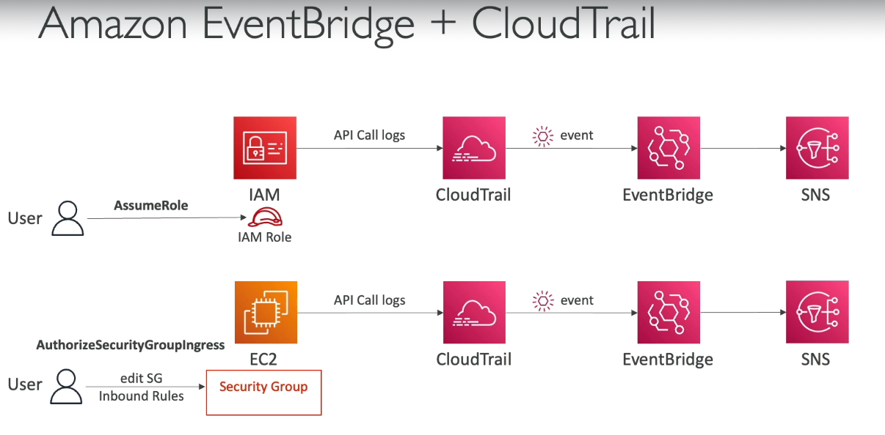
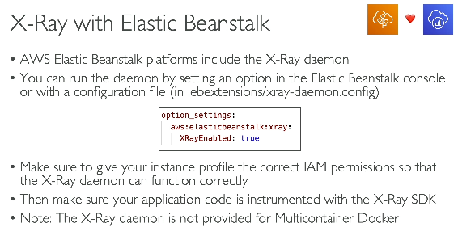
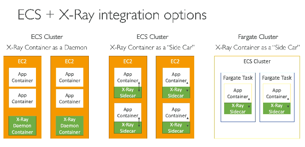

# Cloudwatch
- 4 things (Metrics, logs, Alarms and Events via Eventbridge)
## 1. Metrics
- CPU, memory utilization, billing usage
- we can create alarm, when values goes above / below threshold

#### CloudWatch Metrics - Important Attributes
| Attribute | Meaning | Example |
|---|---|---|
| **Namespace** | Container/category for metrics | `AWS/EC2`, `AWS/Lambda`, `MyApp` |
| **Metric Name** | Name of the metric being measured | `CPUUtilization`, `Invocations`, `RequestCount` |
| **Dimensions** | Key-value pairs that uniquely identify the metric source | `InstanceId=i-123`, `FunctionName=my-fn` |
| **Timestamp** | Time when the metric data point was recorded | `2026-06-23T11:00:00Z` |
| **Value** | Actual measured value | `72.5` (CPU %) |
| **Unit** | Unit of measurement | `Percent`, `Count`, `Bytes`, `Milliseconds` |
| **Period** | Time interval over which data points are aggregated | `1 min`, `5 min` |
| **Statistic** | Aggregation method applied to data points | `Average`, `Sum`, `Min`, `Max`, `SampleCount`, `p95` |

**(we can have upto 30 dimenstions / metric)**

### Example
Metric:
```text
Namespace   : AWS/EC2
Metric Name : CPUUtilization
Dimensions  : InstanceId=i-123456789
Timestamp   : 2026-06-23 11:00:00 UTC
Value       : 72.5
Unit        : Percent
Period      : 5 minutes
Statistic   : Average
```
This means:

> **Average CPU utilization of EC2 instance `i-123456789` was 72.5% during the 5-minute period ending at 11:00 UTC.**

#### Dimensions are especially important
Without dimensions:
```text
AWS/EC2 : CPUUtilization
```
You don't know **which EC2 instance**.

A metric is uniquely identified by:
```text
(Namespace, MetricName, Dimensions)
```

### Custom Metrics 

**Custom metrics** are metrics that **you publish yourself** to CloudWatch for monitoring application-specific or business-specific data that AWS does not collect automatically.
- Note that metrics are different from logs, metric is total / avg some number that is displayed in cloudwacth metrics dashboard, there are not logs

#### Examples

| Use case | Metric Name | Value |
|---|---|---|
| Active users | `ActiveUsers` | `1250` |
| Orders placed | `OrdersCreated` | `350` |
| Queue size in app | `PendingJobs` | `87` |
| Memory usage on-prem server | `MemoryUsage` | `78%` |

#### Metric Example
```text
Namespace   : MyECommerce
Metric Name : OrdersCreated
Dimensions  : Environment=Prod
Value       : 350
Unit        : Count
Timestamp   : 2026-06-23T11:00:00Z
```
#### How to publish
Your application or script calls the CloudWatch API:
```text
PutMetricData(
  Namespace = "MyApp",
  MetricName = "OrdersCreated",
  Value = 350,
  Unit = Count
)
```
#### Minimal Node.js Example (AWS SDK v3)
```javascript
import {
  CloudWatchClient,
  PutMetricDataCommand,
} from "@aws-sdk/client-cloudwatch";

const client = new CloudWatchClient({ region: "ap-south-1" });
await client.send(
  new PutMetricDataCommand({
    Namespace: "MyApp",
    MetricData: [
      {
        MetricName: "OrdersCreated",
        Value: 350,
        Unit: "Count",
        Dimensions: [
          {
            Name: "Environment",
            Value: "Prod",
          },
        ],
      },
    ],
  })
);
console.log("Custom metric published");
```
### Common ways to send custom metrics
1. **AWS SDK** → Call `PutMetricData`
2. **AWS CLI**
   ```bash
   aws cloudwatch put-metric-data \
     --namespace MyApp \
     --metric-name OrdersCreated \
     --value 350
   ```
3. **CloudWatch Agent** → Collect OS/application metrics from EC2 or on-prem servers.
4. **Embedded Metric Format (EMF)** → Write structured logs, and CloudWatch automatically extracts metrics from them.

- In production app, custom metrics are created from Cloudwatch logs, you goto cloudwatch logs, create metric, give regex, and generate a metric (nore on this in the cloudwatch logs section)

## 2. Cloudwatch logs
**CloudWatch Logs** is a service for **collecting, storing, searching, and analyzing logs** from AWS services, applications, and servers.
### Examples
| Source | Who writes the logs? | Example Log |
|---|---|---|
| Lambda | Your code (`console.log`) | Function execution logs |
| EC2 | Your app / OS | Application logs, Nginx logs |
| ECS | Container/app | stdout/stderr |
| API Gateway | AWS | Access logs |
| VPC | AWS | Flow logs |
| Custom App | Your code | User login, order processing logs |

### Log Hierarchy
```text
Log Group
    └── Log Stream
            └── Log Events
```
Example:
```text
Log Group   : /aws/lambda/process-order
Log Stream  : 2026/06/23/[$LATEST]abc123
Log Event   : "Order 123 created successfully"
```
### Important Concepts

| Term | Meaning |
|---|---|
| **Log Group** | Collection of log streams for an application or service |
| **Log Stream** | Sequence of log events from a specific source (e.g., Lambda instance, ECS task) |
| **Log Event** | Individual log entry containing message + timestamp |
| **Retention Period** | How long logs are kept before deletion |
| **Subscription Filter** | Continuously forwards logs to Lambda, Kinesis, Firehose, etc. |
| **Insights** | SQL-like querying capability for analyzing logs |

### Typical Logging Flow

#### Lambda
```javascript
exports.handler = async () => {
  console.log("User login successful");
  console.error("Payment failed");
};
```
Lambda automatically sends these logs to CloudWatch Logs.
#### EC2
#### 1. Install CloudWatch Agent on EC2

```bash
sudo apt install amazon-cloudwatch-agent
```
**Note - these cloudwatch agents can be added on onprem servers as well, so onprem logs can also be available on Cloudwatch**  
**Note - all the cloudwatch logs are encrypted by default**

#### 2. Configure Agent
```json
// /opt/aws/amazon-cloudwatch-agent/etc/config.json
{
  "logs": {
    "logs_collected": {
      "files": {
        "collect_list": [
          {
            "file_path": "/var/log/myapp.log",
            "log_group_name": "MyApp",
            "log_stream_name": "{instance_id}"
          }
        ]
      }
    }
  }
}
```
---
#### 3. Start Agent
```bash
sudo amazon-cloudwatch-agent-ctl \
  -a fetch-config \
  -m ec2 \
  -c file:/opt/aws/amazon-cloudwatch-agent/etc/config.json \
  -s
```

---
```text
Node.js app
    ↓
/var/log/myapp.log --> use winston to add logs to myapp.log file
    ↓
CloudWatch Agent
    ↓
CloudWatch Logs
        └── Log Group: MyApp
              └── Log Stream: i-1234567890

```
**whenever new entries are logged to the log file, cloudwatch will detect it and push to cloudwatch**

Once the logs are created, we can create metrcis for those logs, see metrics section below - 
  
- these metrics once set, then we can set alarms on these metrics, such as count of error logs > 10 inside 1 hr
  
- this will now be added as a metric in Cloudwatch's metric section, and then we can create alarm on those metrics
- once the metric is created, click on create alarm
  
- then define condition of when the alarm should be trigerred
  
- select action on what should be notified when alarm is trigerred (push mssg to SNS), and add email as SNS's subscriber, so we get email
  

### Cloudwatch subscriptions
   

### Querying Logs with CloudWatch Logs Insights
```sql
fields @timestamp, @message
| filter @message like /ERROR/
| sort @timestamp desc
| limit 20
```
This returns the latest 20 log entries containing `"ERROR"`.  

 

> **CloudWatch Logs is a centralized log management service that collects, stores, searches, and analyzes logs from AWS services, applications, and servers.**

## 3. Alarms
- Automatically monitors metrics/logs and triggers notifications or actions when thresholds are breached.
- cloudwatch alarms can trigger 2 things (EC2 stop / terminate/ reboot, EC2 autoscale, SNS)
 

### Creating an alarm on top of a metric
E.g. - create alarm on CPU utilization  
- click on create alarm
- select metric on which you want to create alarm
- configure alarm
  
- configure action
  
- for this demo we have choosen EC2 action
  

## 4. Events via Eventbridge
- when some action happens trigger action
- EventBridge is a serverless event bus that routes events from AWS services, SaaS applications, and custom applications to targets based on configurable rules.
 

| Aspect | CloudWatch Alarm | EventBridge |
|---|---|---|
| Purpose | Monitor metrics/logs and act when thresholds are crossed | Route events between services and applications |
| Triggered by | Metric or log condition (e.g., CPU > 80%) | Events (e.g., S3 object uploaded, EC2 launched) |
| Nature | Threshold-based monitoring | Event-driven architecture |
| Input | CloudWatch Metrics, Logs | AWS service events, custom events, SaaS events |

#### SNS vs Event bridge
EventBridge can receive events directly from AWS services and route them based on event content, whereas SNS cannot.

Example:
```text
EC2 instance terminated
        ↓
EventBridge receives event automatically
        ↓
Rule: if instanceType == "m5.large"
        ↓
Trigger Lambda

With SNS:
EC2 instance terminated
        ↓
❌ EC2 cannot publish directly to SNS automatically
You would need:
EC2 event
    ↓
EventBridge
    ↓
SNS
    ↓
Subscribers
```

#### Schema registry
> **Schema Registry automatically captures event structures (schemas) and enables producers and consumers to share a typed contract for events.**
Suppose your Order service publishes:

```json
{
  "source": "myapp.orders",
  "detail-type": "OrderCreated",
  "detail": {
    "orderId": 123,
    "amount": 1000
  }
}
```

EventBridge **Schema Registry** automatically discovers and stores:

```text
OrderCreated
├── orderId : integer
└── amount  : integer
```
Your consumer can then generate typed code:
```typescript
event.detail.orderId; // number
event.detail.amount;  // number
```
instead of:
```typescript
event.detail["orderId"]; // hope it exists!
```

### Event bridge configuration
1. select trigerring and target event
 
2. Below are a few 3rd party partner event sources, which can insert data to event bridge
  
3. targets can be custom HTTP events is will to invoke our custom API when event is trigerred

#### CloudWatch Synthetics

**CloudWatch Synthetics** lets you create **canaries** that periodically run scripts to monitor the availability and performance of websites, APIs, and user workflows.

| Use case | What the canary does |
|---|---|
| Website uptime | Opens homepage and verifies HTTP 200 |
| API monitoring | Calls `/orders` API and checks response |
| Login flow | Enters username/password and verifies login success |
| Checkout flow | Adds item to cart and places order |
| Broken links | Navigates pages and validates links |

## CloudTrail
- it logs every action (API call) of every user, and sends those logs to cloudwatch / s3
- inside AWS root account, there can be 100 IAM users, and they can login via various ways, console, CLI, SDK, so every action done by any user, vai any login method will get logged
- e.g. a user deleted something, so if we ant to know who deleted, what deleted and when deleted, cloudtrail will tell
- it is enabled by default

 
 
 


| Event Type | What it captures | Example |
|---|---|---|
| **Management Events** | AWS account and resource configuration/API activities | `CreateUser`, `RunInstances`, `CreateBucket` |
| **Data Events** | Resource-level operations on data within resources | `S3 GetObject`, `S3 PutObject`, `Lambda Invoke` |
| **Insights Events** | Unusual API activity detected by CloudTrail | Sudden spike in `DeleteBucket` or `RunInstances` calls |
| **Network Activity Events** | Network-related API activity for supported services | Access to services through VPC endpoints |

## 5. AWS X-Ray
- you can do visual analysis of your app
## X-Ray
- similar to open telemetry, but opentelemetry is opensource, XRay is AWS proprietery
**AWS X-Ray** is a distributed tracing service that helps you **trace requests across applications and AWS services**, making it easier to identify latency bottlenecks and errors.

Suppose a request goes through:
```text
Client
  ↓
API Gateway
  ↓
EC2 (Node.js)
  ↓
Lambda
  ↓
DynamoDB
```
X-Ray shows:
- Total request latency
- Time spent in each service
- Errors and exceptions
- Service dependency graph
---

#### How it works

```text
Incoming request
        ↓
X-Ray SDK creates a Trace
        ↓
Each service creates Segments/Subsegments
        ↓
X-Ray Daemon / Agent
        ↓
AWS X-Ray service
        ↓
Trace visualization in console
```
Example trace:
```text
Trace abc123
├── API Gateway (20 ms)
├── EC2 Node.js (50 ms)
│     └── Call DynamoDB (30 ms)
└── Lambda (80 ms)
```
You can immediately see where the time was spent.
---

#### Install SDK

```bash
npm install aws-xray-sdk
```
#### Express app

```javascript
const express = require("express");
const AWSXRay = require("aws-xray-sdk");

const app = express();

// Automatically create segments for incoming requests
app.use(AWSXRay.express.openSegment("MyApp"));

app.get("/", (req, res) => {
  res.send("Hello");
});

app.use(AWSXRay.express.closeSegment());

app.listen(3000);
```

#### Run X-Ray daemon on EC2

```bash
sudo yum install -y xray
sudo service xray start
```
The flow becomes:
```text
Client
    ↓
Node.js app (X-Ray SDK)
    ↓
X-Ray Daemon on EC2
    ↓
AWS X-Ray
    ↓
Trace visible in console
```

#### Example: Tracing a business error with X-Ray

A user tries to place an order.

```text
Trace ID: 1-abc123

Client
  │
  │ POST /orders
  ▼
API Gateway ─────────────────────── ✓
  │
  ▼
EC2 Node.js Order Service ───────── ✓
  │
  │ PutItem
  ▼
DynamoDB ────────────────────────── ✓
  │
  │ Charge Credit Card
  ▼
Payment Service (Lambda) ────────── ✗ ERROR
       ErrorType    : ValidationException
       ErrorMessage : Card expired

──────────────────────────────────────────
Request Status : FAILED (400)
Error Source   : Payment Service
Reason         : Customer's card has expired
Trace ID       : 1-abc123
──────────────────────────────────────────
```

#### Without X-Ray

You would:

1. Check API Gateway logs
2. Check EC2 logs
3. Check DynamoDB logs
4. Check Lambda logs
5. Correlate timestamps manually

#### With X-Ray
Open trace `1-abc123` and immediately see:
```text
Error occurred in:
Payment Service (Lambda)
Error:
ValidationException: Card expired
Request path:
Client
 → API Gateway
 → EC2 Order Service
 → DynamoDB
 → Payment Service ✗
```
#### Key point
X-Ray is **not just for latency**.
It helps answer:
- **Which request failed?**
- **Where exactly did it fail?**
- **What exception/error was thrown?**
- **What was the path taken by that request across services?**

| Concept | What it is | Example |
|---|---|---|
| **Trace** | Complete journey of a single request across all services | `Client → API Gateway → EC2 → Lambda → DynamoDB` |
| **Trace ID** | Unique identifier for a trace | `1-68590f8a-5d94b4d9a7c6f1c2e3d4e5f6` |
| **Segment** | Work done by a service as part of a trace | EC2 handling `/orders` request |
| **Subsegment** | Smaller operation within a segment | EC2 calling DynamoDB |
| **Annotation** | Indexed key-value metadata used for filtering/searching traces | `customerId=123`, `environment=prod` |
| **Metadata** | Additional non-indexed information attached to traces | Full request body, SQL query |
| **Sampling** | Controls what percentage of requests are traced | Trace 1 out of every 100 requests (mainly to save cost) |
| **Daemon / Agent** | Local process that collects trace data and sends it to X-Ray | X-Ray daemon running on EC2 |
| **Service Map** | Visual graph showing services and their dependencies | `API Gateway → EC2 → Lambda → DynamoDB` |

**Sampling** - 
Tracing every request is expensive, so X-Ray uses **sampling** to trace only a subset of requests.
Sampling has **2 parameters**:

| Parameter | Meaning | Example |
|---|---|---|
| **Reservoir** | Minimum number of requests to trace per second | `1` → Trace at least 1 request/sec |
| **Rate** | Percentage of additional requests to trace after reservoir is exhausted | `5%` → Trace 5 out of every 100 remaining requests |

### Hierarchy

```text
Trace
├── Segment (API Gateway)
├── Segment (EC2)
│      ├── Subsegment (DynamoDB call)
│      └── Subsegment (Lambda call)
└── Segment (Lambda)
```

  
  

## 6. Codeguru - decommissioned
- does automated PR review

## 7. AWS health dashboard
1. Service health dashboard 
  - Shows global/public health status of AWS services
  - Example: “EC2 issue in ap-south-1”
2. AWS health dashboard 
  - show health of services that you are using in your account
