# Cognito
- AWS managed authentication and user management service that helps you sign up, sign in, and control access for web and mobile applications.
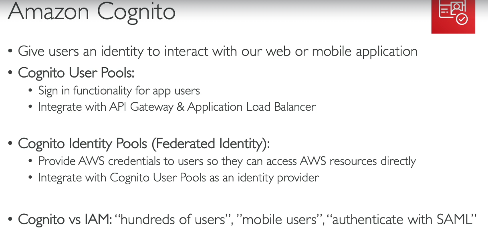 
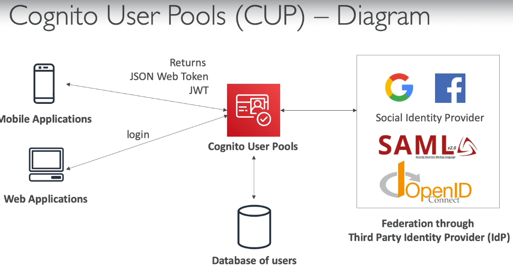  
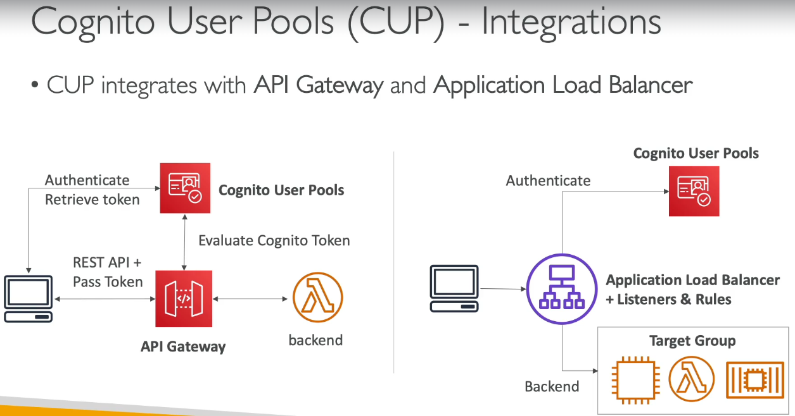 

## Cognito User Pools (CUP)
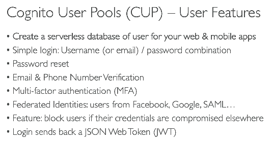  
- **Creating cognito user pool- hands on**
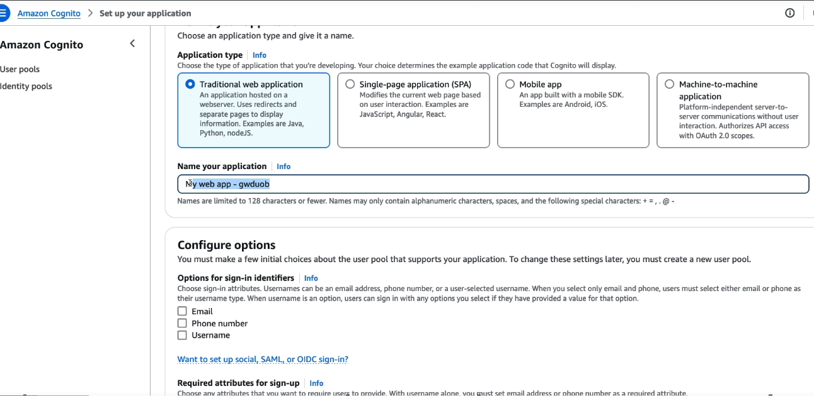  
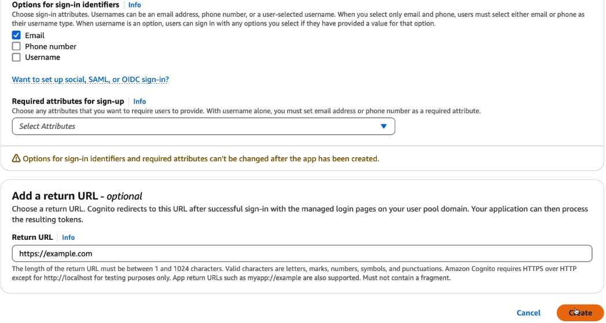  
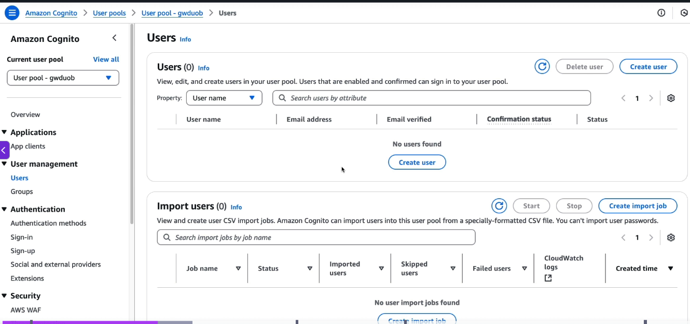  
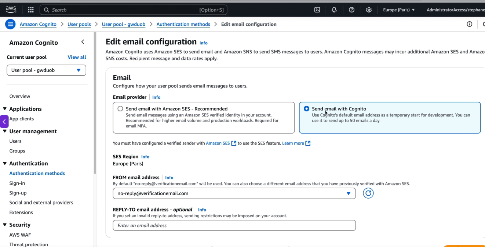  
- create custom login UI
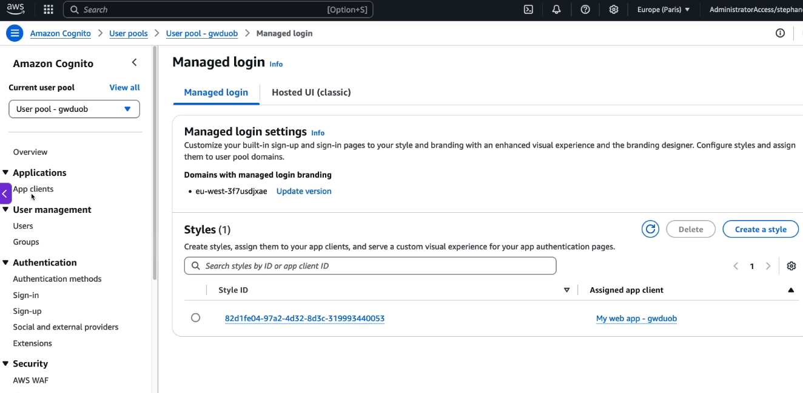  
- add your own mesaage templates
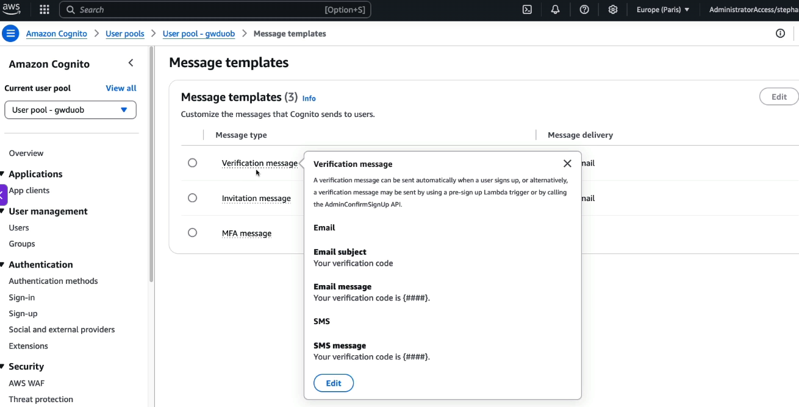  
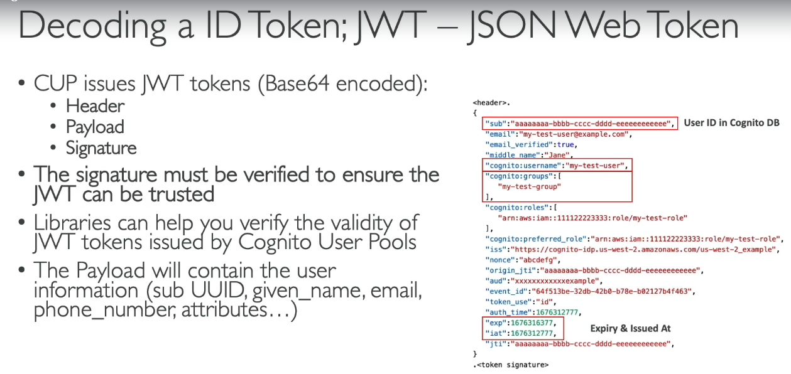  

**CUP can trigger lambdas on user login/signup**

### AWS Cognito Integration (Frontend + Backend)

### 1. Create Cognito Resources

- Create a **User Pool**
- Create an **App Client** (without client secret for SPA)
- Configure:
  - Callback URL: `http://localhost:3000/callback`
  - Sign-out URL: `http://localhost:3000`
- Enable **Authorization Code Grant**
- Note:
  - Region
  - User Pool ID
  - App Client ID
  - Cognito Domain

---

### 2. Configure Cognito SDK (Frontend)

```javascript
import {
  CognitoUserPool,
  CognitoUser,
  AuthenticationDetails
} from "amazon-cognito-identity-js";

const userPool = new CognitoUserPool({
  UserPoolId: "ap-south-1_xxxxx",
  ClientId: "xxxxxxxxxxxxxxxx"
});
```

---

### 3. Sign Up (Optional)

```javascript
userPool.signUp(
  "john@example.com",
  "Password@123",
  [],
  null,
  (err, result) => {
    console.log(result.user.getUsername());
  }
);
```

---

### 4. Confirm User (OTP) (optional)

```javascript
const user = new CognitoUser({
  Username: "john@example.com",
  Pool: userPool
});

user.confirmRegistration(
  otp,
  true,
  console.log
);
```

---

### 5. Login Using SDK

```javascript
const user = new CognitoUser({
  Username: "john@example.com",
  Pool: userPool
});

const auth = new AuthenticationDetails({
  Username: "john@example.com",
  Password: "Password@123"
});

user.authenticateUser(auth, {
  onSuccess(session) {

    const accessToken =
      session.getAccessToken().getJwtToken();

    const idToken =
      session.getIdToken().getJwtToken();

    const refreshToken =
      session.getRefreshToken().getToken();
  }
});
```

> **If you use the Cognito SDK like above, you do not need the Hosted UI or Callback URL.** The SDK talks directly to Cognito.

---

### 6. Backend JWT Validation

```javascript
const jwt = require("jsonwebtoken");
const jwksClient = require("jwks-rsa");

const client = jwksClient({
  jwksUri:
    "https://cognito-idp.ap-south-1.amazonaws.com/<USER_POOL_ID>/.well-known/jwks.json"
});

function authenticateJWT(req, res, next) {

  const token =
    req.headers.authorization?.split(" ")[1];

  jwt.verify(
    token,
    (header, cb) => {
      client.getSigningKey(header.kid, (err, key) => {
        cb(null, key.getPublicKey());
      });
    },
    {
      issuer:
        "https://cognito-idp.ap-south-1.amazonaws.com/<USER_POOL_ID>"
    },
    (err, decoded) => {

      if (err)
        return res.sendStatus(401);

      req.user = decoded;
      next();
    }
  );
}
```

Use it:

```javascript
app.get("/users", authenticateJWT, (req, res) => {
  res.json(req.user);
});
```

---

#### Complete Flow (SDK Login)

```text
Frontend
    │
    ▼
Cognito SDK
    │
    ▼
authenticateUser()
    │
    ▼
Cognito
    │
    ▼
JWT Tokens
    │
    ▼
Authorization: Bearer <Access Token>
    │
    ▼
Backend validates JWT
    │
    ▼
Protected API
```

---

### Complete Flow (Hosted UI)

```text
Frontend
    │
    ▼
Redirect to Cognito Hosted UI
    │
    ▼
User Login
    │
    ▼
Callback URL
    │
    ▼
Authorization Code
    │
    ▼
Exchange Code → JWT Tokens
    │
    ▼
Authorization: Bearer <Access Token>
    │
    ▼
Backend validates JWT
    │
    ▼
Protected API
```

