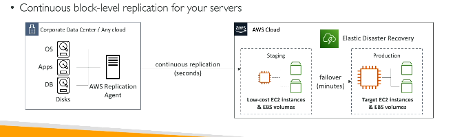

# Disaster Recovery

## RPO and RTO

> [!NOTE]
> ## RPO (Recovery Point Objective)
>
> - **RPO** is the **maximum amount of data you can afford to lose** after a failure.
> - It determines **how frequently backups or replication are needed**.
>
> **Example:**
>
> - Backup taken every **1 hour**.
> - Server fails at **10:45 AM**.
> - Latest backup is **10:00 AM**.
> - **45 minutes of data is lost.**
>
> **RPO = 1 hour**
>
> ---
>
> ## RTO (Recovery Time Objective)
>
> - **RTO** is the **maximum acceptable time to restore the application** after a failure.
> - It determines **how quickly the system must be up and running again**.
>
> **Example:**
>
> - Server crashes at **10:00 AM**.
> - Application is restored by **10:20 AM**.
> - **Downtime = 20 minutes.**
>
> **RTO = 20 minutes**
>
> ---
>
> ### SAA Exam Tip
>
> - **RPO = Data Loss** ("How much data can I lose?")
> - **RTO = Downtime** ("How quickly must I recover?")

## AWS Elastic Disaster recovery
- bring your on-prem data to AWS cloud for disaster recovery
 
