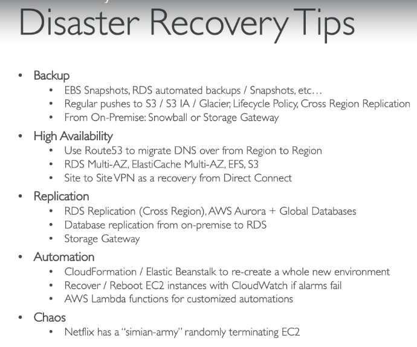
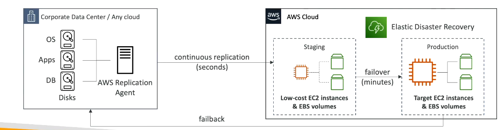
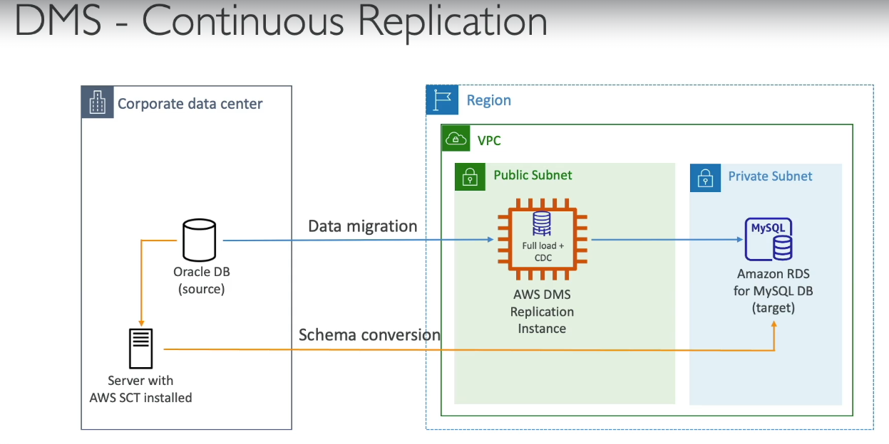

# Disaster Recovery

## RPO and RTO

> [!NOTE]
> ## RPO (Recovery Point Objective)
>
> - **RPO** is the **maximum amount of data you can afford to lose** after a failure.
> - It determines **how frequently backups or replication are needed**.
>
> **Example:**
>
> - Backup taken every **1 hour**.
> - Server fails at **10:45 AM**.
> - Latest backup is **10:00 AM**.
> - **45 minutes of data is lost.**
>
> **RPO = 1 hour**
>
> ---
>
> ## RTO (Recovery Time Objective)
>
> - **RTO** is the **maximum acceptable time to restore the application** after a failure.
> - It determines **how quickly the system must be up and running again**.
>
> **Example:**
>
> - Server crashes at **10:00 AM**.
> - Application is restored by **10:20 AM**.
> - **Downtime = 20 minutes.**
>
> **RTO = 20 minutes**
>
> ---
>
> ### SAA Exam Tip
>
> - **RPO = Data Loss** ("How much data can I lose?")
> - **RTO = Downtime** ("How quickly must I recover?")

## DR Strategies
> [!NOTE]
> ## 1. Backup and Restore
>
> - **Backup and Restore** is a disaster recovery strategy where data is **periodically backed up** and **restored after a failure**.
> - It is **low cost** but has **higher RPO and RTO** than replication-based solutions.
>
> ---
>
> ### How it Works
>
> 1. Periodically take **backups/snapshots** of the application or database.
> 2. Store the backups in durable storage (e.g., **Amazon S3**).
> 3. If a failure occurs, provision new infrastructure.
> 4. Restore the latest backup.
> 5. Resume the application.
>

> [!NOTE]
> ## 2. Pilot Light
>
> - **Pilot Light** is a disaster recovery strategy where **critical infrastructure (e.g., database)** is always running, while the remaining application components are started only during a disaster.
> - It provides **lower RPO and RTO** than Backup & Restore, but at a **higher cost**.
>
> ---
>
> ### How it Works
>
> 1. Keep **critical components** (typically the database) continuously running in the DR region.
> 2. Continuously replicate production data to the DR database.
> 3. Keep application servers and other components **stopped or minimally provisioned**.
> 4. If a failure occurs, launch the remaining application infrastructure.
> 5. Connect the application to the already-running database and resume service.
>

> [!NOTE]
> ## 3. Warm Standby
>
> - **Warm Standby** is a disaster recovery strategy where a **fully functional but scaled-down copy** of the production environment is always running in the DR region.
> - It provides **lower RPO and RTO** than Pilot Light, but at a **higher cost**.
>
> ---
>
> ### How it Works
>
> 1. Keep a **scaled-down version** of the entire application running in the DR region.
> 2. Continuously replicate production data to the DR database.
> 3. The standby environment serves little or no production traffic.
> 4. If a failure occurs, scale up the application servers and database.
> 5. Redirect users to the DR environment.
>

> [!NOTE]
> ## 4. Multi-Site / Hot Standby (Active-Active)
>
> - **Multi-Site (Hot Standby)** is a disaster recovery strategy where **two or more fully functional production environments** run simultaneously in different regions.
> - It provides the **lowest RPO and RTO**, but has the **highest cost**.
>
> ---
>
> ### How it Works
>
> 1. Deploy **identical production environments** in multiple AWS Regions.
> 2. Continuously replicate data between regions.
> 3. Both environments are **active** and can serve user traffic.
> 4. If one region fails, traffic is automatically routed to the healthy region.
> 5. Users experience little or no downtime.
>

 

## AWS Elastic Disaster recovery
> [!NOTE]
> ## AWS Elastic Disaster Recovery (AWS DRS)
> - **AWS Elastic Disaster Recovery (DRS)** is a managed AWS service that continuously replicates your on-premises or cloud servers to AWS.
> - During a disaster, it automatically launches fully functional EC2 instances from the replicated data, providing **low RPO and low RTO**.
>
> ---
>
>   
> ### How it Works
>
> 1. Install the **AWS Replication Agent** on the source server.
> 2. The agent continuously replicates changed disk blocks to AWS.
> 3. AWS stores the replicated data in a **low-cost staging area**.
> 4. During a disaster, AWS automatically launches EC2 instances from the replicated data.
> 5. Redirect users to the recovered application.
>

## Database Migratation Service (Service)
- Migrate Data from on-prem to AWS  
- 1. Homogenous Migration (Oracle to Oracle), 2. Hetrogeneous Migration (MS SQL server to Aurora)  
- working - we create an EC2 instance which will continuously perform replication from on-prem to AWS
- In case of Hetrogeneous migration, we need to use **AWS Schema Conversion Tool (SCT)** - to convert DB's schema from one engine to another  
  
