# DynamoDB
| Feature | Description | Why It Matters |
|----------|-------------|----------------|
| **Fully Managed (Serverless)** | AWS manages servers, patching, replication, backups, and scaling automatically. | No infrastructure management; focus only on application logic. |
| **Single-Digit Millisecond Latency** | Provides consistently low read/write latency at any scale. | Ideal for real-time applications such as gaming, e-commerce, and IoT. |
| **Automatic Scaling** | Supports on-demand mode or provisioned capacity with auto scaling. | Handles traffic spikes without manual intervention. |
| **Flexible Schema (NoSQL)** | Stores key-value and document data; items in the same table can have different attributes. | Easy to evolve application data without schema migrations. |
| **High Availability & Durability** | Data is automatically replicated across multiple Availability Zones within a region. | Built-in fault tolerance and high availability without extra configuration. |

- goto DynamoDB, click on create table
- notice we don't need to create a DB, since it is serverless, DB is already created, just create tables

| Key | Formal Definition |
|------|-------------------|
| **Partition Key** - same as primary key in RDBMS | An attribute whose value determines the partition in which an item is stored. Items with the same partition key belong to the same logical group. |
| **Sort Key** | An optional second key that uniquely identifies and orders items sharing the same partition key, enabling efficient range and ordered queries. |

```text
Table: Orders
Partition Key : CustomerId
Sort Key      : OrderId
```

**Partition Key**: Finds the customer's group. (can have only unique values)
**Sort Key**: Finds the specific order within that customer's group. using sort key, now primary key becomes (Partition key + sort key), so now partiton key can have duplicate values, only the combination of partiton + sort key needs to be unique now

```
Get all orders of Customer C101
→ Partition Key = C101

Get Order O1002 of Customer C101
→ Partition Key = C101
→ Sort Key = O1002
```

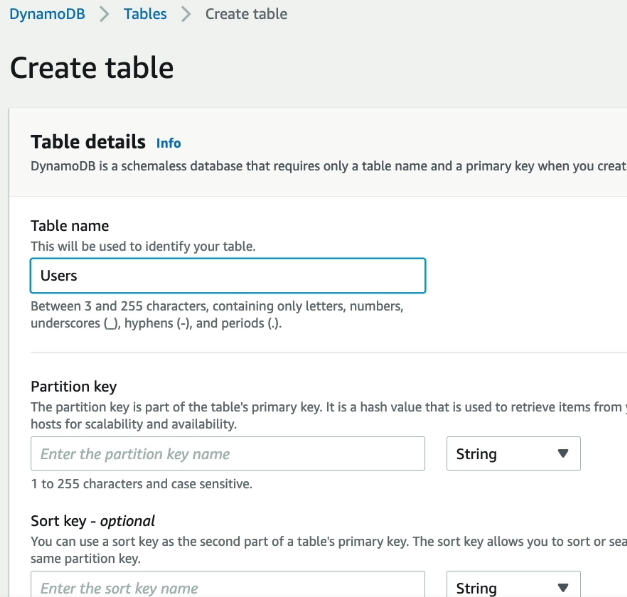   

## DynamoDB Read/Write capacity
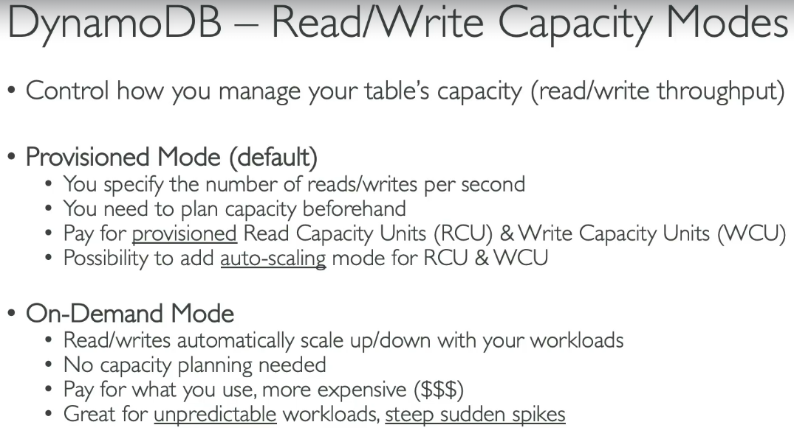  
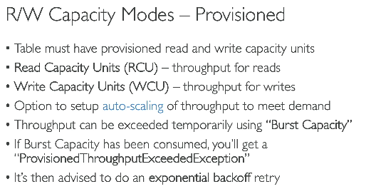  
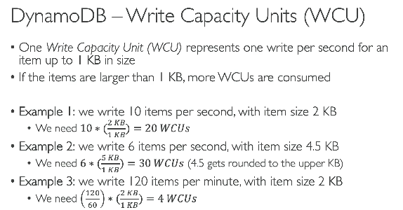  
- Read capacity is of 2 types (We have DynamboDB read replicas, so doe we want eventual consistency? or strong consistency?) - For strong consistency - 1 RCU is consumed per read/second for 4 KB data, for eventual consistency 0.5 RCU is consumed per read/second for 4 KB of data
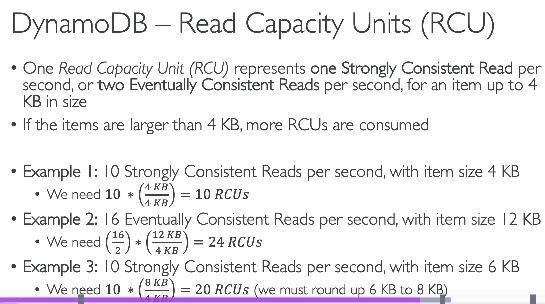  
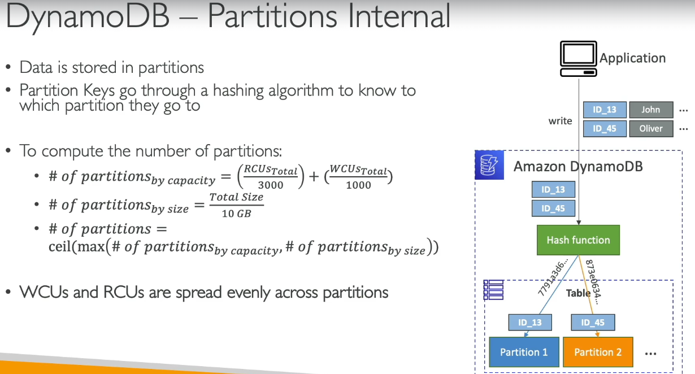  
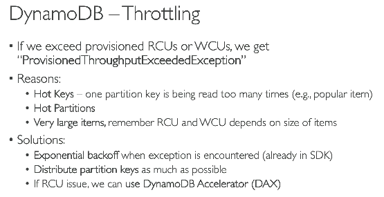  
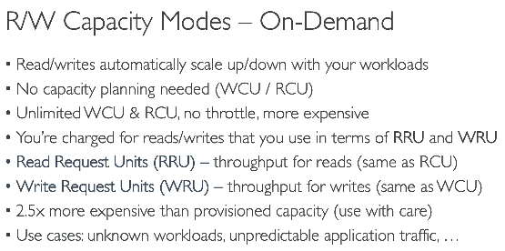  
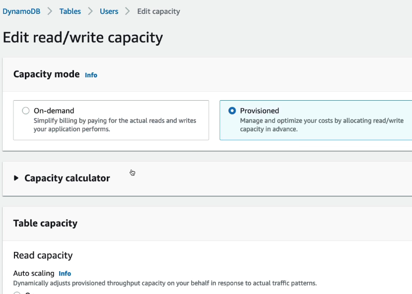  
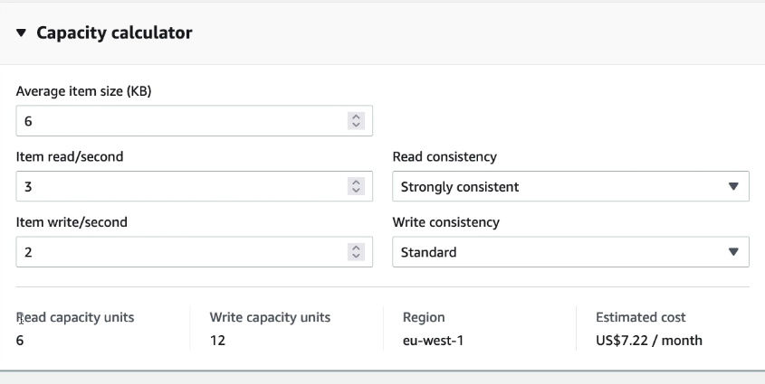  
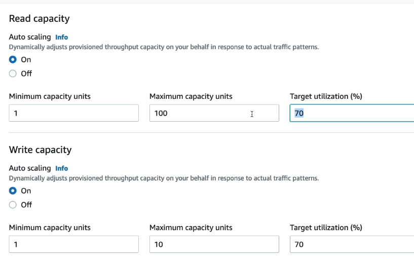  

## DynamoDB commands

| API | Example AWS CLI Command | Purpose | Returns / Action |
|------|-------------------------|---------|------------------|
| **PutItem** | `aws dynamodb put-item --table-name Users --item '{"UserId":{"S":"U101"},"Name":{"S":"Ashish"}}'` | Create a new item or replace an existing one. | Writes an item. |
| **GetItem** | `aws dynamodb get-item --table-name Users --key '{"UserId":{"S":"U101"}}'` | Retrieve a single item by primary key. | Returns one item. |
| **UpdateItem** | `aws dynamodb update-item --table-name Users --key '{"UserId":{"S":"U101"}}' --update-expression "SET #N = :name" --expression-attribute-names '{"#N":"Name"}' --expression-attribute-values '{":name":{"S":"Rahul"}}'` | Update specific attributes of an item. | Updates an item. |
| **DeleteItem** | `aws dynamodb delete-item --table-name Users --key '{"UserId":{"S":"U101"}}'` | Delete an item by primary key. | Deletes an item. |
| **Query** | `aws dynamodb query --table-name Orders --key-condition-expression "CustomerId = :c" --expression-attribute-values '{":c":{"S":"C101"}}'` | Retrieve all items with the same Partition Key. | Returns one or more related items. |
| **Scan** | `aws dynamodb scan --table-name Users` | Read every item in the table. | Returns all (or filtered) items. |
| **BatchGetItem** | `aws dynamodb batch-get-item --request-items file://batch-get.json` | Retrieve multiple items from one or more tables. | Returns multiple items. |
| **BatchWriteItem** | `aws dynamodb batch-write-item --request-items file://batch-write.json` | Write or delete multiple items in one request. | Writes/deletes multiple items. |

#### Conditional writes
| API | Example AWS CLI Command | Purpose | Returns / Action |
|------|-------------------------|---------|------------------|
| **PutItem (Conditional)** | `aws dynamodb put-item --table-name Users --item '{"UserId":{"S":"U101"},"Name":{"S":"Ashish"}}' --condition-expression "attribute_not_exists(UserId)"` | Insert the item **only if it doesn't already exist**. | Prevents overwriting an existing item. |
| **UpdateItem (Conditional)** | `aws dynamodb update-item --table-name Users --key '{"UserId":{"S":"U101"}}' --update-expression "SET Age = :a" --condition-expression "Age < :max" --expression-attribute-values '{":a":{"N":"30"},":max":{"N":"40"}}'` | Update an item **only if a condition is true**. | Prevents invalid updates. |
| **DeleteItem (Conditional)** | `aws dynamodb delete-item --table-name Users --key '{"UserId":{"S":"U101"}}' --condition-expression "Status = :s" --expression-attribute-values '{":s":{"S":"INACTIVE"}}'` | Delete an item **only if a condition is true**. | Prevents accidental deletion. |

#### functions that can be used in conditinal writes
| Condition Function / Operator | Example | Purpose |
|-------------------------------|---------|---------|
| **attribute_exists()** | `attribute_exists(UserId)` | Succeeds only if the attribute exists. |
| **attribute_not_exists()** | `attribute_not_exists(UserId)` | Succeeds only if the attribute does not exist (prevent duplicates). |
| **attribute_type()** | `attribute_type(Age, N)` | Checks that an attribute is of a specific data type. |
| **begins_with()** | `begins_with(OrderId, "ORD")` | Checks whether a string begins with a prefix. |
| **contains()** | `contains(Tags, "AWS")` | Checks whether a string, list, or set contains a value. |
| **size()** | `size(Name) < 20` | Checks the length of a string, list, or binary data. |
| **BETWEEN** | `Price BETWEEN :p1 AND :p2` | Checks if a value lies within a range. |

- **we also have >,<,>=, AND, OR, IN, NOT**

### Indexing
# DynamoDB Secondary Indexes (LSI vs GSI)

## Step 1: Original Table

Suppose the table is:

```text
PK = CustomerId
SK = OrderId
```

| CustomerId | OrderId | OrderDate | Status |
|------------|----------|-----------|---------|
| C101 | O1 | Jan 10 | SHIPPED |
| C101 | O2 | Jan 20 | PENDING |
| C102 | O3 | Jan 15 | SHIPPED |

Internally, DynamoDB organizes the data like this:

```text
Customer C101
    O1
    O2

Customer C102
    O3
```

Since the data is organized by **CustomerId**, you can efficiently query:

```text
CustomerId = C101
```

or

```text
CustomerId = C101
OrderId = O2
```

---

#### Local Secondary Index (LSI)

Suppose you now want to ask:

> Show all orders of Customer C101 sorted by OrderDate.

Problem:

The table is sorted by **OrderId**, not **OrderDate**.

Create an LSI:

```text
PK = CustomerId      (same as table)
SK = OrderDate       (different)
```

AWS builds another index:

```text
Customer C101
    Jan10 → O1
    Jan20 → O2

Customer C102
    Jan15 → O3
```

Notice:

- Still grouped by **CustomerId**
- Only the ordering inside each customer changes.

Hence the name **Local Secondary Index**.

---

#### Global Secondary Index (GSI)

Now suppose you want:

> Show all SHIPPED orders.

The original table cannot answer this efficiently because it is organized by CustomerId.

Create a GSI:

```text
PK = Status
SK = OrderDate
```

AWS builds another index:

```text
SHIPPED
    Jan10 → O1
    Jan15 → O3

PENDING
    Jan20 → O2
```

Now DynamoDB can directly query:

```text
Status = SHIPPED
```

without scanning the table.

---

#### Visual Comparison

Original Table

```text
Customer
├── C101
│     O1
│     O2
└── C102
      O3
```

LSI

```text
Customer
├── C101
│     Jan10
│     Jan20
└── C102
      Jan15
```

- Same customers
- Different ordering

---

GSI

```text
Status
├── SHIPPED
│      O1
│      O3
└── PENDING
       O2
```

- Completely new grouping
- Organized by Status instead of Customer

---

#### Summary

| Feature | LSI | GSI |
|---------|-----|-----|
| Partition Key | Same as table | Different from table |
| Sort Key | Different | Optional, can be different |
| Purpose | Alternate sorting within the same partition | Query by a completely different attribute |
| Example | Customer → Orders by OrderDate | Status → Orders |

#### One-liner
- **LSI:** Same Partition Key, different Sort Key.
- **GSI:** Different Partition Key (and optional Sort Key), creating a completely new way to query the data.

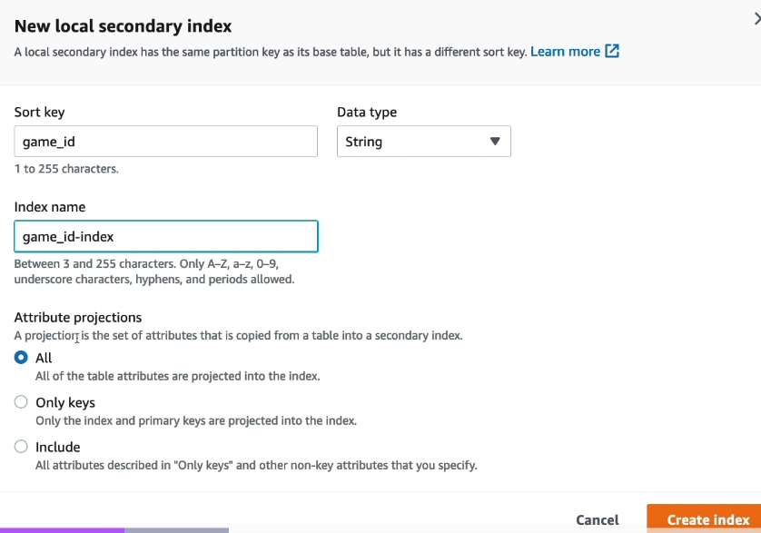  
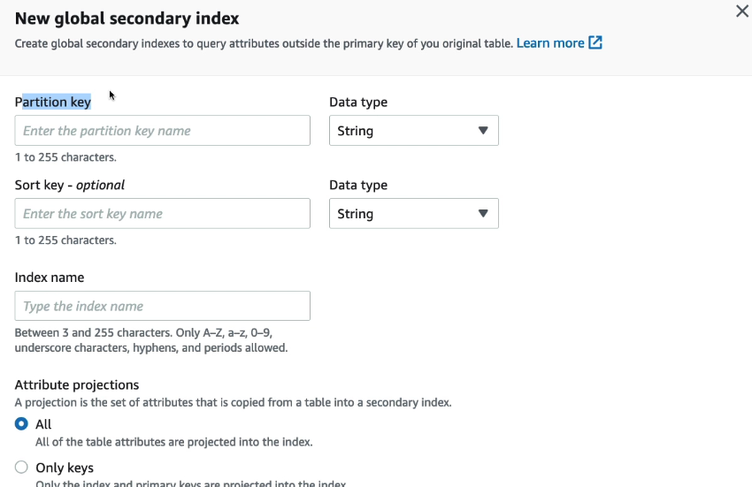  

| Index Type | Maximum per Table | Can be Added Later? |
|------------|-------------------|---------------------|
| **LSI (Local Secondary Index)** | **5** | ❌ No (must be created when the table is created) |
| **GSI (Global Secondary Index)** | **20 (default quota)** | ✅ Yes |

**In our query we need to specify which Index to be used** - 
```bash
aws dynamodb query \
  --table-name Orders \
  --index-name StatusIndex \ 
  --key-condition-expression "Status = :s"
```

- see below, we can wuery either on table, or **directly on the index**
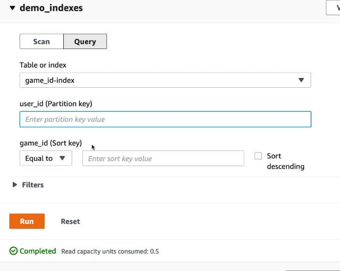  

### PartiQL
**SQL-compatible query language for DynamoDB** that lets you read and modify data using familiar SQL-like statements instead of DynamoDB's native API.  
```SQL
-- instead of doing
-- aws dynamodb query ...
-- we can do
SELECT * FROM Orders WHERE CustomerId = 'C101';
```

### Optimistic locking
- is a concurrency control mechanism that prevents one user from overwriting another user's changes by updating an item only if its version (or another condition) hasn't changed since it was last read.
- we have to create and manage the version attribute yourself
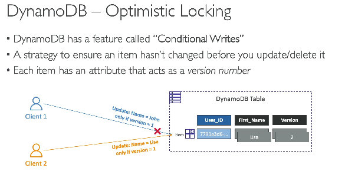  

### DynamoDB Accelerator (DAX)
| Feature | Description |
|---------|-------------|
| **In-Memory Cache** | Fully managed, in-memory cache for DynamoDB that stores frequently accessed items. |
| **Microsecond Read Latency** | Reduces read latency from milliseconds to microseconds for read-heavy workloads. |
| **Highly Available** | Supports multi-node clusters with automatic replication and failover. |

**DAX vs Elastic Cache** - 
| Feature | DAX (DynamoDB Accelerator) | ElastiCache |
|---------|-----------------------------|-------------|
| **Purpose** | Dedicated cache for DynamoDB. | General-purpose distributed cache for any application. |
| **Supported Databases** | Only DynamoDB. | Works with DynamoDB, RDS, Aurora, APIs, and other data sources. |
| **API Integration** | Uses the DynamoDB API with minimal code changes. | Applications must explicitly read/write the cache using Redis or Memcached APIs. |
| **Cache Management** | Automatically manages cache population, updates, and eviction. | Application is responsible for cache population and invalidation (cache-aside, write-through, etc.). |    

**Default TTL in DAX is 5 mins**

#### Creating DAX
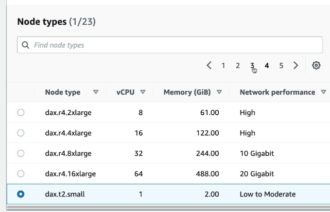  
- then select subnet, IAM roles
- then once created, we will get DAX Cluster endpoint, to which our app can connect

### DynamoDB Streams
- DynamoDB Streams automatically capture every item-level change in a DynamoDB table and make those changes available for event-driven processing for up to 24 hours.

| Aspect | DynamoDB Streams |
|---------|------------------|
| **What is it?** | A time-ordered stream that captures item-level changes (insert, update, delete) in a DynamoDB table. |
| **How it Works** | Every change to the table is automatically written to the stream in the order it occurs. |
| **Retention** | Stream records are retained for **24 hours**. |
| **Consumers** | AWS Lambda or KDS to store data upto 1 yr and let consumers consume ot. |
| **Common Use Cases** | Event-driven processing, new user added to the table, trigger lambda to send welcome email |
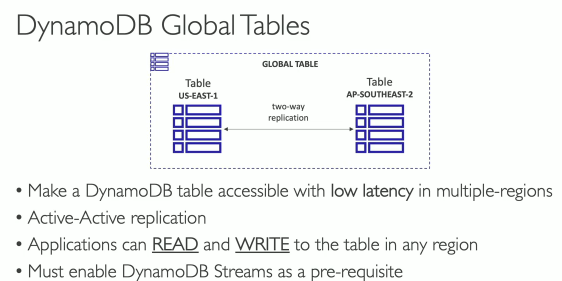  

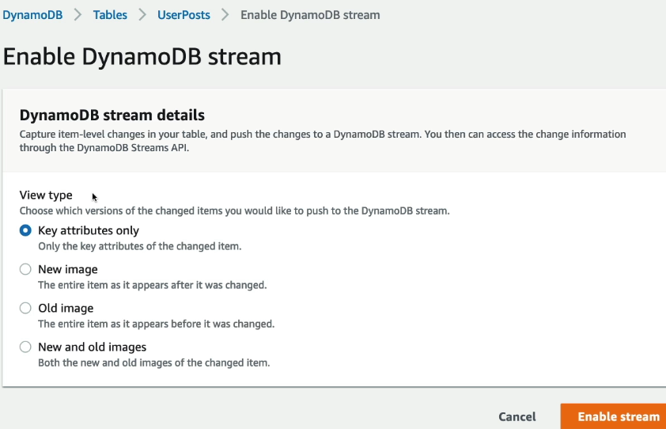  
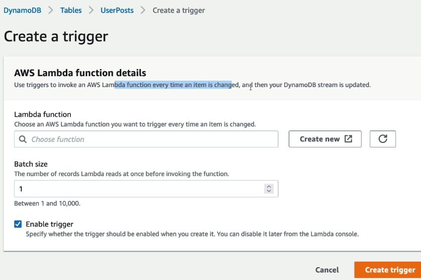  

### DynamoDB TTL
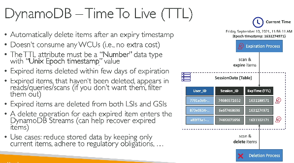  
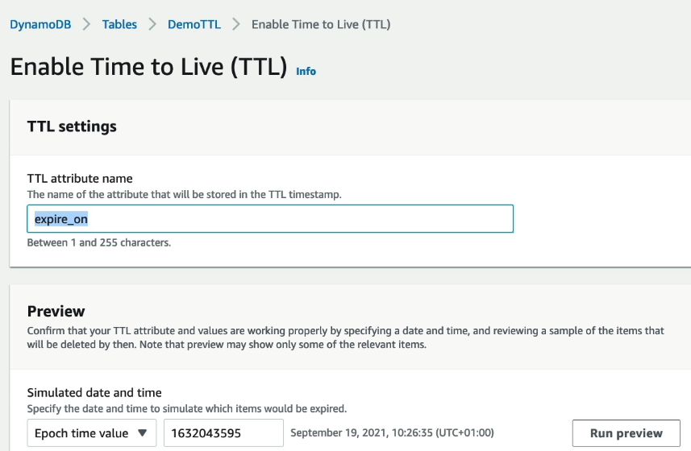  

### DynamoDB CLI commands
| Option | Purpose | Example |
|--------|---------|---------|
| `--table-name` | Specifies the table to query. | `--table-name Orders` |
| `--index-name` | Queries a secondary index (LSI/GSI) instead of the main table. | `--index-name StatusIndex` |
| `--key-condition-expression` | Specifies the Partition Key (and optional Sort Key) condition. | `"CustomerId = :c"` |
| `--filter-expression` | Filters results **after** the Query operation. | `"Status = :s"` |
| `--projection-expression` | Returns only selected attributes. | `"OrderId, Amount"` |
| `--expression-attribute-values` | Defines placeholder values used in expressions. | `'{":c":{"S":"C101"}}'` |
| `--expression-attribute-names` | Defines placeholders for attribute names (e.g., reserved keywords). | `'{"#S":"Status"}'` |
| `--limit` | Limits the number of items returned. | `--limit 10` |
| `--scan-index-forward` | Controls Sort Key order (`true` = ascending, `false` = descending). | `--scan-index-forward false` |
| `--exclusive-start-key` | Continues querying from the last evaluated key (pagination). | `--exclusive-start-key file://key.json` |

### DynamoDB Transactions
- ensures ACID properties are applied to DynamoDB, wither all statements execute or none of them execute
- 1 ttransaction = 2 WCPs
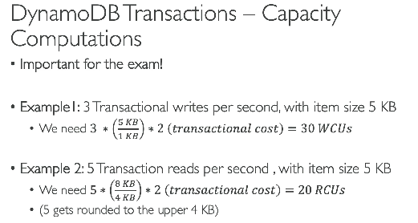  
- in example 2 why it is 8/4KB - 5 is rounded to closest multiple of 4 (upper limit) - so 8, and 4KB of of data per second

### DynamoDB with S3
- store meetadat with object's se url in the table
- actual large file will be stored in S3
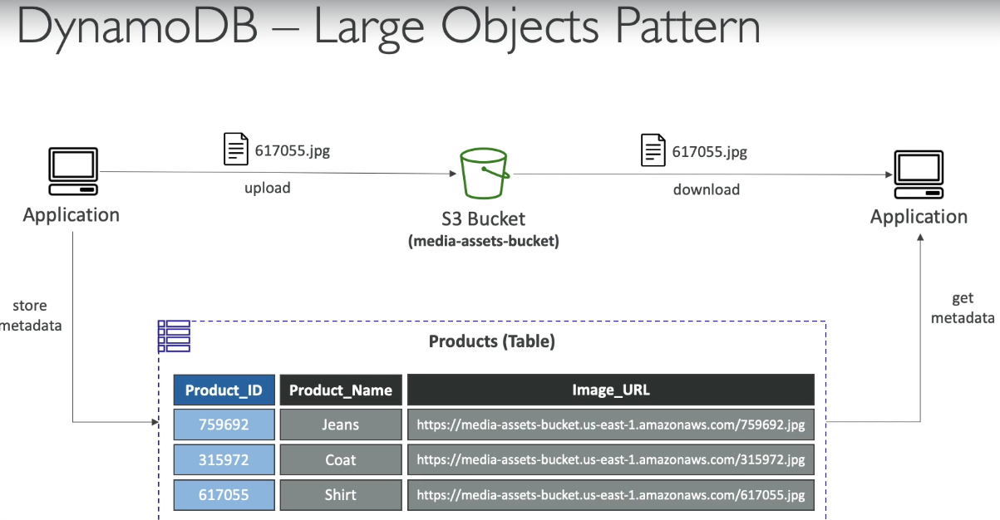  

### Node.js integration with DynamoDB and DAX

#### 1. Install

```bash
npm install @aws-sdk/client-dynamodb @aws-sdk/lib-dynamodb
```

---

#### 2. DynamoDB CRUD

```javascript
import { DynamoDBClient } from "@aws-sdk/client-dynamodb";
import {
  DynamoDBDocumentClient,
  PutCommand,
  GetCommand,
  UpdateCommand,
  DeleteCommand
} from "@aws-sdk/lib-dynamodb";

const client = new DynamoDBClient({
  region: "ap-south-1"
});

const db = DynamoDBDocumentClient.from(client);

// CREATE
await db.send(new PutCommand({
  TableName: "Users",
  Item: {
    UserId: "U101",
    Name: "Ashish"
  }
}));

// READ
const user = await db.send(new GetCommand({
  TableName: "Users",
  Key: {
    UserId: "U101"
  }
}));

// UPDATE
await db.send(new UpdateCommand({
  TableName: "Users",
  Key: {
    UserId: "U101"
  },
  UpdateExpression: "SET #n = :name",
  ExpressionAttributeNames: {
    "#n": "Name"
  },
  ExpressionAttributeValues: {
    ":name": "Rahul"
  }
}));

// DELETE
await db.send(new DeleteCommand({
  TableName: "Users",
  Key: {
    UserId: "U101"
  }
}));
```

---

#### Using DAX

#### Install

```bash
npm install amazon-dax-client
```

---

#### Create DAX Client

```javascript
import AmazonDaxClient from "amazon-dax-client";
import { DynamoDBDocumentClient } from "@aws-sdk/lib-dynamodb";

const dax = new AmazonDaxClient({
  endpoints: [
    "my-dax-cluster.xxxxxx.clustercfg.dax.ap-south-1.amazonaws.com:8111"
  ],
  region: "ap-south-1"
});

const db = DynamoDBDocumentClient.from(dax);
```

---

#### CRUD Operations
No changes are required.
```javascript
await db.send(new GetCommand({
  TableName: "Users",
  Key: {
    UserId: "U101"
  }
}));

await db.send(new PutCommand({
  TableName: "Users",
  Item: {
    UserId: "U101",
    Name: "Ashish"
  }
}));
```
---
