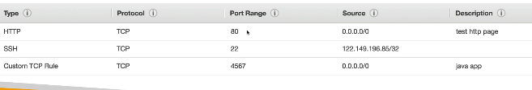
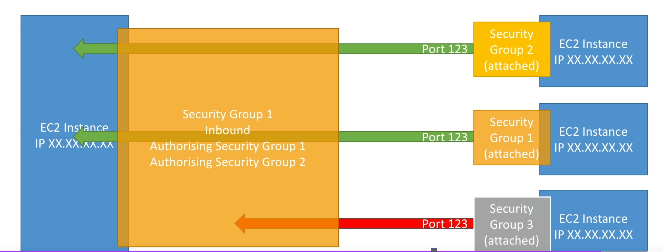

# EC2 - Elastic Compute cloud (IaaS)

## EC2 Purchase Options

- **On-Demand Instances**: Pay for compute capacity by the hour or second with no long-term commitments or upfront payments.
- **Reserved Instances**: Provide a significant discount (up to 75%) compared to On-Demand pricing for committing to use EC2 for 1 or 3 years.
- **Spot Instances**: Bid for unused EC2 capacity, potentially saving up to 90% off On-Demand prices, but instances can be terminated if capacity is needed elsewhere.
- **Dedicated Hosts**: Physical servers fully dedicated to your use, allowing you to use existing server-bound software licenses and meet compliance requirements.
- **Dedicated Instances**: Instances that run on hardware dedicated to a single customer within a VPC, but not a full physical host.
- **Savings Plans**: A flexible pricing model offering lower prices on EC2 usage in exchange for a commitment to a consistent amount of compute usage (measured in $/hour) for 1 or 3 years.

## EC2 Instance Types

EC2 instance types are categorized into families based on their use cases, with varying combinations of CPU, memory, storage, and networking capabilities. Instance names follow the pattern: family.generation.size (e.g., t3.micro).

| Instance Family | Examples | Description | Common Use Cases |
|----------------|----------|-------------|------------------|
| **General Purpose** | t, m | Balanced CPU, memory, and networking resources. | Web servers, application servers, small databases. |
| **Compute Optimized** | c | High CPU performance for compute-intensive workloads. | Batch processing, gaming servers, scientific computing. |
| **Memory Optimized** | r, x, z | Large amounts of RAM for memory-intensive applications. | In-memory databases, caching, big data analytics. |
| **Storage Optimized** | i, d | High storage capacity and high I/O performance. | NoSQL databases, data warehousing, Elasticsearch. |
| **Accelerated Computing** | p, g, f | Hardware accelerators such as GPUs and FPGAs. | Machine learning, graphics rendering, video processing, HPC. |

## Security Groups in EC2

Security Groups act as virtual firewalls for your EC2 instances, controlling inbound and outbound traffic at the instance level. They are stateful, meaning that return traffic for allowed inbound connections is automatically permitted.

- **Key Features**:
  - Rules specify allowed protocols (TCP, UDP, ICMP), ports, and sources (IP addresses, CIDR blocks, or other security groups) for inbound traffic, and destinations for outbound.
  - Default behavior: Deny all inbound traffic, allow all outbound traffic, only allow rules can be specified
  - Can be attached to multiple instances and are VPC-specific.
  - Changes take effect immediately.
  - sec grp is region / VPC specific
  - if you get timeout issue on your site - it is securoty grp is blocking the req
  - if you get connection refused - app error

- **Inbound Rules**: Define what traffic can reach your instances (e.g., allow SSH on port 22 from your IP).
- **Outbound Rules**: Define what traffic your instances can send (e.g., allow HTTP on port 80 to anywhere (so that your ec2 instance can access outside internet)).
**Defning rules** - 

- we can define rules using security groups
- create sec grp, attach multiple sec grp to EC2, then all the other EC2s which are attached to those sec grp can communicate directly, insttead of specific IPs of all EC2, which btw can be dynamic 
 

**Common ports** - 
1. 22 - SSH
2. 21 - FTP
3. 80 - HTTP
4. 442 - HTTPS
5. 3389 - Remote desktop connection

## SSH into EC2
1. Login to AWS cli - ```aws configure``` - then it will prompt for accessId and accessKey
2. ```ssh -i .\ec2-login.pem ec2-user@13.232.74.85``` - the .pem file is option is available wjen creating ec2 instance

## EC2 instance connect
- doing SSH into EC2, but this time, in the browser, simiar to cloudshell for cli
- only works with Amazon Linux AMI

- below I am in EC2 instance connect, so I am into EC2 server
- now if this EC2 server needs to call IAM service it cannot do, because we need to attach IAM role which can access IAM service
- note- as shwon in below image, we can call aws configure and provide our IAM user's accessid and secret key, but then anyone, using this EC2, can maybe see our user's secrtet key, hence we should use IAM role
- this is the reason why IAM role's exists, other wise any developer might see any other develper's IAM secret if those are configured in any of the AWS's services, hence IAM roles are used for AWS services and not IAM users
 

## Storage on EC2
3 types
1. Elastic Block store (EBS)
2. EC2 instance store
3. Elastic File System (EFS)


### 1. EBS - Elastic Block Store
- EBS provides persistent block storage volumes that can be attached to EC2 instances, offering durable and high-performance storage for data that requires frequent updates.
- It supports features like snapshots for backups, encryption, and different volume types (e.g., SSD for general purpose or IOPS-optimized) to match various performance and cost needs.
- by default for every new EC2 instance that we create, EBS of 8 GB is attached

After creating EC2 instance, go to storage section, and click on create volume

**EBS cannot be used across Availiability zones**, for e.g. if you create a volume in us-east-1 AZ, then you cannot attach this volume to EC2 which is in us-east-2. To do that, you need to create a snapshot of that region and then use theat snapshot in new Volume created in the sepcified region.

1. Under volumes - click on action -> create snapshot
2. Under snapshot - click on copy snapshot to other region - slect region
3. Under snapshot - click on create volume from snapshot  
Thus you have created exact same volume in a new region


### 2. Elastic instance store 
Apart from EBS, each EC2 instance also has something called as EC2 instance store to store data, but this will vanish once EC2 instance is terminated.
- So EC2 instance store for caching the data, and EBS for storing permanent data

### 3. EFS - Elastic File System
- This is shared file systems and multiple EC2 instances even from different availability zones can access same EFS, not possible in EBS

# AMI - Amazon Machine Image

# AMI - Amazon Machine Image
- similar to docker images, you can launch new EC2 instances from this AMIs
- AMI is a template that contains the software configuration (OS, application server, applications) needed to launch an EC2 instance, allowing you to quickly deploy pre-configured environments.
- It can be based on AWS-provided images or custom ones which we can create, or can use AMIs created by others from marketplace
1. right click on EC2 instance -> images and template -> create image
2. while creating new ec2 instance - instead of selecing os as windows,linux, select your own AMI

## EC2 user data scripts
- shell command that we can run when the machine starts
- Run only during the instance's initial boot by default. 
- Restarting or stopping/starting the instance does not rerun the script unless the instance is specifically configured to do so.

### EC2 public and private IPs
### Why Does an EC2 Instance Have Both Private and Public IPs?

- **Private IP:** Used for communication within the VPC. It remains the same for the lifetime of the instance.
- **Public IP:** Used for communication with the internet. AWS maps it to the instance's private IP.
- The Public IP Changes when you start and stop the instance, unless we use elastic IP

**Example:** Your laptop accesses the EC2 instance using its public IP, while another EC2 instance in the same VPC communicates using the private IP.