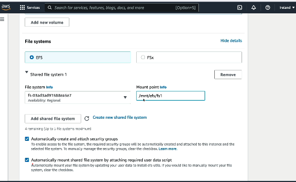
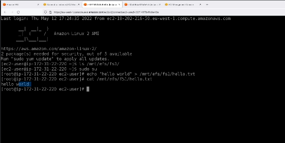
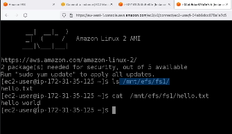

# EC2 - Elastic Compute cloud (IaaS)

## EC2 Purchase Options

- **On-Demand Instances**: Pay for compute capacity by the hour or second with no long-term commitments or upfront payments.
- **Reserved Instances**: Provide a significant discount (up to 75%) compared to On-Demand pricing for committing to use EC2 for 1 or 3 years. **Convirtable Reserver Instance** - withing the lockin period, you can change EC2 instance type - like from micro to x-large
- **Spot Instances**: Bid for unused EC2 capacity, potentially saving up to 90% off On-Demand prices, but instances can be terminated if capacity is needed elsewhere hence unreliable.
- **Dedicated Hosts**: provides an entire physical server dedicated to a customer, offering visibility and control over host-level resources and supporting BYOL licensing.
- **Dedicated Instances**: provides hardware isolation from other AWS customers, but AWS manages the underlying physical server.
- **Savings Plans**: A flexible pricing model offering lower prices on EC2 usage in exchange for a commitment to a consistent amount of compute usage (measured in $/hour) for 1 or 3 years.
- **EC2 Capacity Reservation** - Reserves EC2 capacity in a specific Availability Zone so that instances can be launched whenever needed, even during periods of high demand.
- Charged for the reserved capacity whether you use it or not
- then why not use on-demand - for on-demand, you pay price for compute, but in cap reservation, only pay reservation price
**Use Case:** A critical production application must be able to launch additional EC2 instances during a traffic spike, even if the AZ is experiencing capacity shortages.

## EC2 Instance Types

EC2 instance types are categorized into families based on their use cases, with varying combinations of CPU, memory, storage, and networking capabilities. Instance names follow the pattern: family.generation.size (e.g., t3.micro).

| Instance Family | Examples | Description | Common Use Cases |
|----------------|----------|-------------|------------------|
| **General Purpose** | t, m | Balanced CPU, memory, and networking resources. | Web servers, application servers, small databases. |
| **Compute Optimized** | c | High CPU performance for compute-intensive workloads. | Batch processing, gaming servers, scientific computing. |
| **Memory Optimized** | r, x, z | Large amounts of RAM for memory-intensive applications. | In-memory databases, caching, big data analytics. |
| **Storage Optimized** | i, d | High storage capacity and high I/O performance. | NoSQL databases, data warehousing, Elasticsearch. |
| **Accelerated Computing** | p, g, f | Hardware accelerators such as GPUs and FPGAs. | Machine learning, graphics rendering, video processing, HPC. |

## Security Groups in EC2

Security Groups act as virtual firewalls for your EC2 instances, controlling inbound and outbound traffic at the instance level. They are stateful, meaning that return traffic for allowed inbound connections is automatically permitted.

- **Key Features**:
  - Rules specify allowed protocols (TCP, UDP, ICMP), ports, and sources (IP addresses, CIDR blocks, or other security groups) for inbound traffic, and destinations for outbound.
  - Default behavior: Deny all inbound traffic, allow all outbound traffic, only allow rules can be specified
  - Can be attached to multiple instances and are VPC-specific.
  - Changes take effect immediately.
  - sec grp is region / VPC specific
  - if you get timeout issue on your site - it is securoty grp is blocking the req
  - if you get connection refused - app error

- **Inbound Rules**: Define what traffic can reach your instances (e.g., allow SSH on port 22 from your IP).
- **Outbound Rules**: Define what traffic your instances can send (e.g., allow HTTP on port 80 to anywhere (so that your ec2 instance can access outside internet)).
**Defning rules** - 

- we can define rules using security groups
- create sec grp, attach multiple sec grp to EC2, then all the other EC2s which are attached to those sec grp can communicate directly, insttead of specific IPs of all EC2, which btw can be dynamic 
 

**Common ports** - 
1. 22 - SSH
2. 21 - FTP
3. 80 - HTTP
4. 442 - HTTPS
5. 3389 - Remote desktop connection

**Note** - security group is not just attched to EC2, it can be attached to almost all AWS services

## SSH into EC2
1. Login to AWS cli - ```aws configure``` - then it will prompt for accessId and accessKey
2. ```ssh -i .\ec2-login.pem ec2-user@13.232.74.85``` - the .pem file is option is available wjen creating ec2 instance

## EC2 instance connect
- doing SSH into EC2, but this time, in the browser, simiar to cloudshell for cli
- only works with Amazon Linux AMI

- below I am in EC2 instance connect, so I am into EC2 server
- now if this EC2 server needs to call IAM service it cannot do, because we need to attach IAM role which can access IAM service
- note- as shwon in below image, we can call aws configure and provide our IAM user's accessid and secret key, but then anyone, using this EC2, can maybe see our user's secrtet key, hence we should use IAM role
- this is the reason why IAM role's exists, other wise any developer might see any other develper's IAM secret if those are configured in any of the AWS's services, hence IAM roles are used for AWS services and not IAM users
 

## Storage on EC2
3 types
1. Elastic Block store (EBS)
2. EC2 instance store
3. Elastic File System (EFS)


### 1. EBS - Elastic Block Store
- EBS provides persistent block storage volumes
- these are network only and not physically attached to EC2
- attched to only one EC2 at a time (default size 8GB)
- locked at AZ level, (can be attched to EC2 from different AZ, by taking snapshot)


1. Under volumes - click on action -> create snapshot
2. Under snapshot - click on copy snapshot to other region - slect region
3. Under snapshot - click on create volume from snapshot  
Thus you have created exact same volume in a new region

**EBS Volume types** - 
1. SSD = Fast access (IOPS-focused) → gp3, io2
2. HDD = Cheap storage (throughput-focused) → st1, sc1
3. gp3 = Default
4. io2 = Database
5. st1 = Big Data
6. sc1 = Archive

#### EBS Multi-attach
- one EBS can connect to only 1 EC2, and that too in same AZ
- multi-attach allows to connect to upto 16 EC2 instances in same AZ
- only io1 and io2 EBS volums can be multi-attached
- usecase - when multi-cluser (app running on multiple servers) apps need to access same disk storage, e.g. Oracle RAC (Real appliction cluster), rarely a use case for web devs

**How to attach EBS to EC2** - out of scope for certified DEV

### 2. Elastic instance store 
- this will vanish once EC2 instance is terminated.
- So EC2 instance store for caching the data, and EBS for storing permanent data

**How to attach Elastic instance store to EC2** - this is physically attached to EC2 instance

### 3. EFS - Elastic File System
- This is shared file systems and multiple EC2 instances even from different availability zones can access same EFS, not possible in EBS
- highly scalable, and pay per use. no need to reserve capacity
- **EFS** → Shared folder for many servers.
- **Usecase** - Content Management Systems (e.g., WordPress) running on multiple EC2 instances that need shared plugins, themes, and uploaded files. Mostly used in legacy systems, or if we are bringing legacy systems to Cloud, mostly se is suitable

**EFS Storage classes** - 
1. Standard → Hot data
2. Infrequent Access (IA) → Warm data
3. Archive → Cold data

**EFS Performance categories** - 
1. Performance Mode = "How Fast?"
- **General Purpose** → Low latency (default)
- **Max I/O** → Massive scale, higher latency

2. Throughput Mode = "How Much Data per Second?"
- **Elastic** → AWS automatically adjusts throughput
- **Provisioned** → You specify throughput
- **Bursting** → Throughput depends on file system size (legacy)

**How to attach EFS to EC2** - 
- create EFS volume
- speficy security groups, VPC
- while creating EC2, specify EFS volume


**note** - the checbox above - auto moutn shared FS by attaching user data scripts - make saure that the EFS will be attached to this EC2, and AWS will handle the userdata script which will run on instance boot (1st time)
- this way our EC2 now has access to this file system **/mnt/efs/fs1**
- **accessing this fs in multiple EC2 instance**
- **Instance A** - create a new file hello-world.txt and writes content (we connected to EC2 via AWS instance connect)


- **Instance B** - can directly read the file contents, becuase this is now a shared FS 



# AMI - Amazon Machine Image
- similar to docker images, you can launch new EC2 instances from this AMIs
- AMI is a template that contains the software configuration (OS, application server, applications) needed to launch an EC2 instance, allowing you to quickly deploy pre-configured environments.
- It can be based on AWS-provided images or custom ones which we can create, or can use AMIs created by others from marketplace
1. right click on EC2 instance -> images and template -> create image
2. while creating new ec2 instance - instead of selecing os as windows,linux, select your own AMI

## EC2 user data scripts
- shell command that we can run when the machine starts
- Run only during the instance's initial boot by default. 
- Restarting or stopping/starting the instance does not rerun the script unless the instance is specifically configured to do so.

### EC2 public and private IPs
### Why Does an EC2 Instance Have Both Private and Public IPs?

- **Private IP:** Used for communication within the VPC. It remains the same for the lifetime of the instance.
- **Public IP:** Used for communication with the internet. AWS maps it to the instance's private IP.
- The Public IP Changes when you start and stop the instance, unless we use elastic IP

**Example:** Your laptop accesses the EC2 instance using its public IP, while another EC2 instance in the same VPC communicates using the private IP.