# Elastic Container Service (ECS)
- allows us to launch docker container on AWS
- for this we first need to provision EC2 instance
- AWS will handle container lifecycle part

**There are 2 launch types of ECS containers**

## 1. EC2 launch type
- In ECS EC2 launch type, you provision and manage EC2 instances, and ECS schedules containers as tasks on those instances using the ECS Agent running on each EC2. 
**How it works**
```text
ECS Cluster
    |
    +-- EC2 Instance 1
    |      |
    |      +-- ECS Agent
    |      +-- Container A
    |      +-- Container B
    |
    +-- EC2 Instance 2
           |
           +-- ECS Agent
           +-- Container C
```
Flow  
#### Step 1. Create ECS cluster - 
- **ECS Cluster** is a logical grouping of compute resources (EC2 instances or Fargate) where ECS schedules and runs containers.
- select launch type - farget, farget and self managed instances (this is nothing but EC2 instance launch type)
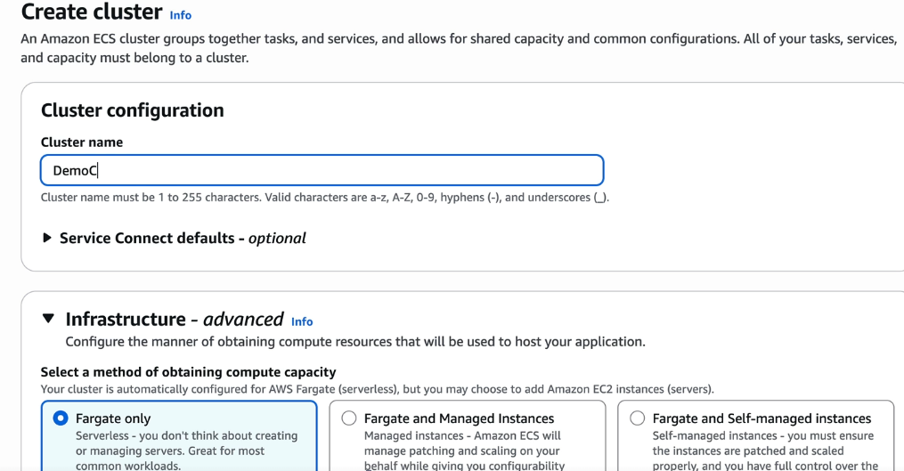  
- then choose EC2 details, EC2 instance role (this is same as IAM role,if EC2 is going to call any other AWS service)
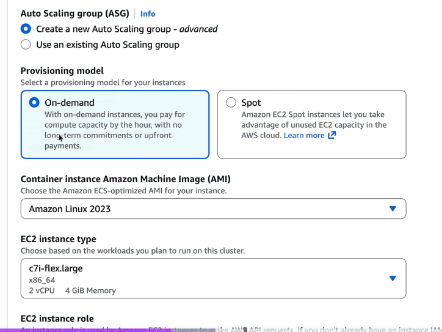  
- select desired capacity
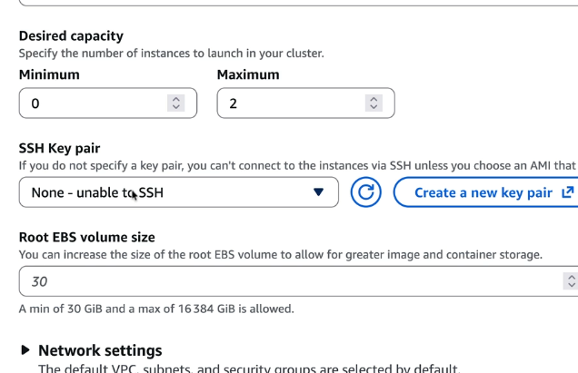  
- the click on create cluster
- FYI - when cluser is created it will also auto create ASG group which will have EC2 instances based on capacity selected

- when cluser is created, we then need to create tasks, services to launch containers on those EC2s
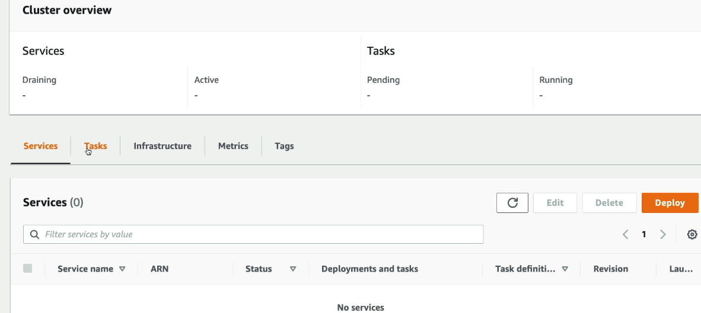  

#### Step 2. Create Tasks
- **ECS Task** is a running instance of a Task Definition, i.e., one or more containers running together on ECS., **ECS task is similar to pod in K8**
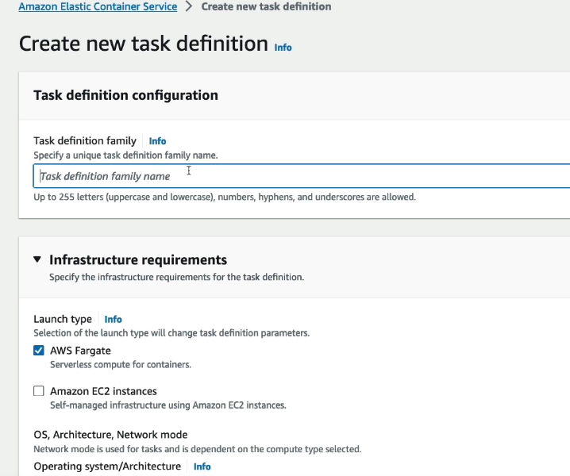  
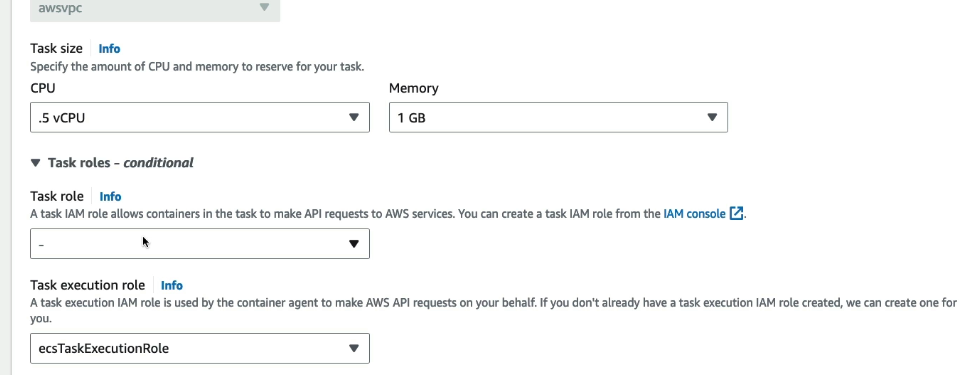  
- then provide container details, (image url below is image name from dockerhub)  
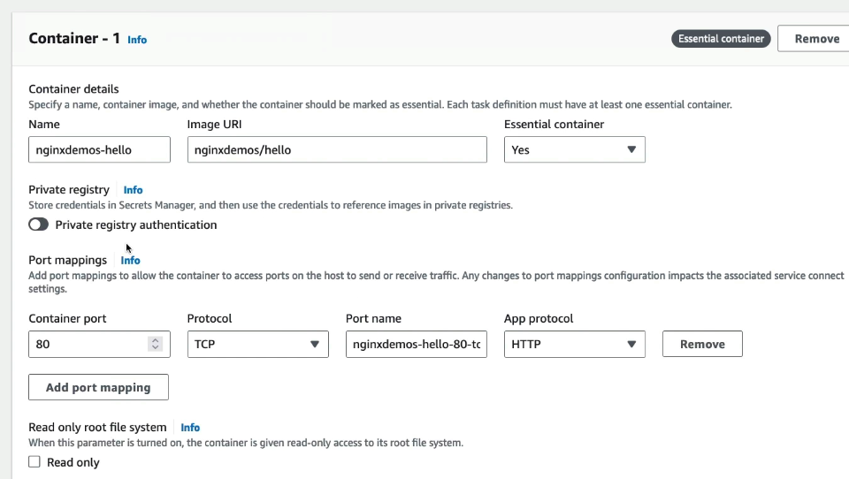  

#### Step 3. Create Services
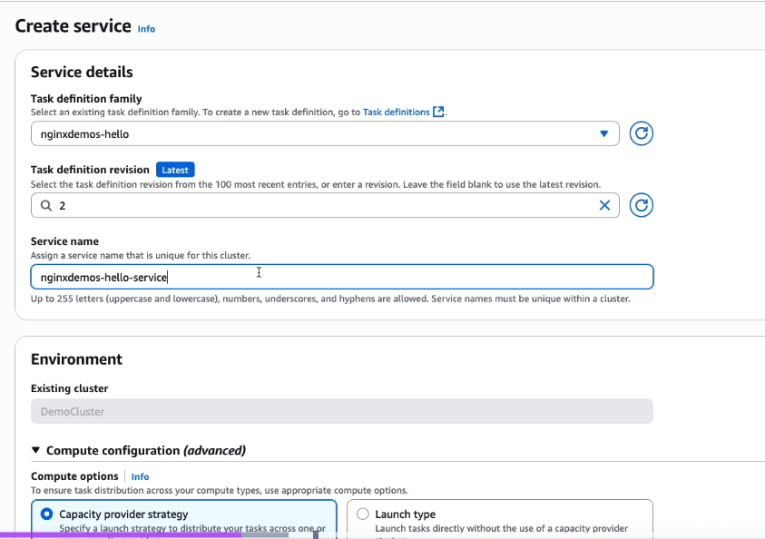  
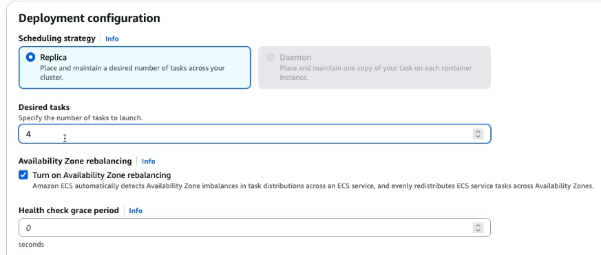  
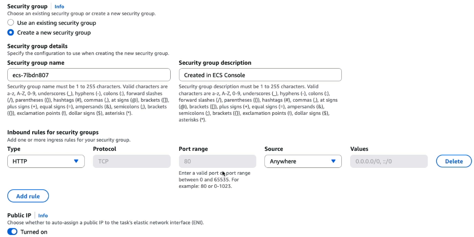  
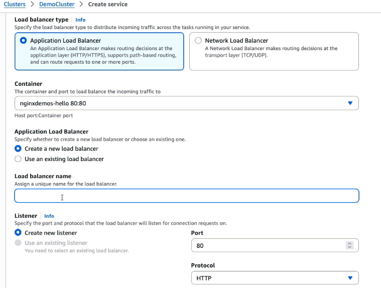  


1. You launch EC2 instances (often via an Auto Scaling Group).
2. Each EC2 runs the ECS Agent.
3. The ECS Agent registers the EC2 with the ECS Cluster.
4. You create an ECS Service/Task.
5. ECS Scheduler chooses an EC2 with enough CPU/RAM.
6. ECS Agent pulls the Docker image and starts the container

**Responsibilities** - 

| ECS Manages | You Manage |
|------------|------------|
| Container scheduling | EC2 instances |
| Service discovery | AMI updates |
| Health checks | OS patches |
| Task placement | Scaling EC2 fleet |

## 2. Farget launch type

- allows us to launch docker container on AWS
- same as ECS, but it is serverless
- so no need to provision EC2 instance

### IAM roles for ECS
### How ALB integrates with ECS
### ECS Data volumes

## ECR - Elastic container registry
- AWS's private docker registry
- this is where docker images are stored
- AWS ECR Public gallery - this is public docker registry by AWS, similar to dockerhub

## EKS - Elastic Kubernetes service
- containers can be hosted on EC2 or farget
