# Elastic Container Service (ECS)
- allows us to launch docker container on AWS
- for this we first need to provision EC2 instance
- AWS will handle container lifecycle part

**There are 2 launch types of ECS containers**

## 1. EC2 launch type
- see below (EC2 launch type working)
## 2. Farget launch type

- allows us to launch docker container on AWS
- same as ECS, but it is serverless
- so no need to provision EC2 instance

### EC2 lanunch type working - 
- In ECS EC2 launch type, you provision and manage EC2 instances, and ECS schedules containers as tasks on those instances using the ECS Agent running on each EC2. 
**How it works**
```text
ECS Cluster
    |
    +-- EC2 Instance 1
    |      |
    |      +-- ECS Agent
    |      +-- Container A
    |      +-- Container B
    |
    +-- EC2 Instance 2
           |
           +-- ECS Agent
           +-- Container C
```
Flow  
#### Step 1. Create ECS cluster - 
- **ECS Cluster** is a logical grouping of compute resources (EC2 instances or Fargate) where ECS schedules and runs containers.
- select launch type - farget, farget and self managed instances (this is nothing but EC2 instance launch type)
  
- then choose EC2 details, EC2 instance role (this is same as IAM role,if EC2 is going to call any other AWS service)
  
- select desired capacity
  
- the click on create cluster
- FYI - when cluser is created it will also auto create ASG group which will have EC2 instances based on capacity selected

- when cluser is created, we then need to create tasks, services to launch containers on those EC2s
  

#### Step 2. Create Tasks
- **ECS Task** is a running instance of a Task Definition, i.e., one or more containers running together on ECS., **ECS task is similar to pod in K8**
  
  
- then provide container details, (image url below is image name from dockerhub)  
  

#### Step 3. Create Services
- **ECS Service** ensures that a specified number of ECS Tasks are continuously running and automatically replaces failed tasks.
- **ECS service is similar to deployment in K8**
- while creating service, provide the link to the task we created earlier
  
- provide deployment config, e.g. if we provide desired capaciry as 4, then 4 container will be running (4 containers of the same task we created above)
  
- provide sec grp details, which makes containers accessible over http
  
- create and attach a new ALB, so that those 4 containers are load balanced
  
- then we go to the ALB created above, open DNS of ALB, and then it will call those 4 containers round-robin
- so basically, our docker image (referenced in Task (image url)) - will have our app running and exposing port 80

**Responsibilities** - 

| ECS Manages | You Manage |
|------------|------------|
| Container scheduling | EC2 instances |
| Service discovery | AMI updates |
| Health checks | OS patches |
| Task placement | Scaling EC2 fleet |

### ECS autoscaling
- auto increase number of tasks
- this is different from EC2 ASG
- EC2 ASG scales EC2 instances, ECS autoscaling scales number of tasks (pods)

| Method | How it works | Example |
|-------|-------------|---------|
| **Target Tracking** | Maintain a target metric value | Keep CPU around 60% |
| **Step Scaling** | Scale by different amounts based on alarm thresholds | CPU > 70% → +2 tasks, CPU > 90% → +5 tasks |
| **Scheduled Scaling** | Scale at predefined times | Scale to 10 tasks every day at 9 AM |

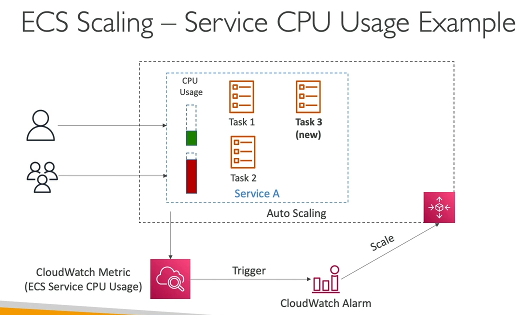 
- when CPU utilization goes up, it triggers Cloudwatch Alarm
- the alarm will trigger scaling activity to ECS service, which will eventually add new task 3

### ECS rolling updates

**Rolling Update** deploys a new version of your application **gradually**, replacing old tasks with new ones while keeping the service available.

### Example

Current state:

```text
ECS Service: orders-api
Desired Tasks: 4
v1  v1  v1  v1

now we have v2 version

- **Minimum Healthy Percent = 50**
  - ECS must keep at least **50% of desired tasks** running during deployment.
  - Since desired tasks = 4, at least **2 healthy tasks** must always be available.

- **Maximum Percent = 200**
  - ECS can temporarily run up to **200% of desired tasks** during deployment.
  - Since desired tasks = 4, ECS can run at most **8 tasks** simultaneously.

Step 1: ECS starts 4 new tasks (v2)
```text
v1  v1  v1  v1
v2  v2  v2  v2
Total tasks = 8 (allowed because Maximum Percent = 200)
Step 2: ECS waits for v2 tasks to become healthy.
Step 3: ECS stops old v1 tasks.

if we keep maximm % to 100 and min to 50%
- then 2 v1 will be removed (cannot remove more because min 50%), 2 v2 will be added
- again 2 v1 removed, 2 v2 added
- also cannot first add v2 and then remove v1 because (max=100%)
```

### ECS architectures
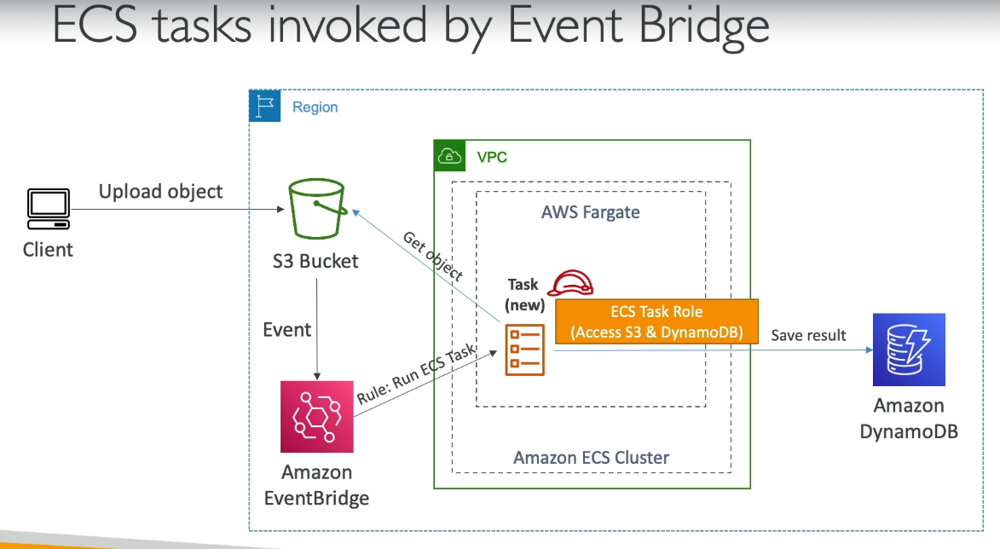  
- why not use lambda?
- if task will take more than 15-20 mins, then ECS tasks is preferred
- for smaller time duration, use lambda
- e.g. Video Processing - Video transcoding may take 10-30 minutes.

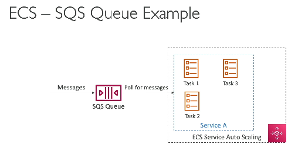  
- key note here - if SQS queue gets more messages, we can use ECS autoscaling to add more number of tasks
- anywhere lambda can be used, ECS can also be used, use ECS when task to be performed on event trigger will take more time

### ECS Task definition
**ECS Task vs ECS Task definition vs docker images** -
| ECS Task | ECS Task Definition | Docker Image |
|---------|----------------------|-------------|
| Running instance | Blueprint / Template | Application package |
| Actually runs containers | Defines how to run one or more containers | Contains application code and dependencies |
| Created from a Task Definition | Defined as JSON | Built using `Dockerfile` |

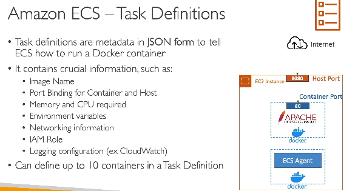  
- Note - we difine IAM role inside ECS Task definition, so if task needs to access s3, IAM role is defined here
- then we also define env variables in task definition (hardcoded or get from SSM service)
- if we just define the container port and not the host port, then host ports would be dynamic
- ALB has a dynamic host port mapping feature, which allows it to connect to ECS tasks
- for this to work, the EC2's security group must allow to connect to it from any port

### ECS Data volumes
- if we need to share data between multiple containers / task in the same service, we use ECB data volumns
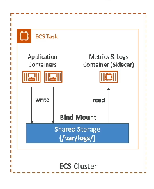  
- usecase - Video Processing Pipeline
```text
ECS Task
├── ffmpeg Container
│      |
│      | writes:
│      | 720p.mp4
│      | 1080p.mp4
│      v
│   Shared Volume
│      ^
│      |
└── Upload Container
       |
       | uploads files
       |
      S3
```
**Why Volume is the best choice?**

- ffmpeg generates **large intermediate files** (GBs).
- Upload container needs to access them **immediately**.
```text
Input Video (S3)
      |
ffmpeg container
      |
Shared Volume (local disk)
      |
Upload container
      |
Output Videos (S3)
```
The shared volume acts as a **fast local scratch space**.
---

> ECS Data Volumes are best used for sharing large temporary files between containers in the same task, such as video transcoding pipelines where one container generates files and another uploads them to S3.

### ECS Task placement
- it allows ECS to determine where to place a new task, in which EC2 by looking at CPU / Memory utilization  
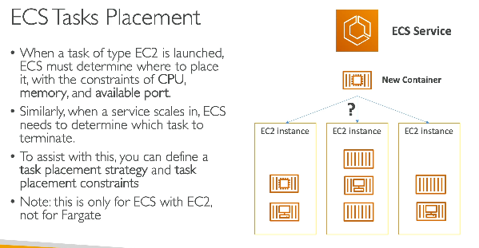  

#### ECS Task placement strategies
1. Binpack
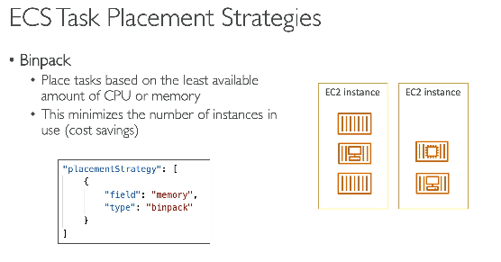  
2. Random - ECS randomly places container on any EC2 instance, no logic
3. Spread - 
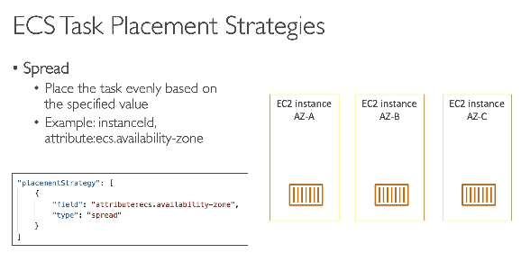  

- Note you can mix and create a strategy e.g. (Spread based on region, then spread based on instance ID)
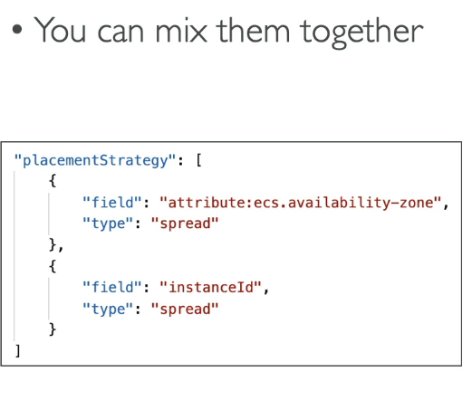  

#### ECS task placement constraints
- restrict *where* tasks can run, e.g., run tasks only on EC2 instances with a specific attribute, Availability Zone, or instance type.
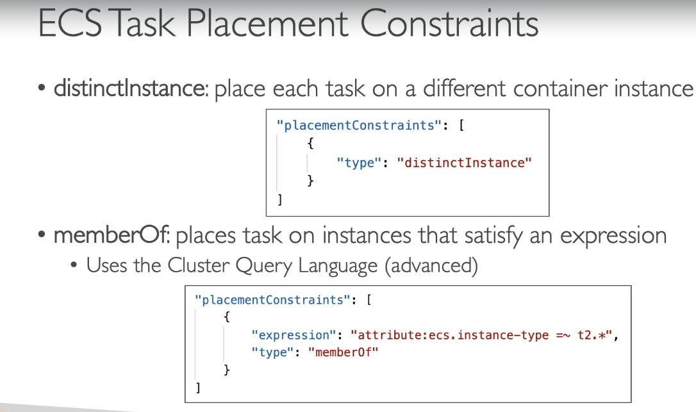  

## Elastic Container Registry 
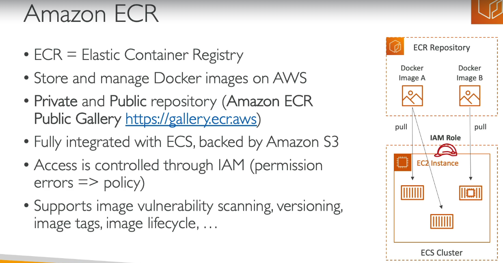  
- AWS ECR Public gallery - this is public docker registry by AWS, similar to dockerhub
#### 1. First create ECR repo
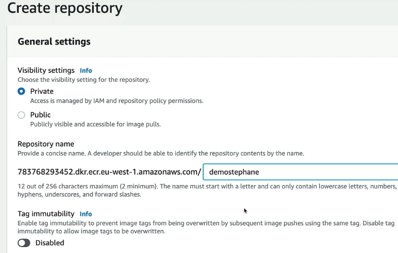  
#### 2. Run commands
- make sure docker is installed locally
| Purpose | Command |
|--------|---------|
| Login to ECR | `aws ecr get-login-password \| docker login --username AWS --password-stdin <account>.dkr.ecr.<region>.amazonaws.com` |
| Tag image for ECR | `docker tag orders:v1 <account>.dkr.ecr.ap-south-1.amazonaws.com/orders:v1` |
| Push image to ECR | `docker push <account>.dkr.ecr.ap-south-1.amazonaws.com/orders:v1` |
| Pull image from ECR | `docker pull <account>.dkr.ecr.ap-south-1.amazonaws.com/orders:v1` |

## EKS - Elastic Kubernetes service
- containers can be hosted on EC2 or farget
