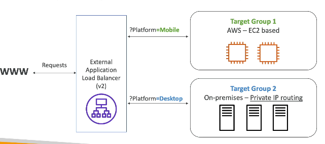
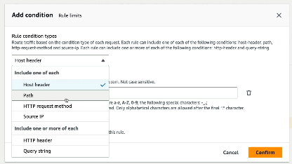
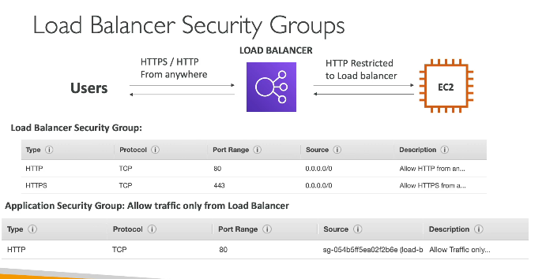
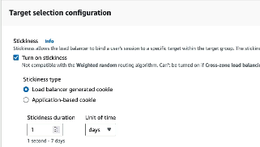
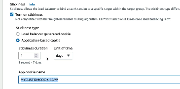
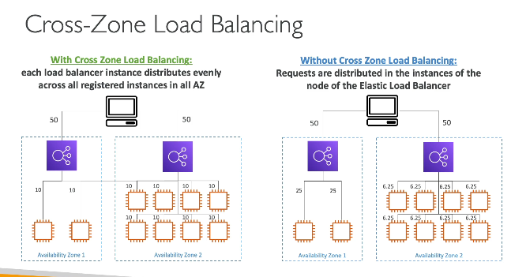
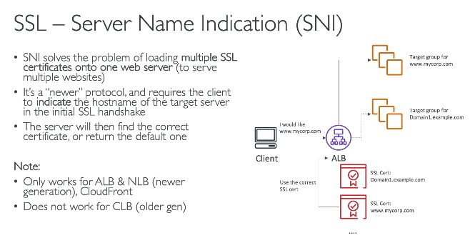
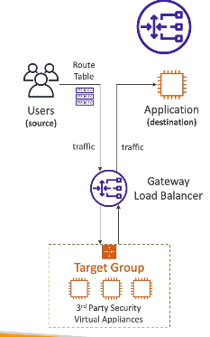

# Elastic Load Balancer (ELB)
- **managed** - Load balancer
- IMP - it is managed, so AWS will gurantee that ELB will be working for you, and AWS will be responsible for everthing for that ELB, we just need to configure it

### 4 types of ELB
1. Application layer (HTTP / HTTPs) - layer 7 (ALB - Application load balancer)
2. Network load balancer (ultra high performance) - layer 4
3. Gateway load balancer - layer 3 () at IP level
4. Classic load balancer (retired) - layer 4 and 7

### Steps to create ALB
1. Create multiple EC2 instances
2. Got to Loadbalancers
3. Click on create
4. Select Application load balancer
5. Create target groups - see below
6. Select / Create security group, similar to while creating EC2s, we configured security groups to allow HTTP trafic and SSH rule, we need to create for load balancer, but mostly SSH rule is not required for load balancers
7. Click on create, now open the IP of load balancer, and it will work

**Target group** - 
- We group and select all EC2 instances which will be handeled by this load balancer into a group called target group
- target groups can be for **group of EC2 instances, lambda function, ECS tasks, list of private IP addresses**
- ALB can route request to multiple target groups, so we can create 1 TG for EC2s, 1 TG for lambdas

#### Routing rules
- based on query params
 
- similarly routing can be done based below options
 

## How to stop access of target Ec2 instances which are hidden behind ELB
 
- ony security grp of load balancer, will have allow inbound rules of 80 and 443, with source IP range (0.0.0.0/0) - making the loadbalancer publicly accessible
- but the underneath EC2 instance will only HTTP port open and this time source won't be range of IPs, but soruce will be the security grp of the load balancer, so only loadbalancer can access EC2 on port 80

## How to configure routing algo for load balancer
1. Open **EC2 Console** → **Target Groups**.
2. Select the target group attached to your ALB.
3. Go to **Attributes** → **Edit**.
4. Under **Load Balancing Algorithm**, choose:
   - **Round Robin** *(default)*
   - **Least Outstanding Requests**
   - **Weighted Random**
5. Save the changes.

**What if I need to use consistent hashing algo, instead of the defaul algos provided by ALB?** - 
1. Use a self-managed load balancer such as **NGINX** or **HAProxy** on EC2.
2. Implement routing logic in your application or API gateway layer.

**Routing rules vs Load balancers routing algorithm** - 
- **Routing rules** - they route request to a specific target groups (routing req. to group of EC2 instances)
- **Routing algo** - within a target group, there can be 50 EC2 instances, so to which specific EC2 instance the req, needs to be routed is determined bu routing algorithm

```text
Client Request
      |
      v
ALB Listener
      |
      |-- Routing Rule: path=/api/*
      v
Target Group (API)
      |
      |-- Load Balancing Algorithm: Round Robin
      v
EC2-1 / EC2-2 / EC2-3
```

#### Sticky Sessions in ALB

- Sticky sessions ensure that requests from the same client are routed to the **same (EC2 instance)** for a configurable duration.
- ALB achieves this by using a **cookie**.

**Cookie Types**

| Cookie | Created By | Description |
|--------|------------|-------------|
| **AWSALB** | ALB | ALB-generated cookie that keeps the client bound to the same target. |
| **Application Cookie** | Your application | ALB uses your application's cookie to maintain stickiness. |

- in below config, AWS will create a cookie for you with name AWSALB

- in below config, you have to create cookie inside app with name - MYCUSTOMCOOKIEAPP
- we need to handle all it's cookie attributes, ALB will just ensure that same cookie value goes to same EC2 instance


- An ALB can route requests to targets in **multiple AZs**  but the **region should be same**


- in with cross zone LB - ALB instance from 1 AZ will send req to EC2 intance from a different AZ, to balance the load
- in without cross Zone - ALB will send req to EC2 instance which are in the same AZ
- note - in the digrame we see 2 ALBs, but those are instance of ALB, kind of replica of ALB we created, so we create only 1 ALB, and we define in how many AZs this ALB needs to exists
- croze zone AZ is enabled by default for ALB, but default disabled for NLB and Gateway LB

**Configuring SSL cert in ALB** - 
- SSL certs are provided by 3rd party Certification Authority like Symantec
- SSL encrypts data in transit between client and ALB

1. Request/import certificate in **ACM**.
2. Open **EC2 Console → Load Balancers → Your ALB**.
3. Go to **Listeners**.
4. Create or edit the **HTTPS (443)** listener.
5. Select the ACM certificate.
6. Configure listener rules to forward traffic to target groups.



## Network Loadbalancer
- works at TCP / UDP layer
- ultra fast, millions of req / sec

## Gateway load balancer
- works at Network / IP layer
- This LB first routes packets to Firewall instances, to analyze Network packets, and if firewalls allow the request, then it is forwarded further
- 
- why can't we use ALB, instead of using GLB?
- ALB can only access HTTP packets (cookies, headers), but can't access IP packets
- 3rd Party firewalls need access to IP packets
- How are 3rd party firewalls invoked? 
- using **route tables** - (will explore in Solutions architect)

## Auto scaling group (ASG)
- In ELB, if instances goes down due to some reason (app crashed), then new instances are not created, and if all instances go down, then APP is down.
- in ASG, we define min, max EC2 instances, and AWS takes care that minimum EC2 instances are up, all the time, if instances goes down, ASG will spin up new instances for us, enabling auto scaling

#### Steps to create ASG
1. click on ASG, under EC2, give name, click on launch template
2. similar to process of creating EC2, we need to specify all the details similar to launching Ec2 instance (provide user data to start EC2 with some webpage)
3. select existing LB, provide target groups similar to ELB
4. Configure sizing - min, max and desired EC2 instances (keep max instance to 4 for testing)
5. once finished, the loadbalancer that we selected in step 3, while creating ASG, then go to that ELB, open the DNS name, and it will redirect the request to any of the (4EC2) created in ASG template, becuase we kept desired / max EC2 instances to 4
6. under EC2, we will see new 4 instances created, and while cleaning up, we first need to delete ASG, otherwise if we terminate the instances from EC2 tab without deleteing ASG, then ASG will keep on creating new instances do meet the desired number if EC2 instances in ASG config

#### ASG scaling strategies
1. Manual - the one we did where me manually added min, max EC2 instances
2. Dynamic - 
2.1 - Simple / Step scaling - When cloudwatch alarm trigerred (CPU utilization > 70%) then add 2 EC2 instance, when CPU < 30% remove 2 EC2s
2.2 - Target tracking - I want avg ASG CPU utilization to be 50%, ASG, will decide then when to add / remove, based on this tracking
2.3 - Scheduled - Every Mon, Tue, Wed - 10 AM, increase min capacity to 10 EC2 instances
3. Predictive - AWS analysis trafic load, and scales EC2 instance based on future load prediction