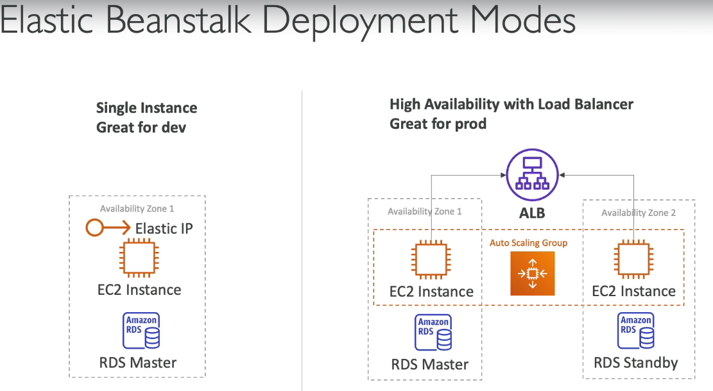

# ElasticBeanStalk
- fully managed Platform-as-a-Service (PaaS), similar to heroku 
- simplifies deploying and scaling web applications 
- automatically handles capacity provisioning, load balancing, auto-scaling, and health monitoring. 
- we just need to focus on code
- if we don't use beanstalk then we need to provision servers, security, networking
- create beanstalk - provide name, provide runtime env, upload your code, some other settings and you are good to go

  
 

### Creating ELB application
  
  
  
  
- Once the application is created, open the Domain, and your webapp is up and running
  

  

### AWS Code commit
- AWS's version of git
- private, secure, and can be integrated with other services

### AWS code build
- pull code from AWS code commit, and build it and create artifacts

### AWS code pipeline
- similar to bamboo, for CI/CD
- here we configure different steps to push the code to prod

**use AWS code commit to comit the code, AWS code build will build the code, and Codepipeline will deploy it to beanstalk (or any other AWS servcie, not just beanstalk)**

### CodeArtifact
- similar to npm registry or Maven repository. It's a managed artifact repository service that acts as a private repository for packages (npm, Python, Maven, etc.) 
