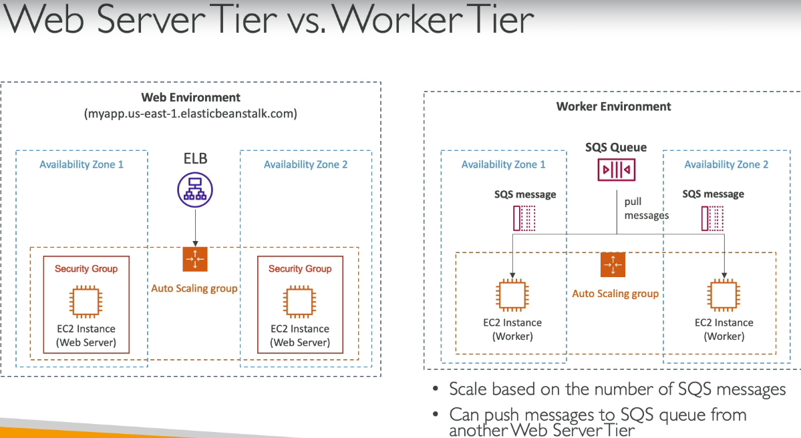
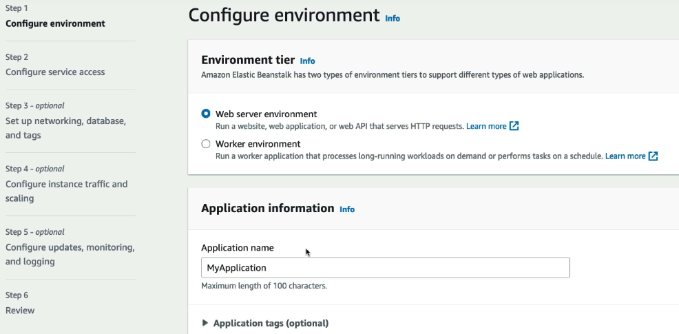
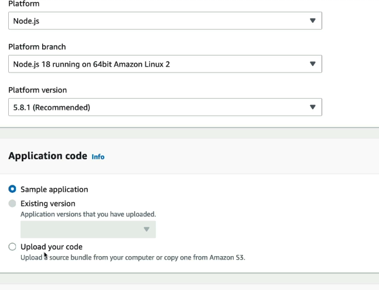
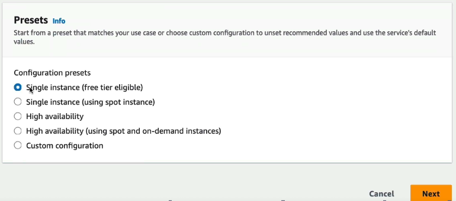
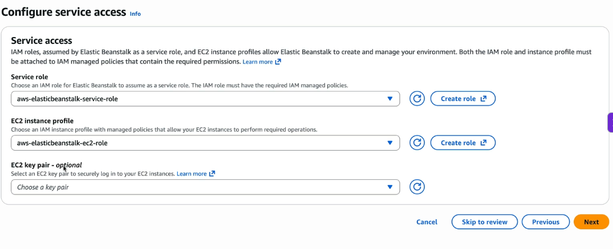
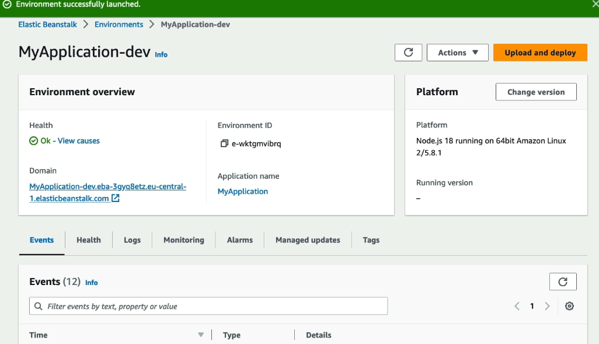
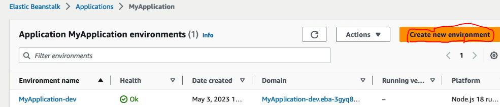
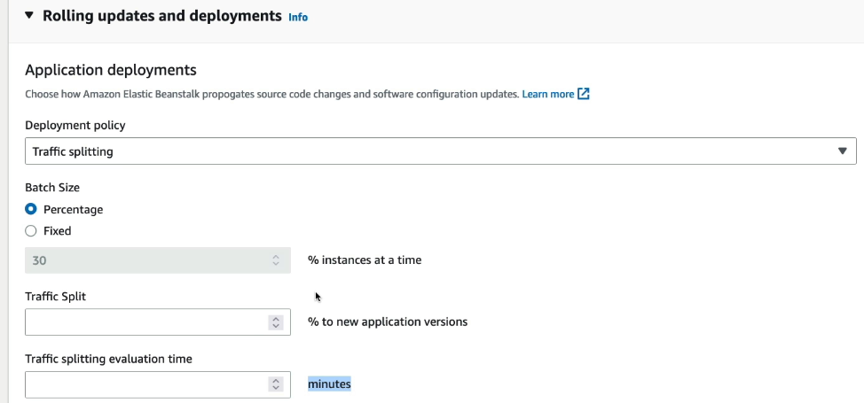
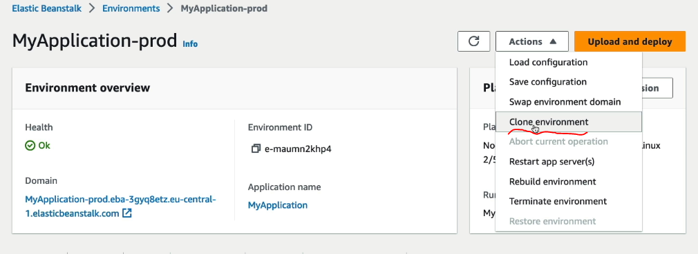
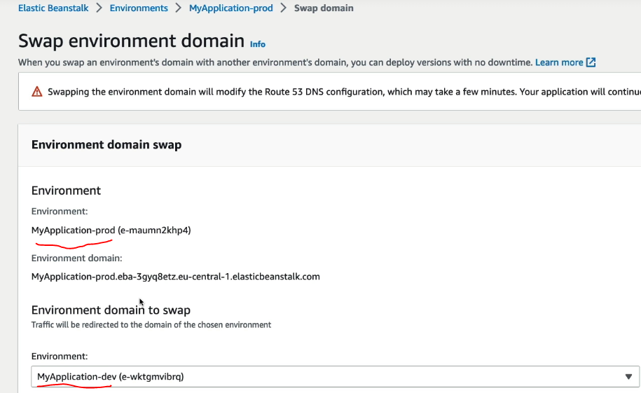

# ElasticBeanStalk
- fully managed Platform-as-a-Service (PaaS), similar to heroku 
- simplifies deploying and scaling web applications 
- automatically handles capacity provisioning, load balancing, auto-scaling, and health monitoring. 
- we just need to focus on code
- if we don't use beanstalk then we need to provision servers, security, networking
- create beanstalk - provide name, provide runtime env, upload your code, some other settings and you are good to go

 

### Creating ELB application
  
  
  
  
- Once the application is created, open the Domain, and your webapp is up and running
  

**There are additional settings which we have skipped in our demo app, such as creating / configuring ASG, EC2 instance types, storing logs to s3**

- click on create new environment, and with same codebase, create prod env and select all the option config for Elastic beanstalk 
  

### ELB-Based Deployment Modes

| Deployment Mode | How it works | Downtime | Extra Capacity Needed | Rollback | When to Use |
|----------------|-------------|----------|----------------------|----------|------------|
| **All at Once** | Replace all instances/tasks with new version at once | High | No | Difficult | Dev/Test environments where downtime is acceptable |
| **Rolling** | Replace a few instances/tasks at a time | Low | No | Moderate | Production apps where brief capacity reduction is acceptable |
| **Rolling with Additional Batch** | Launch new batch first, then terminate old batch | None | Yes | Easy | Production apps requiring zero downtime |
| **Immutable** | Launch an entirely new Auto Scaling Group, then switch traffic | None | High | Very Easy | Critical production workloads where safety is most important |
| **Traffic splitting / Canary** | Route a small % of ELB traffic to new version, then gradually increase | None | Medium | Easy | New features or risky releases needing real-user validation |
| **Blue/Green** | Run old (Blue) and new (Green) environments simultaneously and switch ELB traffic | None | High | Instant | Major releases, schema changes, easy rollback requirements |

- **Note blue/green is not available as option in beanstalk (see below on how to configure)**
---

### Quick Decision Guide

| Requirement | Recommended Mode |
|------------|-------------------|
| Fastest deployment | All at Once |
| Minimal extra cost | Rolling |
| Zero downtime | Rolling with Additional Batch |
| Safest deployment | Immutable |
| Instant rollback | Blue/Green |
| Test with small % of users first | Canary |

- **configuring deployment mode in Elastic beanstalk**
  

- **blue green deployment** - 
- click on swap environment - 
  
- internally this will swap the DNS of prod with DNS of dev, mkaing blue green deploy possible
  
- note for e.g. we have used dev and prod, ideally it would always be prod1 and prod2
- so prod1 is live, you push everything to prod2, extensive testing is done
- when ready, sway prod1's domin with prod2, now prod2 is live
- if anything fails swipe back

#### EB CLI
- apart from AWS CLI, we have AWS EBCLI, to manage ELB apps deployments
- mostly this is used in CI/CD pipeline to deploy app to beanstalk
- more on this in devops course

### EB lifecycle policy
- atmost beanstalk can store 1000 versions of you application
- if old versions not removed, we won't be able to deploy newer versions
- code for all app versions are stored in S3

### AWS Code commit
- AWS's version of git
- private, secure, and can be integrated with other services

### AWS code build
- pull code from AWS code commit, and build it and create artifacts

### AWS code pipeline
- similar to bamboo, for CI/CD
- here we configure different steps to push the code to prod

**use AWS code commit to comit the code, AWS code build will build the code, and Codepipeline will deploy it to beanstalk (or any other AWS servcie, not just beanstalk)**

### CodeArtifact
- similar to npm registry or Maven repository. It's a managed artifact repository service that acts as a private repository for packages (npm, Python, Maven, etc.) 
