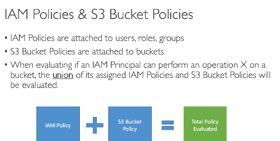
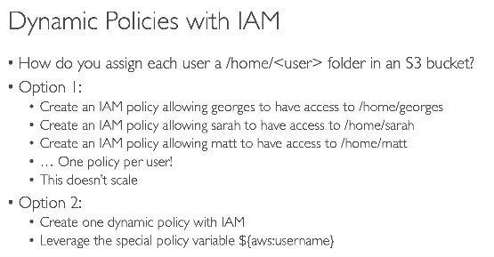
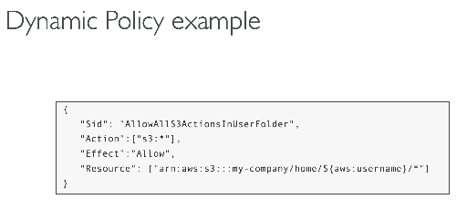
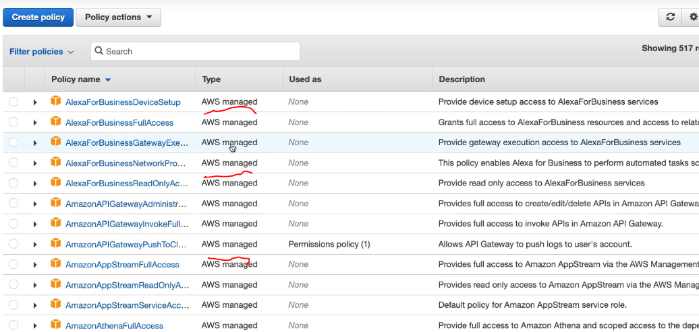
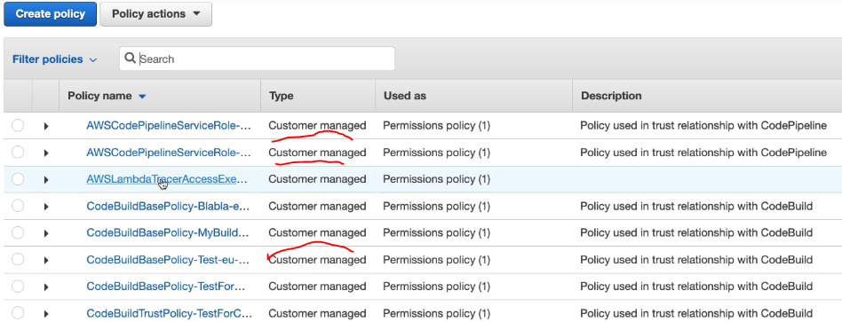
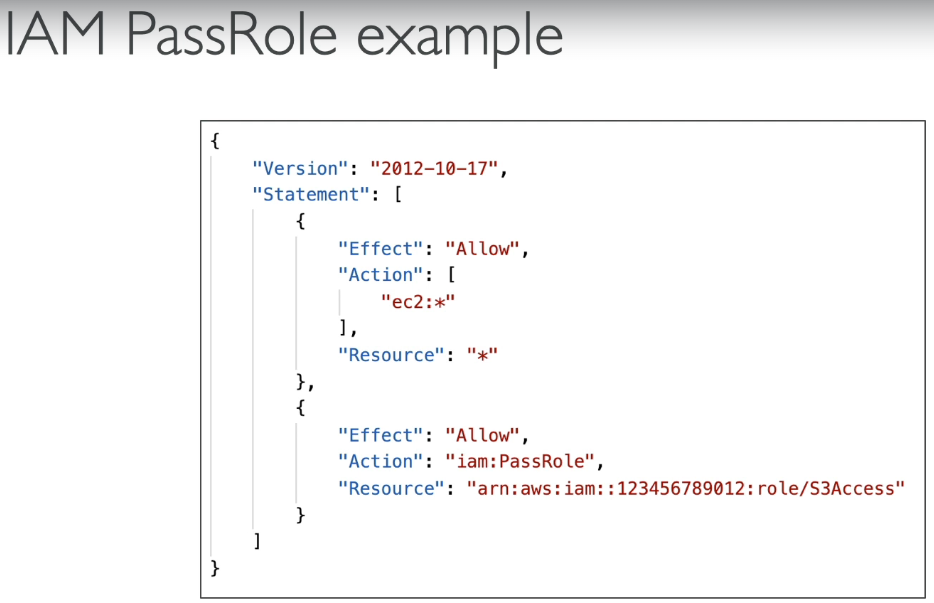

# IAM - Identity and Access Management (Global service)

## 4 ways to log in to AWS
1. Using root credentials - typically only one or two per organization
2. Using IAM credentials - one per employee in an organization
3. AWS CLI - using (accesskey)
4. AWS SDK - using accesskey

Note - the accesskeys are created under specific IAM user, so each IAM user will have its own accesskey and it will have same permissions as that of the IAM user

Each AWS account has one account ID. To log in via IAM, you will also have to provide the account ID, and then your IAM username and password.

Four sections in IAM

1. IAM User - A normal employee having access to AWS via IAM credentials
2. IAM policies - JSON documents that define permissions specifying which actions can be performed on which resources
3. IAM User groups - simplify permission management by assigning permissions to groups instead of individual users. 
- IAM policies are typically attached to **groups** (though they can also be attached directly to users).
- Users are added to groups such as **Developers**, **DevOps**, or **Marketing**, and inherit the group's permissions.
- A user can belong to multiple groups and receive permissions from all of them.
- Example: A Marketing group may have access to S3 but not EC2, while a DevOps group may have access to both.

4. IAM roles - These roles also consist of policies, and these roles are assigned to AWS services, so those AWS services can have access to other AWS services. E.g. for EC2 service to call IAM APIs, EC2 services needs to have an IAM role, so that IAM role has a IAMACCESS policy as allow

**IMP - IAM user - who have access to AWS account, IAM role - AWS resource (like EC2), IAM policies - set of rules which can be applied to both IAM user and IAM role**

## Sample IAM Policy Structure

Here's a sample IAM policy in JSON format, with comments explaining each field:

```json
{
  "Version": "2012-10-17",  // The version of the policy language. Use "2012-10-17" for most cases.
  "Statement": [  // An array of one or more policy statements.
    {
      "Effect": "Allow",  // Specifies whether the statement allows or denies access. Values: "Allow" or "Deny".
      "Action": "s3:GetObject",  // The AWS service actions that are allowed or denied. Can be a string or array of strings.
      "Resource": "arn:aws:s3:::mybucket/*"  // The AWS resources to which the actions apply. Can be a string or array of ARNs.
    }
  ]
}
```

**IAM policy priority**  -
- by default no user / IAM role has access to any service - DEFAULT_DENY
- if explicitly DENY is mentioned, then no access
- if ALLOW is present, then only access is granted to that service
- if BOTH ALLOW and DENY is there, then DENY will take precedence

  
- e.g. if IAM role from EC2 to access s3 is removed, EC2 instance can still access s3 if access is given via bucket policy (ARN of EC2 instance is added in the bucket policy, or ARN of role (which is attched to EC2) is added in the bucket policy)  
- similarly if IAM gives access to EC2 to ready s3 obj, but bucket policy is configured to deny read access, then even if EC2 has correct IAM, but still cannot access s3, because DNEY takes precedence

#### Dynamic policies in IAM
  
  


#### Different types of IAM policies
| Feature | AWS Managed Policy | Customer Managed Policy | Inline Policy |
|---------|---------------------|--------------------------|---------------|
| Created By | AWS | Customer | Customer |
| Editable | ❌ No | ✅ Yes | ✅ Yes |
| Reusable | ✅ Yes | ✅ Yes | ❌ No (1:1 with principal) |
| Attached To | Multiple Users/Roles/Groups | Multiple Users/Roles/Groups | Single User/Role/Group only |
| Automatically Updated | ✅ Yes (by AWS) | ❌ No | ❌ No |
| Best For | Common AWS permissions | Organization-specific permissions | One-off, unique permissions |
| Versioning Supported | ❌ No | ✅ Yes (up to 5 versions) | ❌ No |
| Deletion | Can be detached; AWS manages the policy | Can be detached/deleted independently | Deleted automatically when the principal is deleted |
| Typical Example | `AmazonS3ReadOnlyAccess` | `CompanyBillingReadOnly` | Temporary permissions for a specific user |

| Policy Type | Use When |
|-------------|----------|
| AWS Managed | Standard AWS permissions are sufficient. |
| Customer Managed | Multiple users/roles need the same custom permissions. |
| Inline | Permissions are unique to a single user, role, or group and should not be reused. |

- AWS managed policy
  
- Customer managed policy
  
- inline policy, is created under specific user, and can only be attched that that user

**iam:PassRole** - 
- for any AWS serivce to talk to any other service we need to attach a specific IAM role to that service
- however, doing this action also requires access, it's not just that anyone can attch any policy to any AWS service
- this access is granted by iam:PassRole
- see below, with below polciy attched to my user, then I can only attach s3 policies to EC2 instances, I cannot attach any other policy like lambda / dynamoDB to EC2 instances
  

**Trusted relationships** - Specifies **who is allowed to assume this role**.

Example:

```json
{
  "Version": "2012-10-17",
  "Statement": [{
    "Effect": "Allow",
    "Principal": {
      "Service": "ec2.amazonaws.com"
    },
    "Action": "sts:AssumeRole"
  }]
}
```

Meaning:

> **Only EC2 is allowed to assume this role.**

- trust relationship is the reason, why only sepcific policies can be attched to specific services

- **Trust Relationship** → *"Who is allowed to assume this IAM role?"*
- **`iam:PassRole`** → *"Who is allowed to assign this IAM role to an AWS service?"*

### IAM Access advisor
- now it's name is changed to last access
- works at user level, you goto a particular IAM user, and select access advisor
- it shows which service was last accessed by this user, we if few services are never accessed by this user, or were accessed long time back, we can remove this
- this aligns with AWS's least access previlage principle

### Cloudshell
- AWS CLI on cloud
- login to console, you will see option for cloudshell, then it will open terminal in the browser, and that terminal is already autenticated to AWS via the IAM role, that you are logged in with
- this service is not available for all the regions

### STS - (Security Token Service)
AWS STS is a service that provides temporary, short-lived security credentials (Access Key, Secret Key, Session Token) to users, applications, or AWS services instead of using long-term IAM credentials.

- **e.g. IAM role X from account A wants to access service Y from account B** 

AWS STS checks the **Trust Policy** of the target IAM Role before issuing temporary credentials.

#### Two Configurations Required

| Account | Configuration | Purpose |
|---------|---------------|---------|
| **Account A (Caller)** | IAM Policy | Allows the caller to invoke `sts:AssumeRole` |
| **Account B (Target)** | Role Trust Policy | Specifies who is allowed to assume the role |

> **Both must allow the request.**

---

#### 1. Account B (Target) - Trust Policy

Suppose:

- **Account A:** `111111111111`
- **Account B:** `222222222222`

Role in Account B:

```json
{
  "Version": "2012-10-17",
  "Statement": [
    {
      "Effect": "Allow",
      "Principal": {
        "AWS": "arn:aws:iam::111111111111:root"
      },
      "Action": "sts:AssumeRole"
    }
  ]
}
```

Meaning:

> "I trust identities from Account A to assume this role."

---

#### 2. Account A (Caller) - IAM Policy

Attach this policy to the IAM User or IAM Role:

```json
{
  "Effect": "Allow",
  "Action": "sts:AssumeRole",
  "Resource": "arn:aws:iam::222222222222:role/MyRole"
}
```

Meaning:

> "You are allowed to call `sts:AssumeRole` on this role."

#### Complete Flow

```text
                Account A
        +----------------------+
        | IAM User / IAM Role  |
        +----------------------+
                  |
                  | IAM Policy
                  | Allow sts:AssumeRole
                  |
                  v
        +----------------------+
        |      AWS STS         |
        +----------------------+
                  |
                  | Checks Trust Policy
                  |
                  v
                Account B
        +----------------------+
        |      IAM Role        |
        +----------------------+
        | Trusts Account A     |
        +----------------------+
                  |
                  v
     Temporary Credentials Returned
```

#### Calling STS

```bash
aws sts assume-role \
    --role-arn arn:aws:iam::222222222222:role/MyRole \
    --role-session-name demo
```

Response:

```json
{
  "Credentials": {
    "AccessKeyId": "...",
    "SecretAccessKey": "...",
    "SessionToken": "..."
  }
}
```

> **Cross-account AssumeRole succeeds only when BOTH the IAM Policy and the Trust Policy allow it.**

| STS API | Primary Purpose | Authentication Input | Common Use Case | Returns |
|----------|-----------------|----------------------|-----------------|----------|
| `AssumeRole` | Assume an IAM Role | AWS credentials (IAM User/Role) | Cross-account access, EC2, Lambda, ECS | Temporary credentials |
| `GetSessionToken` | Temporary credentials for an IAM User | IAM User credentials (optionally MFA) | MFA-enabled CLI/API access | Temporary credentials |
| `AssumeRoleWithWebIdentity` | Authenticate using an OIDC/JWT token | Web Identity token (Google, GitHub, Kubernetes, Cognito, etc.) | Mobile apps, EKS IRSA, GitHub Actions | Temporary credentials |
| `AssumeRoleWithSAML` | Authenticate using a SAML assertion | SAML assertion from an Identity Provider | Enterprise SSO (ADFS, Okta, Azure AD, etc.) | Temporary credentials |
| `GetFederationToken` | Temporary credentials for federated users | IAM User credentials | Legacy federation scenarios with custom identity brokers | Temporary credentials |

### AWS Managed Active Directory
**Types**  
| Directory Type | Managed By | Connects To | Best Use Case | Supports Trust | Internet Required |
|----------------|------------|-------------|---------------|----------------|-------------------|
| **AWS Managed Microsoft AD** | AWS | Native Microsoft Active Directory | Enterprise workloads on AWS (EC2, FSx, WorkSpaces, RDS SQL Server) | ✅ Yes | ❌ No |
| **AD Connector** | Your on-premises AD | Existing on-premises Active Directory | Use existing AD without storing directory data in AWS | N/A (Proxy only) | Connectivity to on-prem (VPN/Direct Connect) |
| **Simple AD** | AWS | Samba-based directory | Small applications, development, testing | ❌ No | ❌ No |


| Requirement | Recommended Option |
|------------|--------------------|
| Need a fully managed Microsoft Active Directory in AWS | **AWS Managed Microsoft AD** |
| Already have an on-premises Active Directory and don't want to duplicate it | **AD Connector** |
| Need a low-cost directory for development or testing | **Simple AD** |

### AWS Identity center
- service that provides centralized access management and Single Sign-On (SSO) for multiple AWS accounts and business applications.
- Let's say you have 4 different AWS accounts. then instead of remembering creds for all 4 accounts, create login under AWS Identity center, so you always login to AWS Identity cetner, from there you can login directly to any management console using only one login creds
 
