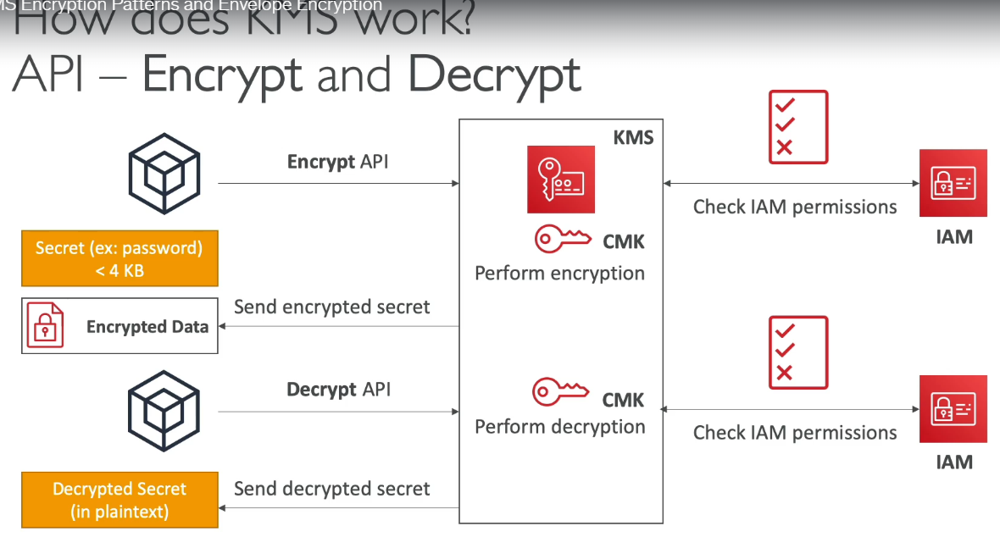
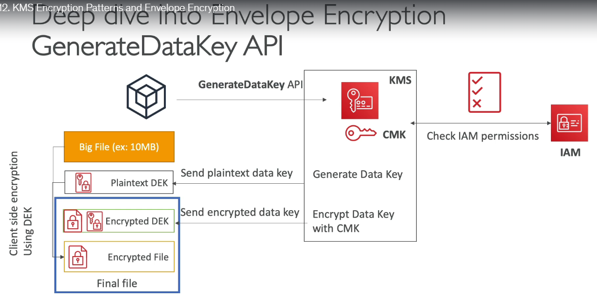
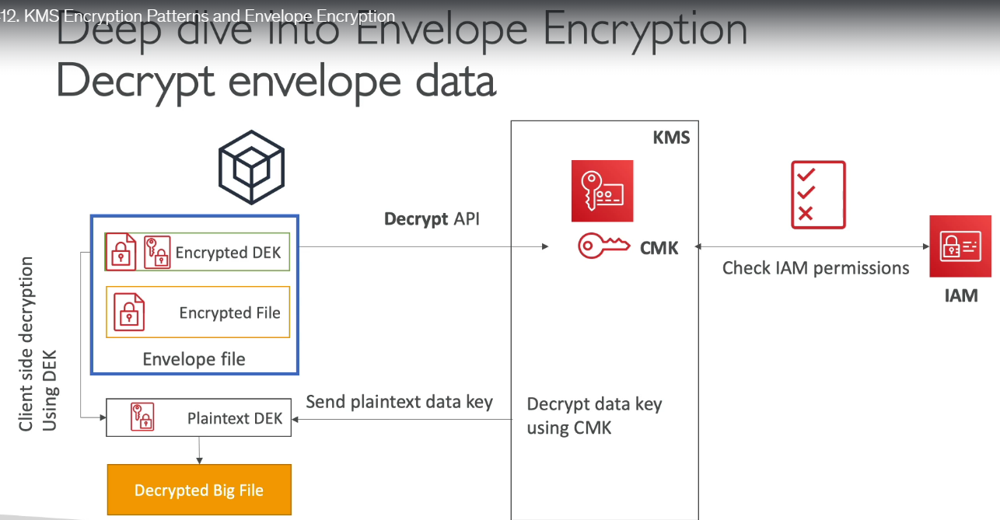
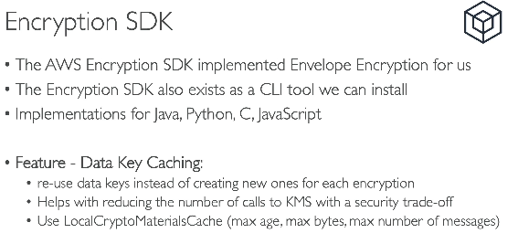
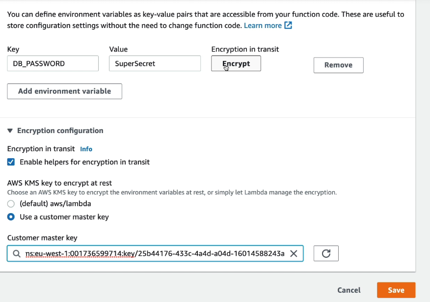
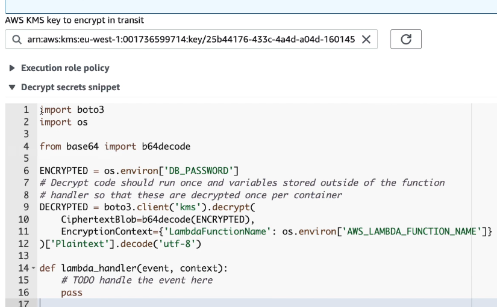
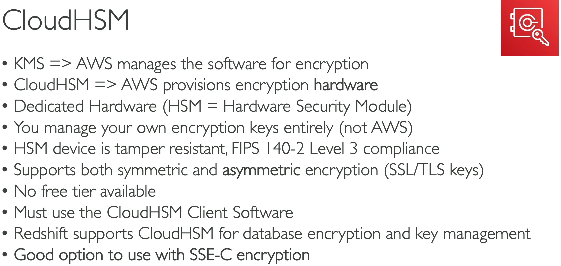
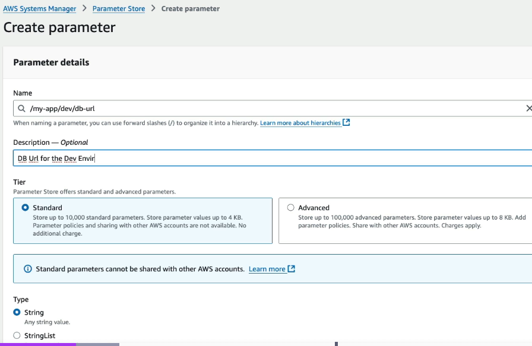
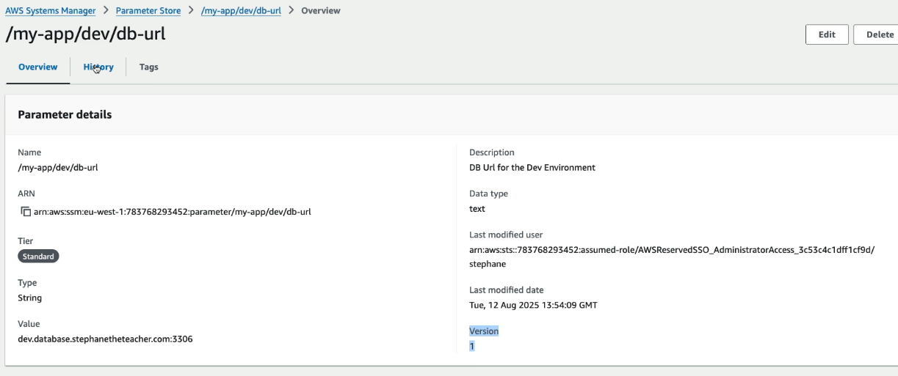

# KMS - Key Management Service
- AWS will manage encryption keys for us
- fully intergated with IAM

## KMS key types

| Key Type | Who Owns & Manages the Key | Can You View the Key Material? | Pricing | Best Use Case | Notes |
|----------|-----------------------------|--------------------------------|---------|---------------|------|
| **AWS Owned Key** | AWS | ❌ No | **Free** | Default encryption for many AWS services | Used automatically by AWS; not visible or manageable by customers. |
| **AWS Managed Key** (`aws/service-name`) | AWS (per account/service) | ❌ No | **Free** (pay only for KMS API requests) | Simple encryption for a specific AWS service (e.g., S3, EBS, RDS) | Automatically created and rotated by AWS. |
| **Customer Managed Key (CMK)** | Customer | ❌ No (unless imported or external) | **Paid** (monthly key fee + API requests) | Full control over encryption, permissions, rotation, auditing | Recommended for production workloads requiring fine-grained control. |
| **Imported Key Material** | Customer | ✅ Yes (you generate and import it) | **Paid** | Bring Your Own Key (BYOK), compliance requirements | If imported key material expires or is deleted, the CMK becomes unusable until re-imported. |
| **External Key Store (XKS)** | Customer (external HSM) | ✅ Yes (stored outside AWS) | **Paid** (KMS charges + external HSM costs) | Strict compliance where keys must never reside in AWS | Key operations are performed by your external HSM. |

## KMS Key policy
- similar to bucket policy

A **Key Policy** is a **resource-based policy attached directly to a KMS key** that controls **who can use and manage that specific key**.

> **1-liner:** A Key Policy defines **who can access and manage a particular KMS key.**

### Example

Allow an IAM role to encrypt and decrypt data using the KMS key.

```json
{
  "Version": "2012-10-17",
  "Statement": [
    {
      "Sid": "AllowAppRoleToUseKey",
      "Effect": "Allow",
      "Principal": {
        "AWS": "arn:aws:iam::123456789012:role/AppRole"
      },
      "Action": [
        "kms:Encrypt",
        "kms:Decrypt",
        "kms:GenerateDataKey"
      ],
      "Resource": "*"
    }
  ]
}
```

## How KMS works
  
1. We call KMS encrypt API (via CLI / SDK) by passing the Customer Managed Key (CMK) (First we need to create CMK or any other Key in KMS, and assign Key policy to it) and data that needs to be encrypted <= 4KB
2. The KMS service will check if the user / role has access to use the Key 
3. If yes, then KMS will do encryption, and will share us the encrypted data
4. To decrypt, we call KMS decrypt API (via CLI / SDK), and pass the encrypted data
5. KMS will take the encrypted data, it will figure out on it's own which CMK was used to encrypt the data
6. It will check if the user / IAM role has access to decrupt the data
7. If yes, it will share the decrypted data

- **Notice - how using KMS, we can encrypt and decrypt data only upto 4KB, but not more, but why? because encrypt / decrypt is CPU intensive, and if we call KMS, to encrypt MB or GBs of file, it will be very costly, and main purpose of KMS service is to manage KEYS**  
- **But, then how to encrypt / decrypt data sizes in MBs / GBs** - ANS = **Envelope Encryption using GenerateDataKey API**  

**STEP 1 - encrypting data using Envelope encryption**  
  
- this time we call GenerateDataKey API, instead of encrypt API, passing CMK
- this time we don't pass the data that needs to be encrypted
- again IAM check happens
- GenerateDataKey API will return 2 things (1. plaintext data key (DEK), encrypted data key(DEK))
- now we use the plaintext DEK (plaintext DEK is a temporary key, which neither the client or KMS will store after encryption), to encrypt the data on the client side
- now we have plaintext DEK, and data is also with us (client), now we can encrypt data whose size is in MBs/GBs, because encryption is hapenning client side, so client's CPU is used to encrypt the data
- now we have the final file, which has encrypted data and the encrypted DEK

**STEP 2 - decrypting data using Envelope encryption**
  
- now we call DecryptAPI, note this is same as normal Decrypt API, and we are passing just the encrypted DEK (which is < 4KB), so we are good 
- again IAM check happens
- we get the decrypted DEK, which is nothing but the plain text DEK
- use this plain text DEK to decrypt the file on the client side

  

#### E.g. Usecase - encrypt DB_PASSWORD env variable of Lambda using KMS
- we can store DB password in lambda env vars, but it is not secure, anyone having access to lambda config can see the DB password
- so create a KMS key and when adding env var to kmabda click on encrypt and provide the ARN of KMS key we created
  
- once you click on encrypt the value of that env var (SuperSecret), will show the encrypted value and not the plain text value

- to decrypt the value in lambda code, call the KMS's decrupt API call by passing the encrypted text
  

### S3 bucket key

> **1-liner:** An **S3 Bucket Key** reduces the cost of **SSE-KMS** encryption by minimizing the number of calls made from S3 to AWS KMS.

Without Bucket Keys:

Every object upload/download may require S3 to call KMS.

```text
Upload Object
      │
      ▼
S3
      │
      ▼
KMS Encrypt Data Key

Upload Object
      │
      ▼
S3
      │
      ▼
KMS Encrypt Data Key

...every object...
```

This results in:

- More KMS API calls
- Higher KMS cost
- Slightly higher latency


Instead of contacting KMS for every object, S3 derives object encryption keys using the bucket key.

Result:

- Much fewer KMS API calls
- Lower cost
- Same security model

---

#### Working Flow

```text
Client
   │
Upload Object
   │
   ▼
S3
   │
   │ First object only
   ▼
AWS KMS
   │
Generate Bucket Key
   │
   ▼
S3 stores Bucket Key securely
   │
   ├── Encrypt Object 1
   ├── Encrypt Object 2
   ├── Encrypt Object 3
   └── ...
```
- the option to enable s3 bucket to use s3 bucket key is available when creating s3 bucket

## Cloud HSM
- **AWS CloudHSM** is a **dedicated hardware security module (HSM)** that gives **you full control over creating and managing your encryption keys**.
- Unlike AWS KMS, **you own and manage the HSM**, making it suitable for applications with strict security or compliance requirements.  
  

## AWS Systems Manager (SSM) Parameter Store

> **SSM Parameter Store is a fully managed service for securely storing configuration values and secrets, with optional KMS encryption and IAM-based access control.**

#### What can it store?

- Database passwords
- API keys
- JWT secrets
- Connection strings
- Environment variables
- Feature flags
- Application configuration


#### Types of Parameters

| Type | Description | Encryption |
|------|-------------|------------|
| `String` | Plain text value | ❌ No |
| `StringList` | Comma-separated list of strings | ❌ No |
| `SecureString` | Sensitive values encrypted using AWS KMS | ✅ Yes |

---

### Features

| Feature | Description |
|---------|-------------|
| Secure storage | Stores configuration and secrets centrally |
| KMS integration | Encrypts `SecureString` parameters |
| Versioning | Every update creates a new version |
| IAM integration | Control access using IAM policies |
| Hierarchical paths | Organize parameters like folders (`/prod/db/password`) |
| No servers | Fully managed service |

---

### Example Parameter Hierarchy

A **parameter hierarchy** organizes parameters into **folder-like paths** using `/`.

Example:

```text
/prod/db/password
/prod/db/username
/prod/api/url

/dev/db/password
/dev/db/username
/dev/api/url
```

It is similar to organizing files into directories.

---

#### Why is it needed?

Without hierarchy:

```text
db-password
db-username
api-url
jwt-secret
prod-db-password
dev-db-password
test-db-password
```

As the number of parameters grows, they become difficult to manage.

With hierarchy:

```text
/prod
    /db
        username
        password
    /api
        url

/dev
    /db
        username
        password
```

Everything is neatly organized.

### Typical Flow

```text
Application
      │
      ▼
SSM Parameter Store
      │
      │ (Decrypt using KMS if SecureString)
      ▼
Returns Parameter Value
```

---

### Example CLI

Store:

```bash
aws ssm put-parameter \
  --name "/prod/db/password" \
  --value "MyPassword123" \
  --type SecureString
```

Retrieve:

```bash
aws ssm get-parameter \
  --name "/prod/db/password" \
  --with-decryption
```

---

### Minimal Node.js

```javascript
import {
  SSMClient,
  GetParameterCommand
} from "@aws-sdk/client-ssm";

const ssm = new SSMClient({ region: "us-east-1" });

const { Parameter } = await ssm.send(
  new GetParameterCommand({
    Name: "/prod/db/password",
    WithDecryption: true
  })
);

console.log(Parameter.Value);
```

  
  

---

## AWS Secrets Manager

> **1-liner:** AWS Secrets Manager is a **fully managed service for securely storing, retrieving, and automatically rotating secrets**.
- **this does same job as SSM**, then why to use?
- this is newer service
- and we can set automatic key rotation policy
- very well integrated with RDS

---

# What can it store?
- same as parameter SSM

#### Features
- mostly same as SSM parameters, only key rotation is new here
#### How Secret Rotation Works

```text
Application
      │
      ▼
Secrets Manager
      │
      │ (Secret nearing rotation date)
      ▼
Lambda Rotation Function
      │
      │ Change password in database
      ▼
Database
      │
      ▼
Update Secret in Secrets Manager
```

Applications continue reading the latest version of the secret.

---


#### Typical Flow
- same as SSM

#### Example Secret

```json
{
  "username": "admin",
  "password": "MySecurePassword123"
}
```

---

#### Minimal Node.js

```javascript
import {
  SecretsManagerClient,
  GetSecretValueCommand
} from "@aws-sdk/client-secrets-manager";

const client = new SecretsManagerClient({
  region: "us-east-1"
});

const { SecretString } = await client.send(
  new GetSecretValueCommand({
    SecretId: "prod/db"
  })
);

console.log(JSON.parse(SecretString));
```

### Parameter Store vs Secrets Manager

| Feature | Parameter Store | Secrets Manager |
|---------|-----------------|-----------------|
| Store configuration | ✅ | ✅ |
| Store secrets | ✅ | ✅ |
| KMS encryption | ✅ | ✅ |
| Automatic secret rotation | ❌ | ✅ |
| Versioning | ✅ | ✅ |
| Cost | Free (Standard tier) / Low cost (Advanced) | Paid |


