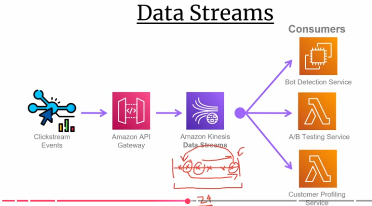
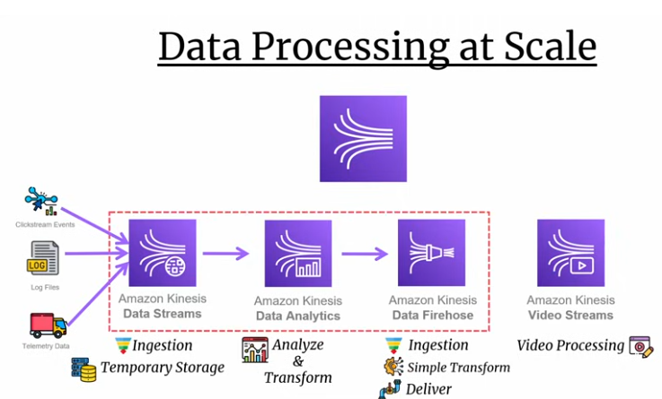
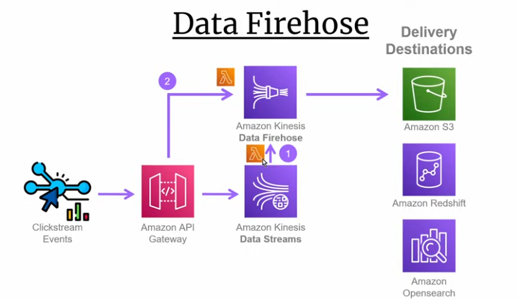
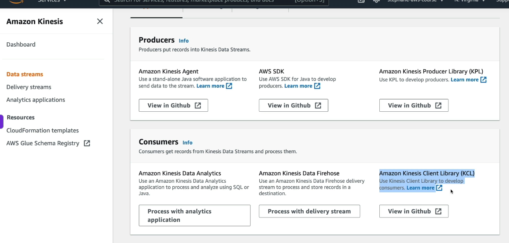
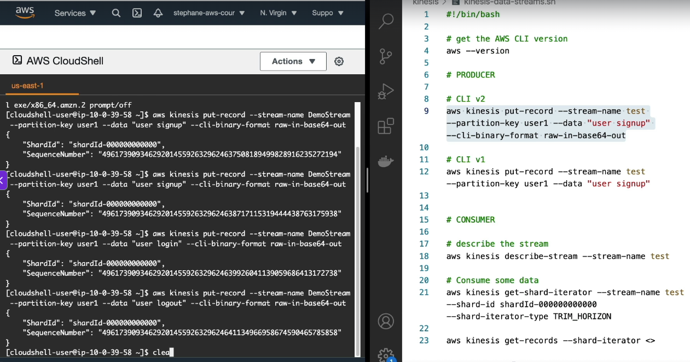
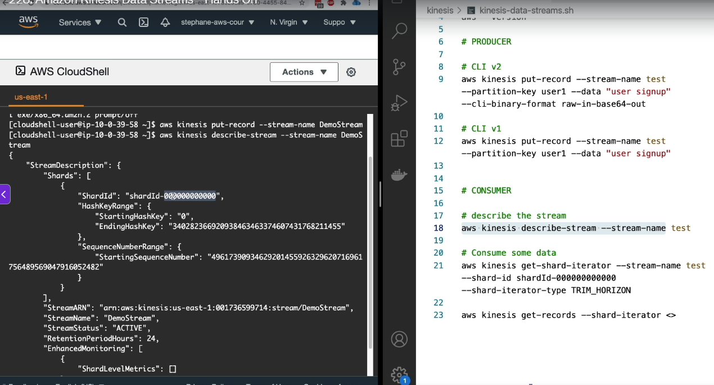
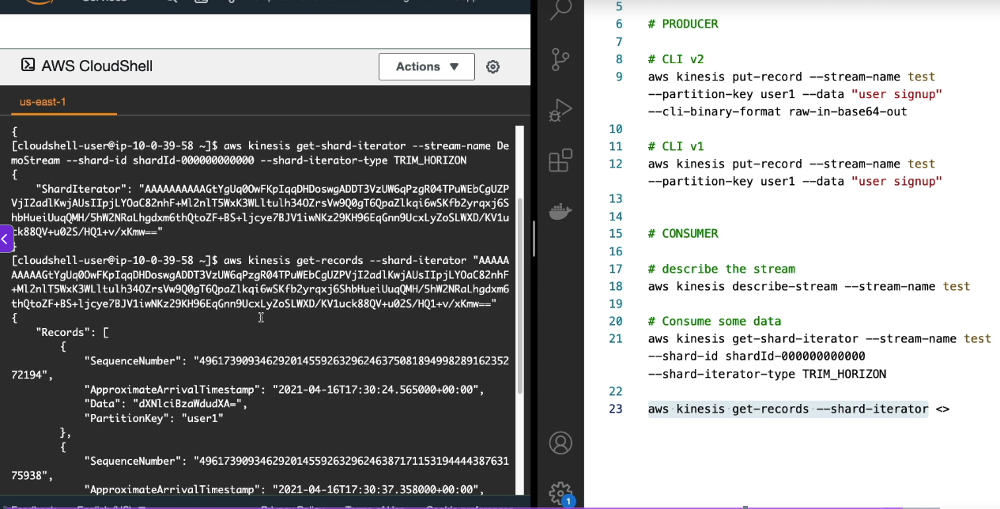

# Kinesis
**Amazon Kinesis Data Streams (KDS)** is a **real-time data streaming and processing service** that continuously ingests, stores, and processes streams of data from multiple producers, allowing multiple consumers to independently read and replay the same data.

One liner - 

> **Kinesis is a durable, ordered, append-only stream of events that allows multiple independent consumers to process and replay the same data in real time.**

#### SNS SQS (Kinesis aka Kafka) - SNS send mgs to multiple subscribers and msg removed, SQS - Consumers will have to POLL msgs (unlike SNS which sends msgs), in SQS msg is consumed by only one consumer (use this to distribute workloads among mutliple consumers), Kinesis (Kafka) - store / process real-time events (which are appendonly), unlike SQS (where only 1 consumer can conume msgs), in Kinesis multiple consumers can consume message (consumers will have to poll), and unlike SNS where message once delivered to all gets deleted, in Kinesis, msgs stored upto 1 yr, plus, consumers can consume messages at their own pace, and can REPLAY msgs, where as in SNS, all subscribers recieve msgs at the same time
---
### What is a Real-time Data Streaming / Processing Service?
A real-time data streaming service processes a **continuous flow of events** as they occur, instead of processing them in batches.
### Example: E-commerce Order Processing
Whenever a user places an order:
```json
{
  "orderId": "O123",
  "amount": 500
}
```
the event should be processed by:

- Analytics Service → Generate business metrics
- Fraud Detection Service → Detect suspicious transactions
- Dashboard Service → Show live order counts
- Data Warehouse Loader → Persist data for reporting
And this should happen **immediately**, as the events occur.
---
## Core Architecture
```text
Web App / Mobile App
    │
    └──► OrderPlaced Event
                │
                ▼
        +----------------------+
        |   Kinesis Stream     |
        +----------------------+
                │
      ┌─────────┼─────────┐
      ▼         ▼         ▼
Analytics   Fraud Detection   Dashboard
 Service        Service        Service
```
Important:
- All consumers can read the **same records**.
- Consumers are **independent**.
- Consumers maintain their **own progress**.
---
### The Most Fundamental Concept: Append-only Log
Kinesis stores events as an **append-only log**.
```text
Kinesis Stream
Record1 ──► Record2 ──► Record3 ──► Record4 ──► Record5 ──► ...
```
New records are always:
```text
APPENDED →
```
They are never:
- Modified ❌
- Overwritten ❌
- Inserted in the middle ❌

### Why is this important?
- Historical events remain available.
- Consumers can replay old records.
- Event history is preserved.
- Consumers can resume after failures.
---
### Records
Each event written to Kinesis is called a **Record**.
```text
{
  partitionKey,
  sequenceNumber,
  data
}
```
Example:
```json
{
  "partitionKey": "Customer123",
  "sequenceNumber": "495859384759",
  "data": {
    "orderId": "O123",
    "amount": 500
  }
}
```
#### Record fields
- **partitionKey**
  - Determines which shard stores the record.
- **sequenceNumber**
  - Unique ordered identifier within a shard.
- **data**
  - Actual business payload.
---

### Shards
A Stream is divided into multiple **Shards**.
A shard is the unit of:
- Throughput
- Storage
- Ordering
```text
Kinesis Stream  
┌─────────────────┐    ┌─────────────────┐
│    Shard 0      │    │    Shard 1      │
│ M1 → M2 → M3    │    │ M4 → M5 → M6    │
└─────────────────┘    └─────────────────┘
```
---
#### Why Shards?
Suppose your website receives:
```text
1 Million orders / second
```
One machine cannot process all of them.
Kinesis distributes records:
```text
Shard 0 ──► 100K records/sec
Shard 1 ──► 100K records/sec
Shard 2 ──► 100K records/sec
...
```
Benefits:
- Spread load across machines.
- Increase throughput.
- Preserve ordering within a shard.
- Scale horizontally by adding more shards.
---

### Partition Key
Producer writes:
```text
putRecord(
    partitionKey = customerId,
    data = ...
)
```
Internally:

```text
customerId ──► hash(customerId) ──► Choose Shard ──► Store Record
```
Notice:

```text
Same customerId ──► Same shard ──► Ordered processing
```
---

### Ordering Guarantee
Within a shard:
```text
Shard 0
M1 ──► M2 ──► M3
↓
Consumer receives
M1 ──► M2 ──► M3
```
Ordering is guaranteed.
Across shards:
```text
Shard 0           Shard 1
M1 ──► M3         M2 ──► M4
```
No global ordering.
---
### Multiple Consumers
```text
Kinesis Stream
M1 ──► M2 ──► M3 ──► M4 ──► M5
Analytics
M1 ──► M2 ──► M3 ──► M4 ──► M5
Fraud Detection
M1 ──► M2 ──► M3 ──► M4 ──► M5
Dashboard
M1 ──► M2 ──► M3 ──► M4 ──► M5
```
All consumers can read the same records independently.

Example:
```text
Analytics        ──► Processed till M1000
Fraud Detection  ──► Processed till M500
Dashboard        ──► Processed till M950
```
---

### Replaying Messages (Most Important Feature)
Suppose the stream contains:

```text
Kinesis Stream
M1 ──► M2 ──► M3 ──► M4 ──► M5
```
Analytics:

```text
M1 ──► M2 ──► M3 ──► M4 ──► M5
                          ↑
                 Last processed
```
After 6 months:

```text
Recommendation Engine
```
is introduced.
It can start from:
```text
M1 ──► M2 ──► M3 ──► M4 ──► M5
```
and process the entire history.

This is called:
> **Replay**

---

#### How does Replay work?
Each consumer stores:
```text
Last processed sequence number
```
Example:
```text
Analytics
Sequence Number = 1000
```
If Analytics crashes:
```text
Crash ──► Restart ──► Resume from ──► Sequence Number = 1001
```
If a new consumer starts:

- **TRIM_HORIZON**
  - Read from oldest available record.
- **LATEST**
  - Read only new incoming records.
- **AT_TIMESTAMP**
  - Read from a specific timestamp.
---

#### Data Retention
Records are retained for:

```text
Default ──► 24 hours
Maximum ──► 365 days
```
During this period:

- Records remain immutable.
- Multiple consumers can read them.
- Consumers can replay them multiple times.

---
---
# The 5 Fundamental Principles of Kinesis
1. **Append-only**
   - Records are only added, never modified.
2. **Partitioning**
   - Records are distributed across shards using partition key.
3. **Ordering**
   - Ordering is guaranteed within a shard.
4. **Replayability**
   - Consumers can re-read old records.
5. **Independent Consumers**
   - Multiple consumers can read the same stream independently.
---

**Another example** - real time data processing /streaming, we do analytics of clicks on websites, web sote has 1000s of clickable buttons / links, and 1000s of clients are clicking and we want to peform analytics  
  
**here notice importance of replaying the messages** - if customer profile service goes down, or we pushed some bug where we did not analyse events properly, Kinesis alloow is to replay all the events for customer profile services for a given point in time  

| Aspect | SNS | SQS | Kinesis Data Streams | RabbitMQ | Kafka |
|---|---|---|---|---|---|
| **Actual purpose it solves** | Broadcast an event to multiple subscribers | Distribute work among consumers | Real-time event streaming with replay | General-purpose message broker | Distributed event streaming platform |
| **Pattern** | Pub/Sub | Distributed Queue | Primarily Pub/Sub (queue-like within consumer apps) | Can act as both | Primarily Pub/Sub (queue-like within consumer groups) |
| **Push or Pull** | Push | Pull | Pull | Primarily Push | Pull |
| **How delivery works** | SNS actively delivers to subscribers | Consumers poll the queue | Consumers poll the stream using checkpoints | Broker pushes messages over TCP connection | Consumers pull using offsets |
| **Equivalent to** | Closest to RabbitMQ Fanout Exchange | Closest to RabbitMQ Queue | Kafka | SNS + SQS combined capabilities | Kinesis Data Streams |
| **Message retention** | Temporary delivery | Up to 14 days | Up to 365 days | Usually consumed & removed after ACK | Configurable, often days/months |
| **Replay old messages** | ❌ No | ❌ No | ✅ Yes | ⚠️ Limited | ✅ Yes |
| **Multiple consumers get same message** | ✅ Yes | ❌ No | ✅ Yes | ✅ Yes (Pub/Sub mode) | ✅ Yes |
| **Independent consumer progress** | ❌ No | ❌ No | ✅ Yes | ⚠️ Limited | ✅ Yes |
| **Ordering guarantee** | No | FIFO queues only | Within a shard | Queue dependent | Within a partition |
| **Typical use cases** | OrderPlaced, UserRegistered notifications | Image processing, Email sending, Background jobs | Clickstreams, IoT, Logs, Real-time analytics | Enterprise messaging, RPC, Work queues | Event sourcing, Analytics, Logs, Streams |
| **Unique ability** | Simple fan-out to many AWS services with almost zero setup | Fully managed queue with virtually unlimited scale and no server management | Replay historical events while allowing multiple consumers to progress independently | Supports many messaging patterns/protocols (AMQP, MQTT, STOMP, etc.) | Massive-scale event streaming with replay, ecosystem, and cross-platform portability |

## Kinesis components
| Component | One-liner |
|---|---|
| Kinesis Data Streams (KDS) | Real-time streaming service for ingesting, storing, and replaying ordered streams of data. |
| Kinesis Data Firehose | Fully managed service to deliver streaming data to destinations like S3, Redshift, OpenSearch, or Splunk. |
| Kinesis Data Analytics | Service to process and analyze streaming data using SQL or Apache Flink. so it can do joins on multiple events at runtime, as and when events are received |
| Kinesis Video Streams | Service to ingest, store, and process video streams from cameras and devices. |

  

- Note - KDS is not a queue, it is **distributed, durable, append-only event log**  
- **Data Firehose** - server 2 purpose - (batching and data transformation)
1. Batching
  
- for every click event below, it is not ideal to call the s3 / any other service to store the record.
- Firehose will batch the records (based on duration (like batch all records of last 5 mins, or based on data (batch all records, where paylod is not >=5BM)), in AWS console when creating Firehose, these are config properties with names - Buffer size (paylod - 5MB) and Buffer interval respectively(5 mins)), and call S3 API, only once per batch
2. provide APIs where we can call APIs to transform the data before storing it to delivery destinations like S3
- Firehose can be configure with only 1 delivery destination only (e.g. either s3 / redshift or something else, but not mutliple), Note the delivery destination can also be a custom HTTP endpoint (our custom app)
- note it is not necessary for producers to send data to KDS, then can also send data directly to Firehose, but we need to know that KDS can have multiple consumers, but not Firehose, and reply of msgs is possible in Firehose, only in KDS

- **Kinesis Data Analytics** - using Apache flink, it can 
1. Perform joins at runtime as and when the events are received
2. Time window analysis - e.g. every 5 mins, tell me my top 10 leader boards, this can be done in this Kinesis data analysis tool using Apache flink

## Kinesis producers and consumers
- Producers are the one's who will send data to Kinesis stream / Firehose
- consumers will get msgs from KDS and process it
  
note - lambda can also be a consumer of KDS  

#### Using AWS CLI commands to produce and consume messages to KDS
1. Produce msgs to KDS
  
2. Consuming (describing the stream, getting metadata of KDS stream, not the actual records)
  
2. Consuming data from KDS (first get the shard iterator, then get the shard records)
  
- the data key in the records array has the actual data, which is base64 encoded, you can decode it and get the actual data  
- once all msgs are consumed, it will give us the NextShardIterator, so the consumer knows from which record to resume consuming again from KDS
