# Lambda
- virtual functions
- run and pay on-demand
- - Scaling is automatic: if the number of incoming requests increases, AWS Lambda automatically creates additional concurrent Lambda executions to handle the load.
- lambda pricing is very cheap, hence popular
- popular usecase - serverless cron jobs (schedule AWS Eventbridge every 24 hr, which will trigger lambda), why lambda? you pay only for 10 mins (assuming job duration is 10 mins only), if we use EC2 and schedule corn job manually, we have to pay for full 24hrs, even if the job is not running, but EC2 is still up (lambda is only not recommended when batch job duration is > 15 mins or so)

## 3 ways to invoke lambda
### 1. Lambda Synchronous Invocation

- Caller waits for Lambda to finish execution and receive the response.
- Used when an immediate result is required.

Examples:
- API Gateway → Lambda
- Application → Lambda (Invoke API with RequestResponse)

**Other services which invoke lambda synchronously** - 
| Service | Notes |
|----------|----------|
| Amazon API Gateway | Waits for Lambda response and returns it to the client |
| Application Load Balancer (ALB) | Forwards request to Lambda and waits for response |
| Amazon Cognito (User Pool Triggers) | Authentication flows wait for Lambda result |
| AWS AppSync | GraphQL resolver waits for Lambda response |
| CLI / SDK | invokes lambda synchronously |
| Custom Application / SDK | Using Lambda Invoke API with `InvocationType=RequestResponse` |

### 2. Lambda Asynchronous Invocation
- Caller does NOT wait for Lambda execution to complete.
- behind the scenes, S3, SNS, Cloudwach events push the messages to internal labda queue, which then invokes lambda
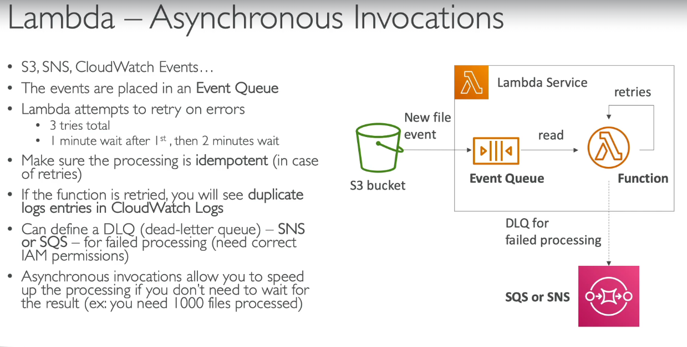  
- for async invocation where lambda fails for X amount of time, we can have DLQ which will send msgs to SNS
- note that this DLQ is set on Lambda and not on SNS
- note we cannot connect lambda directly to SQS, because unlike SNS, SQS doesnot push messages to consumers (consumers need to poll), and lambda cannot be run on its own, some service needs to trigger it, and SQS does not trigger. Solution - Eventsource mapping (see below)

### 3. Lambda Event source mapping invocation
- Some services (KDS, SQS, Dynamo DB streams) don't push events directly to Lambda.
- Instead, Lambda must continuously poll them for new messages/records.
- A Lambda Event Source Mapping is a configuration that tells Lambda to poll an event source and invoke the function when new records arrive.
- here also we can have failed messages and set a DLQ, but this time DLQ needs to be set in SQS, because with eventsource mapping, lambda is invoked synchronously, and DLQ on lambda can be set only when lambda is invoked async

**How it works** -  
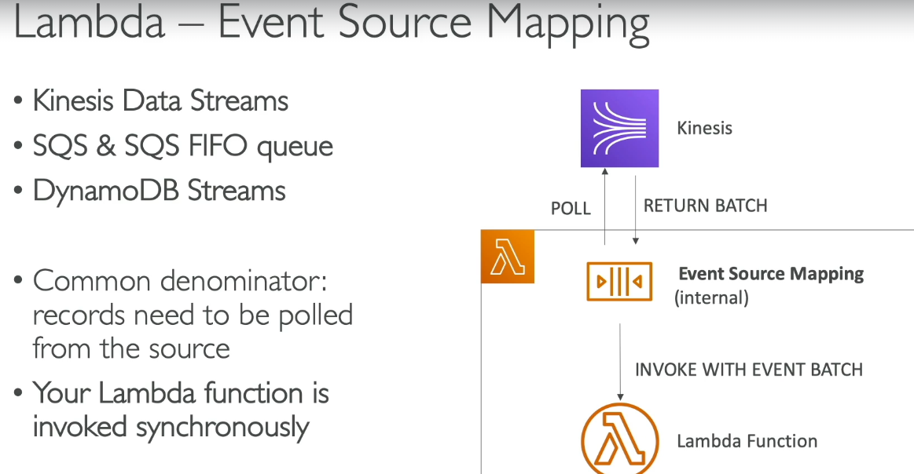  
1. You create an Event Source Mapping between a source (SQS/Kinesis/DynamoDB Stream) and a Lambda function.
2. AWS creates and manages pollers internally.
3. These pollers continuously poll the source:
   - SQS → ReceiveMessage API
   - Kinesis → GetRecords API
   - DynamoDB Streams → GetRecords API
4. Pollers collect records into batches based on:
   - Batch size
   - Batch window
   - Available records
5. Poller invokes Lambda synchronously with the batch.
6. Lambda processes the records and returns success/failure.
7. Based on the result:
   - Success → records are checkpointed/removed
   - Failure → records are retried according to source-specific rules

- so goto lambda function, add trigger, select SQS  
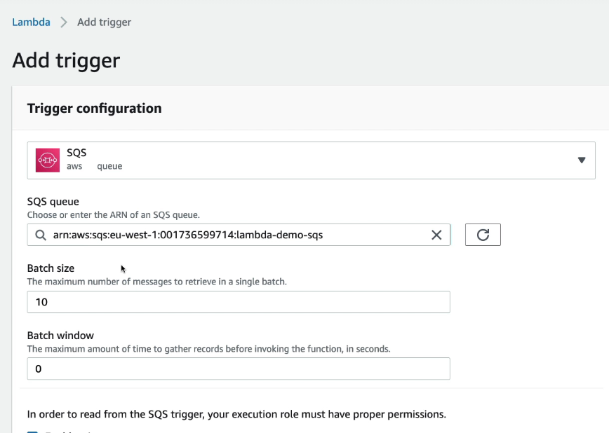  
- **Note** - even though we have selected SQS as trigger, behind the scenes AWS will create event source mapper for this to work

### Lambda Destinations
Lambda Destinations allow you to send the result of an **asynchronous Lambda invocation** to another AWS service after execution completes.

**Why?** - 
Instead of writing custom code to handle success/failure outcomes, Lambda can automatically route them.

**Why not use DQL then?**  
| Lambda Destinations | Dead Letter Queue (DLQ) |
|----------|----------|
| Can send both success and failure outcomes | we can send only failed events |
| Can send execution result metadata (request ID, response, error details) | Stores only the original event |
| Supports SNS, SQS, EventBridge, Lambda as targets | Supports only SQS or SNS |
| Useful for chaining workflows | Useful for retaining failed events |
| Can trigger downstream processing on success | Cannot handle successful executions |

### When to Use

| Scenario | Use |
|----------|----------|
| Capture failed events for later reprocessing | DLQ |
| Trigger another workflow after successful execution | Destination |
| Need detailed execution result/error information | Destination |
| Event-driven orchestration | Destination |

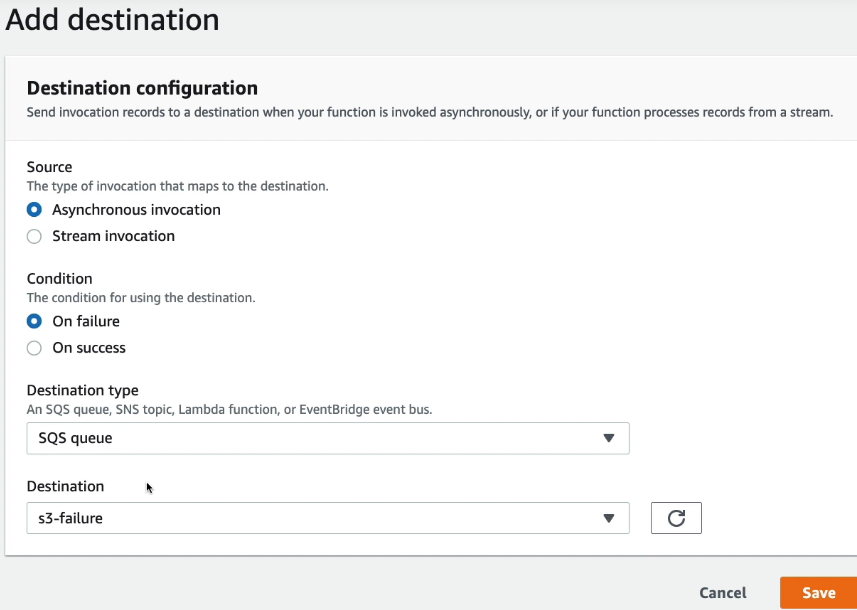  
- after this if lambda errors out, a new message will be pushed to the SQS queue mentioned above
- similarly on success, we can push message to another SQS / SNS, and from there we can have as many subscribers as we want to continue or workflow

### 1. ALB with Lambda

Instead of forwarding requests to EC2 instances or containers, an Application Load Balancer (ALB) can forward requests directly to a Lambda function.

Flow:

Client → ALB → Lambda → ALB → Client

How it works:
1. Client sends an HTTP/HTTPS request to ALB.
2. ALB listener rule matches the request (path, host, etc.).
3. ALB invokes the Lambda function synchronously.
4. Lambda processes the request and returns a response.
5. ALB converts the Lambda response into an HTTP response and sends it back to the client

**ALB acts as an adapter, automatically transforming HTTP requests into Lambda event JSON and transforming Lambda responses back into HTTP responses.**

```text
HTTP Request
    ↓
ALB
    ↓ (converts request to JSON event)
Lambda
    ↓ (returns JSON response)
ALB
    ↓ (converts response to HTTP)
Client
```

**Example**
```text
GET /users/123 HTTP/1.1
Host: myapp.com
User-Agent: Chrome
```
**ALB converts HTTP request to Lambda events automatically**
```text
{
  "httpMethod": "GET",
  "path": "/users/123",
  "headers": {
    "host": "myapp.com"
  },
  "queryStringParameters": {},
  "body": "",
  "isBase64Encoded": false
}
```
**Accessing event in code** - 
```javascript
exports.handler = async (event) => {
  console.log(event.path); // /users/123
  return {
    statusCode: 200,
    headers: {
      "Content-Type": "application/json"
    },
    body: JSON.stringify({
      userId: 123
    })
  };
};
```
**ALB then sends function's return value as HTTP response**  

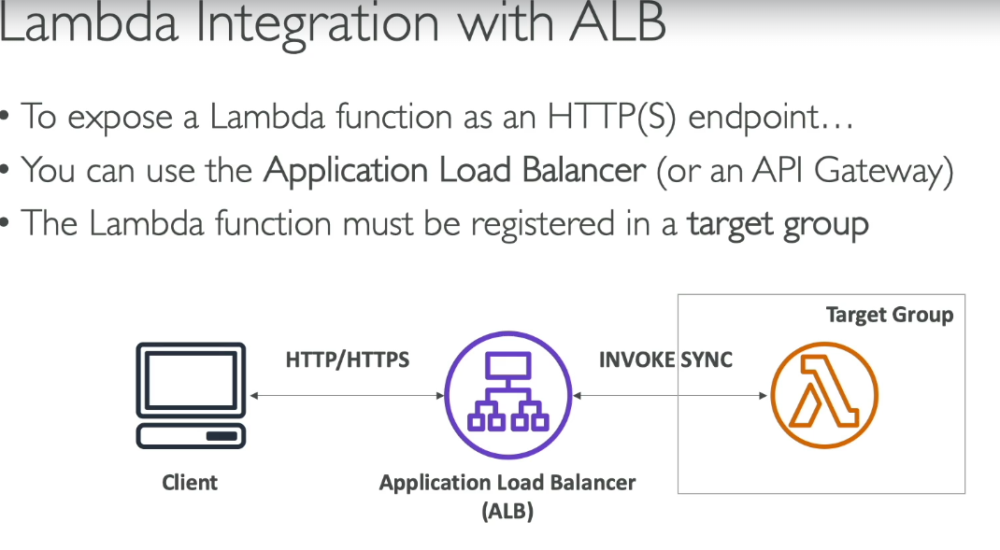  
**when we create ALB, we need to specify target group (like EC2 lambda, etc, in this case we have to chhose lambda)**
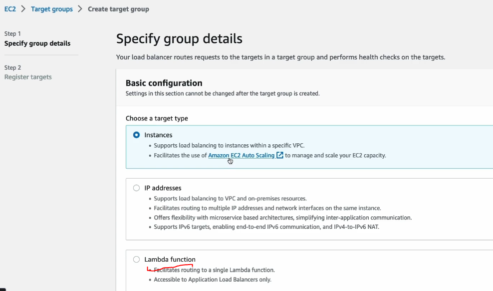  
- then choose the lambda function which will be invoked by ALB
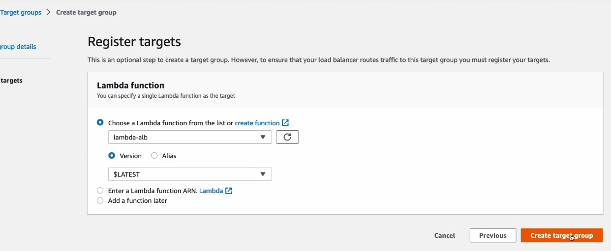 
- by doing this ALB trigger is automatically added for the lambda function we added above in the target group
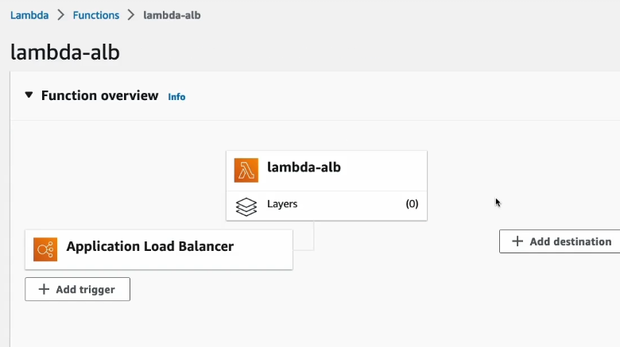  

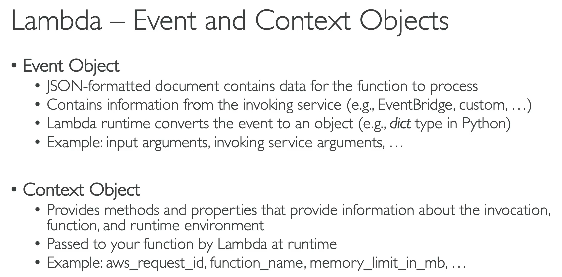  

### 2. Lambda with Eventbridge
- we cannot schedule lambda invocations (like run every 1 hr), but we have schedular in Eventbridge
- so goto event bridge, click on EB schedule, select target as lambda, then name of our lambda function
- schedule frequency based on cron job, or hourly, daily and so on

### 3. Lambda with S3
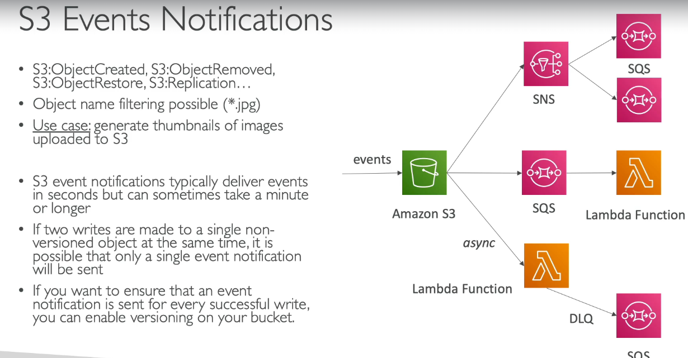  
- goto bucket, click on create event notification, select event types
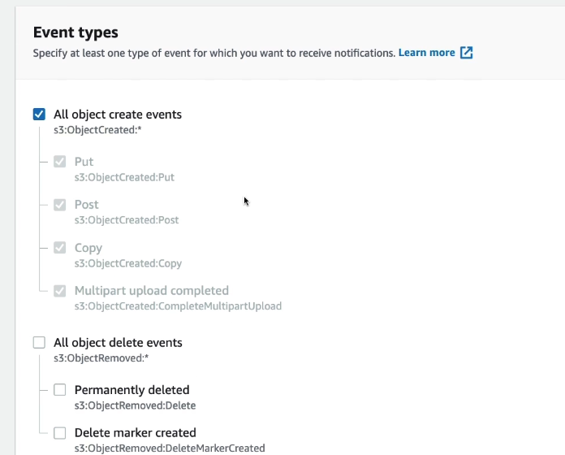  
- select destination as lambda, and from the dropdown select your lambda function which needs to be trigerred
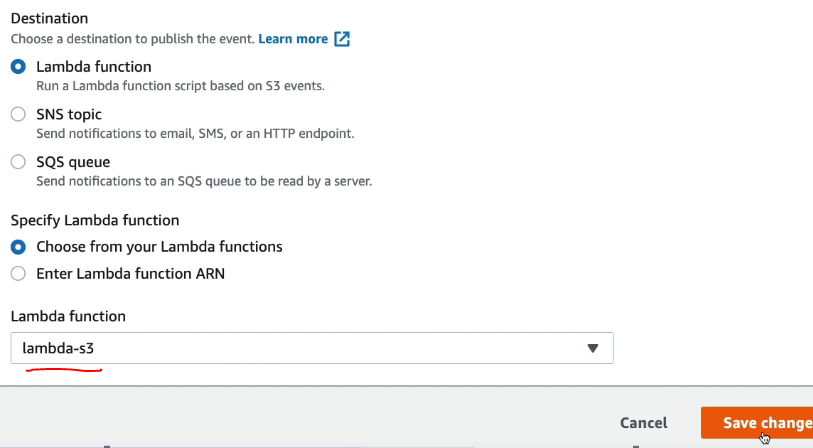  

> [NOTE]
> - ### 4. Lambda with RDS and Aurora
> - 2 ways lambda can be invoked via RDS
> - 1. Using RDS Events (AT DB Level)- When we set this, RDS will trigger lambda on (DB creation, Snapshot taken, DB param change, security grps change)
> - 2. Invoking lambda on DB data (when new rows are added / updated / deleted to table) - Usecase - Product price changed → Invalidate cache. ❌ **Not ideal** - User registers → Send welcome email. For registration - let app publich event to SNS / SQS, and let other systems handle it

### Lambda Execution role vs Resource policy
- **Execution Role  = What Lambda CAN DO**
- **Resource Policy = Who CAN CALL Lambda**  

| Aspect | Lambda Execution Role | Lambda Resource Policy |
|----------|----------|----------|
| Purpose | Defines what the Lambda function can access | Defines who can invoke or access the Lambda function |
| Attached To | Lambda function (IAM Role) | Lambda function (Resource-based Policy) |
| Direction | Lambda → Other AWS Services | Other AWS Services/Accounts → Lambda |
| Controls | Outbound permissions | Inbound permissions |
| Example | Lambda reads from S3 and writes to DynamoDB | Allow S3 bucket to invoke Lambda |
| Similar To | IAM role assumed by Lambda | S3 bucket policy |

### Example

| Scenario | Execution Role | Resource Policy |
|----------|----------|----------|
| Lambda reads files from S3 | `s3:GetObject` permission on role | Not required |
| Lambda writes to DynamoDB | `dynamodb:PutItem` permission on role | Not required |
| S3 invokes Lambda on object upload | Not required | Allow `s3.amazonaws.com` to invoke Lambda |
| EventBridge invokes Lambda | Not required | Allow `events.amazonaws.com` to invoke Lambda |
| Another AWS account invokes Lambda | Not required | Allow that account in Lambda resource policy |

- Execution role - allow lambda to poll messags from SQS via event source mapping
  
- Lambda resource policy - allow a particualt bucket to invoke this lambda
  

**Adding env vars to lambda** - Goto lambda --> configurations --> env variables --> add --> then use in your code ```process.env.YOUR_ENV_VAR_NAME```

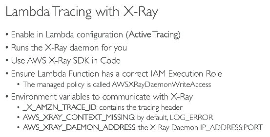  

> [!NOTE]
> #### CloudFront Functions vs Lambda@Edge
>
> | Feature | CloudFront Functions | Lambda@Edge |
> |--------|----------------------|-------------|
> | **Purpose** | Simple request/response modifications | Complex request/response processing |
> | **Can Access** | Headers, URL, Cookies | Everything + Request/Response Body + AWS Services + External APIs |
> | **Cannot Do** | Network calls, AWS service calls, Body access | Practically no such limitations |
> | **Performance / Cost** | ⚡ Fastest & Cheapest | 🐢 Slower & Costlier |
> | **Typical Use Cases** | URL rewrite, Redirect, Header/Cookie manipulation | Authentication (JWT), Call APIs, Generate dynamic responses, Access DynamoDB/S3 |
> | **Real-life Example** | **YouTube/Netflix** redirects users from `/latest` → `/v2/latest`, adds security headers, or redirects mobile users to `/m`. | **Amazon/Banking websites** validate JWT/session tokens before reaching the origin, fetch user-specific data, or generate personalized responses. |
> | **Configuration** | Attach a CloudFront Function to a Viewer Request/Response event. | Attach a Lambda function to a CloudFront event (Viewer/Origin Request/Response). |
> | **How it Works** | Request reaches Edge → Function executes → Continue to cache/origin. | Request reaches Edge → Lambda executes → Can call AWS/services → Continue to cache/origin. |
>
> **Remember**
> - **CloudFront Functions** → Tiny JavaScript running at the edge.
> - **Lambda@Edge** → Full Lambda running at the edge.
> - **Normal Lambda** → Full Lambda running in an AWS Region.


> [!NOTE]
> - ### General question - where should we do JWT token validation?
> - Lambda@Edge or API Gateway or inside app code
> - preference is usually:
> - ✅ API Gateway Authorizer (managed, scalable, request rejected before backend)
> - ✅ Lambda@Edge (when using CloudFront and you want authentication at the edge)
> - ✅ Application code (works, but the request has already reached your backend, consuming compute resources)


### Lambda and VPC
| Topic | Key Point |
|----------|----------|
| Default Behavior | Lambda runs outside your VPC in an AWS-managed VPC |
| Internet Access (Default) | Available by default |
| Why Connect to VPC? | To access private resources such as RDS, ElastiCache, internal services |
| How to Connect? | Configure Lambda with VPC, subnets, and security groups |
| ENI | Lambda creates Elastic Network Interfaces (ENIs) in selected subnets |
| Private Subnet Recommendation | Place Lambda in private subnets |
| Security | Controlled using Security Groups and NACLs |

#### Internet Access Scenarios

| Lambda Location | Internet Access |
|----------|----------|
| Not attached to VPC | ✅ Direct internet access |
| Attached to Public Subnet | ❌ No direct internet access |
| Attached to Private Subnet + NAT Gateway | ✅ Internet access via NAT |

### Lambda configurations
| Configuration | Description | Key Points |
|----------|----------|----------|
| Memory (RAM) | Memory allocated to the Lambda function | 128 MB – 10,240 MB; increasing memory also increases CPU allocation |
| Timeout | Maximum execution duration before Lambda terminates the function | 1 second – 900 seconds (15 minutes) |
| Execution Context | Reusable runtime environment for Lambda invocations | Variables and initialized resources outside the handler can be reused across warm invocations |
| Ephemeral Storage (`/tmp`) | Temporary local storage available during execution | 512 MB – 10 GB; data persists only for the lifetime of the execution environment |
| Environment Variables | Key-value pairs available to the function | Used for configuration without code changes |

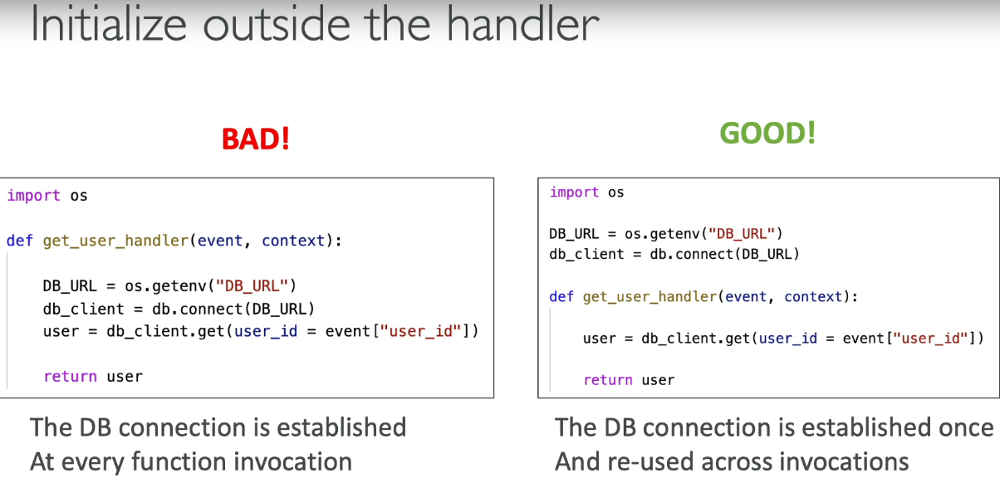  
**Execution context** -  
```text
Cold Start:
Create DB Connection
Load Libraries
Initialize Variables

Warm Invocation:
Reuse Existing DB Connection
Reuse Loaded Libraries
Reuse Initialized Variables
```

**How long is execution context active after lambda has finished it's execution?** - No guranteed time, (can be seconds / minutes/ sometimes hours)  

```text
Execution Context Lifecycle

Invocation 1 (Cold Start)
      ↓
Execution Context Created
      ↓
Invocation 2 (Warm)
      ↓
Invocation 3 (Warm)
      ↓
...
      ↓
AWS may destroy it at any time
```

### Lambda layers
2 things  
1. Allows us to run lambda on custom runtime not supported by lambda (C++ / Rust)
2. Externalize dependencies - allow common dependencies and shared code to be packaged once and reused by multiple Lambda functions, reducing deployment size and simplifying maintenance.  

| Topic | Lambda Layers |
|----------|----------|
| Purpose | Share common code, libraries, and dependencies across multiple Lambda functions |
| Why Use? | Avoid packaging the same dependencies with every Lambda function |
| Contains | External libraries, SDKs, custom code, certificates, binaries |
| Attached To | One or more Lambda functions |
| Versioning | Layers are versioned and immutable |
| Reuse | Multiple Lambda functions can use the same layer |
| Max Layers Per Function | 5 |
| Typical Examples | `lodash`, `pandas`, database drivers, shared utility code |

**Without Layers**

```md
Lambda A = Code + Dependencies
Lambda B = Code + Dependencies
Lambda C = Code + Dependencies
```

**With Layers**

```md
Shared Layer (Dependencies)
         ↑
         │
   ┌─────┼─────┐
   │     │     │
Lambda A B     C
   (Code Only)
```

- goto lambda, add layers
- upload zip file with all the necessary external dep
- on local, npm i axios, zip that node_mudules folder, upload it to lambda layers
- then we can use axios lib for all lambda functions that are connected to this layer

### Concurrency

| Concept | Meaning | Key Points |
|----------|----------|------------|
| **Concurrency** | Number of Lambda executions running at the same time | Each invocation consumes 1 concurrency while it is executing |
| **Account Concurrency Limit** | Maximum concurrent executions allowed in an AWS account per region | Default is typically 1,000 (can be increased via support request) |
| **Reserved Concurrency** | Concurrency exclusively allocated to a specific Lambda function | It guarantees that given lambda can always use up to X concurrent executions, even if other Lambda functions are consuming the rest |
| **Provisioned Concurrency** | Pre-initialized Lambda execution environments | Reduces cold starts for latency-sensitive applications |
| **Throttling** | Lambda cannot execute because concurrency limit is reached | Invocation is rejected/throttled until capacity becomes available |
| **Scaling Behavior** | Lambda creates additional execution environments as request volume increases | One execution environment handles one request at a time |

> [!NOTE]
> #### Reserved Concurrency Scenarios
>
> **Account Concurrency Limit = 1000 (this is default, to go beyond 1K contact AWS)**
>
> **Scenario 1: Lambda A has Reserved Concurrency = 200, but is idle**
> ```text
> Lambda A      Reserved = 200 (Not Running)
> Other Lambdas            = Can use only 800
> ```
> - The **200 concurrency is reserved exclusively** for Lambda A.
> - **Other Lambda functions cannot use those 200 slots**, even if Lambda A is idle.
>
> ---
>
> **Scenario 2: Only Lambda A is invoked**
> ```text
> Account Limit = 1000
> Reserved for Lambda A = 200
>
> Incoming Requests = 500
> ```
> ```text
> 200 executions  ✅
> 300 throttled   ❌
> ```
> - Lambda A **cannot exceed its reserved concurrency (200)**.
> - The remaining **800 account concurrency stays unused**, even if no other Lambda functions are running.
> - This is IMP, theat Lambda A cannot go beyond 200, any requests more than 200 will be throttled
> ---
>
> **Scenario 3: Other Lambdas are busy**
> ```text
> Other Lambdas = Using 800
> Lambda A = Needs 100
> ```
> - Lambda A **still gets its 100 executions**, because **200 slots are reserved** for it.
> - Other functions **cannot consume Lambda A's reserved capacity**.
>
> ---
>

##### Provicioned Concurrency Example

| Requests | Execution Time | Required Concurrency |
|-----------|---------------|----------------------|
| 100 req/sec | 1 sec | 100 |
| 500 req/sec | 2 sec | 1,000 |
| 2,000 req/sec | 500 ms | 1,000 |

```text
Provisioned Concurrency = 10

AWS keeps 10 Lambda environments:
✓ Runtime loaded
✓ Code loaded
✓ Layers loaded
✓ Initialization code executed

Request arrives
    ↓
Immediately executes handler
```

> [!NOTE]
> #### Provisioned concurrency helps with Cold Start and not reserved concurrency
>
> - ❌ **Reserved Concurrency does NOT reduce cold starts.**
> - It **only reserves execution capacity**.
> - To reduce cold starts, use **Provisioned Concurrency**, which keeps Lambda execution environments **pre-initialized (warm)**.

- so if a function invocation goes beyond the limit we set in Reserved concurrency, the function will throttle  
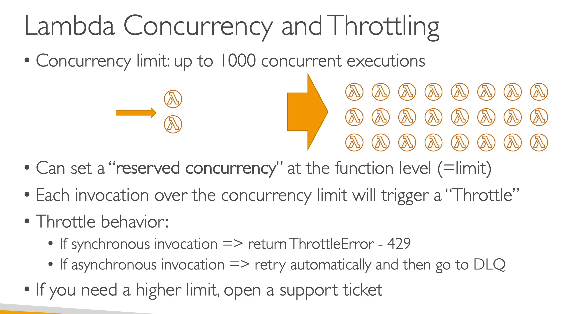   
- issue if we don't set the reserved concurrency limit - 
- if one app is heavily used by users, all lambda will be invoked by that app
- any other app (in below image - API gateway), will be throttled without even a single req, becuase our 1K account limit is exhaused by the first app  

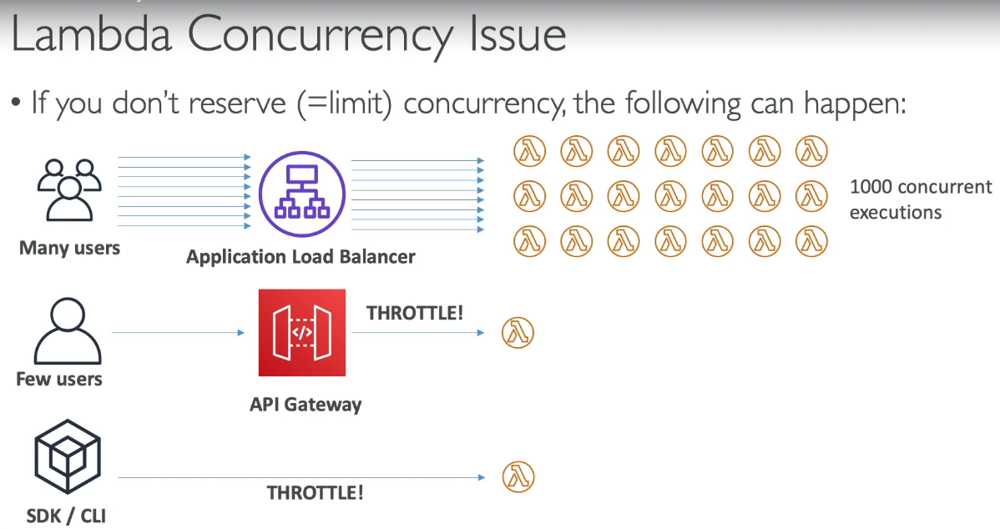 

> [!NOTE] 
> - #### Lambda snapstart
> - works only with Java Python and .NET
> - it stores the snapshot of lambda runtime + code + initialization to execute lamda faster 
> - then what is diff between using provisioned concurrency vs snapstart to improve cold start issue?

> [!NOTE]
> #### Lambda Cold Starts
>
> **Normal Lambda**
> ```text
> Request
>    │
>    ▼
> Start Runtime → Load Code → Initialize → Execute → Shutdown (eventually)
> ```
>
> **Provisioned Concurrency**
> ```text
> Deploy
>    │
>    ▼
> Start Runtime → Load Code → Initialize → 🔥 Wait for Requests
>
> Request
>    │
>    ▼
> Execute Immediately
> ```
>
> **SnapStart**
> ```text
> Deploy
>    │
>    ▼
> Start Runtime → Load Code → Initialize → 📸 Create Snapshot
>
>                    (No warm Lambda is kept running)
>
> Request
>    │
>    ▼
> Restore Snapshot → Execute
> ```
>
> **Remember**
> - **Normal Lambda** → Initializes on every cold start.
> - **Provisioned Concurrency** → Keeps Lambda **warm and waiting** for requests. (high cost)
> - **SnapStart** → Keeps a **snapshot** and restores it when a request arrives., (low cost)

### External dependencies

> Lambda Layers are a mechanism for sharing common code and libraries across multiple Lambda functions, while external dependencies are bundled directly within a function's deployment package.

| Aspect | Lambda Layers | External Dependencies (inside deployment package) |
|----------|----------|----------|
| Purpose | Share common libraries/code across multiple Lambda functions | Package dependencies directly with a specific Lambda function |
| Storage | Separate Layer resource managed by AWS | only the current lambda function can use this lib |
| Deployment | Update layer independently of function code | Must redeploy function to update dependencies |
| Max Layers | Up to 5 per function | N/A |
| Typical Contents | SDKs, utilities, common libraries, like  dynatrace extenions, org wide common libs | App-specific libraries |
| Update Impact | Layer update can benefit multiple functions | Each function updated separately |
| Best For | Common dependencies used by many Lambdas | Dependencies used by only one/few Lambdas |

- typically on prod apps, in CI/CD, entire lambda along with it's node_modules, is zipped and uploaded to the lambda function

- see below, entire node modules is ziped
- in our CI/CD, we run below command to create / update lambda function
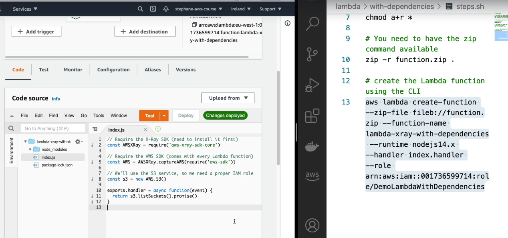   

### Lmabda with CloudFormation
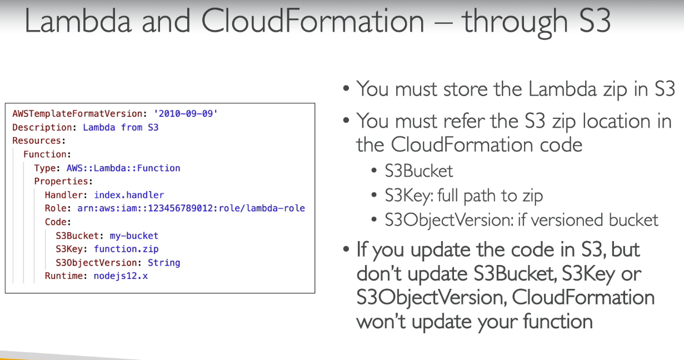   

### Lambda Container Images
- Instead of deploying a ZIP file, you package your Lambda as a Docker container image and store it in Amazon Elastic Container Registry (ECR)  

```text
Dockerfile
    ↓
docker build
    ↓
Image
    ↓
Push to ECR
    ↓
Create/Update Lambda
```

- STEP 1 - **create docker file with lambda base image** -  
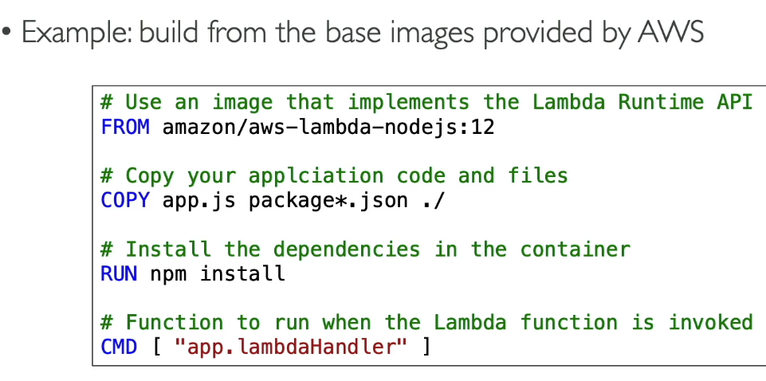   
- STEP 2 - build image ```docker build -t orders-api .```
- STEP 3 - push img to ECR ```docker push <account>.dkr.ecr.<region>.amazonaws.com/orders-api:latest```
- STEP - create lambda from img -  
```bash
aws lambda create-function \
  --function-name orders-api \
  --package-type Image \
  --code ImageUri=<ecr-image-uri> \
  --role <role-arn>
```

### Lambda versions and Aliases
| Concept | Lambda Version | Lambda Alias |
|----------|----------|----------|
| What is it? | Immutable snapshot of a Lambda function | Named pointer to a specific version |
| Mutability | Immutable | Mutable |
| Contains | Code + configuration at publish time | Reference to a version |
| Can be changed? | No | Yes |
| Numbering | 1, 2, 3, ... | dev, test, prod, live, blue, green |
| Purpose | Preserve a deployable snapshot | Provide stable endpoint/reference |
| Invocation | Function:1 | Function:prod |
| Traffic Shifting | No | Yes |
| Rollback | Invoke older version | Point alias to older version |
| Common Usage | Release artifact | Environment abstraction |

#### Creating versions
- goto lambda, under actions click on create version
- version 1 of lambda will be created and not it's code cannot be changed
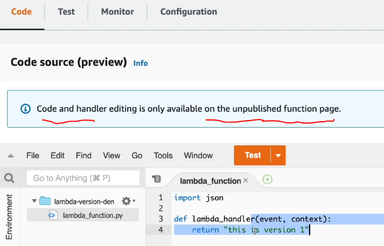   
- similarly, once new feature are added create v2,v3

#### Creating Aliases
- goto lambda, under actions click on create alias

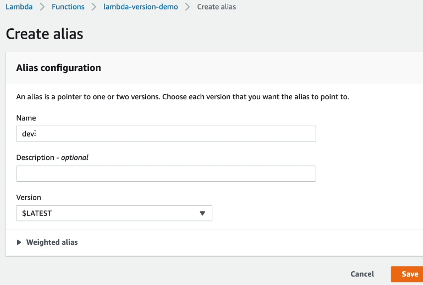   
- similraly we can create test alias, which can point to v2 version of our lambda 

- changing Alias to point to different version, along with configurable weighted routing  

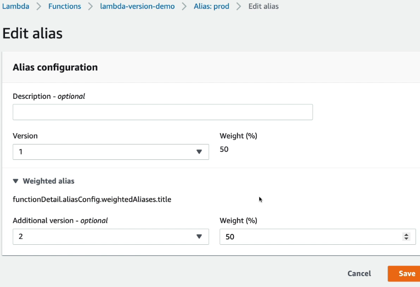   
- so basically, when prod alias of lambda is invoked, it will call v1 and v2 version of lambda alternatively
- how to call v1/v2/dev/prod version of lambda? each version / alias has a unique ARN, so use this ARN while selecting lambda (e.g. select prod alias of lambda version in SNS)

**Every time you release a Lambda function version, it gets a new number and you have to manually update all the AWS resources linked to your function (e.g., event triggers). What should you do? ---> Use Aliases ARN, and we can change only Alises to point to newer versions, other services remain intact**

### Lambda and function URLs
- A Lambda Function URL gives your Lambda its own HTTPS endpoint.
- no ALB, no API Gateway needed

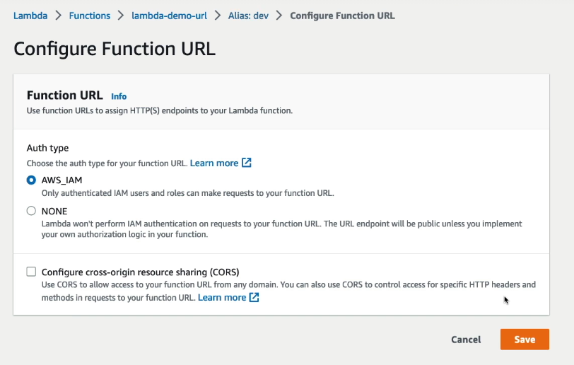  

| Feature | Lambda URL | API Gateway | ALB |
|----------|----------|----------|----------|
| HTTPS Endpoint | Yes | Yes | Yes |
| Setup Complexity | Very Low | Medium | Medium |
| Request Validation | No | Yes | No |
| Rate Limiting | No | Yes | No |
| API Keys | No | Yes | No |
| WebSocket APIs | No | Yes | No |
| Load Balancing EC2/ECS | No | No | Yes |
| Cost | Lowest | Higher | Higher |

**Usecase** - GitHub webhook invokes a Lambda whenever code is pushed to a repository.

The Function URL is just an HTTPS endpoint. You pass the body exactly like you would to any REST API.

Using curl  
```bash
curl -X POST \
  https://abcde.lambda-url.ap-south-1.on.aws \
  -H "Content-Type: application/json" \
  -d '{"name":"Ashish","age":35}'
```

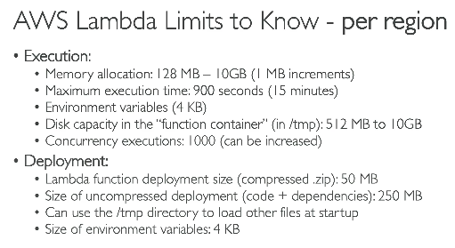  