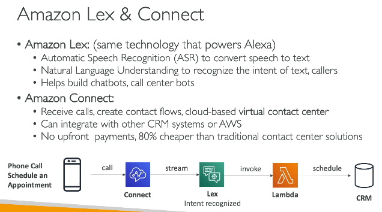

# Machine Learning

## Amazon Rekognition
- Finds objs, text, faces inside images using ML

## Transcribe
- speech to text
- has features like it auto removes PII data from speech while converting it to text

## Poly
- text to speech

## Translate
- convert one language to another language (convert English to french)

## Amazon Lex and connect
- similar to Alexa
- helps build chatbot (e.g call center bots)
 