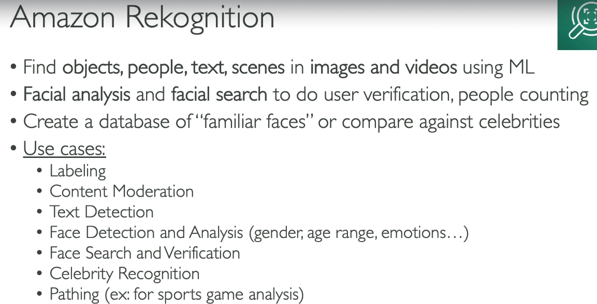
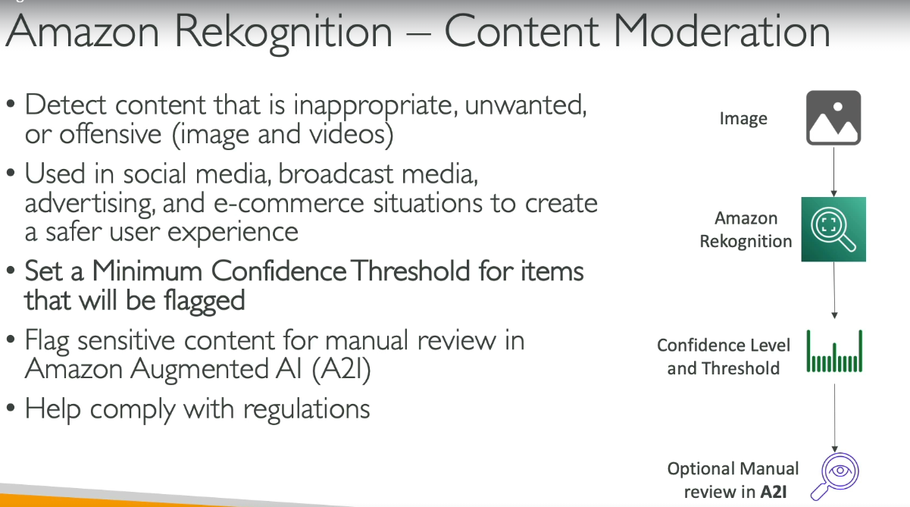
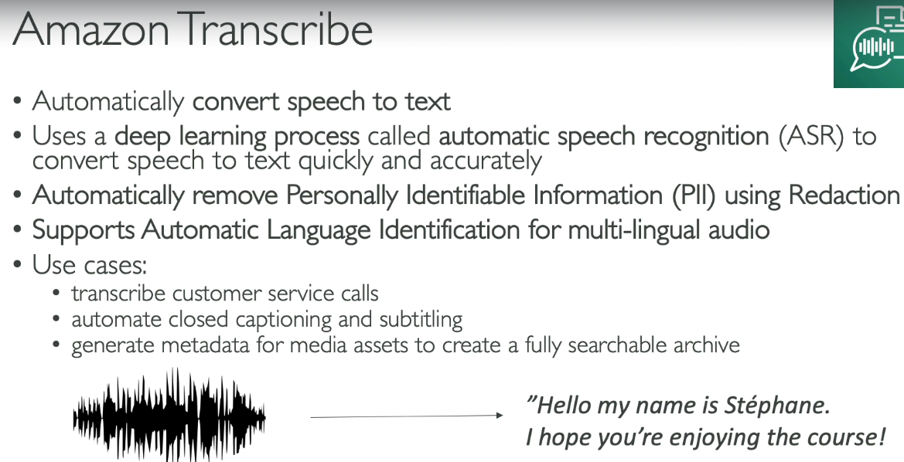
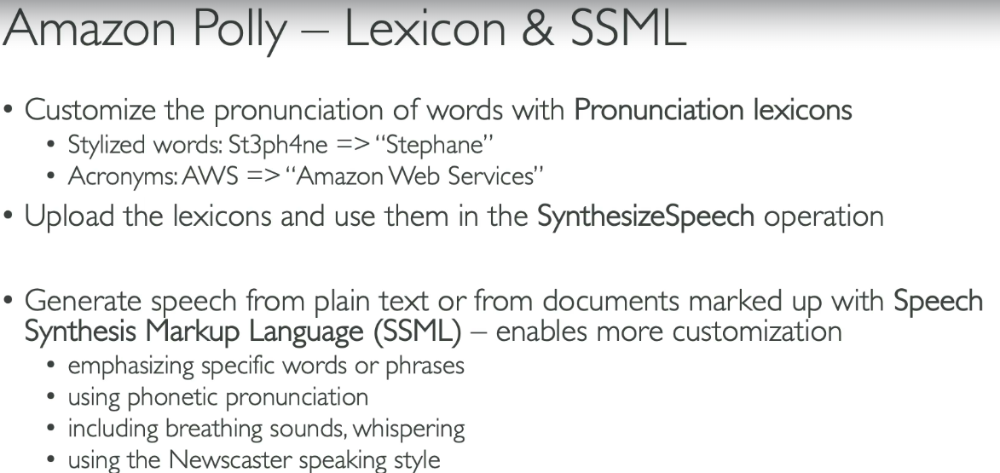
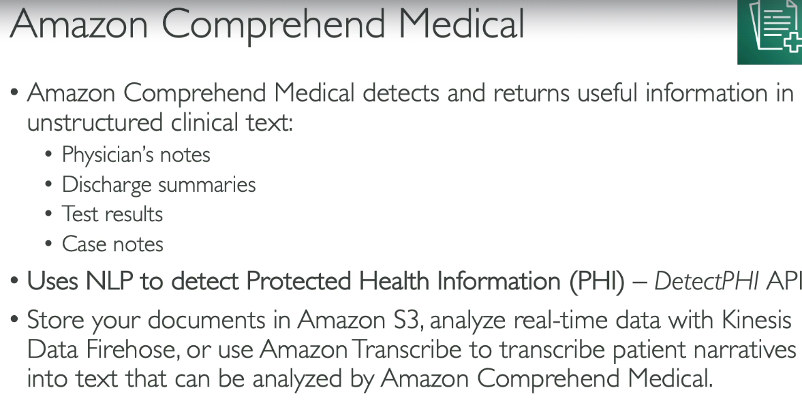
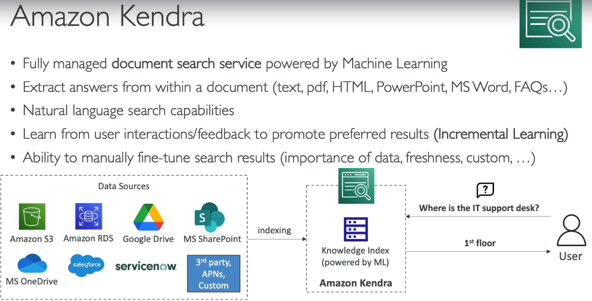
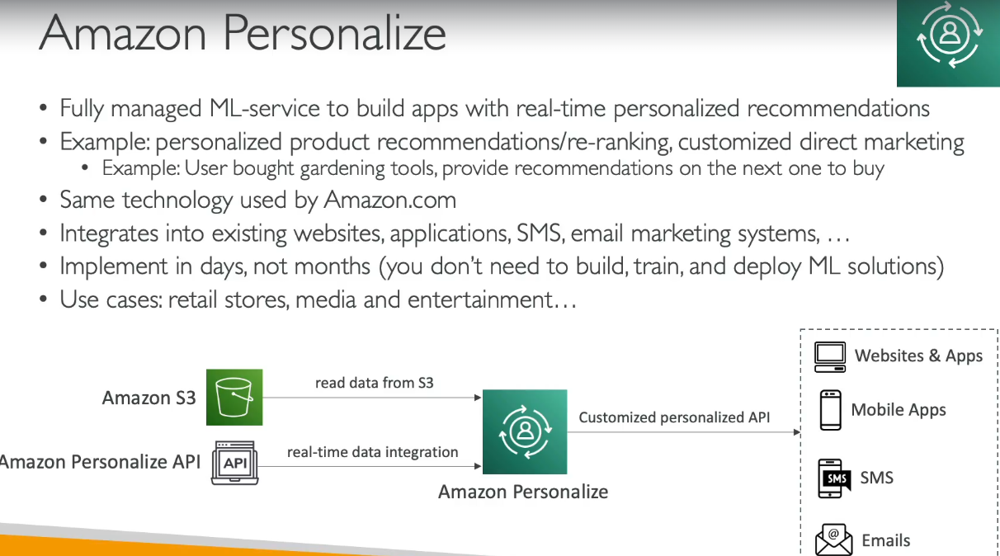
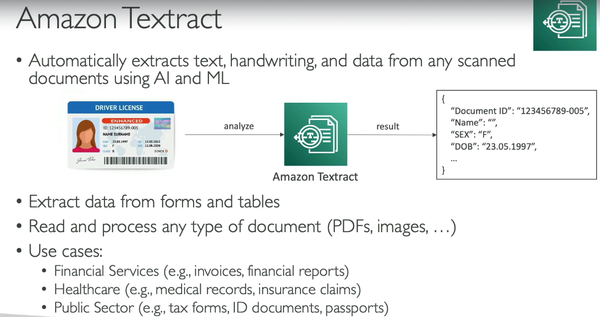

# Machine Learning

## Amazon Rekognition
-   
-   

## Transcribe
-  

## Poly
- text to speech  
-  

## Translate
- convert one language to another language (convert English to french)
- usecase - localization for webapps

## Amazon Lex and connect
- similar to Alexa
- helps build chatbot (e.g call center bots)  
 

## Amazon comprehend
- natural language processing (NLP) service by Amazon Web Services that uses machine learning to extract insights, sentiment, entities, and key phrases from text automatically  
  

## Sagemaker
- managed service to build ML models

## Kendra
- managed document search service using ML  
 

## Amazon Personalize
 

## Amazon textract
 