# Other DBs

## 1. Athena
-   
- 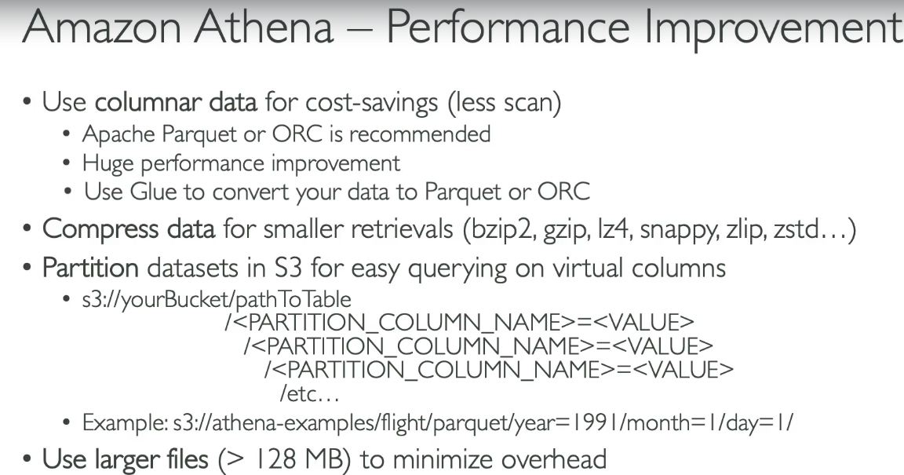  
- 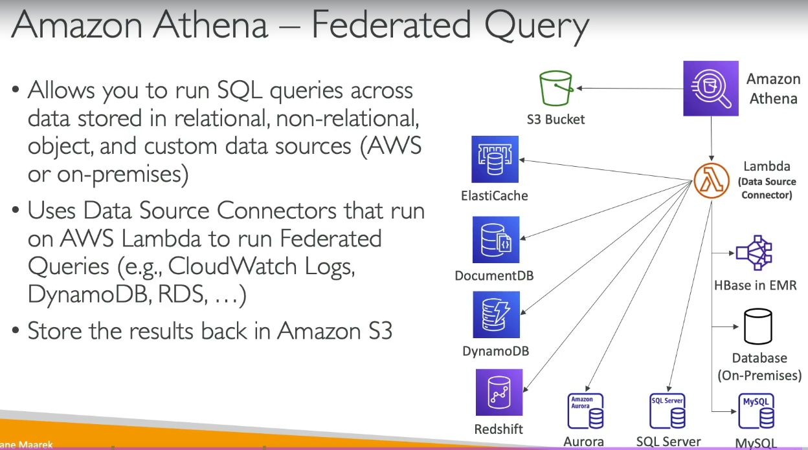  
- **first we create a DB**  
- 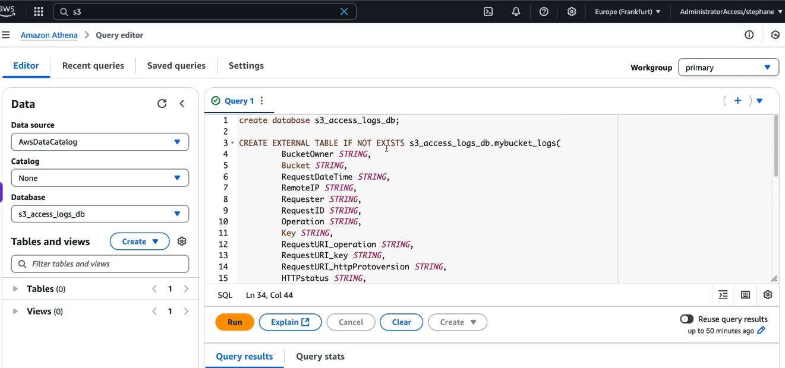  
- **then run queries on a specific bucket**
- 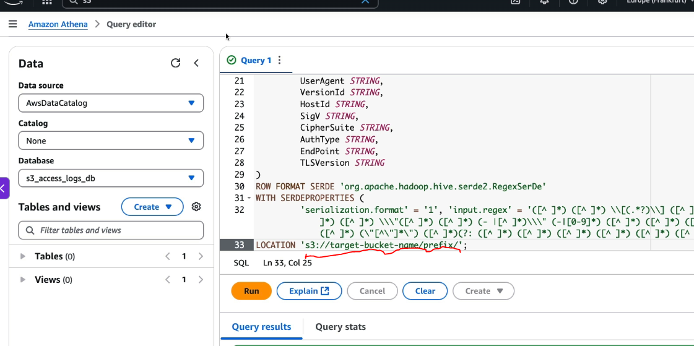  

## 2. Redshift
- Redshift is a **data warehouse**, not a transactional database.
- Uses **columnar storage**.
- Uses **Massively Parallel Processing (MPP)**.
- Leader node coordinates queries; compute nodes execute them.
- Supports **automatic and manual snapshots**.
- Supports **cross-region snapshot copy** for disaster recovery.
- Supports **KMS encryption** and **SSL/TLS**.
- Runs inside a **VPC** and uses **Security Groups**.
- **Concurrency Scaling** adds temporary clusters during heavy query loads.
- Best suited for **BI, reporting, dashboards, and analytics**, not OLTP.  

#### Amazon Redshift Integrations  

- **Amazon Data Firehose → Redshift** – Continuously streams real-time data into Redshift (typically via an intermediate S3 bucket using the `COPY` command).
- **Amazon S3 ↔ Redshift** – Imports data into Redshift using `COPY`, exports data using `UNLOAD`, and enables querying S3 data directly with **Redshift Spectrum**.
- **Amazon EC2 → Redshift** – Applications or analytics tools running on EC2 connect to Redshift over JDBC/ODBC or PostgreSQL-compatible drivers to execute SQL queries.  

#### Amazon Redshift Spectrum

- **Amazon Redshift Spectrum** lets you **query data stored directly in Amazon S3 using standard SQL without loading it into Redshift tables**.

#### How it works

```text
Application
      │
SQL Query
      ▼
Redshift Cluster
      │
Redshift Spectrum
      │
      ▼
Amazon S3 (CSV, JSON, Parquet, ORC, Avro, etc.)
```

## 3. OpenSearch (previously Elastic search)
- DynamoDB - queries only on primary keys or indexes
- Opensearch - search any field, even partial matches  

#### Flow
- 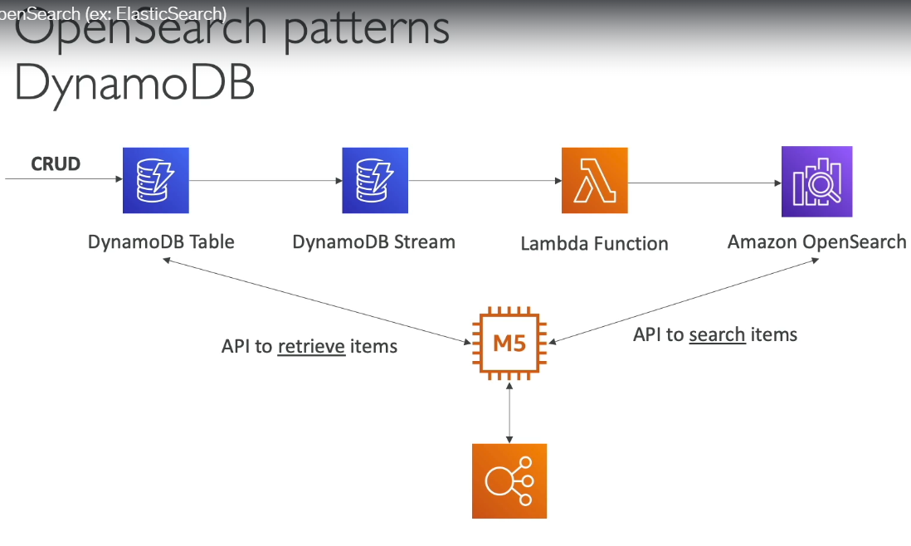  

1. Application performs **CRUD operations** on the DynamoDB table.
2. **DynamoDB Streams** captures every insert, update, and delete event.
3. The stream triggers a **Lambda function**.
4. Lambda transforms the data (if needed) and indexes it into **Amazon OpenSearch**.
5. The application uses **OpenSearch** for fast full-text searches and filtering.
6. After getting matching document IDs from OpenSearch, the application retrieves the complete records from **DynamoDB**.

> **Key idea:** **DynamoDB is the source of truth**, while **OpenSearch is an indexed copy optimized for searching.**

## 3. EMR - Elastic MapReduce  
  

| Node Type | Role (1-liner) | Recommended Purchasing Option |
|-----------|-----------------|-------------------------------|
| **Master Node (Primary)** | Manages the cluster and coordinates all worker nodes. | **On-Demand** or **Reserved** (avoid Spot, as losing the master terminates the cluster). |
| **Core Node** | Processes data and stores HDFS blocks. | **On-Demand** or **Reserved** (avoid Spot since HDFS data loss can impact the cluster). |
| **Task Node** | Performs compute tasks only and stores no HDFS data. | **Spot Instances** (ideal, as they can be interrupted without data loss). |

## 4. QuickSight
  
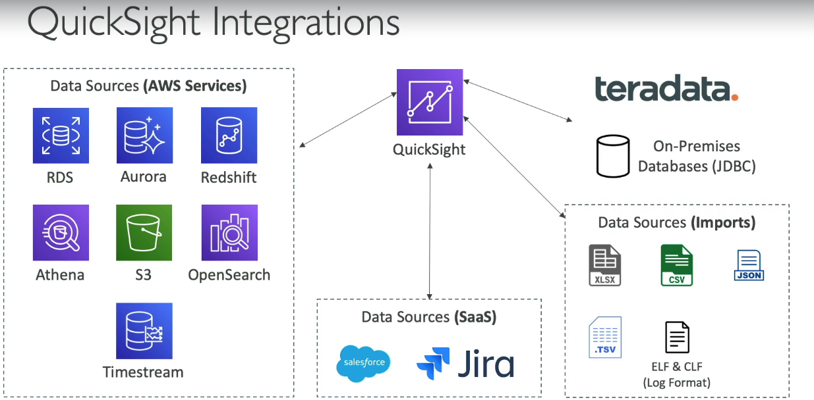  
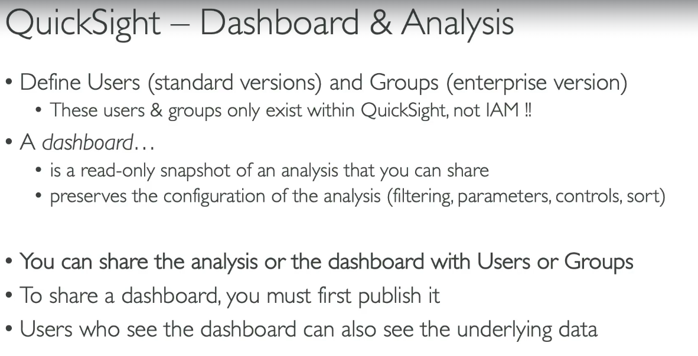  

## 5. Glue
  
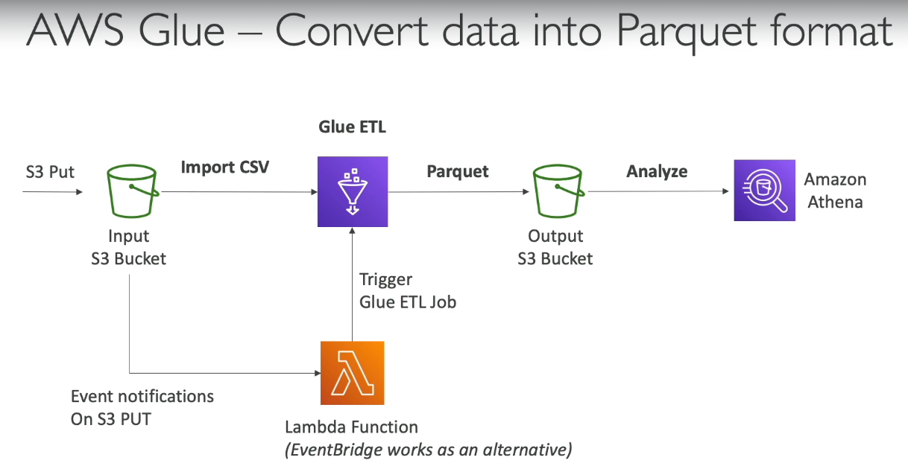  
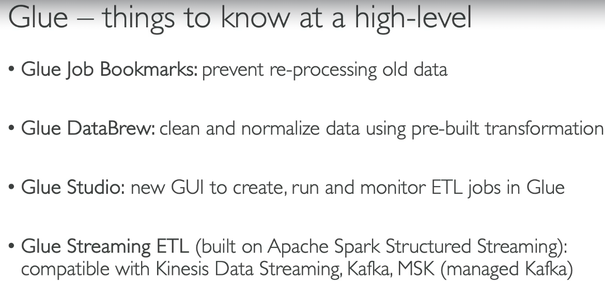  

## 6. AWS Lake Formation

- **Data Lake** – A centralized repository (typically on Amazon S3) that stores structured, semi-structured, and unstructured data for analytics.
- **AWS lake is a fully Managed data lake**
- **Data Ingestion & Preparation** – Collects, cleans, transforms, and loads data from multiple sources into the data lake.
- **Automates Data Management** – Automates data collection, cataloging, cleansing, movement, and de-duplication (using AWS Glue and ML Transforms).
- **Supports All Data Types** – Combines structured, semi-structured, and unstructured data in a single data lake.
- **Built-in Data Sources** – Provides ready-made connectors (blueprints) to ingest data from S3, RDS, relational databases, and NoSQL databases.
- **Fine-Grained Access Control** – Controls access at the database, table, column, row, and cell level using centralized permissions.
- **Built on AWS Glue** – Uses the AWS Glue Data Catalog and Glue crawlers to discover, catalog, and manage metadata.  


#### Working
1. Data is ingested from multiple sources (Amazon RDS, Aurora, S3, on-premises databases, logs, streaming data, etc.) into the data lake.
2. The data lake stores raw and processed data, typically in **Amazon S3**.
3. **AWS Glue Crawlers** scan the data and create metadata in the **AWS Glue Data Catalog**.
4. **AWS Lake Formation** centrally manages permissions (database, table, column, and row-level access) for the data lake.
5. Analytics services such as **Amazon Athena**, **Amazon EMR**, **Amazon Redshift Spectrum**, and **AWS Glue ETL** use the Glue Data Catalog to discover the data and query or process it directly from S3.

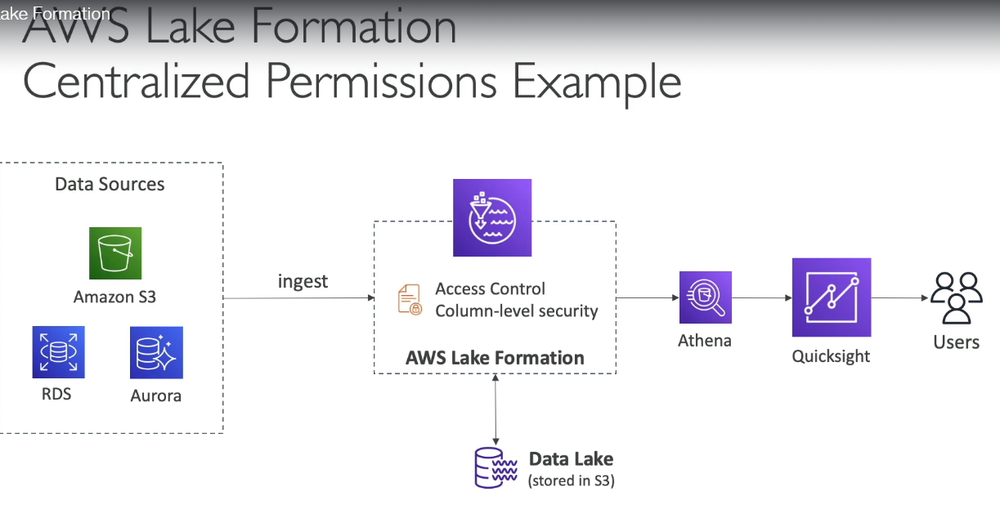  

## 7. Managed service for Apache Flink
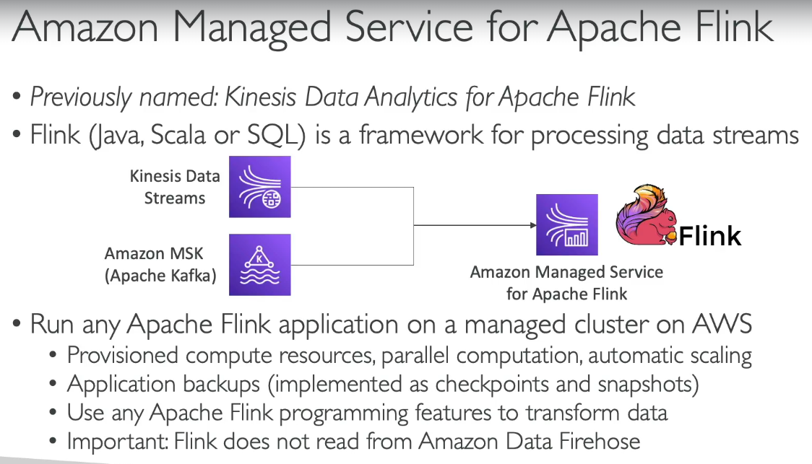  

## 8. Managed service for Apache Kafka (MSK)
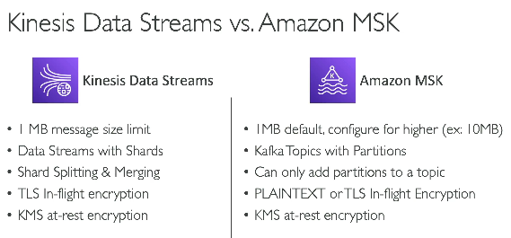  
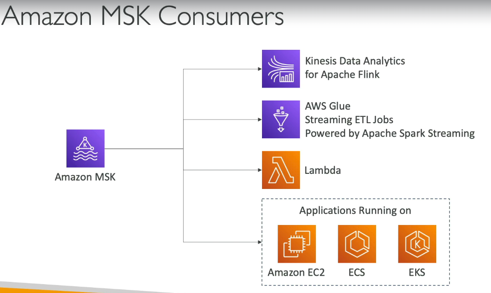  

## 9. Bigdata ingestion pipeline
-task -  
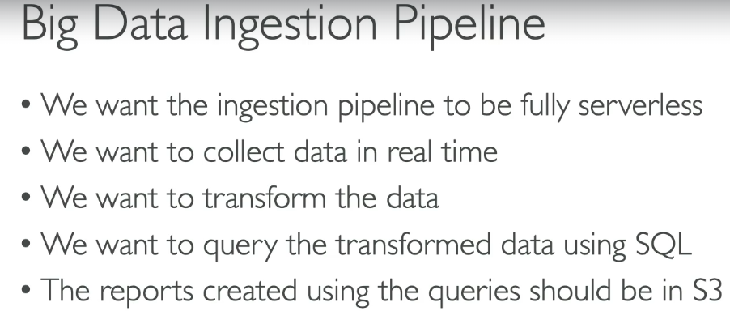  
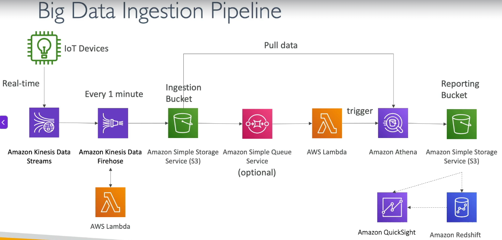  