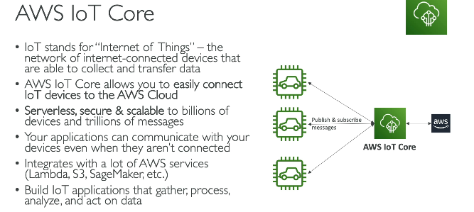
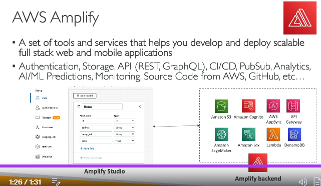

# Other Services

## Workspaces
- AWS managed Desktop as a service
- VDI as a service, no need for on-prem VDIs
- pay monthly, or hourly

## AppStream - 2.0
- Desktop application as a service e.g. photoshop
- instead of we downloading photoshop on our desktop, use this service, so we can access photoshop directly inside browser
- **Workspaces** - VDI as a service, **Appstream** - any app as a service within VDI

## IOT
 

## AWS Amplify
 
- Amplify vs Beanstalk
- Amplify - easiest way to build and host modern frontend/serverless applications
- Beanstalk - platform-as-a-service for deploying and managing web applications with more infrastructure control.

## AWS Infrastructure composer
- drag and drop service to build AWS infra for your app
- behind the scenes it will generate Infrastrucutre as code using cloudfomration

## AWS Device farm
- lets us run web application on different browsers / mobiles/ tabs, to test how app is rendered on different devices
- similar to browserstack

## AWS Data sync
- bring large data on-prem data to AWS

## Cloud migration strategy
### AWS Cloud Migration – 7 Rs (with Examples)

1. **Relocate**
   - Move servers to the cloud without changing the application or underlying virtualization platform.
   - **Example:** Moving on-premises VMware VMs to VMware Cloud on AWS.

2. **Rehost (Lift & Shift)**
   - Move the application as-is to the cloud with minimal changes.
   - **Example:** Moving a Java application from an on-premises server to an Amazon EC2 instance.

3. **Replatform (Lift, Tinker & Shift)**
   - Make small optimizations while migrating.
   - **Example:** Moving a database from a self-managed MySQL server to Amazon RDS MySQL.

4. **Refactor / Re-architect**
   - Redesign the application to take advantage of cloud-native services.
   - **Example:** Breaking a monolithic application into microservices using Amazon EKS and serverless functions.

5. **Repurchase**
   - Replace the existing application with a SaaS product.
   - **Example:** Replacing an on-premises CRM with Salesforce.

6. **Retire**
   - Remove applications that are no longer needed.
   - **Example:** Decommissioning an old reporting application that nobody uses.

7. **Retain (Revisit)**
   - Keep the application where it is for now and migrate later if needed.
   - **Example:** Keeping a legacy mainframe application on-premises because it has strict compliance requirements.


## Migrating projects to cloud
 (see Disaster recovery section)
3. AWS Migration Evaluator 
- Used **before migration planning** to estimate costs and build a business case for migrating to AWS.
- Analyzes on-premises infrastructure and provides **TCO (Total Cost of Ownership)** comparisons.
- **Example:** "If we move 500 servers to AWS, how much money can we save?"
- **Migration Evaluator = Cost and business justification.**
- **Application Discovery Service = Infrastructure and dependency discovery.**

4. AWS Migration Hub
- A central dashboard to track and monitor migrations across multiple AWS migration tools.
- Integrates with services like AWS Application Discovery Service, AWS Database Migration Service (DMS), and AWS Application Migration Service (MGN).

**Example:** If you're migrating 100 servers and 20 databases using different AWS migration tools, Migration Hub lets you see the overall migration status in one place.

## AWS Fault Injection Simulator (FIS)

- A managed service used to perform controlled chaos engineering experiments on AWS workloads.
- Intentionally injects failures (e.g., stop EC2 instances, throttle APIs, simulate network issues) to test application resilience.
- Helps identify weaknesses before real outages occur.
- Integrates with AWS services such as EC2, ECS, EKS, RDS, and CloudWatch.

**Example:** Randomly stop one EC2 instance in an Auto Scaling Group to verify that the application remains available and recovers automatically.

## AWS Ground Station

- A fully managed service that lets you communicate with and process data from satellites using AWS-managed ground stations.
- Eliminates the need to build and maintain your own satellite antenna infrastructure.
- Satellite data is received directly into AWS, where it can be stored, processed, and analyzed using AWS services.
- Commonly used for weather monitoring, earth observation, mapping, and space missions.

**Example:** A satellite captures images of the Earth. AWS Ground Station receives the satellite data and sends it to AWS for processing and analysis.

## AWS Pinpoint

- A customer engagement service used to send targeted communications to users.
- Supports Email, SMS, Push Notifications, Voice messages, and in-app messaging.
- Allows user segmentation, campaigns, scheduling, analytics, and tracking user engagement.
- Commonly used for marketing campaigns, promotions, and customer notifications.

**Example:** Send a promotional SMS only to users in Pune who haven't logged into the app in the last 30 days.

| AWS Pinpoint | AWS SNS |
|-------------|----------|
| Designed for targeted customer engagement and marketing campaigns. | Designed for simple notifications and pub/sub messaging. |
| Supports user segmentation, campaigns, and engagement analytics. | Focuses on message delivery; no customer segmentation or campaign management. |

## SES - Simple Email Service
- we can send emails to customer using SMTP or AWS SDK
- we can receieve emails using SNS, S3, Lmabda
- is integrated with IAM to restrict access to sending email

### AppConfig

> **1-liner:** AWS AppConfig is a **fully managed service for safely deploying and managing application configuration and feature flags without redeploying your application.**

No application redeployment required.

### Typical Use Cases

- Feature flags
- Enable/disable features
- Change API endpoints
- Tune application parameters
- Rate limits
- Logging levels
- Kill switches (disable a feature instantly)

---

### Working Flow

```text
Developer
      │
      ▼
Create Configuration
      │
      ▼
AWS AppConfig
      │
Validate Configuration
      │
Deploy Configuration
      │
      ▼
Application
      │
Fetch Latest Configuration
      │
      ▼
Uses New Settings
```


### AppConfig Components

| Component | Purpose |
|----------|---------|
| Application | Logical application |
| Environment | Dev, Test, Prod |
| Configuration Profile | Defines where configuration comes from (hosted, SSM, S3, etc.) |
| Hosted Configuration | Configuration stored directly in AppConfig |
| Deployment Strategy | Controls rollout speed |
| Validator | Ensures configuration is valid |

---

### AppConfig vs Parameter Store vs Secrets Manager

| Feature | AppConfig | Parameter Store | Secrets Manager |
|---------|-----------|-----------------|-----------------|
| Application configuration | ✅ | ✅ | ❌ |
| Feature flags | ✅ | ❌ | ❌ |
| Secrets | ❌ | ✅ | ✅ |
| Automatic secret rotation | ❌ | ❌ | ✅ |
| Safe gradual deployment | ✅ | ❌ | ❌ |
| Automatic rollback | ✅ | ❌ | ❌ |
| Runtime configuration updates | ✅ | Limited | ❌ |

> [!NOTE]
> ## AWS AppFlow
>
> - **AWS AppFlow** is a **fully managed integration service** that securely transfers data between **SaaS applications** and **AWS services** without writing code.
> - Supports **scheduled**, **event-based**, or **on-demand** data transfers.
>
> ---
>
> ### How it Works
>
> 1. Connect AppFlow to the source application using its **API** (OAuth/API credentials).
> 2. Select the data (e.g., Salesforce **Accounts** table).
> 3. AppFlow reads the data using the application's **REST/API endpoints**.
> 4. (Optional) Filter or transform the data.
> 5. Write the data to the destination (e.g., S3, Redshift).
>
> ---