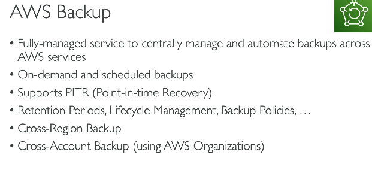
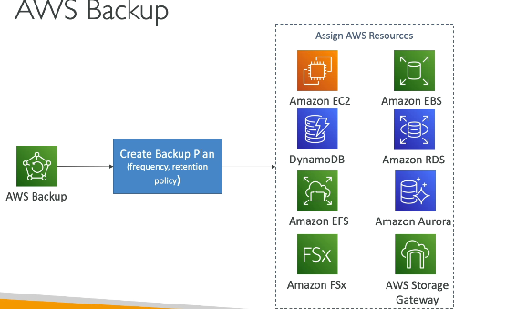
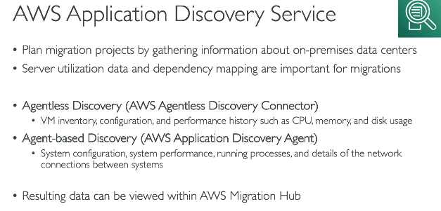
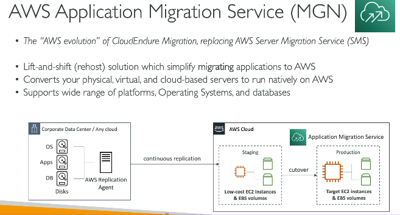

# Other Services

## Workspaces
- AWS managed Desktop as a service
- VDI as a service, no need for on-prem VDIs
- pay monthly, or hourly

## AppStream - 2.0
- Desktop application as a service e.g. photoshop
- instead of we downloading photoshop on our desktop, use this service, so we can access photoshop directly inside browser
- **Workspaces** - VDI as a service, **Appstream** - any app as a service within VDI

## IOT
 

## AppSync
- fully managed service that makes it easy to build GraphQL APIs
- connects to data sources such as Amazon DynamoDB, AWS Lambda, and databases, while handling API scaling, caching, offline synchronization, and real-time updates.

## AWS Amplify
 
- Amplify vs Beanstalk
- Amplify - easiest way to build and host modern frontend/serverless applications
- Beanstalk - platform-as-a-service for deploying and managing web applications with more infrastructure control.

## AWS Infrastructure composer
- drag and drop service to build AWS infra for your app
- behind the scenes it will generate Infrastrucutre as code using cloudfomration

## AWS Device farm
- lets us run web application on different browsers / mobiles/ tabs, to test how app is rendered on different devices
- similar to browserstack

## AWS backup
 
 

## AWS Disaster recovery strategies
| DR Strategy                    | How It Works                                                                                              | Recovery Time                                 | Cost        |
| ------------------------------ | --------------------------------------------------------------------------------------------------------- | --------------------------------------------- | ----------- |
| **Backup & Restore**           | Data is backed up and infrastructure is recreated during a disaster.                                      | Slowest (hours–days)                          | Lowest      |
| **Pilot Light**                | Critical components (e.g., database) run continuously; remaining resources are started during a disaster. | Faster (hours)                                | Low–Medium  |
| **Warm Standby**               | A scaled-down version of the full application runs in the DR region and is scaled up when needed.         | Fast (minutes–hours)                          | Medium–High |
| **Multi-Site (Active-Active)** | Full production environments run simultaneously in multiple regions and serve traffic.                    | Fastest (seconds–minutes, near-zero downtime) | Highest     |

## AWS Elastic Disaster recovery
- bring your on-prem data to AWS cloud for disaster recovery
 

## AWS Data sync
- bring large data on-prem data to AWS

## Cloud migration strategy
### AWS Cloud Migration – 7 Rs (with Examples)

1. **Relocate**
   - Move servers to the cloud without changing the application or underlying virtualization platform.
   - **Example:** Moving on-premises VMware VMs to VMware Cloud on AWS.

2. **Rehost (Lift & Shift)**
   - Move the application as-is to the cloud with minimal changes.
   - **Example:** Moving a Java application from an on-premises server to an Amazon EC2 instance.

3. **Replatform (Lift, Tinker & Shift)**
   - Make small optimizations while migrating.
   - **Example:** Moving a database from a self-managed MySQL server to Amazon RDS MySQL.

4. **Refactor / Re-architect**
   - Redesign the application to take advantage of cloud-native services.
   - **Example:** Breaking a monolithic application into microservices using Amazon EKS and serverless functions.

5. **Repurchase**
   - Replace the existing application with a SaaS product.
   - **Example:** Replacing an on-premises CRM with Salesforce.

6. **Retire**
   - Remove applications that are no longer needed.
   - **Example:** Decommissioning an old reporting application that nobody uses.

7. **Retain (Revisit)**
   - Keep the application where it is for now and migrate later if needed.
   - **Example:** Keeping a legacy mainframe application on-premises because it has strict compliance requirements.

## Migrating projects to cloud
1. AWS Application Discovery service - understand what all needs to be migrated, and there counterpart AWS service
 
2. AWS Application Migration Service - Do the actual migration 

3. AWS Migration Evaluator 
- Used **before migration planning** to estimate costs and build a business case for migrating to AWS.
- Analyzes on-premises infrastructure and provides **TCO (Total Cost of Ownership)** comparisons.
- **Example:** "If we move 500 servers to AWS, how much money can we save?"
- **Migration Evaluator = Cost and business justification.**
- **Application Discovery Service = Infrastructure and dependency discovery.**

4. AWS Migration Hub
- A central dashboard to track and monitor migrations across multiple AWS migration tools.
- Integrates with services like AWS Application Discovery Service, AWS Database Migration Service (DMS), and AWS Application Migration Service (MGN).

**Example:** If you're migrating 100 servers and 20 databases using different AWS migration tools, Migration Hub lets you see the overall migration status in one place.

## AWS Fault Injection Simulator (FIS)

- A managed service used to perform controlled chaos engineering experiments on AWS workloads.
- Intentionally injects failures (e.g., stop EC2 instances, throttle APIs, simulate network issues) to test application resilience.
- Helps identify weaknesses before real outages occur.
- Integrates with AWS services such as EC2, ECS, EKS, RDS, and CloudWatch.

**Example:** Randomly stop one EC2 instance in an Auto Scaling Group to verify that the application remains available and recovers automatically.

## AWS Step Functions

- A workflow orchestration service that coordinates multiple tasks and AWS services.
- Each step in the workflow can be a Lambda function, ECS task, API call, database operation, email notification, or even a human approval action.
- AWS Step Functions manages the sequence, retries, error handling, and state between steps.
- Useful when a business process involves multiple actions that must happen in a specific order.

**Example: Leave Approval Workflow**
1. Lambda: Store leave request in database.
2. Lambda: Send approval request to manager.
3. Human: Manager approves or rejects the request.
4. Lambda: Update leave status in database.
5. Lambda: Send notification to employee.

AWS Step Functions orchestrates all these steps and keeps track of the workflow state.