# RDS - Relation DB Service
- we can create our own DB, or use 3rd part DB, and connect to those DBs from EC2
- but then we need to manage DB server patching (if not 3rd party), monitoring etc
- AWS provides managed DB services, for relation DB it is called RDS
- so DB server patching, montioring is done by AWS
- but we cannot SSH into AWS RDS
- AWS RDS supports MySQL, SQL Server, Postgres and others  

**RDS Storage auto-scaling** - 
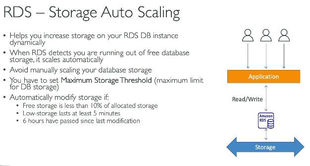 

### RDSReadReplica - Main purpose - perf optimization for read operations
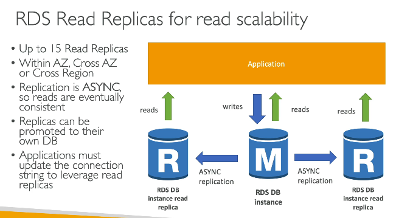 
- Note - since this is async replication, we will have eventual consistency
- One usecase is obvious - perf optimization
- other usecase - our main app read / write to DB, there is another App which just shows reporting dashboards by reading DB, then that reporting dashboard can just connect to that read replica

### RDS Read Replica Costing
 

### RDS Multi-AZ - for disaster recovery purpose
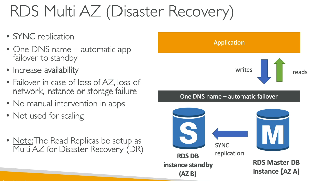 
- it does sync replication, so DB is always consistent
- also, in our app, we don;t need to configure multiple DB URLs, only one, and standby DB will takeover if main DB fails

### Creating RDS
- Open RDS service, click on create RDS
- select 1 option - Full configuration or Easy create (below is e.g. of full config)
- select DB engine (MySQL, Postgress, SQL server, Aurora), then select DB engine version
- select availability type - 1. Single AZ deploy (1 instance), 2. Multi AZ (2 DB instance), 2nd DB instance will be standby, it is not a read replica, it cannot be accessed unless main BD fails, this is only for disaster recovery, 3. Multi-AZ DB CLuster deploy (3 instance)
- select db name, password config - create your own, or use secrets manager
- select DB size, select autoscaling or not, and select max size for autoscaling
- click create
- after creation, it wil gve you DB endpoint, default port is 3306, so you can use endpoint as url, and connect to this DB via app code, or connect via different DB tools like (SQL Server Management Studio (SSMS) for SQL server, MySQL Workbench for MySQL and so on). provide your DB connetion url port and DB creds and you are good to go
- or we can use a tool called SQLElectron, which can connect to any SQL DB engine, just in the config we have to first specify Database type, then the DB connection utl and creds 
- you can restrict access to DB by adding security group, by default it is attched to defualt VPC, so only resources from the same VPC, can connect to this DB, 
- to connect to thsi DB from local machine, or from app code, we need to change security group to allow connection from any IP address, So we have seen secutiry groups being created fro EC2, ALB and now RDS
- after DB is created, we go to that DB and from the option, select read replica, this way we can create read-replicas
- again from the options, we can create a snapshot of our DB

## AWS Aurora vs AWS RDS
- Auror is built by AWS, built as cloud optimize DB
- 5x time faster then MySQL and 3x fater that postgres, if we used MySQL or Postgres, since they are not cloud optimized
- but 20% costlier than RDS 

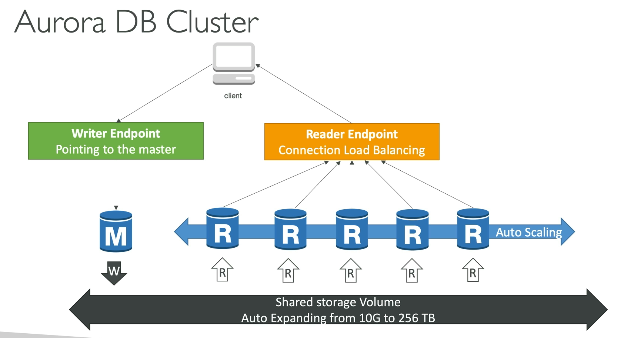 
- key adv is Aurira procides 2 DB endpoints reader and writer
- using writer endpoint, we can do CRUD DB operations, using Reader, only Read
- the key diff is the endpoint does not change, and Aurora will handle load balancing for us on which instance of read-replica to call, when a read request is made
- in RDS, our app code needs to decide which read replica instance to use to make a read request
- so loadbalcing for read replica's in RDS nead to be handled in app code
- **Aurora endpoints** - writer.cluster-xyz.amazonaws.com, reader.cluster-xyz.amazonaws.com
- **RDS endpoints** - primary.xyz.amazonaws.com, replica1.xyz.amazonaws.com, replica2.xyz.amazonaws.com

### RDS MySQL

```js
const mysql = require('mysql2/promise');

// Primary endpoint
const primary = await mysql.createConnection({
  host: 'primary.xyz.us-east-1.rds.amazonaws.com',
  user: 'admin',
  password: 'password',
  database: 'mydb'
});

// Read replica endpoint
const replica = await mysql.createConnection({
  host: 'replica1.xyz.us-east-1.rds.amazonaws.com',
  user: 'admin',
  password: 'password',
  database: 'mydb'
});

// Write
await primary.execute(
  'INSERT INTO users(name) VALUES (?)',
  ['John']
);

// Read
const [rows] = await replica.execute(
  'SELECT * FROM users'
);
```

### Aurora MySQL

```js
const mysql = require('mysql2/promise');

// Writer endpoint
const writer = await mysql.createConnection({
  host: 'writer.cluster-xyz.us-east-1.rds.amazonaws.com',
  user: 'admin',
  password: 'password',
  database: 'mydb'
});

// Reader endpoint
const reader = await mysql.createConnection({
  host: 'reader.cluster-xyz.us-east-1.rds.amazonaws.com',
  user: 'admin',
  password: 'password',
  database: 'mydb'
});

// Write
await writer.execute(
  'INSERT INTO users(name) VALUES (?)',
  ['John']
);

// Read
const [rows] = await reader.execute(
  'SELECT * FROM users'
);
```

**Key Difference**

- **RDS:** Application chooses which replica endpoint to use.
- **Aurora:** Application uses a single Reader endpoint; Aurora automatically load balances across replicas.

- while creating Aurora DB, we still need to select DB engine (MySQL, Postgress)
- rest all steps remain similar to RDS DB creation
- after creation, Aurora DB will give 2 endpoints, reader endpoint and writer endpoint

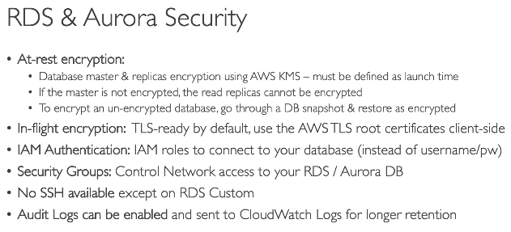 

### RDS Proxy
- this will manage DB connection pool
- but we can create DB conn pool in code then why RDS proxy
- If we have 50 EC2 instances, and the app code creates 20 DB coons, then total 100 DB connections will be opened to with the DB
- more over if Lambdas connect to DB, then there can be 10 lambda's so more DB conns, plus every time labda does cold start, it will have to establish new DB conn
- so instead use RDS proxy, which will maintain DB pool for us
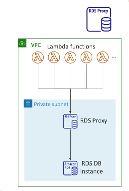 
- RDS proxy is not publicly available
- to connect to RDS proxy from code, provide RDS proxy conn, string
- so as long as EC2 instacnes are withing same VPC, it will work
- but same code from local comp will not work, we might have to use VPN then

## Elastic cache
- AWS managed Redis / memcache
- use case - performance, store user's session, so all EC2 instances can access user sessions, and we don't need sticky sessions any more

#### Creating Elastic cache
- note in below Val-key is Redis only

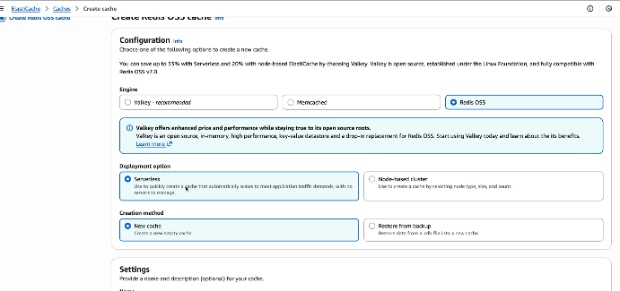  
- rest steps are more or less similar ro RDS creation
- it will give us Redis's primary and read replica endpoints, which we can use in app code to connect

#### Caching strategies
| Pattern | Flow | Key Idea |
|--------|------|----------|
| **Lazy Loading (Cache Aside)** | Read → Cache Miss → DB → Cache | Cache populated on **read miss**. |
| **Write Through** | Write → Cache → DB *(or DB → Cache in some implementations)* | Cache updated at **write time**, so future reads hit the cache. |

#### Cache Eviction policies
1. Delete from cache on DB delete
2. LRU
3. TTL

#### AWS MemoryDB for Redis

- A **Redis-compatible, durable in-memory database** managed by AWS.
- Stores data in memory for low latency while also persisting it across multiple AZs for durability.

**Use Cases** -
- **Real-time leaderboards** in gaming.
- **User profiles/shopping carts** requiring microsecond latency and durability.
- Applications that need Redis performance **without losing data** on node failures.

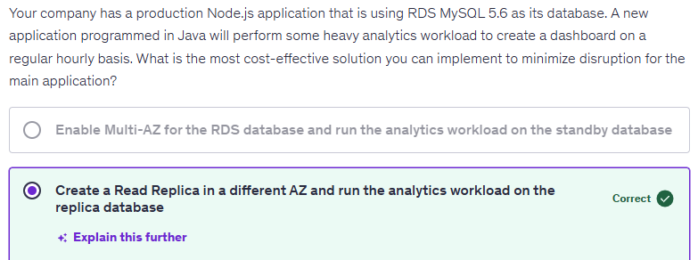  

## DynamoDB
- NoSQL AWS DB
- it is serverless DB, so you just directly create tables (NoSQL), no need for DB instance
- DynamoDB can have only 1 table
- similar to Elastic cache, we have DAX (DynamoDB Accelerator) - caching, but just for DynamoDB
- we can use Elastic cache for DynamoDB as well, but DAX is more performant and specially designed for DynamoDB

## Redshift
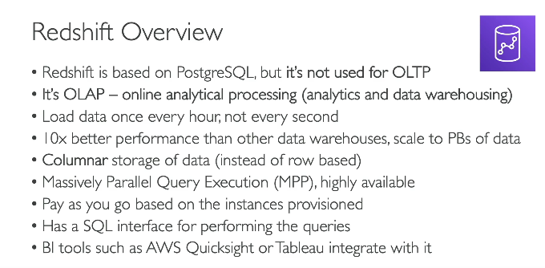 

## EMR
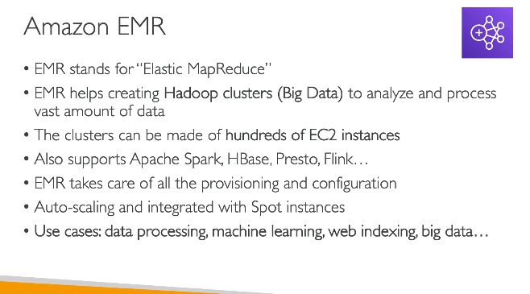 

## Athena
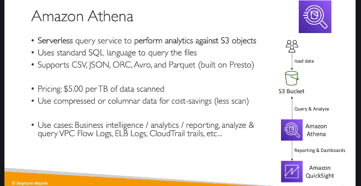 

## Quicksight
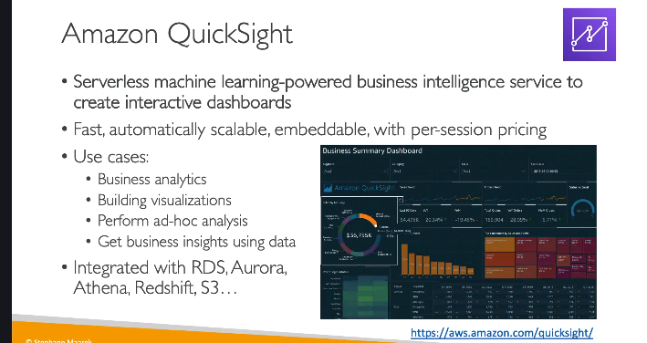 

## DocumentDB
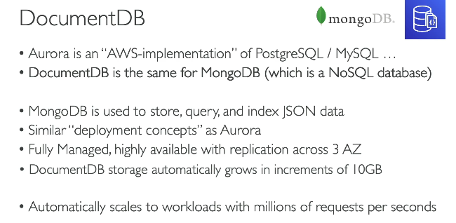 
- DynamoDB - fully serverless, DocumentDB - it will have instance of NoSQL like MondoDB

## Neptune
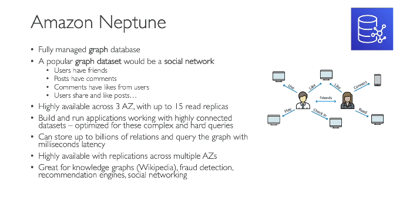 

## Timestream
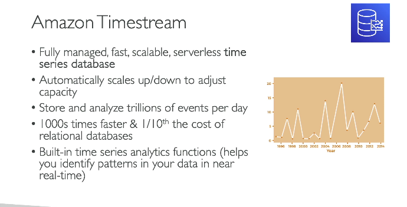 

## ManagedBlockchain
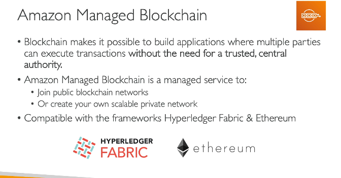 

## Glue
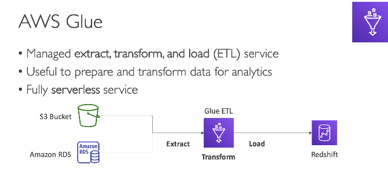 

## Database migration service
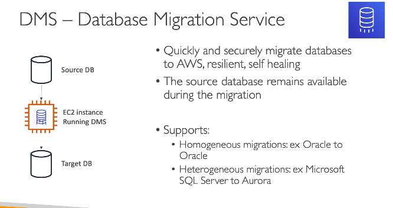 