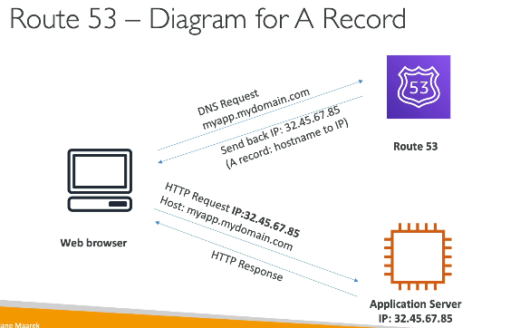
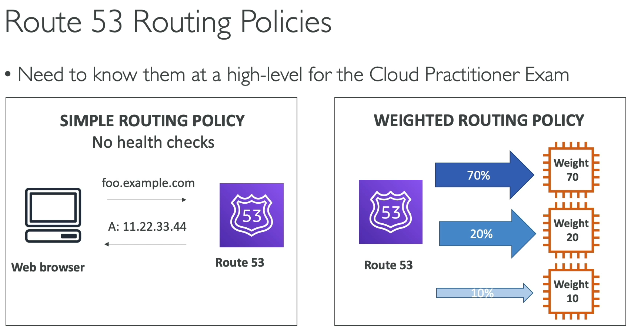
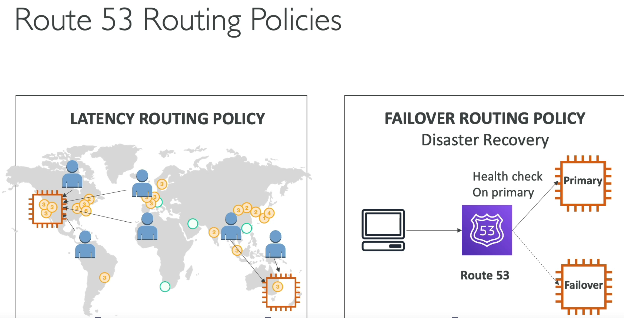

- all the servies listed below are to make our application globally accessible, and improve performance
# Route53
- it is a managed DNS - i.e, DNS service is managed by AWS
- so in Route53, we map the IP of a server (where our app is deployed, maybe EC2). with a domain url
 

## R53 Policies
 
1. simple - give url, get IP
2. weighted - R53 will ensure, 70& traffic goes to sever 1, 20 to server 2, and 10 to server 3, kind of loadbalancing
 
3. latency based - R53 will ensure, users are given IP of server which are closed to them
4. Faliover routing policy - R53 will give IP of other server, if it sees one of the server is down

### Configuring Route53
1. Register Domain (ashish.com) - need to pay around $12/yr
2. Create A record in R53, map your server IP with subdomain - app1.ashish.com - EC2 instance IP

# Cloudefront
- managed CDS - i.e, CDN service is managed by AWS
- cache static content on CDN, which are close to user's location

## Cloudefront origins
- these are backend services which can be connected to cloudfront
- so cloudfront will first make request to backend origin which will then cache data to it's edge location
- backed services could be S3, any static HTTP website, or any API gateway REST endpoint, so cloudfront can call these resources and cache them

### Configuring cloudfront
- Open cloudfront, select plan
- select origin (in our case, lets use s3)
- select bucket, configure bucket patterns
- then cloudfront will give url - random-string.cloudefront.net, we can access this 
- note, we can keep s3 object private and make them accessible via cloudfront

### AWS Global accelerator
- we know internet across countries is connected via cables under the ocean
- AWS global accelerator, provides dedicated AWS cables inside ocean, making it a provate network, and fast, because it is a dedicated network
- hence it is fast and secured

### AWS outpost
- All AWS infra on prem
- infra will have prebuilt AWS services

### AWS wavelength
- AWS will install the infra inside telecome provider's data centers
- hence reduces latency, so req does not need to go to AWS data centers
- useful when users have 5G connection

## Memory Trick
**Region** → A city-sized AWS area (e.g., Mumbai)
**Availability Zone** → A data center (or group of data centers) inside that city (1 region as min 3 availability zones)
**Local Zone** → A small AWS extension closer to users outside the main city, connected via ultra-low latency
**Edge Location** → A cache point that brings content very close to users

Region > Availability Zone > Local Zone > Edge Location

### How to Choose a Region when building apps?
- **Latency:** Choose a region close to your users.
  - Example: Indian users → Mumbai region.
- **Compliance/Data Residency:** Some regulations require data to stay in a specific country or region.
- **Service Availability:** Not all AWS services are available in every region.
- **Cost:** Pricing varies between regions.
- **Disaster Recovery:** Choose additional regions if you need cross-region failover.
