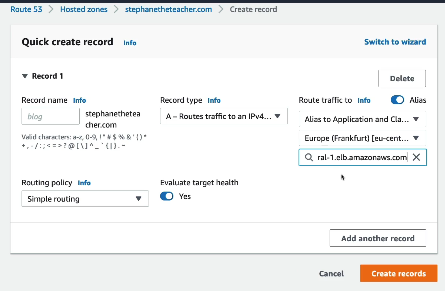
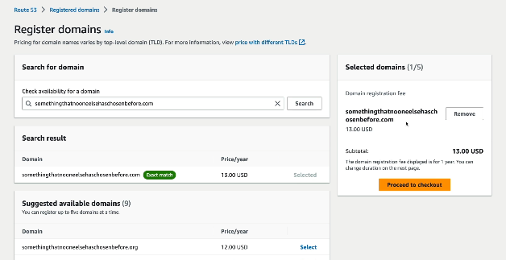
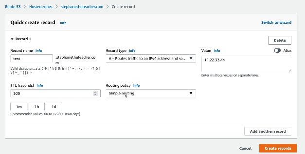
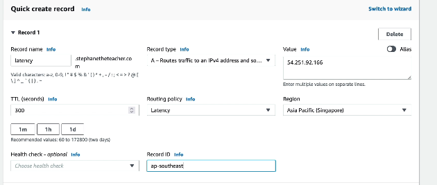
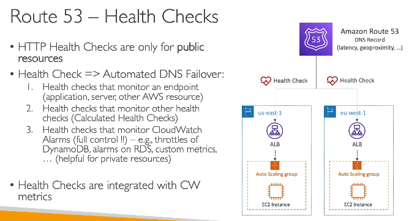
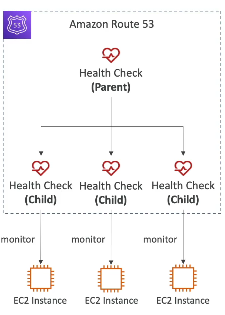
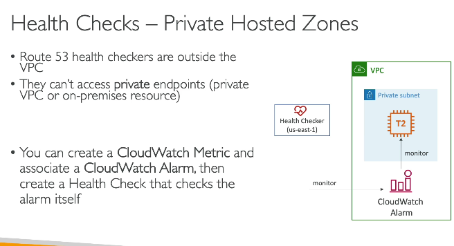
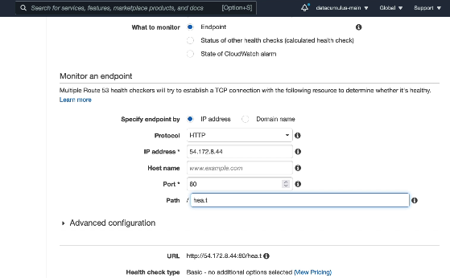

- all the servies listed below are to make our application globally accessible, and improve performance
# Route53
- it is a managed DNS - i.e, DNS service is managed by AWS
- it is Authorative DNS - that means we can update the DNS records, it is not just a normal DNS lookup server
- it is also a DNS registrar - it is like Godady, we can purchase domain names here
- so in Route53, we map the IP of a server (where our app is deployed, maybe EC2). with a domain url
 

### Route 53 record types
| Record Type | Purpose | Example | Resolves To |
|------------|---------|---------|-------------|
| **A** | Maps a domain name to an **IPv4** address. | `api.example.com → 54.12.34.56` | IPv4 address |
| **AAAA** | Maps a domain name to an **IPv6** address. | `api.example.com → 2406:da1c::1234` | IPv6 address |
| **CNAME** | Makes one domain an alias of another domain, if you don't want users to see .elb.amazonaws.com, then CNAME is to be updated | `my-alb-123.ap-south-1.elb.amazonaws.com → api.example.com`, or `fb.com` -> `facebook.com` | Another domain name |
| **NS** | These tell the internet: "If you want DNS records for example.com, ask these name servers." | `example.com → ns-123.awsdns-45.com` | Name servers |

- Seems like AWS has 4 authorative name servers (NS), which will include all the above 4 records
```
- ns-123.awsdns-45.com
- ns-678.awsdns-12.net
- ns-910.awsdns-56.org
- ns-111.awsdns-78.co.uk
```

The public DNS system knows to query AWS Route 53 because your **registrar** publishes **NS records** that say:
> "For `example.com`, ask these Route 53 name servers."
After that, all DNS queries for `example.com` are forwarded to Route 53's authoritative name servers (the 4 NS servers we listed above).
- then these NS servers already know the IP for a domain name by looking at A and AAAA records

**A Hosted Zone is a collection of DNS records for a domain in Route 53.**
- These hosted zones holds the actual records, name servers just look into these records
- one organization can have 20-30 sub domains, and AWS manages 1000 such orgs, so even if record data is small the list of records is still large, so hosted zones are used to store this info

- **Public Hosted Zone** stores DNS records that are resolvable from the internet.
- **Private Hosted Zone** stores DNS records that are resolvable only from associated VPCs.
- hence in a company, internal websites are not accessible over normal internet, e.g. dev.principal.com cannot be access from a device which is not connect to the company's internal network
- becasue, the DNS record (dev.principal.com) is resolvable only from the company's VPC/network.
- so we need to connect to VPN
- but internal websites are not just protected via Private hosted zones, they are also protected by
1. **Private IPs** - private IPs are routable only inside the VPC/corporate network. 
2. **Security groups** - if private IPs are not used then protected via security groups
3. **Firewalls**

**CNAME vs Alias** - 
| Feature | CNAME | Alias (Route 53) |
|--------|--------|------------------|
| Standard DNS record | ✅ Yes | ❌ No (AWS-specific) |
| Points to | Another domain name | AWS resource or another record |
| Can be used at root domain (`example.com`) | ❌ No | ✅ Yes |
| Extra DNS lookup required | ✅ Yes | ❌ No (Route 53 resolves it internally) |
| Common Targets | `www.example.com -> example.com` | `example.com -> ALB / CloudFront / S3 website` |



- notice - that if we had used CNAME, we can provide the target as another domain name only, but this is alias record (alias toggle is on), so target can be any AWS resource
- why to use Alias? - if I purchased ashish.com domain, I can apply CNAME only on it's subdomain, but if I want a app running on ashish.com and not on any subdomain, then it can be done using alias only, (you can see in above screenshot the record name blog is empty, but it is required if record type is CNAME)

If your application is behind an **ALB**, you typically **do not create a normal A record**.
Instead, you create:
```text
www.example.com
      |
      | Alias A record
      v
my-alb-123.ap-south-1.elb.amazonaws.com
      |
      v
ALB
      |
      v
EC2 / ECS / Lambda
```

#### Registering a domain


- then provide your contact info
- then do the payment, and you have your domain name  
- AWS will create NS record by default for your domain, since AWS knows it's NS servers

#### Creating records
- so now test.stephantheteacher.com will point to IP 11.22.33.44


- the TTL field tells the client browser to cache the DNS record (domain to IP mapping) for these many seconds
- if TTL is 24hrs, and if we update the record type, lets say we update the A record with different IP, the clients will have stale DNS records for upto 24hrs, based on when they last queried the DNS server

### R53 Routing Policies
- This defines how R53 will respond to DNS queries
- this routing is not same as ALB routing policies
- ALB routing - routes traffic, basically client's requests
- R53 routing policies - which IP to send to the user when looking for IP from Domain name

User -> DNS query: www.example.com
      -> Route 53 returns Mumbai ALB IP

User -> HTTP request to Mumbai ALB
      -> ALB routes /api/* to API target group


Routing policies determine **which IP address (or endpoint)** Route 53 returns in the DNS response.

#### Example

```text
app.example.com

A Records:
- 3.10.10.10 (Mumbai)
- 18.20.20.20 (Singapore)
```

| Routing Policy | What Route 53 Returns |
|----------------|-----------------------|
| **Simple** | One or more configured IPs |
| **Weighted** | IPs according to the configured weights |
| **Latency** | The endpoint with the lowest latency |
| **Geolocation / Geoproximity** | The endpoint for the user's region |
| **Failover** | The primary endpoint unless health checks fail |

---


#### Does Routing Happen Only Once?

**Yes.**

The routing policy is evaluated **only when a DNS lookup reaches Route 53** untill the DNS cache expires (TTL we set above)

```text
Browser
    │
    │ DNS Query
    ▼
Route 53
    │
    │ Applies Routing Policy
    ▼
Returns IP Address
    │
    ▼
DNS Cache (TTL)
    │
    ├── Subsequent requests use the cached IP
    └── No Route 53 lookup until TTL expires
```

---

#### Key Points

- ✅ Route 53 routing policies are applied **only during DNS resolution**.
- ✅ After that, the returned IP is **cached** for the record's **TTL**.
- ✅ While cached, requests go to the **same IP**.
- ✅ Once the TTL expires and a fresh DNS lookup occurs, Route 53 may return a **different IP** according to the routing policy.

### Route 53 → ALBs → EC2

```text
                        User
                          │
                          │ DNS Query
                          ▼
                    Route 53
              (Routing Policy Applied)
                          │
        ┌─────────────────┴─────────────────┐
        │                                   │
        │                                   │
 ALB - Mumbai (A Record 1)          ALB - Singapore (A Record 2)
   alb-mumbai...amazonaws.com         alb-sg...amazonaws.com
        ▲                                   ▲
        │                                   │
        └────── Route 53 returns ONE based on
                the routing policy ──────────┘
                          │
                          ▼
                Client connects to
                the selected ALB only
                          │
                          ▼
               Selected ALB Load Balances
                          │
                ┌─────────┴─────────┐
                ▼                   ▼
          EC2 Instance 1      EC2 Instance 2
```

#### Why Multiple A Records Pointing to Different ALBs?

The most common use case is **multi-region deployments**.

Suppose you have:

| Region | ALB | Backend |
|--------|-----|---------|
| Mumbai (`ap-south-1`) | ALB-1 | EC2 instances in Mumbai |
| Singapore (`ap-southeast-1`) | ALB-2 | EC2 instances in Singapore |

Both ALBs are configured as **A (Alias)** records for:

```
app.example.com
```

Route 53 chooses **which ALB** to return.

---

#### Examples

| Routing Policy | Which ALB is Returned? |
|----------------|------------------------|
| **Latency** | Nearest ALB (e.g., Mumbai users → Mumbai ALB, Singapore users → Singapore ALB) |
| **Weighted** | 80% Mumbai ALB, 20% Singapore ALB (for canary or gradual rollout) |
| **Failover** | Primary ALB unless it becomes unhealthy, then secondary ALB |
| **Geolocation** | ALB based on user's country/continent |
| **Geoproximity** | ALB closest to the user's geographic location |

---

Route 53 decides **which ALB (or region)** the user should reach.

The selected **ALB** then decides **which healthy EC2 instance** should serve the request.

**Route 53 performs global routing.**

**ALB performs local load balancing within a region.**

### 1. Simple routing policy
- Route 53 returns the **single configured record** for a domain.
- If multiple records are configured, Route 53 returns them in a random order (round-robin style). 
- e.g. - Every DNS query for www.example.com will always return IP - 54.12.34.56, again if multipe A records are added, then any random IP will be shared

 

### 2. weighted 
- R53 will ensure, 70& traffic goes to sever 1, 20 to server 2, and 10 to server 3
- now this is actual loadbalancing, it distributes traffic

| Service | Typical Use Cases |
|--------|-------------------|
| **Route 53 Weighted Routing** | • Blue/Green deployments<br>• Canary releases<br>• Gradually shifting traffic between regions or environments |
| **Load Balancer** | • Distributing requests among servers in the same application/environment<br>• High availability and scaling |

A **Canary Release** is a deployment strategy where you send a **small percentage of users** to the new version first, and gradually increase traffic if everything works fine.

### 3. latency based 
- R53 will ensure, users are given IP of server which are closed to them

  
- R53 does not know which target IP belongs to which region
- so for a target IP, we specify policy as latency and then choose region the rgion, we know the IP belongs to 
- then Route 53 uses the source of the DNS query (typically the user's DNS resolver), to determine which IP sits closer to the user

#### R53 Healthchecks
- if we have apps deployed on mutli-region
- and if we use latency based DNS routing  

  
- then if 1 region is down (us-east 1), then our R53 will still redirect user's query to us-east-1, becuase if it is closer to a user, then R53 will route to the failed ALB only, since R53 does not know if server is up or down
- for this purpose, we use healthchecks
- **One liner - healthchecks are used for automated DNS failover**

#### Healthchecks types
1. endpoint monitoring healthchecks (works for public endpoints)
- AWS will use 15 healthchecks servers (from all regions) to hit your endpoint
- These heltcheck servers come from all the regions, and they are also not part of VPC, so it is IMP for our ALBs to allow incoming traffic from AWS's healthservers, this IPs can be found in AWS docs  

2. Calculated healthchecks  

  
- combines the results of multiple Route 53 health checks using logical rules (e.g., AND/OR) to determine the overall health of the parent healtchecker (we can configure rules, e.g. if out of 100 heltcheckers if 80 healthcehckers are green, the parent heltchecker is green).
- usecase - to monitor progress of mainteneance of website, while app is maintaing, those individual components and parent heatlcare will be unhealthy, app will be healthy when parent is healthy  

3. Private hosted zones (used to helthcheck enpoints which are private, not exposed to public)  

  

#### Configuring healthchecks
- Endpoint readio button is selected, indicating it is enpoint type of heatlcheck
- the IP added below is the IP of EC2 that we want to monitor
  

### 3. Routing failover policy
- if one ALB is down then R53 will route requests to standup ALB (if we have multiple ALBs)

### 4. Routing policy - geolocation
- Routes users based on their **geographic location** (country, continent, or US state).
- Route 53 determines the user's location from the **source IP of the DNS query**.

**Use Case** - Serve different websites based on country
```text
India users    -> india.example.com
US users       -> us.example.com
Others         -> global.example.com
```

| Routing Policy | Chooses Endpoint Based On | Example |
|----------------|---------------------------|---------|
| **Latency-Based** | **Lowest network latency** (fastest response) | A user in Delhi may be routed to **Mumbai** instead of Singapore because it responds faster. |
| **Geolocation** | **User's geographic location** (country/continent/state) | Users from **India → Mumbai**, users from **Japan → Tokyo**, regardless of latency. |

### 5. GeoProximity policy 
- Routes users to resources based on their **geographic proximity** to AWS Regions or AWS Local Zones.
- You can apply a **bias** to increase or decrease the traffic sent to a region.

Suppose you have:

```text
Mumbai Region
Singapore region
```
Normally:

Users near India → Mumbai
Users near SG → SG

But if Mumbai is overloaded, you can apply a negative bias to Mumbai so that some nearby users are routed to SG instead. Even in this, first the users that are almost equidistance, or marginally closer to Mumbai will go to SG, based on the traffic

Geolocation vs Geoproximity
Geolocation → "Users from India always go to Mumbai."
Geoproximity → "Users are routed to the nearest region, but I can adjust traffic using bias."

### 6. IP based routing
- R53 will route users based on user's IP
- usecase - 

### 5. Multi value routing policy
- Route 53 returns **multiple healthy IP addresses** for the same DNS query.
- If an endpoint becomes unhealthy, Route 53 stops returning its IP.
- users query for DNS Query: app.example.com
- R53 will return mutliple IP address
- The client OS/browser picks one of the returned IPs to connect to.
- save cost using of load baancing, if use case is for smaller applications with few EC2 instance, cheaper that normal ALB

### GoDaddy vs R53
- buy domain in Godaddy
- add A record to map IP with the created domain name
- AWS gives NS records
- add those in Godady's NS records, so go daddy can pass on request to r53 

# Cloudefront
- managed CDS - i.e, CDN service is managed by AWS
- cache static content on CDN, which are close to user's location

## Cloudefront origins
- these are backend services which can be connected to cloudfront
- so cloudfront will first make request to backend origin which will then cache data to it's edge location
- backed services could be S3, any static HTTP website, or any API gateway REST endpoint, so cloudfront can call these resources and cache them

### Configuring cloudfront
- Open cloudfront, select plan
- select origin (in our case, lets use s3)
- select bucket, configure bucket patterns
- then cloudfront will give url - random-string.cloudefront.net, we can access this 
- note, we can keep s3 object private and make them accessible via cloudfront

### AWS Global accelerator
- we know internet across countries is connected via cables under the ocean
- AWS global accelerator, provides dedicated AWS cables inside ocean, making it a provate network, and fast, because it is a dedicated network
- hence it is fast and secured

### AWS outpost
- All AWS infra on prem
- infra will have prebuilt AWS services

### AWS wavelength
- AWS will install the infra inside telecome provider's data centers
- hence reduces latency, so req does not need to go to AWS data centers
- useful when users have 5G connection

## Memory Trick
**Region** → A city-sized AWS area (e.g., Mumbai)
**Availability Zone** → A data center (or group of data centers) inside that city (1 region as min 3 availability zones)
**Local Zone** → A small AWS extension closer to users outside the main city, connected via ultra-low latency
**Edge Location** → A cache point that brings content very close to users

Region > Availability Zone > Local Zone > Edge Location

### How to Choose a Region when building apps?
- **Latency:** Choose a region close to your users.
  - Example: Indian users → Mumbai region.
- **Compliance/Data Residency:** Some regulations require data to stay in a specific country or region.
- **Service Availability:** Not all AWS services are available in every region.
- **Cost:** Pricing varies between regions.
- **Disaster Recovery:** Choose additional regions if you need cross-region failover.
