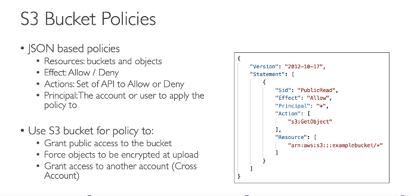
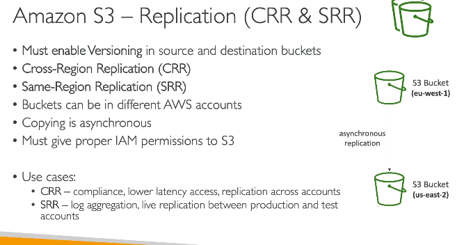
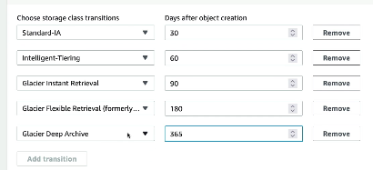
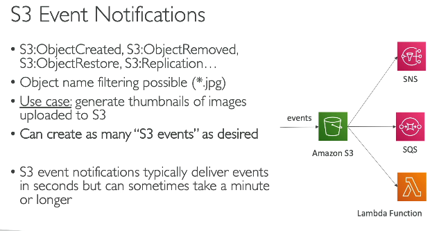
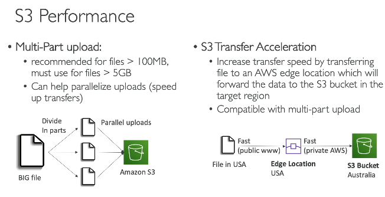

# S3 - Simple storage service
- 1 file size can be upto 50TB
- can be used for backup, recovery
- static website hosting
- Media hosting
- big data analytics

## Buckets and Objects
- each bucket name must be unique across regions and across all AWS accounts around the world
- objects are files, and each obj has key which is path to that file
- s3 buckets are at region level
- we can use **Account regional namespace** - which allows using same bucket name, because it is in a namespace, AWS will auto add account regional namespace suffix to the bucket

## S3 Security policy
**Policy at 2 levels**
- User level - 1. IAM permissions (which user in AWS will have access) - IAM roles (for Ec2 / other service to access S3 object) restrict via 2. IAM roles, contol access vai API calls
- Resource level policy - (Bucket policy)
### Bucket policy
  
**principal** - principal refers to which user/account this policy applies to 

- Default: S3 buckets have Block Public Access enabled at creation.
- If you disable Block Public Access, objects have a normal public URL and can be accessed directly.
- **IMPP - If Block Public Access is enabled, you can still share objects using a pre-signed URL.**
- A pre-signed URL embeds a signature/token and grants time-limited access to anyone with the link.
- Pre-signed URLs work in incognito/external browsers while valid; they expire afterward.

### Static website hosting
1. Enable static website hosting for a bucket, bucket must be public
2. Upload index.html, and all your static html css and js files, in your index.html - you can references css /img /js files relative to your bucket

## Bucket versioning 
- e.g. on static website, we want to rollback to previos version of the app, for e.g. revert index.html file changed, then enable versioning for the bucket, this way, if we click on show versions, all the previous versions are shown and we can select which sould be the latest version

### S3 replication
  
- **S3 batch replication** - the S3 replication will only replicate new objects, to replicate objects which were already in the bucket use **S3 batch replication**

### Storage gateway
- allows on-prem servers to use AWS cloud storage

## S3 Storage Classes (quick comparison)

| Storage class | Definition (holistic) | Typical access pattern | Retrieval time / min duration | Cost (relative) |
|---|---|---|---|---|
| Standard | General-purpose for frequently accessed data; highest availability and low latency. | Frequent | Immediate / no minimum | Highest |
| Intelligent-Tiering | Automatically moves objects between access tiers based on usage to optimize cost for unknown patterns. | Unknown / changing | Immediate | Monitoring fee; lower average cost |
| Standard‑IA (Infrequent Access) | For long-lived but infrequently accessed data that needs rapid access when required. | Infrequent | Immediate / 30 days min | Lower storage, retrieval fee |
| One Zone‑IA | Same as Standard‑IA but stored in a single AZ — cheaper but lower resilience. | Infrequent | Immediate / 30 days min | Cheaper than Standard‑IA |
| Glacier Instant Retrieval | Archive storage with millisecond retrieval for seldom-accessed data requiring fast reads. | Rare archive | Milliseconds | Very low storage, retrieval fee |
| Glacier Flexible Retrieval | Archive with configurable retrieval options (minutes to hours) — good for bulk restores. | Archive | Minutes to hours | Very low storage |
| Glacier Deep Archive | Lowest-cost long-term archive for data rarely retrieved; retrieval takes hours. | Long-term archive | Hours | Lowest |

**S3 objects can be shared across AWS accounts**  

### S3 storage lifecycle
- S3 Lifecycle Rules automatically transition objects to cheaper storage classes or delete them after a specified time to optimize storage costs and manage data retention.

| Action | Example |
|-------|---------|
| Transition to another storage class | After 30 days → S3 Standard-IA |
| Archive | After 90 days → Glacier Flexible Retrieval |
| Delete old object versions | Delete non-current versions after 30 days |

e.g. 
```text
Day 0    -> S3 Standard
Day 30   -> S3 Standard-IA
Day 90   -> Glacier Flexible Retrieval
Day 365  -> Delete
```

**S3 Storage Class Analysis** - identifies infrequently accessed objects by analyzing access patterns. The insights are then used to create Lifecycle Rules that automatically transition objects to cheaper storage classes.

- under s3 bucket, go to management -> lifecycle management
  

#### S3 events
  
- apart from these events are now sent to event bridge as well

 