# S3 - Simple storage service
- 1 file size can be upto 50TB
- can be used for backup, recovery
- static website hosting
- Media hosting
- big data analytics

## Buckets and Objects
- each bucket name must be unique across regions and across all AWS accounts around the world
- objects are files, and each obj has key which is path to that file
- s3 buckets are at region level
- we can use **Account regional namespace** - which allows using same bucket name, because it is in a namespace, AWS will auto add account regional namespace suffix to the bucket

## S3 Security policy
**Policy at 2 levels**
- User level - 1. IAM permissions (which user in AWS will have access) - IAM roles (for Ec2 / other service to access S3 object) restrict via 2. IAM roles, contol access vai API calls
- Resource level policy - (Bucket policy)
### Bucket policy
  
**principal** - principal refers to which user/account this policy applies to 

- Default: S3 buckets have Block Public Access enabled at creation.
- If you disable Block Public Access, objects have a normal public URL and can be accessed directly.
- **IMPP - If Block Public Access is enabled, you can still share objects using a pre-signed URL.**
- A pre-signed URL embeds a signature/token and grants time-limited access to anyone with the link.
- Pre-signed URLs work in incognito/external browsers while valid; they expire afterward.

### Static website hosting
1. Enable static website hosting for a bucket, bucket must be public
2. Upload index.html, and all your static html css and js files, in your index.html - you can references css /img /js files relative to your bucket

## Bucket versioning 
- e.g. on static website, we want to rollback to previos version of the app, for e.g. revert index.html file changed, then enable versioning for the bucket, this way, if we click on show versions, all the previous versions are shown and we can select which sould be the latest version

### S3 replication
  
- **S3 batch replication** - the S3 replication will only replicate new objects, to replicate objects which were already in the bucket use **S3 batch replication**

### Storage gateway
- allows on-prem servers to use AWS cloud storage

## S3 Storage Classes (quick comparison)

| Storage class | Definition (holistic) | Typical access pattern | Retrieval time / min duration | Cost (relative) |
|---|---|---|---|---|
| Standard | General-purpose for frequently accessed data; highest availability and low latency. | Frequent | Immediate / no minimum | Highest |
| Intelligent-Tiering | Automatically moves objects between access tiers based on usage to optimize cost for unknown patterns. | Unknown / changing | Immediate | Monitoring fee; lower average cost |
| Standard‑IA (Infrequent Access) | For long-lived but infrequently accessed data that needs rapid access when required. | Infrequent | Immediate / 30 days min | Lower storage, retrieval fee |
| One Zone‑IA | Same as Standard‑IA but stored in a single AZ — cheaper but lower resilience. | Infrequent | Immediate / 30 days min | Cheaper than Standard‑IA |
| Glacier Instant Retrieval | Archive storage with millisecond retrieval for seldom-accessed data requiring fast reads. | Rare archive | Milliseconds | Very low storage, retrieval fee |
| Glacier Flexible Retrieval | Archive with configurable retrieval options (minutes to hours) — good for bulk restores. | Archive | Minutes to hours | Very low storage |
| Glacier Deep Archive | Lowest-cost long-term archive for data rarely retrieved; retrieval takes hours. | Long-term archive | Hours | Lowest |

**S3 objects can be shared across AWS accounts**  

### S3 storage lifecycle
- S3 Lifecycle Rules automatically transition objects to cheaper storage classes or delete them after a specified time to optimize storage costs and manage data retention.

| Action | Example |
|-------|---------|
| Transition to another storage class | After 30 days → S3 Standard-IA |
| Archive | After 90 days → Glacier Flexible Retrieval |
| Delete old object versions | Delete non-current versions after 30 days |

e.g. 
```text
Day 0    -> S3 Standard
Day 30   -> S3 Standard-IA
Day 90   -> Glacier Flexible Retrieval
Day 365  -> Delete
```

**S3 Storage Class Analysis** - identifies infrequently accessed objects by analyzing access patterns. The insights are then used to create Lifecycle Rules that automatically transition objects to cheaper storage classes.

- under s3 bucket, go to management -> lifecycle management
  

#### S3 events
  
- apart from these events are now sent to event bridge as well

 

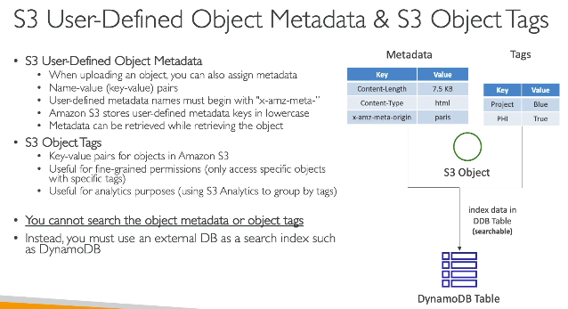 
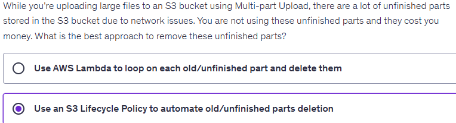 

## S3 security

### 1. Encryption
1. SSE-S3 - server side encryption - Default
2. SSE-KMS
3. SSE-C
4. Client side encryption (frst 3 are server side encryption)

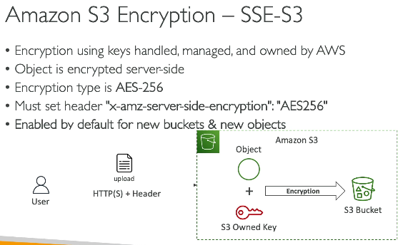 
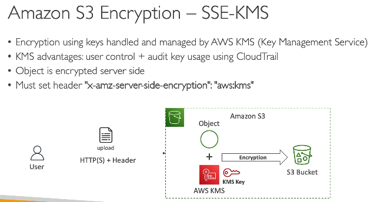 
- note with SSE KMS - AWS will call KMS APIs, and quota limits can be a limiting factor
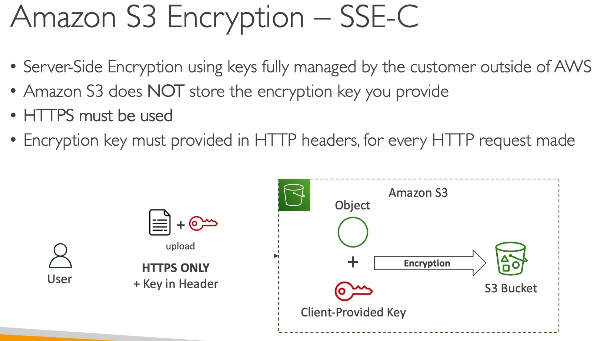 
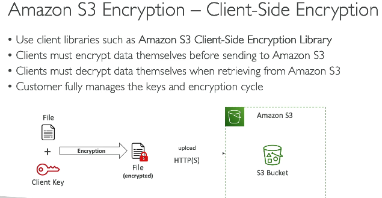 
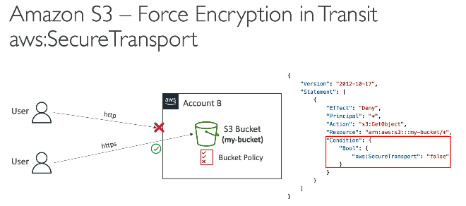 

- S3 encryption mainly protects data at rest. 
- With SSE-S3 and SSE-KMS, S3 automatically decrypts data for authorized users.
- If you want AWS to store only encrypted bytes that it cannot decrypt, use client-side encryption.

### 2. S3 and CORS
- our app deployed to myapp.ashish.com
- it returns index.html with img link - https://s3-bucket-url/coffee.jpg
- but browser sees request to img originated from domain ashish.com, and the image is in different domain
- unless the S3 server is configured with CORS to include myapp.ashish.com domain in it'a allowed origin, req. will fail
- in below in the allowed origins, add your domain to solve CORS issue
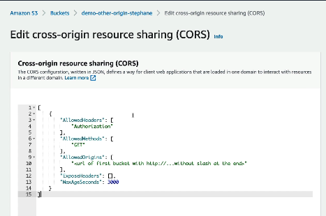 

### 3. S3 MFA delete
- enable MFA for distructive actions on S3 (like deleting bucket / object)

### 4. S3 access logs
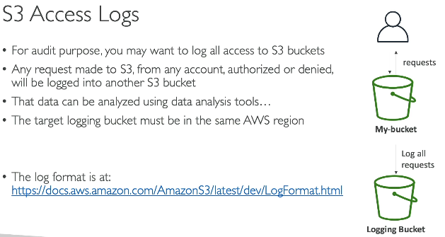 
- create a new bucket, which will store the log files
- go to the bucket for which you want to enable logs -> select properties -> serverside logs -> then select target bucket (created above), where the logs will be stored

### 5. S3 pre-signed urls
- we have private bucket
- so not accessible publicly
- but we want to share one file with anonymous user (outside AWS)
- generate pre-signed URL and share this URL with that user, he will be able to access for certain duration
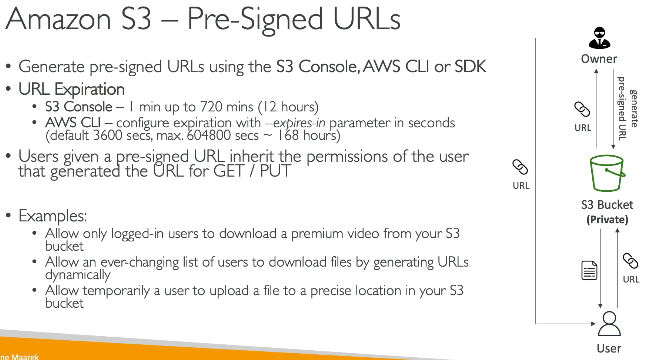 
- go to object -> click on object action dropdown -> Share with pre-signed URL
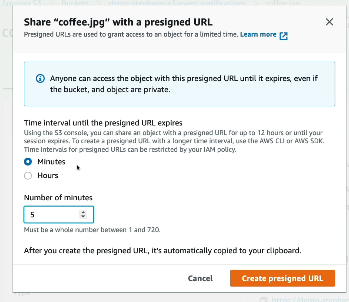 

### 6. S3 access points
- lets multiple applications or teams use the same S3 bucket while each team can access only specific directory within that bucket. (fine-grained access control)
**Example:**
```text
Bucket name: company-data
web-app AP      -> Can read/write only to this directory`/users/*`
analytics AP    -> Can read `/logs/*`
finance AP      -> Can read/write `/payments/*`
```
| Aspect | Bucket Policy | S3 Access Point |
|-------|---------------|-----------------|
| Scope | Entire bucket | Specific application/team |
| Number | One policy per bucket | Multiple access points per bucket |
| Use Case | Small/simple setups | Large orgs with many apps/teams |

**Problem with Bucket Policy** -  Suppose one bucket is used by:
- Web App
- Analytics Team
- ML Team
- Finance Team
You end up with **one large bucket policy**:
```text
Bucket Policy
├── Allow Web App
├── Allow Analytics
├── Allow ML
├── Allow Finance
└── Deny ...
```

- Bucket Policies control access to the entire S3 bucket using a single policy. S3 Access Points provide separate endpoints and policies for different applications or teams, making access management simpler and more scalable

### 7. S3 object lambda
- lets you **modify an S3 object on-the-fly** using a Lambda function **before returning it to the client**
- why not use lambda functions directly, which will call s3 and modify object and send it to user
**Direct lambda** - 
Client
   |
API Gateway
   |
Lambda
   |
GetObject from S3
   |
Transform
   |
Return response

**S3 Object lambda** - 
Client
   |
GET Object
   |
S3 Object Lambda Access Point
   |
Lambda (transform)
   |
S3

The client still thinks: - he is calling s3 get API
```GET s3://bucket/customers.json```
but receives the transformed version.  
this allows presenting different views of the same object to different users  

-With direct Lambda, the client calls Lambda and Lambda fetches/transforms the S3 object. With S3 Object Lambda, the client still performs a normal S3 GetObject, and S3 automatically invokes Lambda to transform the object before returning it.

> [!NOTE]
> - 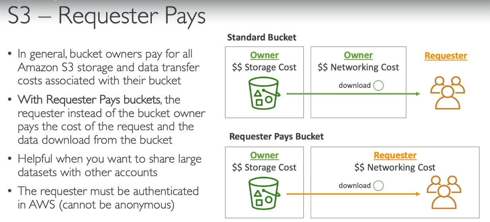  
> - 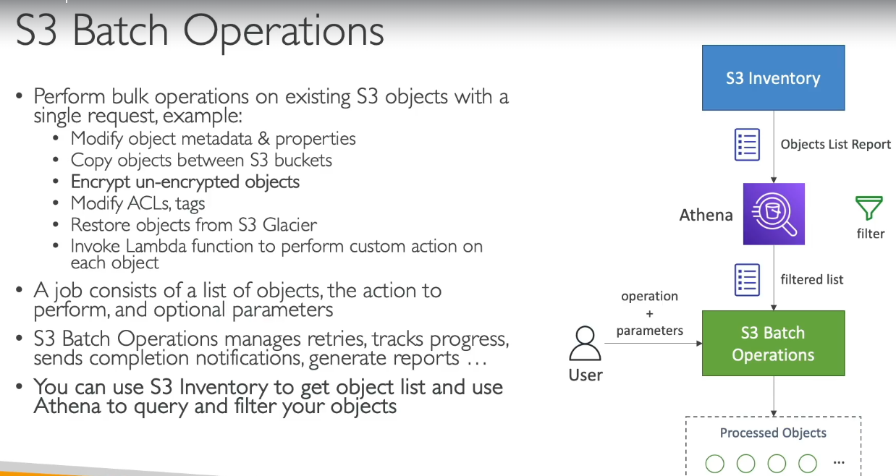  

> [!NOTE]
> #### How S3 Select Works
>
> ```text
> Application
>      │
> SQL Query
>      ▼
> S3 Select
>      │
> Reads S3 Object (CSV / JSON / Parquet)
>      │
> Filters matching rows/columns
>      ▼
> Returns only the required data
>      │
>      ▼
> Application
> ```
>
> **Example**
>
> **orders.csv**
>
> ```text
> OrderId,CustomerId,Amount
> 1,101,500
> 2,102,800
> 3,101,1200
> ```
>
> Application sends:
>
> ```sql
> SELECT * FROM S3Object WHERE CustomerId = 101
> ```
>
> **Without S3 Select**
> ```text
> Download entire CSV (e.g., 10 GB)
>        │
> Filter locally
> ```
>
> **With S3 Select**
> ```text
> S3 reads the file
>        │
> Returns only:
>
> OrderId,CustomerId,Amount
> 1,101,500
> 3,101,1200
> ```
>
> **Remember**
> - **Application sends SQL → S3 Select.**
> - **S3 Select reads and filters the S3 object.**
> - **Only the matching data is returned**, not the entire object.
>````

> #### Amazon S3 Storage Lens
> - **S3 storage lens** - helps analyze and optimize **only** S3 bucket's storage across region and across AWS Org with multiple accounts. It can aggregate all data from all buckets and create reports, which we can use to optimize cost
> #### S3 Storage Lens Metrics
>
> | Metric Category | What it Shows |
> |-----------------|---------------|
> | **Summary Metrics** | Overall storage usage, object count, and request activity across S3. |
> | **Cost Optimization Metrics** | Identifies opportunities to reduce storage costs (e.g., transition infrequently accessed data to cheaper storage classes). |
> | **Data Protection Metrics** | Shows the status of versioning, replication, and encryption for your S3 data. |
> | **Access Management Metrics** | Shows bucket/object permissions and public access settings to help identify overly permissive access. |

> ### S3 Glacier vault lock
> - WORM (Write Once Read Many) model
> - Create a Vault lock policy so that once data added to vault can never be modified / deleted
> - We can also lock this **Vault lock policy** - so that the policy itself cannot be changed
> - Use for compliance related stuff
> - **Glacier Vault lock is for buckets, S3 Object lock if for objects to lock them**  
> - 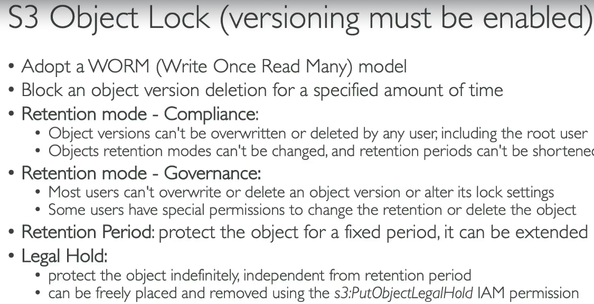  
