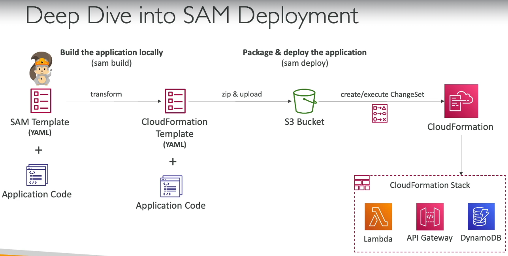

# SAM
- AWS SAM (Serverless Application Model):
- An AWS framework that lets you define, build, test, and deploy serverless applications (Lambda, API Gateway, DynamoDB, etc.) using a simplified YAML template built on CloudFormation.

  
- **SAM is higher level abstraction over cloud formation**
- then why not use cloudformation only?

### AWS SAM vs CloudFormation

| CloudFormation | AWS SAM |
|----------------|----------|
| General-purpose Infrastructure as Code (IaC) | Serverless-focused Infrastructure as Code |
| More verbose | Much shorter templates |
| You manually configure Lambda, IAM roles, API Gateway, permissions, etc. | Automatically generates these resources where possible |
| Supports all AWS resources | Optimized for serverless (`AWS::Serverless::*`) + supports standard CloudFormation resources |
| No built-in local testing | Built-in local testing with SAM CLI |
| Uses CloudFormation directly | Converts SAM template into CloudFormation before deployment |

---

#### Example
#### CloudFormation (simplified)
```yaml
Resources:
  MyFunction:
    Type: AWS::Lambda::Function
    Properties:
      ...

  MyRole:
    Type: AWS::IAM::Role
    Properties:
      ...

  MyPermission:
    Type: AWS::Lambda::Permission
    Properties:
      ...

  MyApi:
    Type: AWS::ApiGateway::RestApi
    Properties:
      ...
```
#### AWS SAM
```yaml
Resources:
  MyFunction:
    Type: AWS::Serverless::Function
    Properties:
      CodeUri: .
      Handler: app.handler
      Runtime: nodejs22.x
      Events:
        Api:
          Type: Api
          Properties:
            Path: /
            Method: GET
```
SAM automatically generates the required CloudFormation resources for:
- Lambda Function
- IAM Role
- Lambda Permission
- API Gateway Integration
- Log Group (when applicable)
- Other supporting resources
---
#### Deployment Flow
```
SAM Template
      │
      ▼
SAM CLI transforms template
      │
      ▼
CloudFormation Template
      │
      ▼
CloudFormation creates AWS resources
```
---
#### When to use which?
| Use Case | Recommendation |
|----------|----------------|
| Lambda + API Gateway + DynamoDB + SQS + SNS | ✅ AWS SAM |
| Complete AWS infrastructure (VPC, EC2, ECS, RDS, etc.) | ✅ CloudFormation |
| Mostly serverless with a few non-serverless resources | ✅ AWS SAM (can include CloudFormation resources) |
---
