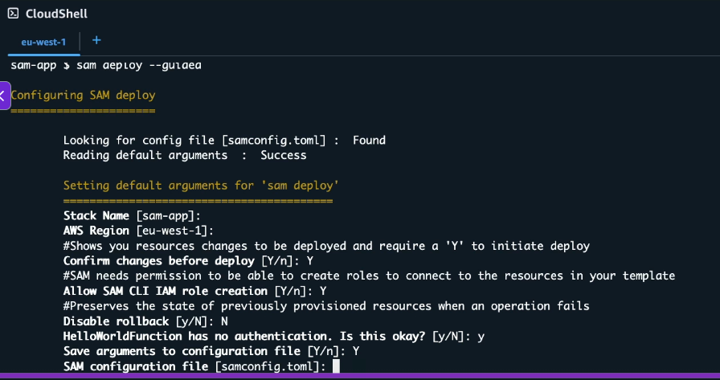
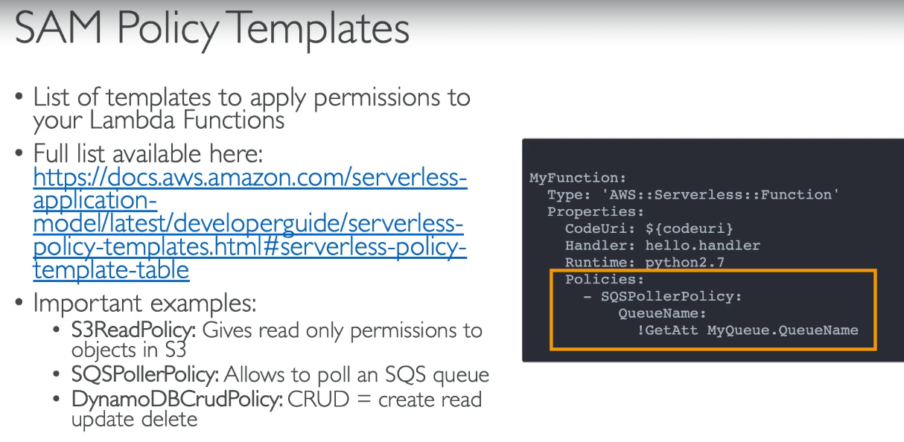
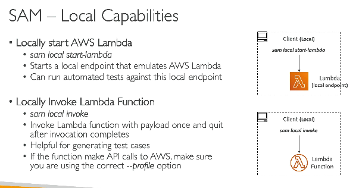
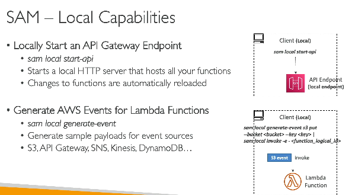

# SAM
- AWS SAM (Serverless Application Model):
- An AWS framework that lets you define, build, test, and deploy serverless applications (Lambda, API Gateway, DynamoDB, etc.) using a simplified YAML template built on CloudFormation.

  
- **SAM is higher level abstraction over cloud formation**
- then why not use cloudformation only?

#### Flow

```
Source Code
     │
     ▼
sam build
     │
     ▼
Creates build artifacts (.aws-sam/build)
     │
     ▼
sam deploy
     │
     ├── 1. Zips Lambda code
     ├── 2. Uploads ZIP to S3
     ├── 3. Transforms SAM template → CloudFormation template
     ├── 4. Automatically calls CloudFormation CreateStack/UpdateStack API
     ▼
CloudFormation
     │
     ▼
Creates/updates all AWS resources
     │
     ▼
Lambda downloads code from S3
```

---
#### Do we manually import the CloudFormation template?

**No.**

`sam deploy` does this automatically.

You **do not**:

- Open the CloudFormation console
- Upload the template manually
- Click "Create Stack"

SAM CLI handles all of that.
---

#### What is stored in S3?

Only deployment artifacts, for example:

```
my-deployment-bucket/

├── abc123.zip        <-- Lambda code
├── xyz789.zip        <-- Layer
└── ...
```
---

### deployment flow

```
sam deploy
    │
    ▼
Uploads ZIP to S3
    │
    ▼
Transforms SAM → CloudFormation
    │
    ▼
CloudFormation CreateStack
    │
    ▼
Resources are created
```
---


### AWS SAM vs CloudFormation

| CloudFormation | AWS SAM |
|----------------|----------|
| General-purpose Infrastructure as Code (IaC) | Serverless-focused Infrastructure as Code |
| More verbose | Much shorter templates |
| You manually configure Lambda, IAM roles, API Gateway, permissions, etc. | Automatically generates these resources where possible |
| Supports all AWS resources | Optimized for serverless (`AWS::Serverless::*`) + supports standard CloudFormation resources |
| No built-in local testing | Built-in local testing with SAM CLI (```sam local invoke```) - Runs a Lambda function locally inside a Docker container that closely mimics the AWS Lambda runtime, |
| Uses CloudFormation directly | Converts SAM template into CloudFormation before deployment |

---

#### Example
#### CloudFormation (simplified)
```yaml
Resources:
  MyFunction:
    Type: AWS::Lambda::Function
    Properties:
      ...

  MyRole:
    Type: AWS::IAM::Role
    Properties:
      ...

  MyPermission:
    Type: AWS::Lambda::Permission
    Properties:
      ...

  MyApi:
    Type: AWS::ApiGateway::RestApi
    Properties:
      ...
```
#### AWS SAM
```yaml
Resources:
  MyFunction:
    Type: AWS::Serverless::Function
    Properties:
      CodeUri: .
      Handler: app.handler
      Runtime: nodejs22.x
      Events:
        Api:
          Type: Api
          Properties:
            Path: /
            Method: GET
```
SAM automatically generates the required CloudFormation resources for:
- Lambda Function
- IAM Role
- Lambda Permission
- API Gateway Integration
- Log Group (when applicable)
- Other supporting resources
---
---
#### When to use which?
| Use Case | Recommendation |
|----------|----------------|
| Lambda + API Gateway + DynamoDB + SQS + SNS | ✅ AWS SAM |
| Complete AWS infrastructure (VPC, EC2, ECS, RDS, etc.) | ✅ CloudFormation |
| Mostly serverless with a few non-serverless resources | ✅ AWS SAM (can include CloudFormation resources) |
---

## SAM Accelerate (sam sync)

> **SAM Accelerate (`sam sync`) speeds up development by synchronizing only changed resources to AWS. It updates Lambda code directly for code changes and uses CloudFormation only when infrastructure changes are detected.**

| Feature | Description |
|---------|-------------|
| Purpose | Rapidly sync local changes to AWS without a full deployment |
| Command | `sam sync` |
| Introduced As | AWS SAM Accelerate |
| Uses CloudFormation? | ✅ Yes, but only when infrastructure changes are detected |
| Best For | Fast development and testing in the cloud |
| Full Stack Deployment? | ❌ No, only changed resources are updated |
| Speed | Much faster than `sam deploy` for code changes |
| Infrastructure Changes | Falls back to CloudFormation update ||

---

### Development Workflow

```text
Edit Lambda Code
       │
       ▼
sam sync --watch
       │
       ▼
Detect file changes
       │
       ▼
Upload only changed Lambda code
       │
       ▼
Update Lambda in AWS
       │
       ▼
Test immediately
```

---

### If Infrastructure Changes

Example:

```yaml
Resources:
  MyTable:
    Type: AWS::DynamoDB::Table
```

You add another table.

```text
sam sync
      │
      ▼
Detect infrastructure change
      │
      ▼
Runs CloudFormation UpdateStack
      │
      ▼
Creates/updates resources
```
---

- **run ```sam init```** - for quick start  
  
  
- these policies will behind the scenes create IAM roles, so we don't have to write CLoudFormation for IAM roles, SAM made it easy for us

### SAM local capabilities
- we can run SAM locally (invoking lamda, API gateway)
- internall SAM will run a docker container to mimic AWS services like Lambda / API Gateway
- prerequsit - install Docker SAM CLI
  
  


