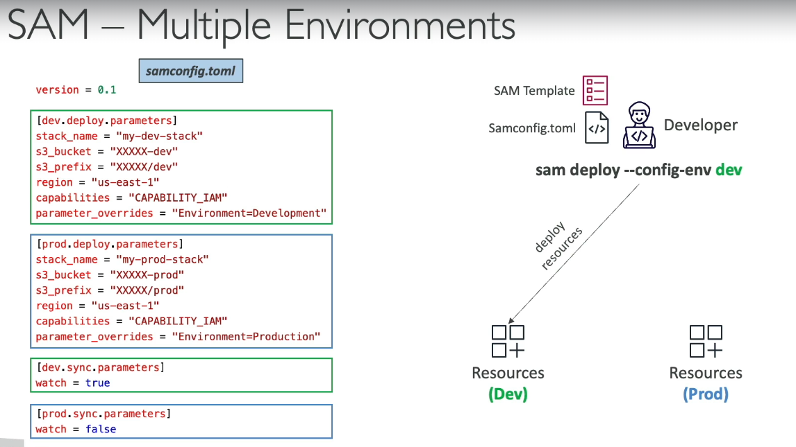
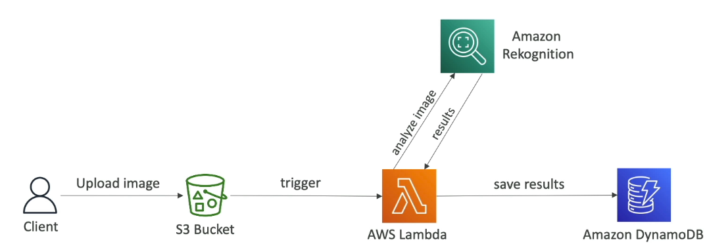

# SAM
- AWS SAM (Serverless Application Model):
- An AWS framework that lets you define, build, test, and deploy serverless applications (Lambda, API Gateway, DynamoDB, etc.) using a simplified YAML template built on CloudFormation.

  
- **SAM is higher level abstraction over cloud formation**
- then why not use cloudformation only?

#### Flow

```
Source Code
     │
     ▼
sam build
     │
     ▼
Creates build artifacts (.aws-sam/build)
     │
     ▼
sam deploy
     │
     ├── 1. Zips Lambda code
     ├── 2. Uploads ZIP to S3
     ├── 3. Transforms SAM template → CloudFormation template
     ├── 4. Automatically calls CloudFormation CreateStack/UpdateStack API
     ▼
CloudFormation
     │
     ▼
Creates/updates all AWS resources
     │
     ▼
Lambda downloads code from S3
```

---
#### Do we manually import the CloudFormation template?

**No.**

`sam deploy` does this automatically.

You **do not**:

- Open the CloudFormation console
- Upload the template manually
- Click "Create Stack"

SAM CLI handles all of that.
---

#### What is stored in S3?

Only deployment artifacts, for example:

```
my-deployment-bucket/

├── abc123.zip        <-- Lambda code
├── xyz789.zip        <-- Layer
└── ...
```
---

### deployment flow

```
sam deploy
    │
    ▼
Uploads ZIP to S3
    │
    ▼
Transforms SAM → CloudFormation
    │
    ▼
CloudFormation CreateStack
    │
    ▼
Resources are created
```
---


### AWS SAM vs CloudFormation

| CloudFormation | AWS SAM |
|----------------|----------|
| General-purpose Infrastructure as Code (IaC) | Serverless-focused Infrastructure as Code |
| More verbose | Much shorter templates |
| You manually configure Lambda, IAM roles, API Gateway, permissions, etc. | Automatically generates these resources where possible |
| Supports all AWS resources | Optimized for serverless (`AWS::Serverless::*`) + supports standard CloudFormation resources |
| No built-in local testing | Built-in local testing with SAM CLI (```sam local invoke```) - Runs a Lambda function locally inside a Docker container that closely mimics the AWS Lambda runtime, |
| Uses CloudFormation directly | Converts SAM template into CloudFormation before deployment |

---

#### Example
#### CloudFormation (simplified)
```yaml
Resources:
  MyFunction:
    Type: AWS::Lambda::Function
    Properties:
      ...

  MyRole:
    Type: AWS::IAM::Role
    Properties:
      ...

  MyPermission:
    Type: AWS::Lambda::Permission
    Properties:
      ...

  MyApi:
    Type: AWS::ApiGateway::RestApi
    Properties:
      ...
```
#### AWS SAM
```yaml
Resources:
  MyFunction:
    Type: AWS::Serverless::Function
    Properties:
      CodeUri: .
      Handler: app.handler
      Runtime: nodejs22.x
      Events:
        Api:
          Type: Api
          Properties:
            Path: /
            Method: GET
```
SAM automatically generates the required CloudFormation resources for:
- Lambda Function
- IAM Role
- Lambda Permission
- API Gateway Integration
- Log Group (when applicable)
- Other supporting resources
---
---
#### When to use which?
| Use Case | Recommendation |
|----------|----------------|
| Lambda + API Gateway + DynamoDB + SQS + SNS | ✅ AWS SAM |
| Complete AWS infrastructure (VPC, EC2, ECS, RDS, etc.) | ✅ CloudFormation |
| Mostly serverless with a few non-serverless resources | ✅ AWS SAM (can include CloudFormation resources) |
---

## SAM Accelerate (sam sync)

> **SAM Accelerate (`sam sync`) speeds up development by synchronizing only changed resources to AWS. It updates Lambda code directly for code changes and uses CloudFormation only when infrastructure changes are detected.**

| Feature | Description |
|---------|-------------|
| Purpose | Rapidly sync local changes to AWS without a full deployment |
| Command | `sam sync` |
| Introduced As | AWS SAM Accelerate |
| Uses CloudFormation? | ✅ Yes, but only when infrastructure changes are detected |
| Best For | Fast development and testing in the cloud |
| Full Stack Deployment? | ❌ No, only changed resources are updated |
| Speed | Much faster than `sam deploy` for code changes |
| Infrastructure Changes | Falls back to CloudFormation update ||

---

### Development Workflow

```text
Edit Lambda Code
       │
       ▼
sam sync --watch
       │
       ▼
Detect file changes
       │
       ▼
Upload only changed Lambda code
       │
       ▼
Update Lambda in AWS
       │
       ▼
Test immediately
```

---

### If Infrastructure Changes

Example:

```yaml
Resources:
  MyTable:
    Type: AWS::DynamoDB::Table
```

You add another table.

```text
sam sync
      │
      ▼
Detect infrastructure change
      │
      ▼
Runs CloudFormation UpdateStack
      │
      ▼
Creates/updates resources
```
---

- **run ```sam init```** - for quick start  
  
  
- these policies will behind the scenes create IAM roles, so we don't have to write CLoudFormation for IAM roles, SAM made it easy for us

### SAM local capabilities
- we can run SAM locally (invoking lamda, API gateway)
- internall SAM will run a docker container to mimic AWS services like Lambda / API Gateway
- prerequsit - install Docker SAM CLI
  
  

### SAM multiple envs
  

# CDK
**Instead of creating yml file by hand, we can use CDK (Cloud development kit)**  
- Using CDK we can write cloudformation template in JS/TS/Python, and using CDK, we can complie our ts file to cloudformation.yml file

### AWS SAM vs AWS CDK

| Feature | AWS SAM | AWS CDK |
|---------|----------|----------|
| Primary Purpose | Build and deploy **serverless applications** | Define and provision **any AWS infrastructure** using programming languages |
| Definition Style | YAML (`template.yaml`) | Code (TypeScript, Python, Java, C#, Go) |
| Best Use Case | Lambda, API Gateway, DynamoDB, SQS, SNS, EventBridge | Complex cloud infrastructure (VPC, ECS, EKS, RDS, EC2, Lambda, etc.) |
| Output | CloudFormation | CloudFormation (`cdk synth`) -|
| Create infrastructure | ```sam deploy``` | ```cdk deploy```|


**Below architecture - we are going to creat using CDK**
  

- install aws-cdk-lib
- run command ```cdk init app --language typescript```
- ```cdk bootstrap``` - 
- ```cdk synth``` - 
- ```cdk deploy``` - 

- below is the CDK code to build this infra
```typescript
const cdk = require("@aws-cdk/core");
const s3 = require("@aws-cdk/aws-s3");
const iam = require("@aws-cdk/aws-iam");
const lambda = require("@aws-cdk/aws-lambda");
const lambdaEventSource = require("@aws-cdk/aws-lambda-event-sources");
const dynamodb = require("@aws-cdk/aws-dynamodb");

// Logical name used for the S3 bucket construct
const imageBucket = "cdk-rekn-imagebucket";

// Every CDK stack represents a CloudFormation Stack.
class CdkAppStack extends cdk.Stack {
    /**
     * scope -> Parent construct
     * id    -> Unique logical ID of this stack
     * props -> Optional stack properties (region, account, tags, etc.)
     */
    constructor(scope, id, props) {
        super(scope, id, props);

        // ============================================================
        // S3 Bucket
        // Creates an AWS::S3::Bucket resource.
        // ============================================================
        const bucket = new s3.Bucket(this, imageBucket, {
            // Delete bucket automatically when stack is deleted.
            // (Useful for demos/dev, avoid in production)
            removalPolicy: cdk.RemovalPolicy.DESTROY,
        });

        // CloudFormation Output
        // Displays the bucket name after deployment.
        new cdk.CfnOutput(this, "Bucket", {
            value: bucket.bucketName,
        });

        // ============================================================
        // IAM Role
        // Creates an AWS::IAM::Role resource.
        // ============================================================
        const role = new iam.Role(this, "cdk-rekn-lambdarole", {

            // Specifies which AWS service can assume (use) this role.
            // Here, only Lambda functions can use it.
            assumedBy: new iam.ServicePrincipal("lambda.amazonaws.com"),
        });

        // Attach an inline IAM policy to the role.
        role.addToPolicy(
            new iam.PolicyStatement({
                effect: iam.Effect.ALLOW,
                actions: [
                    "rekognition:*",
                    "logs:CreateLogGroup",
                    "logs:CreateLogStream",
                    "logs:PutLogEvents",
                ],

                // Allow these actions on all resources.
                resources: ["*"],
            })
        );

        // ============================================================
        // DynamoDB Table
        // Creates an AWS::DynamoDB::Table resource.
        // ============================================================
        const table = new dynamodb.Table(this, "cdk-rekn-imagetable", {

            // Defines the primary (partition) key.
            partitionKey: {
                name: "Image",
                type: dynamodb.AttributeType.STRING,
            },

            // Delete the table when the stack is deleted.
            removalPolicy: cdk.RemovalPolicy.DESTROY,
        });

        // Output table name after deployment.
        new cdk.CfnOutput(this, "Table", {
            value: table.tableName,
        });

        // ============================================================
        // Lambda Function
        // Creates an AWS::Lambda::Function resource.
        // ============================================================
        const lambdaFn = new lambda.Function(this, "cdk-rekn-function", {

            // Package everything inside the "lambda" folder
            // and upload it during deployment.
            code: lambda.AssetCode.fromAsset("lambda"),

            // Lambda runtime.
            runtime: lambda.Runtime.PYTHON_3_8,

            // Entry point:
            // index.py -> handler()
            handler: "index.handler",

            // Attach the IAM role created above.
            role: role,

            // Environment variables available inside Lambda.
            environment: {
                TABLE: table.tableName,
                BUCKET: bucket.bucketName,
            },
        });

        // ============================================================
        // Event Source Mapping
        // Configures S3 to invoke this Lambda whenever
        // a new object is uploaded.
        // CDK automatically creates the required
        // S3 notification configuration and permissions.
        // ============================================================
        lambdaFn.addEventSource(
            new lambdaEventSource.S3EventSource(bucket, {
                events: [
                    s3.EventType.OBJECT_CREATED,
                ],
            })
        );

        // ============================================================
        // Grant IAM Permissions
        // CDK automatically updates IAM policies.
        // ============================================================

        // Allow Lambda to read/write objects in the bucket.
        bucket.grantReadWrite(lambdaFn);

        // Allow Lambda full access to the DynamoDB table.
        table.grantFullAccess(lambdaFn);
    }
}

module.exports = { CdkAppStack };
```

**CDK commands** -

| Command | Purpose | What it does |
|---------|---------|--------------|
| `cdk init app --language typescript` | Create a new CDK project | Generates the project structure, sample stack, configuration files, and dependencies. Replace `typescript` with `python`, `java`, `csharp`, or `go` as needed. |
| `cdk bootstrap` | Prepare AWS for CDK | Creates the **supporting resources** (mainly an **S3 bucket** and **IAM roles**) that CDK needs to upload application files (like Lambda ZIPs) and deploy your stacks. **Run once per AWS account and region before the first deployment.** |
| `cdk synth` | Generate CloudFormation template | Converts CDK code into an equivalent CloudFormation template without creating any AWS resources. |
| `cdk diff` | Preview changes | Compares the deployed CloudFormation stack with your current CDK code and shows what resources will be added, modified, or deleted. |
| `cdk deploy` | Deploy the stack | Runs `cdk synth`, uploads deployment assets (if any), and calls CloudFormation to create or update AWS resources. |
| `cdk destroy` | Delete the stack | Deletes the CloudFormation stack and all resources managed by it (subject to each resource's deletion policy). |
| `cdk ls` | List stacks | Displays all stacks defined in the current CDK application. |
| `cdk doctor` | Diagnose environment | Checks the local CDK installation and environment for common configuration issues. |