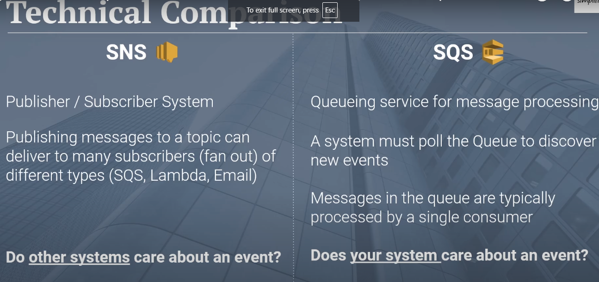
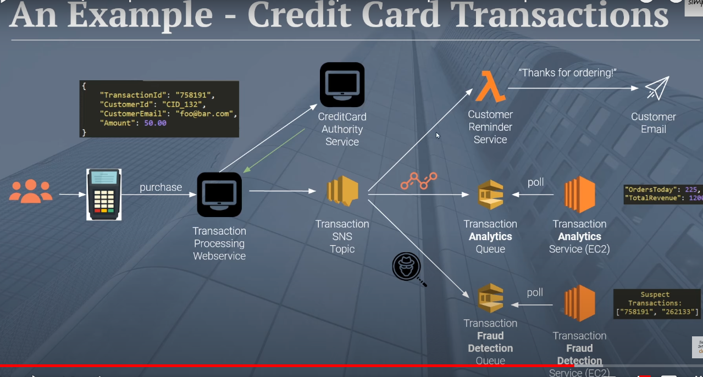

# SNS (PubSub Service)

Used to decouple distributed applications

#### Fully managed Pub/Sub service for A2A and A2P messaging
1. A2A - application to application - application publishing a message to a topic and another application subscribing to a topic to consume the message
2. A2P - application to person - application publishing a message to a topic and a person (email, phone, push notification) service consuming the message (e.g. sending promotional SMS text messages to end-users)

#### SNS vs SQS

SNS is to publish messages to multiple consumers, SQS where one message can be consumed by one consumer  
SQS can be one of the consumers of SNS

 

(**SNS usecase)** - Here when a credit card transaction is done, multiple subscribers are subscribed to the topic, each one performaing a separate business usecase
 

Notice how we are using lambda for email services, if lambda fails, then the message is lost and email is not sent, not business critical  
For fraud and analytics service, we purposefully use SQS, becasue is any of the coneumer of SQS fails, SQS gurantees that message is consumed by some other consumer  
**(remember - SQS - qurantees message delivery atleast once)**

## Core concepts

1. Producers - publish a message to a topic
2. Subscribers - can listen to one / more topics
3. Topics - is a commincation channel to deliver a message to one / multiple subscribers
4. Messages - 

 

#### Kafka vs SNS
1. Both are pub/sub model
2. Use Kafka for real time streaming options (can handle trillions of events / day )
3. Use SNS for basic pub/sub model, like credit card transactions (see below)

### SNS AWS
#### 1. Creating a topic
1. Specify name
2. Access policy - who can publish messages / subscribe to the messages to a given topic (Acct owner, other AWS accounts, Everyone)

#### 2. Create Subscription
1. Specify topic ARN
2. Specify protocol - who the subscriber is?
   
3. Specify subscription filter policy **(Used to reduce AWS cost)**
