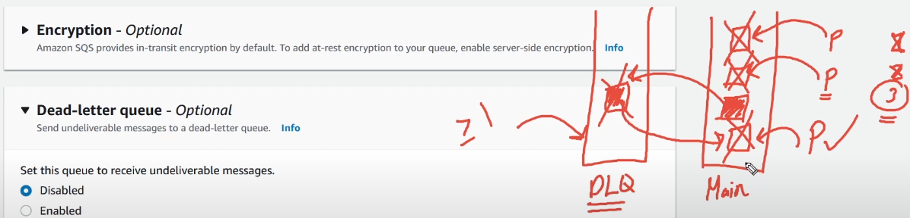
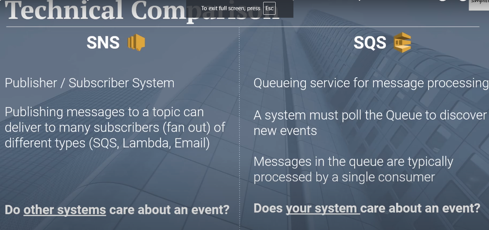
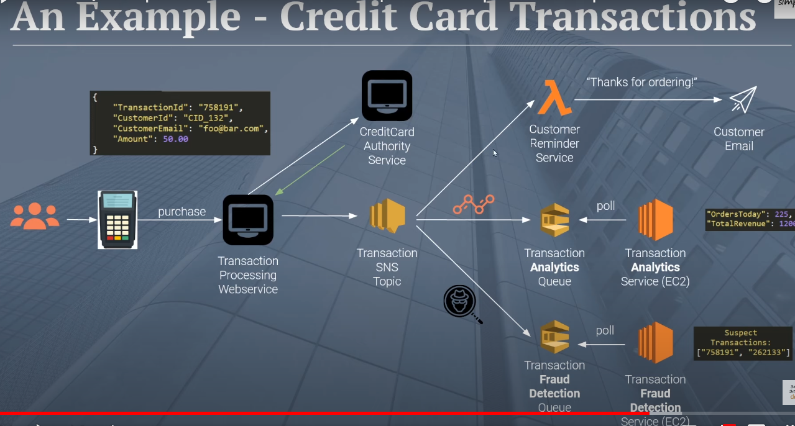

# SQS (Async message based communication)

#### SQS messaging vs API calls
1. SQS is async based message system, API call is synchronous
2. Decoupled architecture
3. Backpressure Control - consmers can choose the rate of processing

### Usecases - 
#### 1. Data processing (IoT devices)
IoT end devices can send messages to SQS and different consumers can consume those messages at their own pace
#### 2. Real time event processing  
E-commerece site requiring real time data analytics dashboards, the web app can produce events and the analytics dashboard can consume data

## Core concepts

### 1. Queue (standard or FIFO)
**1. Standard**  
 - ordering of the messages is not guranteed
 - a message can be delivered multiple times
 - high throughput
 - low cost

**2. FIFO**
 - guranteed message ordering
 - message delivered excatly once
 - low throughput
 - high cost

### 2. Producers 

### 3. Consumers

### 4. Configurations  
  

##### 1. Visibility timeout (default 30s)
Once the message is consumed by one of the consumers, the message is hidden from the queue (basically a lock is applied, so no other consumer can see this message). 
Now once the consumer consumes the message, it need to notify the queue that message is successfully consumed, delete from the queue (then the message is permanentaly deleted)  
If the consumer fails to consume the message and no response is sent back to queue to delete the message, then the queue waits for (**Visibility Timeout deuration**) and then message is again available for other consumers for processing

##### 2. Message retention period
The amount of time the message can stay in the queue (1 min to 14 days), after which the message is automatically deleted from the queue

##### 3. Delivery Delay
The time for which the message needs to wait to enter the queue

##### 4. Receive message wait time (LONG POOLING duration)
The amount of time the consumer can hold on to the request before the message is arraived in the queue  
In SQS, consumers constantly poll the queue to check of new messages, if no message is in the queue, consumer will send another request to check for message.  
Howvere if no message is present in queue, long pooling will keep the connection open for a specified time, before closing the connection.

##### 5. Dead Letter Queue (DLQ)
  
It is a secondary queue, which stores failed messages for X number of times  
When configuring DLQ, you will have to provied **Maximum retires setting**, e.g. (3), so if the message is failed to be processed 3 times by any or all of the consumers, then this message is sent to DLQ.  
Then in DLQ, we can add alerting / monitoring to send email to dev team, which says message not being able to be processed 

## Nodejs code for producers and subscribers

### 1. Send message to Queue  

```javascript
const configObject = {
  region: 'us-east-1',
  credentials: {
    accessKeyId: 'AKIAW5JGT2L735FXOIT',
    secretAccessKey: 'EbuOFnKUHnja5Vt10RSFcTMP9eIZYNWh17Zke1IM',
  },
};
module.exports = { configObject };
```

```javascript
const { SQSClient, SendMessageCommand } = require('@aws-sdk/client-sqs');
const { configObject } = require('./credentials');
const sqsClient = new SQSClient(configObject);
//queue url is the arn name of the queue which we get once queue is created in AWS console
const queueUrl = 'https://sqs.us-east-1.amazonaws.com/451613728407/MyNodeQueue';
const sendMessageToQueue = async (body) => {
  try {
    const command = new SendMessageCommand({
      MessageBody: body,
      QueueUrl: queueUrl,
      MessageAttributes: {
        OrderId: { DataType: 'String', StringValue: '4421x' },
      },
    });
    const result = await sqsClient.send(command);
    console.log(result);
  } catch (error) {
    console.log(error);
  }
};
```

### 2. Consume message from queue

```javascript
const PollMessages = async () => {
  try {
    const command = new ReceiveMessageCommand({
      QueueUrl: queueUrl,
      WaitTimeSeconds: 5,
      MessageAttributes: ["All"],
      VisibilityTimeout: 10,
    });

    const result = await sqsClient.send(command);
    console.log(result.Messages);

    // once the message is processed, it is important to delete it from the queue
    // message has a key called - RecieptHandle which is unique to the message
    // use this key to delete the message
    const delResult = await DeleteMessageFromQueue(message.RecieptHandle)
  } catch (error) {
    console.log(error);
  }
};

const DeleteMessageFromQueue = async (uniqueRecieptHandler) => {
    try {
        const command = new DeleteMessageCommand({
            QueueUrl: queueUrl,
            RecieptHandleData: uniqueRecieptHandler
        });

        await sqsClient.send(command);
    } catch(err) {
        console.log(err)
    }
}
```

##### Note that above code will run once and get closed, but we need to continuously poll the queue, so we can use something like setInterval to call the PollMessage function
##### But for real-world projects we use a library - sqs-consumer

```npm i sqs-consumer``` 

```javascript
// this consumer will be always on continuosly polling for the message
// will delete the message once the message is processed
// no need to call the deleet SQS command explicitly
const {Consumer} = require('sqs-consumer')
const app = Consumer.create({
    QueueUrl: queueUrl,
    sqs: sqsClient,
    handleMessage: async (message) => {
        console.log('new message in the queue ', message)
    }
})
app.on('processing_error', (err) => {
    console.log('error processing message ', err)
})
app.start()
```

## SNS vs SQS

SNS is to publish messages to multiple consumers, SQS where one message can be consumed by one consumer  
SQS can be one of the consumers of SNS

 

(**SNS usecase)** - Here when a credit card transaction is done, multiple subscribers are subscribed to the topic, each one performaing a separate business usecase
 

Notice how we are using lambda for email services, if lambda fails, then the message is lost and email is not sent, not business critical  
For fraud and analytics service, we purposefully use SQS, becasue is any of the coneumer of SQS fails, SQS gurantees that message is consumed by some other consumer  
**(remember - SQS - qurantees message delivery atleast once)**
