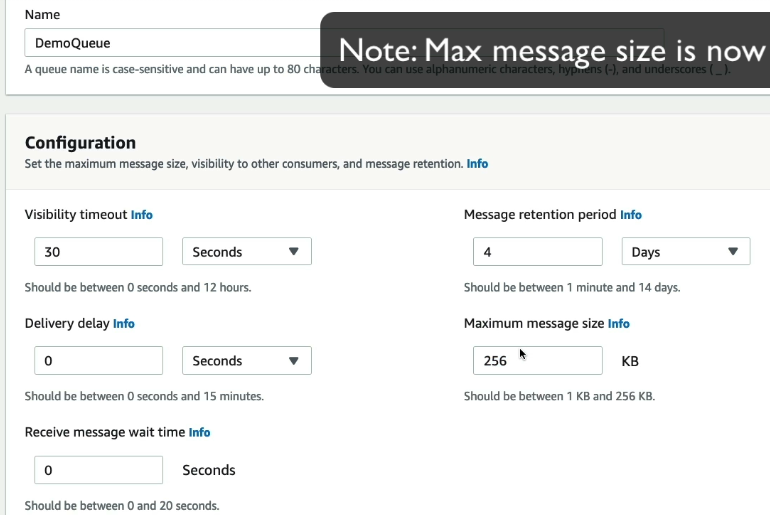
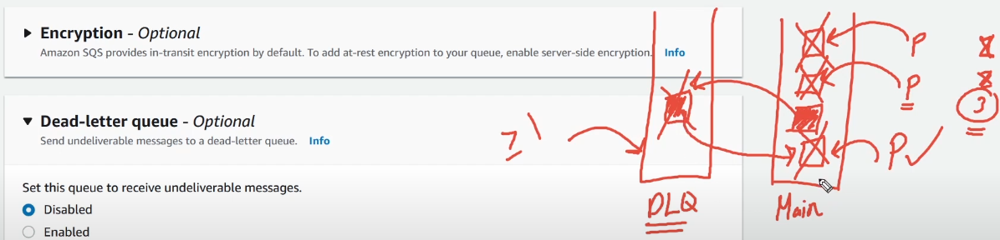
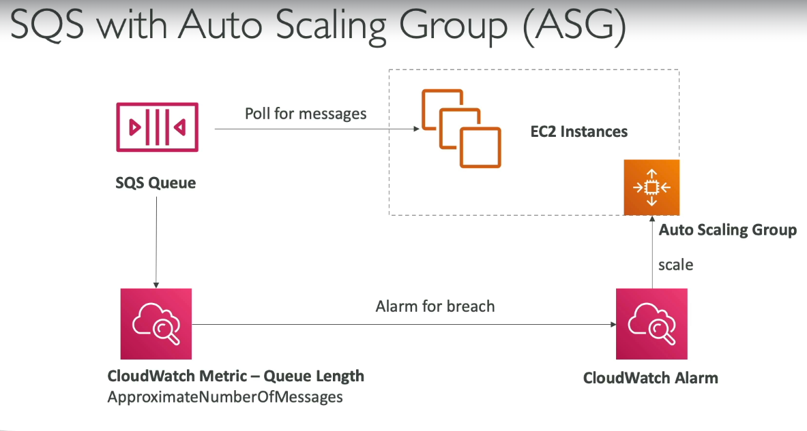
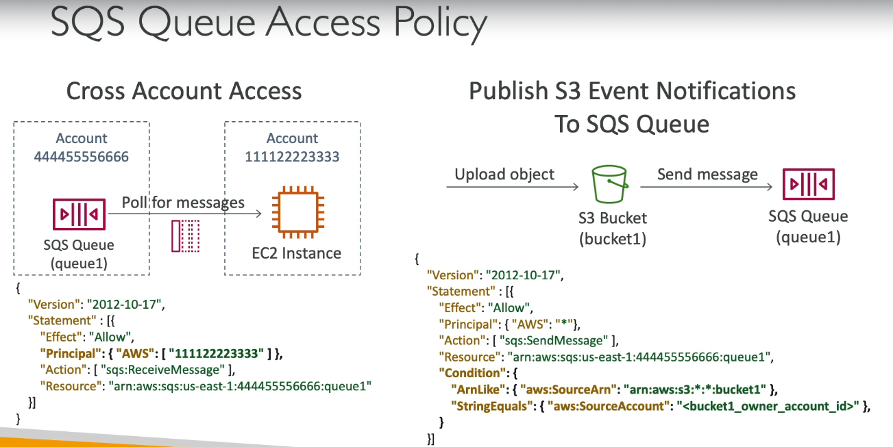
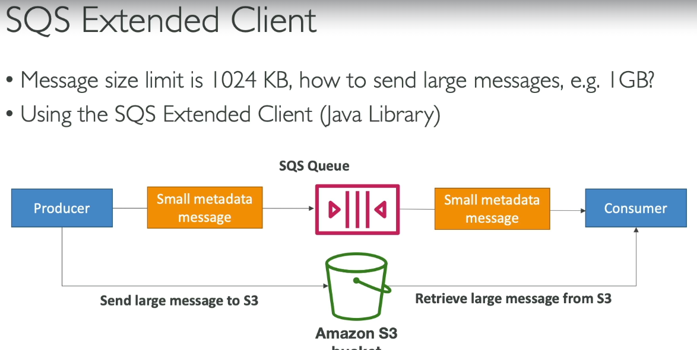

# SQS (Async message based communication)
- it is AWS managed **Distributrd Messaging queue** service
- similar to Kafka and RabbitMQ

#### SQS messaging vs API calls
1. SQS is async based message system, API call is synchronous
2. Decoupled architecture
3. In APIs if one service fails, other service is affected, in SNS/SQS, the producer service is completely decoupled with consumers

### Messageing queue architecure and Principal
#### Principles
1. Producer and Consumer are independent
2. Messages are stored temporarily
3. Receiving does NOT delete the message
4. Consumer must delete the message explicitly by sending the acknowledgement to the queue

| Guarantee | How it is achieved | What the consumer must do | Message structure | Use cases |
|----------|--------------------|---------------------------|-------------------|-----------|
| **At-most-once** | Producer sends once; broker does not retry or consumer ACKs before processing. If message is lost, it is not resent. | Consumer need not be idempotent because duplicates don't occur. | Any structure; message ID optional. | Analytical system where message lost is acceptable|
| **At-least-once** | Broker retries until it receives an ACK/Delete from consumer. If consumer crashes after processing but before ACK, the same message is delivered again. | Consumer **must be idempotent**: processing the same message multiple times should have the same effect as processing it once. | Include a **unique message ID** or business key (`orderId`, `paymentId`, etc.) so consumer can detect duplicates. | |
| **Exactly-once** | Broker uses transactions, deduplication, or atomic commit between message delivery and processing state. Duplicate deliveries are suppressed or deduplicated. | Consumer should still prefer idempotent operations, though duplicates are generally prevented by the system. | Include a unique message ID / deduplication ID. Broker may also require sequence numbers or transaction IDs. | Banking transactions |

**Typical message structure for at-least-once**
{
  "messageId": "550e8400-e29b-41d4-a716-446655440000",
  "orderId": "ORD-123",
  "eventType": "OrderPlaced",
  "payload": {
    ...
  }
}
```text
if messageId already processed:
    ignore message
else:
    process
    mark messageId as processed
```

#### Partitioning queues
- why needed? for scalibility

Split a large queue into multiple smaller queues internally so that reads/writes can happen in parallel.
Instead of:
Queue
M1 M2 M3 M4 M5 M6 M7 M8

have
```text
Partition 1        Partition 2
M1 M2 M3           M4 M5 M6
Producer A         Producer B
     ↓                  ↓
Consumer 1         Consumer 2
```
**Need to use proper partitioning key to put messages in different partitoned queues** - e.g. we can to partition by ```partition = hash(accountId) % numPartitions```, based on account id, so that the messages for same account goes to same partition queue, if it is random, and if user frst deposists 100Rs and then withdrws 50, it is acceptable scenario, but if those messages go in different partitioned queues, and if forst withdraw 50 is called, and if user has 0 balance, then app will show insuffuciant balance

**Backpressure control** is a flow-control mechanism in distributed systems where a slower consumer signals or forces upstream producers to reduce their rate of sending data, preventing unbounded queue growth, resource exhaustion, and system overload.  

Backpressure is achieved by slowing down producers—either explicitly through feedback signals from consumers or implicitly through mechanisms like rate limiting, blocking, bounded queues, pull-based consumption, or autoscaling consumers.

**Messaging queues, pull / push model?** - 
```text
AWS SQS, Kafka:
    Consumers continuously poll (Pull model)

RabbitMQ, Webhooks:
    Broker pushes messages to consumers (Push model)
```

### Usecases - 
#### 1. Data processing (IoT devices)
IoT end devices can send messages to SQS and different consumers can consume those messages at their own pace
#### 2. Real time event processing  
E-commerece site requiring real time data analytics dashboards, the web app can produce events and the analytics dashboard can consume data

## Core concepts

### 1. Queue (standard or FIFO)
**1. Standard**  
 - ordering of the messages is not guranteed
 - a message can be delivered multiple times
 - high throughput
 - low cost

**2. FIFO**
 - guranteed message ordering
 - message delivered excatly once
 - low throughput
 - high cost

### 2. Producers 

### 3. Consumers

### 4. Configurations  
  

##### 1. Visibility timeout (default 30s)
- Once the message is consumed by one of the consumers, the message is hidden from the queue (basically a lock is applied, so no other consumer can't see this message). 
Now once the consumer consumes the message, it need to notify the queue that message is successfully consumed, delete from the queue (then the message is permanentaly deleted)  
- If the consumer fails to consume the message and no response is sent back to queue to delete the message, then the queue waits for (**Visibility Timeout deuration**) and then message is again available for other consumers for processing.  
- What if consumer 1 processed the msg, but while acknowledging, it crashed? Obviosuly msg will be back in the queue, so consumers need to be idempotent, so if msg is consimed multiple times, it will have same output everytime (e.g. message actions should be update like cnt to 54 instead of incremet like count of user ABC by 1, that way even if msg is processed multiple times, cnt will be 54 only)  
- Also, if default visibility timeout is 30s, and consumer needs more tha 30s to process the message, the consumer should be programmed to call **ChangeMessageVisibility** api call to extend the timeout

##### 2. Message retention period
The amount of time the message can stay in the queue (1 min to 14 days), after which the message is automatically deleted from the queue

##### 3. Delivery Delay / Delay queue (max upto 15 mins, default is 0 sec)
The time for which the message needs to wait to enter the queue
| Use case | Why use a Delay Queue? |
|---------|------------------------|
| Order cancellation | If payment is not received within 15 minutes, process a cancellation message. |

**Example: Order Auto-Cancel (Classic Delay Queue Use Case)**
User places an order:
```text
t = 0
Create Order O123
↓
Send delayed message
{
  orderId: "O123",
  action: "CANCEL_ORDER"
}
Delay = 15 min
```
**Case 1: User pays within 15 minutes**
```text
t = 10 min
Order status = PAID
t = 15 min
Delayed message becomes visible
Consumer:
if order.status == PAID:
    do nothing
```
**Result:** Order is **not** cancelled.
---
**Case 2: User does not pay**
```text
t = 15 min
Delayed message becomes visible
Consumer:
if order.status == PENDING:
    cancel order
```
**Result:** Order is automatically cancelled.
---
### Why not use a Cron Job?
You could, but a Delay Queue:
- Scales to millions of scheduled actions
- Distributes work across multiple consumers
- Survives consumer failures
- Doesn't require scanning the database periodically
---

##### 4. Receive message wait time (LONG POOLING duration)
The amount of time the consumer can hold on to the request before the message is arraived in the queue  
In SQS, consumers constantly poll the queue to check of new messages, if no message is in the queue, consumer will send another request to check for message.  
Howvere if no message is present in queue, long pooling will keep the connection open for a specified time, before closing the connection.

##### 5. Dead Letter Queue (DLQ)
  
It is a secondary queue, which stores failed messages for X number of times  
When configuring DLQ, you will have to provied **Maximum retires setting**, e.g. (3), so if the message is failed to be processed 3 times by any or all of the consumers, then this message is sent to DLQ.  
Then in DLQ, we can add alerting / monitoring to send email to dev team, which says message not being able to be processed  
- **DQL redrive** - puts the messages back from DLQ to normal SQS queue

**Messages in SQS are retained by default for 4 days, max is 14 days**

#### SQS with ASG
- attach a cloudwatch metrics, when requests increase and messages in queue cross certain limit
- set alarm when that threshold is reached, which will call ASG to increase EC2 instances (consumers in this case)  
  

### SQS queue access policy, similar to s3 bucket policy
  

**SQS long polling** - he consumer sends a ReceiveMessage request and keeps the connection open for up to 20 seconds, allowing SQS to return messages as soon as they arrive or an empty response if the wait time expires, thus reducing API calls

  
- the library will just store the metadata to SQS along with the pointer to s3 with the actual file (maybe video)
- when the consumer consumes, it reads the pointer key and than processes the file from s3
- then how is this library different from if I write a custom code to store s3 file url as metatdata in SQS queue? - the library does exactly that, just that we don't need to write all the boilerplate code
## Nodejs code for producers and subscribers

### 1. Send message to Queue  

```javascript
const configObject = {
  region: 'us-east-1',
  credentials: {
    accessKeyId: 'AKIAW5JGT2L735FXOIT',
    secretAccessKey: 'EbuOFnKUHnja5Vt10RSFcTMP9eIZYNWh17Zke1IM',
  },
};
module.exports = { configObject };
```

```javascript
const { SQSClient, SendMessageCommand } = require('@aws-sdk/client-sqs');
const { configObject } = require('./credentials');
const sqsClient = new SQSClient(configObject);
//queue url is the arn name of the queue which we get once queue is created in AWS console
const queueUrl = 'https://sqs.us-east-1.amazonaws.com/451613728407/MyNodeQueue';
const sendMessageToQueue = async (body) => {
  try {
    const command = new SendMessageCommand({
      MessageBody: body,
      QueueUrl: queueUrl,
      MessageAttributes: {
        OrderId: { DataType: 'String', StringValue: '4421x' },
      },
    });
    const result = await sqsClient.send(command);
    console.log(result);
  } catch (error) {
    console.log(error);
  }
};
```

### 2. Consume message from queue

```javascript
const PollMessages = async () => {
  try {
    const command = new ReceiveMessageCommand({
      QueueUrl: queueUrl,
      WaitTimeSeconds: 5,
      MessageAttributes: ["All"],
      VisibilityTimeout: 10,
    });

    const result = await sqsClient.send(command);
    console.log(result.Messages);

    // once the message is processed, it is important to delete it from the queue
    // message has a key called - RecieptHandle which is unique to the message
    // use this key to delete the message
    const delResult = await DeleteMessageFromQueue(message.RecieptHandle)
  } catch (error) {
    console.log(error);
  }
};

const DeleteMessageFromQueue = async (uniqueRecieptHandler) => {
    try {
        const command = new DeleteMessageCommand({
            QueueUrl: queueUrl,
            RecieptHandleData: uniqueRecieptHandler
        });

        await sqsClient.send(command);
    } catch(err) {
        console.log(err)
    }
}
```

##### Note that above code will run once and get closed, but we need to continuously poll the queue, so we can use something like setInterval to call the PollMessage function
##### But for real-world projects we use a library - sqs-consumer

```npm i sqs-consumer``` 

```javascript
// this consumer will be always on continuosly polling for the message
// will delete the message once the message is processed
// no need to call the deleet SQS command explicitly
const {Consumer} = require('sqs-consumer')
const app = Consumer.create({
    QueueUrl: queueUrl,
    sqs: sqsClient,
    handleMessage: async (message) => {
        console.log('new message in the queue ', message)
    }
})
app.on('processing_error', (err) => {
    console.log('error processing message ', err)
})
app.start()
```

