# Security
- To protect app from DDoS attack - use 
### AWS shield
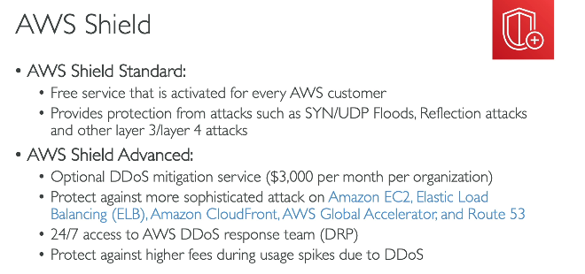

### AWS WAF
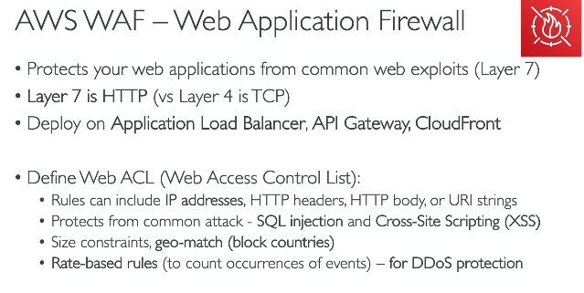 

### Network Firewall
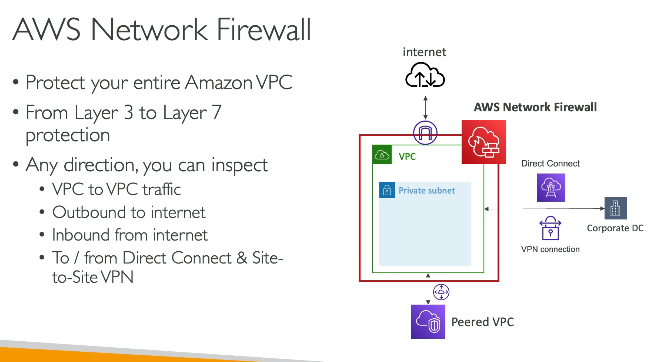 

### Firewall manager
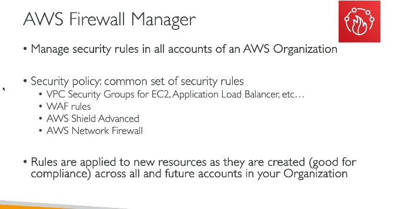 

### ACM
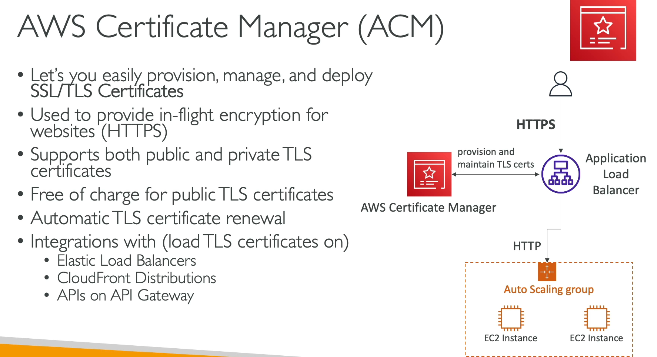 
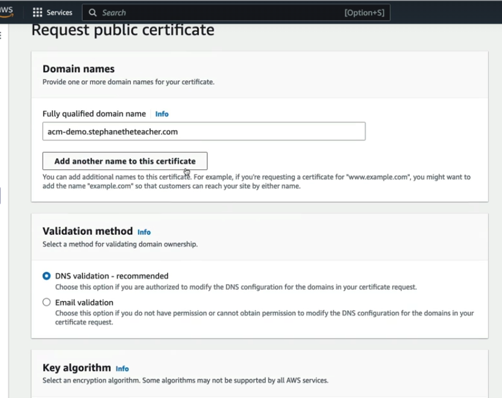 

### Secrets manager
- store app / db passwords, like we store password in .env file
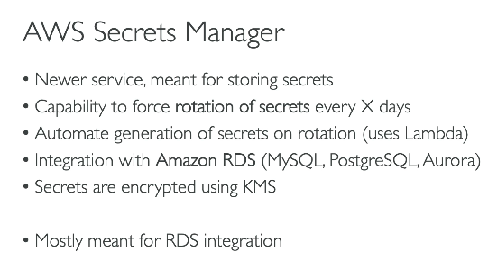 

### GuardDuty
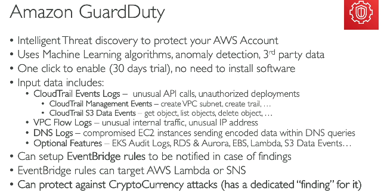 

### Inspector
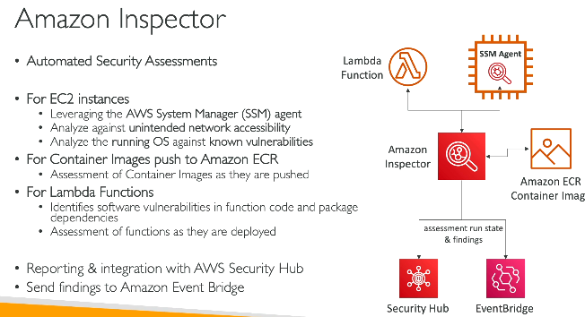 

### Config
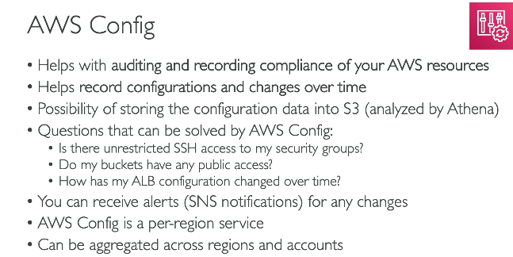 

### Macie
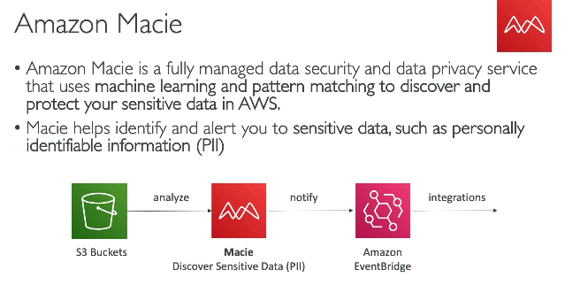 

### SecurityHub
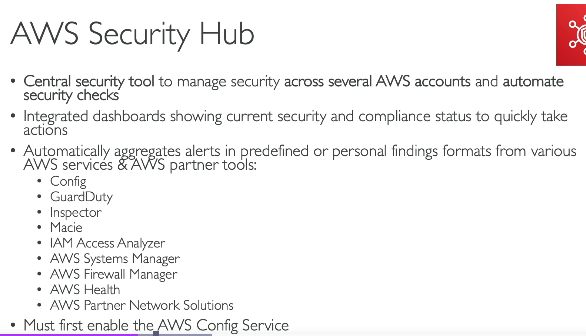 

### Amazon Detective
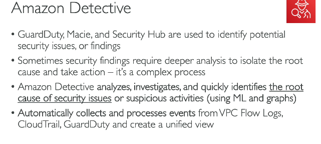 

### Abuse Detective
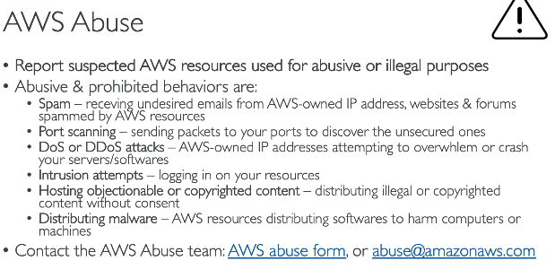 

### Root User
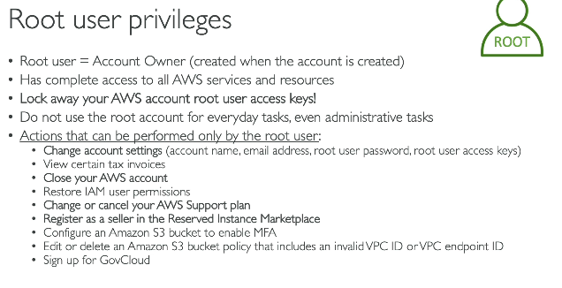 

### IAM Access Analyser
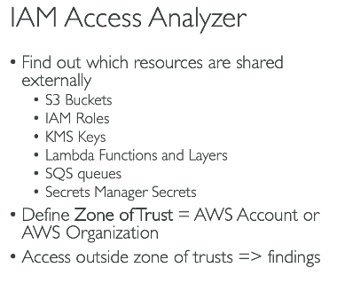 

