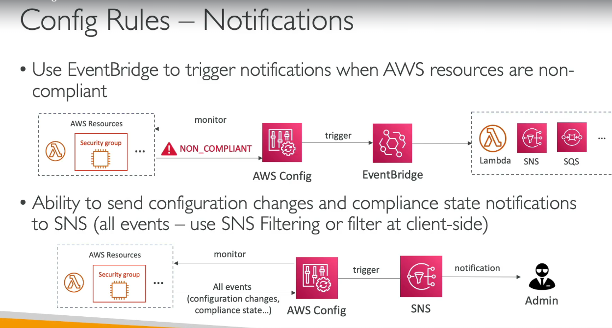

# Security
- To protect app from DDoS attack - use 
### AWS shield
- provided protection from DDoS, Layer4/L5 attacks for free and is enabled by default
- AWS Shield advanced - 24/7 premium DDoS protection
- for best security attach shield to R53, Cloudfront, and ELB, all three

### AWS WAF
 

### Network Firewall
 

### Firewall manager
 

### Penetration testing
- we can this testing perform without AWS's approval 

### ACM
 
 

### Secrets manager
- store app / db passwords, like we store password in .env file
 

### GuardDuty
 

### Inspector
 

### AWS Config
  
  

- Continuously **records the configuration** of AWS resources.
- Tracks **who changed what, when, and how**.
- Evaluates resources against **compliance rules**.
- Helps with **auditing, governance, security, and compliance**.

---

#### How AWS Config Works

#### Step 1: Enable AWS Config

- Enable AWS Config in an AWS account.
- Choose which resource types to record (or record all resources).
- Configure an S3 bucket to store configuration snapshots/history.

---

#### Step 2: Resource Configuration is Recorded

Whenever a supported resource changes (create, modify, delete), AWS Config records its latest configuration.

```text
EC2 / S3 / RDS / IAM ...
            │
 Configuration Change
            ▼
       AWS Config
            │
 Stores Configuration History
```

Example:

- EC2 Security Group modified
- S3 bucket policy updated
- EBS encryption changed

AWS Config records the new configuration.

---

#### Step 3: Rules are Evaluated

AWS Config evaluates recorded resources against **Config Rules**.

There are two types:

| Rule Type | Description |
|-----------|-------------|
| **AWS Managed Rules** | Pre-built rules provided by AWS. |
| **Custom Rules** | Your own rules implemented using AWS Lambda. |

Evaluation can occur:

- On every configuration change
- Periodically (e.g., every 24 hours)

---

#### Step 4: Compliance is Determined

```text
Resource Configuration
          │
          ▼
     Config Rule
          │
     Rule Evaluation
          │
   ┌──────┴──────┐
   ▼             ▼
Compliant    Non-Compliant
```

Example:

Rule:

> "All EBS volumes must be encrypted."

- Encrypted → ✅ Compliant
- Not encrypted → ❌ Non-Compliant

---

#### AWS Managed Rules

AWS provides many ready-to-use rules.

Common examples:

| Managed Rule | Checks |
|--------------|--------|
| `required-tags` | Required tags exist |
| `encrypted-volumes` | EBS volumes are encrypted |
| `restricted-ssh` | No SSH (22) open to the world |
| `root-account-mfa-enabled` | Root user has MFA enabled |
| `s3-bucket-public-read-prohibited` | S3 buckets aren't publicly readable |

---

#### Custom Rule Flow

When AWS doesn't provide a rule, create your own.

```text
Resource Changes
        │
        ▼
   AWS Config
        │
Invokes Lambda
        │
Lambda checks custom logic
        │
Returns:
COMPLIANT
or
NON_COMPLIANT
        │
        ▼
AWS Config updates compliance status
```

Example custom rule:

- Every EC2 instance must have an **Environment** tag.
- RDS instance class must be at least **db.r6g.large**.
- S3 bucket name must follow company naming standards.

---

#### Overall Flow

```text
AWS Resource
      │
Configuration Change
      ▼
AWS Config records configuration
      │
Stores configuration history
      │
Evaluates Config Rules
      │
      ▼
Compliance Status
(Compliant / Non-Compliant)
```

---

- Tracks **configuration changes**, **not application logs**.
- Stores **configuration history** for auditing.
- Uses **AWS Managed Rules** or **Lambda-based Custom Rules**.
- Reports **Compliant** or **Non-Compliant** status.
- Can aggregate compliance across **multiple AWS accounts and Regions** using **AWS Organizations**.

### Macie
 

### SecurityHub
 

### Amazon Detective
 

### Abuse Detective
 

### Root User
 

### IAM Access Analyser
 

